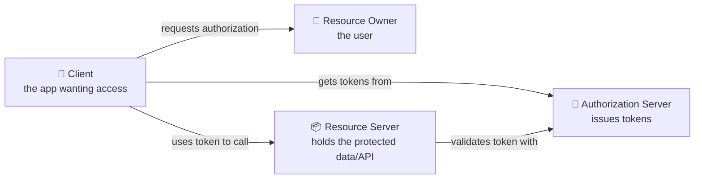
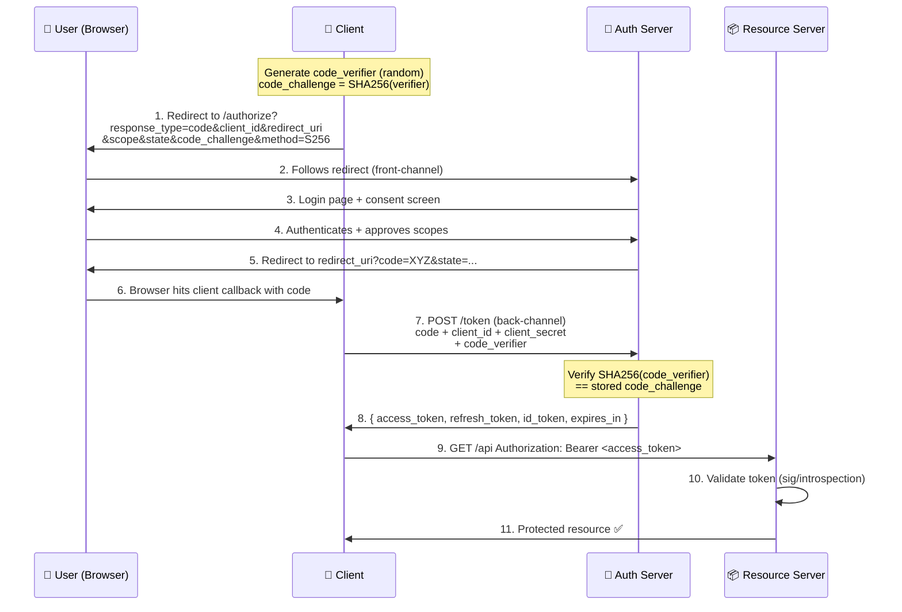
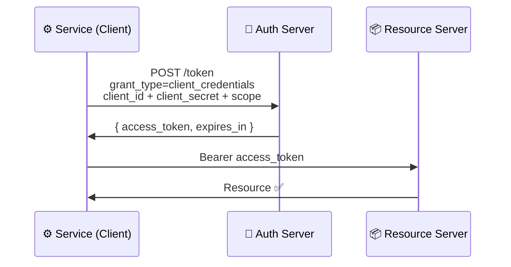
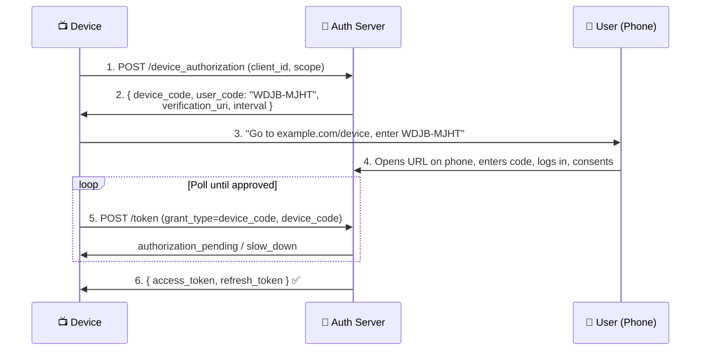
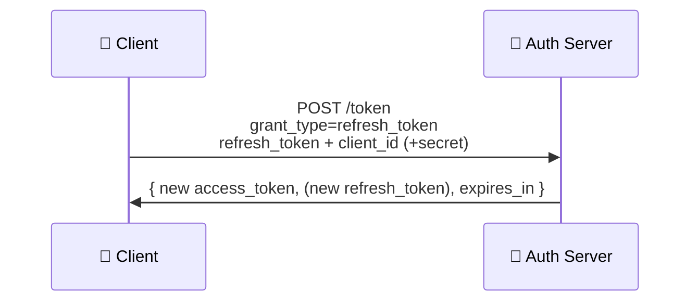
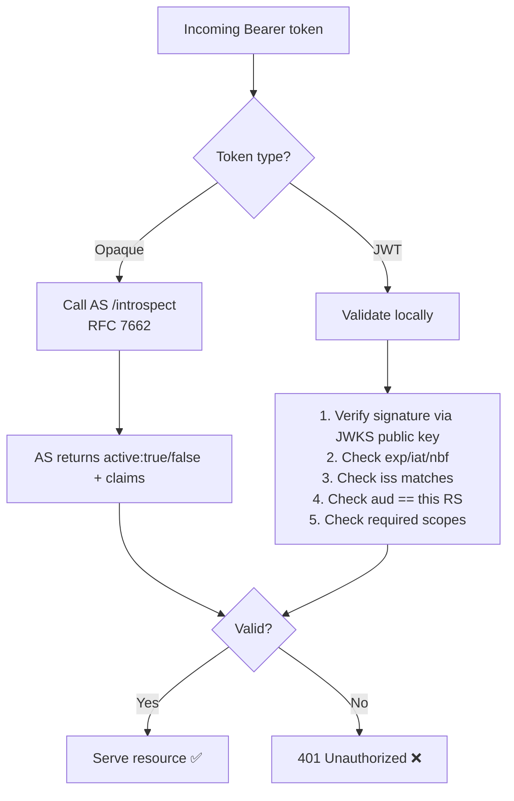
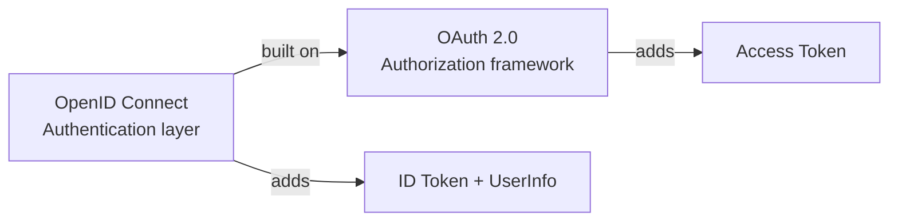

# OAuth 2.0 — Complete Engineering Reference

OAuth 2.0 is an **authorization framework** (RFC 6749) that lets a third-party application obtain **limited access** to a user's resources **without ever seeing the user's password**. It answers: *"How can App X access my data on Service Y, on my behalf, safely?"*

> Key distinction: OAuth2 is for **authorization** (delegated access to resources). **Authentication** ("who is this user?") is layered on top by **OpenID Connect (OIDC)**. More on that at the end.

---

## 1. The Core Problem It Solves

**Before OAuth** ("the password anti-pattern"): To let a photo-printing app access your Google Photos, you'd give the app your Google password. The app now has *full* access forever, can't be scoped, and can't be revoked without changing your password. 

**With OAuth2:** The app gets a **scoped, expiring token** instead of your password. You can revoke it anytime, and it only grants what you consented to.

---

## 2. The Components (Roles)



| Role | Definition | Example |
|------|-----------|---------|
| **Resource Owner** | The user who owns the data and grants access | You |
| **Client** | The app requesting access on the user's behalf | A photo-printing web app |
| **Authorization Server (AS)** | Authenticates the user, gets consent, issues tokens | Google's OAuth/accounts service |
| **Resource Server (RS)** | The API serving protected resources; trusts tokens from the AS | Google Photos API |

> The AS and RS are often run by the same provider (Google) but are logically distinct.

---

## 3. The Tokens

| Token | Purpose | Lifetime | Audience |
|-------|---------|----------|----------|
| **Access Token** | The "key" presented to the Resource Server to call APIs | Short (minutes–1 hr) | Resource Server |
| **Refresh Token** | Used to silently get new access tokens without re-prompting the user | Long (days–months) | Authorization Server only |
| **ID Token** *(OIDC only)* | Proves the user's identity to the **client** | Short | The Client |
| **Authorization Code** | Short-lived one-time code exchanged for tokens | ~30–60 s, single-use | Exchanged at token endpoint |

**Access token formats:**
- **Opaque** — a random string; the RS must call the AS's **introspection endpoint** to validate it.
- **JWT (self-contained)** — a signed JSON Web Token the RS can validate **locally** by checking the signature (via the AS's public key from a JWKS endpoint). No network call needed.

A JWT access token decoded:
```json
// Header
{ "alg": "RS256", "typ": "JWT", "kid": "key-id-2026" }
// Payload (claims)
{
  "iss": "https://auth.example.com",   // issuer
  "sub": "user-12345",                  // subject (user id)
  "aud": "photos-api",                  // audience (intended RS)
  "scope": "photos.read",               // granted scopes
  "exp": 1751400000,                    // expiry (Unix time)
  "iat": 1751396400,                    // issued at
  "jti": "token-unique-id"              // unique token id
}
// Signature: RS256(base64(header) + "." + base64(payload), privateKey)
```

---

## 4. The Endpoints

| Endpoint | Hosted by | Purpose |
|----------|-----------|---------|
| **Authorization endpoint** | AS | Where the user is redirected to log in & consent (browser, front-channel) |
| **Token endpoint** | AS | Where the client exchanges code/refresh token for tokens (back-channel, server-to-server) |
| **Redirect URI (callback)** | Client | Pre-registered URL the AS sends the user back to with the code |
| **Introspection endpoint** | AS | RS asks "is this opaque token valid?" (RFC 7662) |
| **Revocation endpoint** | AS | Client/user invalidates a token (RFC 7009) |
| **JWKS endpoint** | AS | Publishes public keys so RS can verify JWT signatures |

**Front-channel vs back-channel** — a critical security concept:
- **Front-channel** = via the browser/redirects (visible in URL, less trusted). Used for the authorization request.
- **Back-channel** = direct server-to-server HTTPS (private, trusted). Used for the token exchange — so tokens never pass through the browser.

---

## 5. Client Types

| Type | Can it keep a secret? | Examples |
|------|----------------------|----------|
| **Confidential** | Yes — runs on a secure server | Backend web app, server-side service |
| **Public** | No — code is exposed to users | SPA (browser JS), mobile/native app |

This distinction **drives which flow you use** and whether **PKCE** is mandatory.

---

## 6. The Grant Flows (Detailed)

OAuth2 defines several **grant types** for different scenarios. Below, each in depth.

### 6.1 Authorization Code Flow (+ PKCE) — *The Gold Standard*

Used for: web apps, SPAs, and mobile apps. **PKCE is now recommended for all clients**, mandatory for public ones.

**Why a two-step (code → token) dance?** So the powerful tokens are delivered over the **back-channel** (server-to-server), never exposed in the browser URL/history.



**Step-by-step minutiae:**

1. **Client builds the authorization request** and generates PKCE values:
   - `code_verifier` = high-entropy random string (43–128 chars)
   - `code_challenge` = `BASE64URL(SHA256(code_verifier))`, method `S256`
   ```
   GET https://auth.example.com/authorize?
       response_type=code
       &client_id=photo-app
       &redirect_uri=https://app.com/callback
       &scope=photos.read offline_access
       &state=xyz123                 ← CSRF protection (random, opaque)
       &code_challenge=abc...        ← PKCE
       &code_challenge_method=S256
   ```
2. **User authenticates** at the AS (the client never sees credentials).
3. **Consent**: AS shows "Photo App wants to: View your photos." User approves.
4. **AS redirects back** with a one-time `code` and the **same `state`**:
   ```
   https://app.com/callback?code=SplxlOBeZ&state=xyz123
   ```
   - Client **must verify `state` matches** what it sent → blocks CSRF.
5. **Token exchange** (back-channel POST):
   ```
   POST /token
   grant_type=authorization_code
   &code=SplxlOBeZ
   &redirect_uri=https://app.com/callback
   &client_id=photo-app
   &client_secret=*** (confidential clients only)
   &code_verifier=<original random string>   ← PKCE proof
   ```
6. **AS validates** the code (unused, unexpired, matches client + redirect_uri) and checks `SHA256(code_verifier) == code_challenge`. Returns:
   ```json
   {
     "access_token": "eyJ...",
     "token_type": "Bearer",
     "expires_in": 3600,
     "refresh_token": "tGzv3...",
     "id_token": "eyJ...",        // if OIDC
     "scope": "photos.read"
   }
   ```

**What PKCE defends against:** the **authorization code interception attack**. On a public client (mobile app), a malicious app could intercept the `code` from the redirect. Without PKCE it could exchange it for tokens. With PKCE, the attacker lacks the secret `code_verifier`, so the stolen code is useless.

---

### 6.2 Client Credentials Flow — *Machine-to-Machine*

Used for: **no user involved** — a backend service accessing its *own* resources (cron jobs, microservice-to-microservice).



```
POST /token
grant_type=client_credentials
&client_id=billing-service
&client_secret=***
&scope=invoices.read
```
- No user, no consent, no refresh token (the client just re-requests with its credentials).
- Only for **confidential clients** (must safely store the secret).

---

### 6.3 Device Authorization Flow — *Input-Constrained Devices*

Used for: smart TVs, consoles, CLIs — devices with **no browser/keyboard** for typing passwords (RFC 8628).



The TV shows a short **user code**; you approve on your phone. The TV **polls** the token endpoint until you finish.

---

### 6.4 Refresh Token Flow — *Staying Logged In*

When the access token expires, the client silently gets a new one **without bothering the user**:



```
POST /token
grant_type=refresh_token
&refresh_token=tGzv3JOkF0XG5Qx2TlKWIA
&client_id=photo-app
&client_secret=***
```
- Requires the `offline_access` scope to receive a refresh token initially.
- **Refresh token rotation** (best practice): each use returns a *new* refresh token and invalidates the old one. If a stolen old token is reused → AS detects **reuse**, revokes the whole chain. Defends against token theft.

---

### 6.5 Deprecated / Legacy Flows (know them, avoid them)

**Implicit Flow** (`response_type=token`):
- Originally for SPAs that couldn't do a back-channel exchange. The access token was returned **directly in the URL fragment** (front-channel).
- ❌ **Deprecated** — tokens leaked in browser history/referrer, no refresh token. Replaced by **Authorization Code + PKCE** for SPAs.

**Resource Owner Password Credentials (ROPC)** (`grant_type=password`):
- The client collects the user's username/password directly and sends them to the token endpoint.
- ❌ **Deprecated** — reintroduces the password anti-pattern OAuth was built to kill. Only acceptable for highly-trusted first-party legacy apps.

---

## 7. Scopes & Consent

- **Scope** = a space-delimited list of permission strings requested by the client: `scope=photos.read photos.write contacts.read`.
- The **consent screen** shows the user exactly what's being requested.
- Granted scopes are **encoded into the access token** and enforced by the Resource Server (`scope` claim).
- **Principle of least privilege**: request only the scopes you need.

---

## 8. Security Mechanisms (The Minute Details)

| Mechanism | Threat it stops | How |
|-----------|----------------|-----|
| **`state` parameter** | **CSRF** on the redirect | Random value echoed back; client verifies match |
| **PKCE** | **Auth code interception** | Dynamic verifier/challenge proves same client |
| **`nonce`** *(OIDC)* | **ID token replay** | Random value embedded in ID token, client verifies |
| **Redirect URI exact-match** | **Open redirect / token theft** | AS only redirects to pre-registered URIs |
| **Short token lifetimes** | Limits damage of leaked access token | Expire in minutes; refresh as needed |
| **Refresh token rotation** | **Refresh token theft** | One-time-use; reuse detection revokes chain |
| **TLS everywhere** | Eavesdropping/MITM | All endpoints HTTPS-only |
| **Audience (`aud`) checks** | **Token reuse across APIs** | RS rejects tokens not minted for it |
| **Sender-constrained tokens** (DPoP/mTLS) | **Bearer token replay** | Binds token to client's key/cert |

**Bearer token caveat:** a plain access token is a "**bearer**" token — *whoever holds it can use it.* That's why short lifetimes, TLS, and (for high security) sender-constraining (DPoP, mTLS) matter.

---

## 9. Token Validation at the Resource Server

When the RS receives `Authorization: Bearer <token>`, it must validate it. Two strategies:



**JWT local validation steps (in order):**
1. Parse header → get `kid` (key id) and `alg`.
2. Fetch matching **public key** from the AS's **JWKS endpoint** (cached).
3. **Verify signature** with that key.
4. Check **`exp`** (not expired), **`nbf`** (not before), **`iat`** (sane).
5. Check **`iss`** = trusted issuer.
6. Check **`aud`** = this resource server.
7. Check **`scope`** contains what the endpoint requires.

---

## 10. OAuth2 vs OpenID Connect (OIDC)

This trips up many engineers:

| | OAuth 2.0 | OpenID Connect |
|--|-----------|----------------|
| **Purpose** | Authorization (access to resources) | Authentication (identity) — built **on top of** OAuth2 |
| **Question answered** | "Can this app access this data?" | "Who is this user?" |
| **Key artifact** | Access token | **ID Token** (a JWT with user identity claims) |
| **Extra parameters** | — | `scope=openid`, `nonce`, `/userinfo` endpoint |

When you "**Sign in with Google**," that's **OIDC** — you get an **ID token** (a JWT with `sub`, `email`, `name`, `nonce`) proving who you are, *plus* OAuth access tokens for any APIs.



---

## TL;DR Decision Guide

| Scenario | Use this flow |
|----------|--------------|
| Web app / SPA / mobile app with a user | **Authorization Code + PKCE** |
| Backend service, no user (M2M) | **Client Credentials** |
| Smart TV / CLI / no browser | **Device Authorization** |
| Renew access silently | **Refresh Token** (with rotation) |
| "Sign in with Google/Apple" | **OIDC** (Auth Code + PKCE + `openid` scope) |
| ❌ Avoid | Implicit, ROPC (password) |

---
