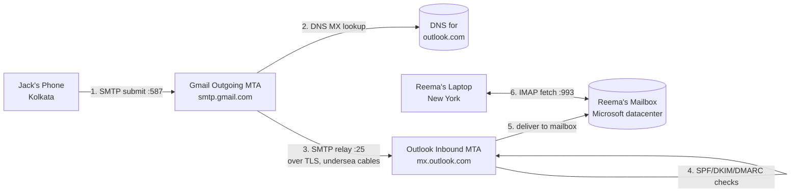
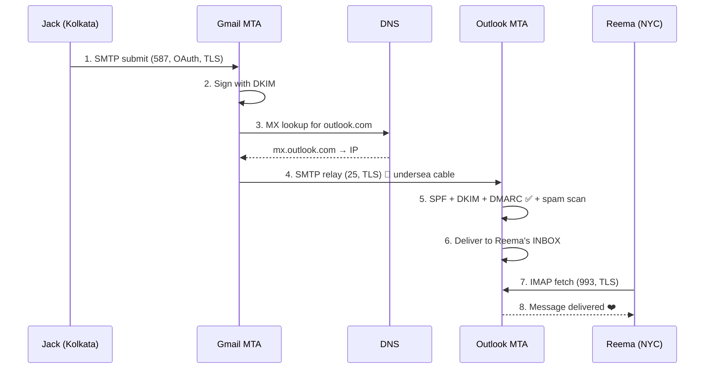

# 📧 Full Journey: Jack's Email to Reema

**The Cast:**
- **Jack** — `jack@gmail.com` (Google), sitting in **Kolkata, India** 🇮🇳
- **Reema** — `reema@outlook.com` (Microsoft), in **New York, USA** 🇺🇸
- Two **different providers** → the mail must cross the public internet between Google's and Microsoft's mail systems.

---

## The Complete Map



The mail makes **three network hops**: client→Google, Google→Microsoft (the long-haul international leg), Microsoft→Reema.

---

## STEP 1 — Jack Composes & Hits "Send"

Jack types his message in the Gmail app. The app builds a **MIME message** with envelope + headers + body:

```
From: Jack <jack@gmail.com>
To: Reema <reema@outlook.com>
Subject: Miss you ❤️
Date: Wed, 01 Jul 2026 21:30:00 +0530        ← note IST timezone
Message-ID: <CA+abc123@mail.gmail.com>
MIME-Version: 1.0
Content-Type: text/plain; charset="UTF-8"

Hi Reema, counting days till I visit NYC! — Jack
```

His phone opens a **TLS-encrypted TCP connection** to `smtp.gmail.com` on **port 587** (submission port).

---

## STEP 2 — Authenticated Submission to Gmail

Jack's client must **prove it's really Jack** (so Google won't be an open spam relay):

```
C: EHLO androidphone
S: 250-smtp.gmail.com at your service
S: 250-STARTTLS
S: 250-AUTH LOGIN PLAIN XOAUTH2
C: AUTH XOAUTH2 <OAuth token>         ← modern: OAuth2, not raw password
S: 235 2.7.0 Accepted
C: MAIL FROM:<jack@gmail.com>
S: 250 OK
C: RCPT TO:<reema@outlook.com>
S: 250 OK
C: DATA
S: 354 Go ahead
C: ...full message... .
S: 250 2.0.0 OK queued as 9F2A1
```

✅ Gmail has **accepted** the message and queued it. Jack's job is done — his app shows "Sent." But the mail hasn't reached Reema yet.

---

## STEP 3 — Google Stamps Authentication (DKIM)

Before relaying, Google's outbound MTA **cryptographically signs** the message with Gmail's private key, adding a header:

```
DKIM-Signature: v=1; a=rsa-sha256; d=gmail.com; s=20230601;
    h=from:to:subject:date:message-id;
    bh=<body hash>; b=<signature>
```

This lets Microsoft later verify the message **truly came from gmail.com** and **wasn't altered** in transit. Google's IP is also covered by Gmail's **SPF** record.

---

## STEP 4 — Finding Reema's Server (DNS MX Lookup)

Google's MTA doesn't know *where* `outlook.com` accepts mail. It asks DNS:

```
Query:  MX record for outlook.com
Answer: 5  outlook-com.olc.protection.outlook.com
Then:   A/AAAA lookup → 52.101.x.x  (Microsoft datacenter IP)
```

The **MX record** is the signpost that directs all of `outlook.com`'s mail to Microsoft's inbound servers. Google now knows the destination IP.

---

## STEP 5 — The Long Haul: Google → Microsoft (SMTP Relay)

Now the **server-to-server** transfer. Google's MTA opens an SMTP connection on **port 25** to Microsoft's inbound MTA. Physically, the packets travel from Google's India edge, across **undersea fiber-optic cables** under the Indian Ocean, Mediterranean/Atlantic, into a Microsoft US datacenter — in tens of milliseconds.

```
S: 220 mx.outlook.com Microsoft ESMTP ready
C: EHLO mail-sender.google.com
S: 250-STARTTLS                          ← encrypt the inter-server link
C: STARTTLS
   ...TLS handshake...
C: MAIL FROM:<jack@gmail.com>
S: 250 OK
C: RCPT TO:<reema@outlook.com>
S: 250 OK
C: DATA → ...message with DKIM header... .
S: 250 2.6.0 Queued, will deliver
```

🌊 The message has now physically crossed from India to the USA.

---

## STEP 6 — Microsoft Verifies the Sender (Anti-Spoofing)

Before trusting the mail, Outlook runs the **three-layer authentication check**:

| Check | What Microsoft does | Result |
|-------|--------------------|--------|
| **SPF** | Is the connecting IP authorized in `gmail.com`'s SPF DNS record? | ✅ Pass |
| **DKIM** | Fetch gmail.com's public key from DNS, verify the signature/body hash | ✅ Pass (untampered) |
| **DMARC** | Does the `From: gmail.com` align with SPF/DKIM? Apply gmail's policy | ✅ Pass |

It also scores the message through **spam/phishing filters**. All green → accepted for delivery (not junked).

---

## STEP 7 — Delivery into Reema's Mailbox

Microsoft's **MDA (Mail Delivery Agent)** writes the message into Reema's **INBOX** in the mailbox store, adds the `\Recent` flag, and updates her unread count. A `Received:` header trail is now stamped on the message documenting every hop:

```
Received: from mail-sender.google.com by mx.outlook.com ...   ← Microsoft added
Received: from androidphone by smtp.gmail.com ...             ← Google added
```

You read these **bottom-up** to trace the path.

---

## STEP 8 — Reema Reads It (IMAP Pull)

Reema's laptop in New York keeps an **IMAP** connection (port **993**, TLS) to Microsoft. Either she refreshes or **IMAP IDLE** push notifies her client of new mail:

```
C: a1 LOGIN reema <OAuth token>
C: a2 SELECT INBOX
S: * 1 EXISTS
S: * 1 RECENT
C: a3 FETCH 1 (FLAGS BODY[])           ← download the message
S: ...Jack's message...
C: a4 STORE 1 +FLAGS (\Seen)           ← mark as read (syncs to her phone too)
```

Her client also displays the date converted to **her timezone** — Jack sent it at 21:30 IST, Reema sees it at **12:00 PM EDT** (IST is UTC+5:30, EDT is UTC−4 → 9.5 h behind).

❤️ **Reema reads: "Hi Reema, counting days till I visit NYC!"**

---

## Why It "Just Works" Across Different Providers

| Standard | Role in this journey |
|----------|---------------------|
| **SMTP** | Universal language every mail server speaks (steps 2 & 5) |
| **DNS MX** | Lets any sender locate any domain's mail server (step 4) |
| **MIME** | Standard message format so Google & Microsoft agree on structure |
| **TLS** | Encrypts both the submission and the international relay leg |
| **SPF / DKIM / DMARC** | Let Microsoft trust a message originating from Google |
| **IMAP** | Lets Reema read from any device, state synced |

Because all providers implement the **same open standards**, Gmail and Outlook — two competing companies — interoperate seamlessly. That's the genius of email's federated design.

---

## One-Glance Sequence


