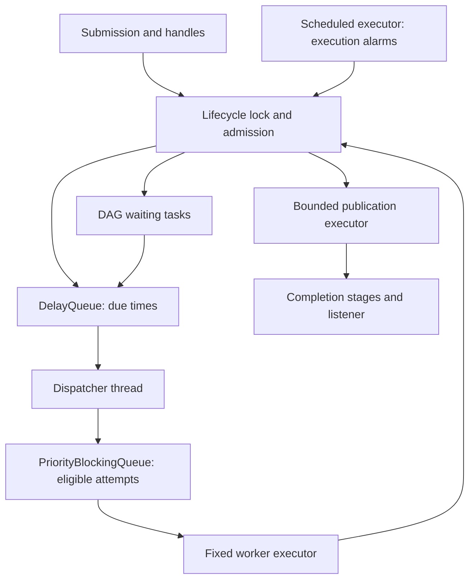
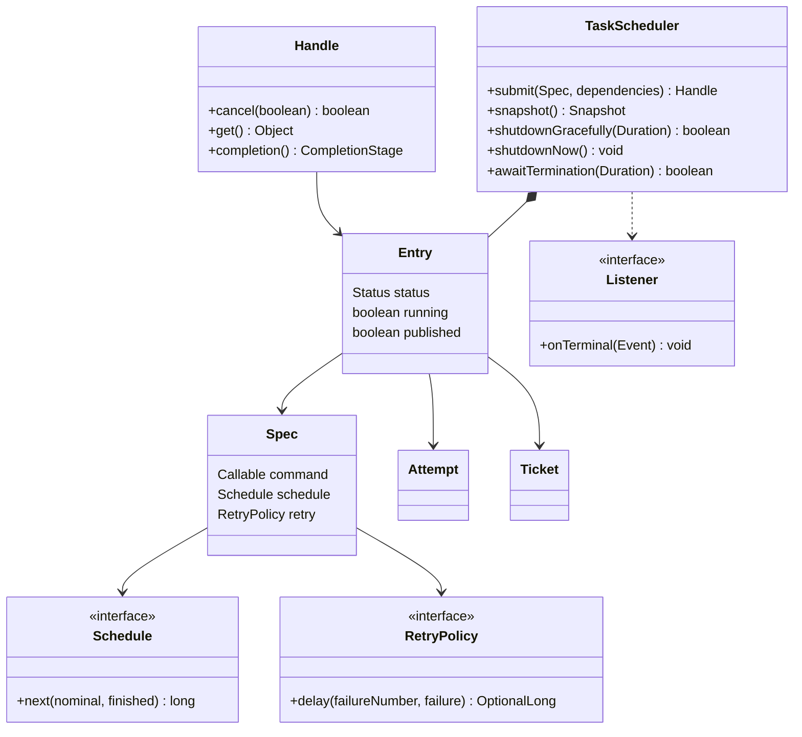
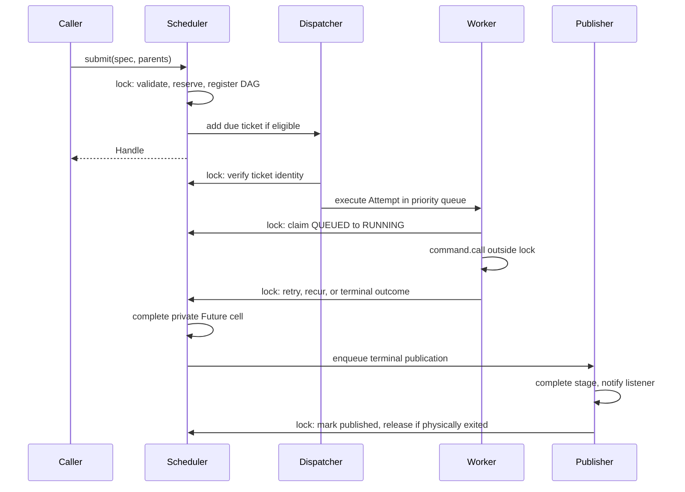
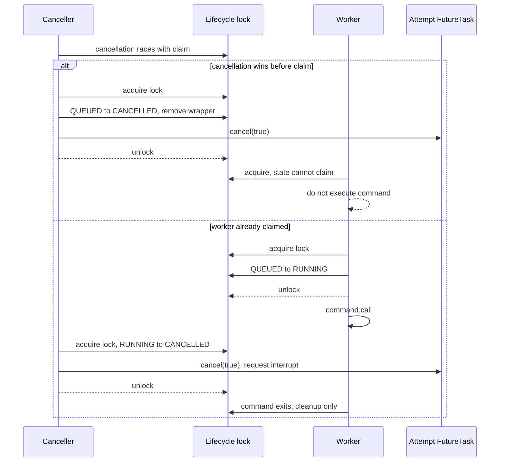
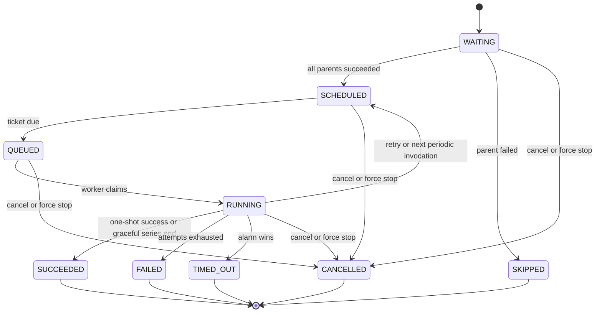
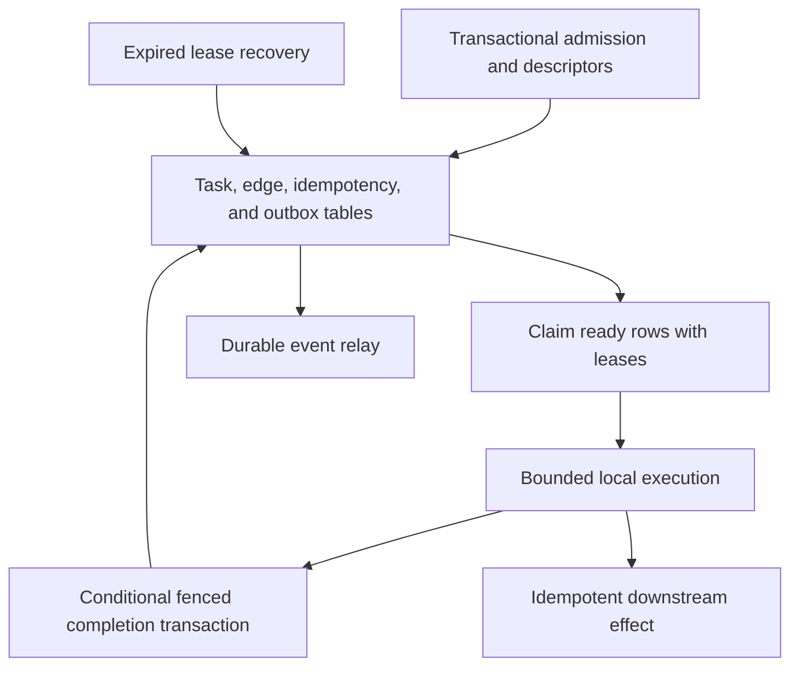

# Production-Grade Task Scheduler — Java 21

An implementation-focused Senior / SDE-3 / Staff interview study guide.

**The central answer:** task claim and cancellation use the **same lifecycle lock**. Cancellation before claim prevents command execution. Cancellation after claim records a terminal outcome and optionally interrupts the attempt. The scheduler retains the task's admission reservation until the actual command has exited and terminal publication has finished. A completed `Future` is not proof that execution has stopped.

This guide includes a complete single-file implementation, executable JUnit 5 tests, race proofs, diagrams, performance reasoning, and a separately identified persistence extension. The runtime core has no external dependencies and uses only stable Java 21 APIs. It is a bounded, functional reference implementation, not a claim that an unreviewed example is ready to operate an arbitrary production service.

## Contents

1. [Problem analysis and guarantees](#1-problem-analysis-and-guarantees)
2. [Core design and ownership](#2-core-design-and-ownership)
3. [Complete Java 21 implementation](#3-complete-java-21-implementation)
4. [Concurrency concepts through actual failures](#4-concurrency-concepts-through-actual-failures)
5. [Design patterns actually implemented](#5-design-patterns-actually-implemented)
6. [Hard concurrency scenarios](#6-hard-concurrency-scenarios)
7. [Testing and diagnosis](#7-testing-and-diagnosis)
8. [Performance and scalability](#8-performance-and-scalability)
9. [Failure handling and durable extension](#9-failure-handling-and-durable-extension)
10. [Twenty interview follow-ups](#10-twenty-interview-follow-ups)
11. [Final revision cheat sheet](#11-final-revision-cheat-sheet)

## 1. Problem analysis and guarantees

### 1.1 What are we building?

An in-process execution engine accepts a command plus scheduling metadata, holds it until it is eligible, places it in a priority queue, and executes it in a configurable fixed platform-thread pool. Commands return values through a `Future` and a read-only `CompletionStage`.

Examples: refresh sports-index data after an upstream update; retry a transient notification failure; run reconciliation every minute; generate an invoice after inventory and payment tasks succeed; delay cleanup of a temporary object. A task scheduler is not a message broker: without persistence, accepted work disappears with its process.

A **logical task** can have several **attempts** due to retries and several **invocations** due to recurrence. A logical task owns one admission slot for its entire lifetime. Its attempts never overlap. Successful periodic invocations keep the logical task alive; cancellation, timeout, exhausted failure, or shutdown eventually ends it.

### 1.2 Functional contract

| Requirement | Exact implemented behavior |
|---|---|
| Immediate execution | Initial delay zero; execute when a worker can claim it |
| Delayed execution | Relative delay from admission, using a monotonic clock |
| Fixed delay | Next nominal due time = previous command return time + period |
| Fixed rate | Remain on initial nominal time grid; skip missed ticks; never overlap |
| Priority | Larger integer wins among attempts currently in worker queue; sequence breaks ties |
| Worker pool | Configurable fixed count; prestarted platform threads |
| Cancellation | `cancel(false)` prevents an unclaimed attempt or marks a running task cancelled without interrupting it; `cancel(true)` also requests interruption |
| Timeout | Per-attempt execution budget starts at claim; terminal timeout with interruption; no automatic timeout retry |
| Retry | Failed commands can retry after exponential backoff and full jitter; maximum includes original attempt |
| DAG | A new task may depend on existing same-engine one-shot handles; all must succeed |
| Dependency failure | Descendants become `SKIPPED`, iteratively |
| Graceful stop | Reject new tasks; drain accepted one-shots including delays/retries; allow running periodic invocation to settle; cancel pending periodic work |
| Forced stop | Cancel outstanding outcomes; interrupt workers; retain resources until physical exit |
| Backpressure | Fail-fast admission limit includes delayed, waiting, queued, running, and terminal-but-not-cleaned-up tasks |
| Deduplication | Reject duplicate active keys; key remains reserved through execution and publication cleanup |
| Metrics | Exact admission/running gauges; sampled queue sizes and aggregate counters/timings; terminal events |
| Persistence | Optional extension design in section 9; intentionally not included in the in-memory core |

Fixed-rate misfire behavior is a product decision. Another valid policy is bounded catch-up or overlap, but that is a different contract. This implementation stops a recurring series after retry exhaustion and does not restart a timed-out series. Its `Future` represents the series, not an individual tick. During graceful stop, successful completion of a currently running periodic invocation completes the series successfully; pending invocations are cancelled.

For DAG tasks, initial delay is an earliest-start constraint from submission. If parents finish later, the child becomes eligible then. Duplicate parents are collapsed. Recurring parents are rejected because their successful lifetime completion is ambiguous. Dependencies cannot be added after submission.

### 1.3 Non-functional requirements and honest targets

Assume a capacity of **100,000 logical tasks**, a maximum of **64 dependencies per submission**, and thousands of competing submitting threads. Task payloads are small references, not 10 MB blobs. Delays, periods, execution timeouts, and retry delays are limited to 365 days. Task bodies and listeners obey the contracts below. The process lifetime is far below the roughly 292-year signed-nanosecond range.

No measured throughput or latency target is fabricated. Example acceptance goals to benchmark on your hardware are: bounded admission latency under a specified submit rate; due-to-claim p99 within the workload's SLA; no unbounded memory growth; and prompt shutdown for interruptible tasks. State the task duration distribution, CPU cores, heap, dependency degree, priority mix, and downstream limits before assigning numbers.

A rough upper bound is `workerCount / mean physical service time`, until CPU, lock serialization, dispatch, publication, or a downstream quota limits throughput. With 32 workers and assumed 20 ms blocking service time, the arithmetic bound is 1,600 attempts/s, not an observed benchmark. LongAdder timing totals do not provide percentiles.

### 1.4 Why this is difficult

Time ordering and priority ordering are different. A high-priority task due tomorrow must not block low-priority work due now. Cancellation, worker claim, timer expiry, completion, and shutdown can all contend for one task. Retries must not overlap the old attempt. DAG registration must be atomic with parent completion. Backpressure must cover delayed work, not just runnable work. An external callback can run synchronously during future completion. A cancelled command may ignore interruption indefinitely.

The dangerous failures include execution after a cancellation that should have won before claim, double terminal results, releasing capacity while old work still runs, interrupted work retrying after cancellation, lost dependency notifications, stale timeout cancellation of a newer attempt, callbacks under a lock, and incomplete futures after queue rejection or shutdown.

### 1.5 Correctness invariants

1. At most `capacity` logical tasks are admitted, including terminal tasks awaiting cleanup.
2. At most one physical command invocation belongs to a logical task at any instant.
3. A task has at most one scheduled ticket or one queued/running attempt; retry/recurrence replaces the old generation.
4. A terminal state never returns to a nonterminal state.
5. Every accepted task has exactly one terminal outcome, **assuming it eventually succeeds, fails, is cancelled/timed out, or is shut down**. A healthy recurring series intentionally remains incomplete.
6. Cancellation before worker claim prevents that command from executing.
7. Capacity and dedup ownership are released only after terminal outcome, physical exit, and terminal publication completion.
8. A child executes only after all declared parents have succeeded; a failed parent prevents its descendants from executing.
9. User commands, retry policy calls, listeners, and completion-stage callbacks execute outside the lifecycle lock.
10. A timeout callback can affect only the exact attempt object that created it.

The implementation also relies on bounded graph edges, immutable priority keys, fixed lock order, removal of cancelled timers, and private ownership of every executor/queue.

### 1.6 What guarantees mean

| Property | Meaning here | Mechanism / limitation |
|---|---|---|
| Thread safety | Legal calls from multiple threads preserve internal invariants | Lifecycle lock plus concurrent queue/future contracts |
| Atomicity | Related lifecycle updates appear as one transition | One critical section for claim/cancel/complete/admit/dependency registration |
| Visibility | Later threads observe preceding writes | Lock unlock/acquire, executor/queue publication, Future completion |
| Ordering | Admission, claim, and terminal transitions have a coherent serialization order | Lock; monotonic deadlines; immutable queue comparator |
| Liveness | Work eventually progresses under explicit assumptions | Workers/callbacks return; bounded overload; no unbounded high-priority starvation |
| Linearizability | An operation can be modeled as occurring at one point between invocation and return | Admission, status, claim, cancellation, terminal result, active-key reservation |
| Eventual observation | Some observers learn about an already decided outcome later | CompletionStage and listener publication; LongAdder metrics across fields |

`Future.get()` result publication is immediate within the terminal critical section; `CompletionStage` publication is deliberately asynchronous. A racing status read may see the terminal state before a separate stage has completed. The future cell is private and has no user-defined `done()` hook.

The engine does **not** promise an exact wall-clock deadline, global start order across multiple workers, preemption, fairness under an infinite high-priority workload, hard thread termination, persistence, distributed deduplication, or exactly-once side effects. A task can write to a remote system and then fail before reporting success. Java locks cannot roll back that write.

## 2. Core design and ownership

### 2.1 Architecture



**Two queue orders:** DelayQueue answers *when is this task eligible?* PriorityBlockingQueue answers *which queued eligible attempt should be selected next?* Workers never wait for a scheduled due time. The timer executor runs only short lifecycle transitions, not business work or callbacks.

The Java queue implementations are intrinsically unbounded. Their **private usage** is bounded by logical admission. There can be no more than one ticket/attempt per admitted task. Queues are never exposed. The publication executor additionally has a real bounded `ArrayBlockingQueue` with capacity equal to the logical task capacity. Admission stays reserved until its runnable finishes, so publication cannot accumulate beyond the admitted bound during normal operation.

This is a deliberate bounded-system design, not the mistaken claim that `new PriorityBlockingQueue<>(100_000)` sets a capacity. The constructor sets initial allocation capacity only. Public JDK contracts confirm both scheduling and priority queues are unbounded; see references R1–R2.

### 2.2 Components and why each exists

| Kind | Type | Responsibility and contract |
|---|---|---|
| Domain/configuration | `Spec<T>` | Immutable validated command, schedule, timeout, retry, priority, key |
| Domain lifecycle | `Entry<T>` | Private mutable logical task, graph links, attempt and timer identity |
| State behavior | `LifecycleState`, `Status` | State-specific claim/cancel eligibility and lifecycle vocabulary |
| Caller boundary | `Handle<T>` | Future contract, cancellation through engine, status, read-only stage |
| Completion primitive | `Promise<T>` | Private FutureTask-based completion without external callbacks |
| Scheduling strategy | `Schedule`, `Once`, `FixedDelay`, `FixedRate` | Determine next nominal invocation time |
| Retry strategy | `RetryPolicy`, `NoRetry`, `ExponentialRetry` | Decide failed-attempt retry delay outside lock |
| Command | `Callable<T>` | Business action; owns its own downstream cleanup/idempotency |
| Decorator | `MeteredCommand<T>` | Wrap a command without changing result/exception behavior |
| Timing infrastructure | `Ticket` | Immutable monotonic due time; implements `Delayed` |
| Execution infrastructure | `Attempt` | FutureTask command wrapper with immutable priority keys |
| Infrastructure factory | `WorkerPoolFactory` | Fixed executors and named non-daemon threads |
| Coordination service | `TaskScheduler` | Admission, DAG transitions, dispatch, claim, termination |
| Observer | `Listener`, `Event` | Observe one terminal event per logical task |
| Metrics | `Snapshot`, LongAdders | Bounded structural gauges and aggregate attempt observations |

An Entry is not exposed. Queue comparators never read mutable status. Cancellation acts on a logical task and its current attempt. A retry creates a new attempt object. No Spring Boot layer is needed to explain or implement these concurrency contracts.

### 2.3 UML class diagram



### 2.4 Submission and execution sequence



### 2.5 Cancellation sequence



The branches show alternative serialization orders. In the second branch, worker claim happens first.

### 2.6 State machine



State and physical execution are independent dimensions. `(CANCELLED, running=true)` and `(TIMED_OUT, running=true)` are valid. Do not invent a transition back to RUNNING when such a command exits; it only triggers resource cleanup.

### 2.7 Thread ownership

| Thread | Owns / performs | Must never do |
|---|---|---|
| Submitting/cancelling caller | Validate and change lifecycle under lock | Run user code inside lifecycle lock |
| One dispatcher | Wait for due tickets, enqueue attempts | Execute commands or block waiting for worker capacity |
| W worker threads | Claim, run command, evaluate retry outside lock, settle result | Block waiting for unscheduled child tasks in same saturated pool |
| One timeout thread | Verify attempt identity, terminal timeout, interrupt | Run completion callbacks or downstream I/O |
| Two publisher threads | Stage completion, terminal listener, cleanup | Block indefinitely or wait for publication work on the same publisher pool |
| Shutdown caller | Change admission state, initiate stop, await conditions | Hold lock while waiting for all workers |

The notifier pool is deliberately small, but listener/continuation contracts require prompt return. Offload expensive work to a separately bounded application executor. A permanently blocked observer retains one admission slot and can cause eventual overload, rather than unlimited queue growth.

### 2.8 Shared mutable state inventory

| State | Writers/readers | Synchronization |
|---|---|---|
| `active`, `dedup`, `life`, `ids`, `order`, `running` | API, dispatcher, workers, timers, publishers | One ReentrantLock |
| Entry status, links, ticket, attempt, alarm, counts, flags | Same lifecycle actors | Same lock; worker's failure count read after claim with no competing writer |
| `delayed` heap | Scheduler inserts/removes; dispatcher takes | DelayQueue internal synchronization; lifecycle identity rechecked under lock |
| Worker ready heap | Scheduler/dispatcher offers/removes; executor takes | PriorityBlockingQueue internal synchronization |
| Private Future completion | Terminal thread completes; callers wait/read | FutureTask internal atomic state / completion publication |
| `stage` | Publisher completes; callers attach stages | CompletableFuture synchronization; no completion under lock |
| `stopDispatcher` | Shutdown writes; dispatcher reads | volatile; interruption wakes `take()` |
| `infrastructureFailure` | Fail-stop actor records; snapshot reads | AtomicReference, first-failure CAS |
| Aggregate counters | Many threads | LongAdder; not a globally atomic metric snapshot |
| Thread-name sequence | Thread creation | AtomicInteger |

**Lock order:** lifecycle lock → queue/executor/timer internals for short nonblocking operations. A queue consumer releases its queue lock before acquiring the lifecycle lock. Publisher completes the stage before acquiring lifecycle lock for cleanup. Never reverse this order in an extension.

## 3. Complete Java 21 implementation

### 3.1 Build and run contract

Save the next block as `src/main/java/TaskScheduler.java`. It is one complete compilation unit in the default package so the implementation and tests can be copied directly. For a real repository, put it in an appropriate package and split public boundaries only when useful.

```bash
javac --release 21 -Xlint:all -d out src/main/java/TaskScheduler.java
```

No preview flags, framework, reflection, unsafe APIs, or runtime dependencies are needed. Tests below use JUnit 5.11.4 / Platform 1.11.4 as a pinned reproducible test dependency, not a statement about the latest release.

### 3.2 Entire core source

```java
import java.time.Duration;
import java.util.*;
import java.util.concurrent.*;
import java.util.concurrent.atomic.*;
import java.util.concurrent.locks.*;

/** Stable Java 21. No preview features and no runtime dependencies. */
public final class TaskScheduler implements AutoCloseable {
    public interface LifecycleState {
        boolean canClaim();
        boolean canCancel();
    }
    /** Enum-backed State pattern: state objects own eligibility behavior. */
    public enum Status implements LifecycleState {
        WAITING, SCHEDULED, QUEUED {
            @Override public boolean canClaim() { return true; }
        }, RUNNING,
        SUCCEEDED, FAILED, CANCELLED, TIMED_OUT, SKIPPED;
        public boolean terminal() {
            return switch (this) {
                case WAITING, SCHEDULED, QUEUED, RUNNING -> false;
                case SUCCEEDED, FAILED, CANCELLED, TIMED_OUT, SKIPPED -> true;
            };
        }
        public boolean canClaim() { return false; }
        public boolean canCancel() { return !terminal(); }
    }
    private enum Life { OPEN, QUIESCING, STOPPING }

    public sealed interface Schedule permits Once, FixedDelay, FixedRate {
        long next(long nominal, long finished);
    }
    public record Once() implements Schedule {
        public long next(long nominal, long finished) { return -1; }
    }
    public record FixedDelay(Duration period) implements Schedule {
        public FixedDelay { positive(period); }
        public long next(long nominal, long finished) {
            return finished + nanos(period);
        }
    }
    /** Skip missed ticks. Never overlap invocations of the same task. */
    public record FixedRate(Duration period) implements Schedule {
        public FixedRate { positive(period); }
        public long next(long nominal, long finished) {
            long p = nanos(period);
            long next = nominal + p;
            return next > finished ? next
                    : next + ((finished - next) / p + 1) * p;
        }
    }
    @FunctionalInterface
    public interface RetryPolicy {
        /** failureNumber is 1-based; empty means stop. Must be fast and pure. */
        OptionalLong delay(int failureNumber, Throwable failure);
    }
    public record NoRetry() implements RetryPolicy {
        public OptionalLong delay(int n, Throwable t) { return OptionalLong.empty(); }
    }
    /** Command decorator. Safe to reuse across non-overlapping periodic attempts. */
    public static final class MeteredCommand<T> implements Callable<T> {
        private final Callable<T> delegate;
        private final String name;
        private final LongAdder calls = new LongAdder(), elapsed = new LongAdder();
        public MeteredCommand(String name, Callable<T> delegate) {
            this.name = Objects.requireNonNull(name);
            this.delegate = Objects.requireNonNull(delegate);
        }
        public T call() throws Exception {
            long started = System.nanoTime(); calls.increment();
            try { return delegate.call(); }
            finally { elapsed.add(System.nanoTime() - started); }
        }
        public String name() { return name; }
        public long calls() { return calls.sum(); }
        public long elapsedNanos() { return elapsed.sum(); }
    }
    /** maxAttempts includes the original attempt. Full jitter in [0, cap]. */
    public record ExponentialRetry(int maxAttempts, Duration base, Duration max)
            implements RetryPolicy {
        public ExponentialRetry {
            positive(base); positive(max);
            if (maxAttempts < 1 || base.compareTo(max) > 0)
                throw new IllegalArgumentException("retry configuration");
        }
        public OptionalLong delay(int n, Throwable t) {
            if (n >= maxAttempts || !(t instanceof Exception)
                    || t instanceof InterruptedException) return OptionalLong.empty();
            long cap = nanos(base), limit = nanos(max);
            for (int i = 1; i < n && cap < limit; i++)
                cap = cap > limit / 2 ? limit : Math.min(limit, cap * 2);
            return OptionalLong.of(ThreadLocalRandom.current().nextLong(cap + 1));
        }
    }
    public record Spec<T>(Callable<T> command, Duration initialDelay,
                          Schedule schedule, int priority, Duration timeout,
                          RetryPolicy retry, String dedupKey) {
        public Spec {
            Objects.requireNonNull(command); Objects.requireNonNull(schedule);
            Objects.requireNonNull(retry); nonnegative(initialDelay); nonnegative(timeout);
            if (dedupKey != null && (dedupKey.isBlank() || dedupKey.length() > 256))
                throw new IllegalArgumentException("dedup key");
        }
        public static <T> Spec<T> immediate(Callable<T> command) {
            return new Spec<>(command, Duration.ZERO, new Once(), 0,
                    Duration.ZERO, new NoRetry(), null);
        }
    }
    public record Event(long id, Status status, int attempts, Throwable failure) {}
    @FunctionalInterface public interface Listener { void onTerminal(Event event); }
    public record Snapshot(int admitted, int delayed, int ready, int running,
                           long accepted, long rejected, long attempts,
                           long dispatches, long completedAttempts,
                           long failedAttempts, long retries, long timeouts,
                           long cancelled, long observerFailures,
                           long queueNanos, long executionNanos,
                           long schedulingLagNanos, String infrastructureFailure) {}
    public static final class DuplicateTaskException extends RejectedExecutionException {
        private static final long serialVersionUID = 1L;
        public DuplicateTaskException(String key) { super("active dedup key: " + key); }
    }
    public static final class DependencyFailedException extends RuntimeException {
        private static final long serialVersionUID = 1L;
        public DependencyFailedException(long id) { super("dependency failed: " + id); }
    }

    /** Internal completion cell. No user-overridden done() and never executed. */
    private static final class Promise<T> extends FutureTask<T> {
        Promise() { super(() -> { throw new AssertionError("not executable"); }); }
        void succeed(T value) { super.set(value); }
        void fail(Throwable failure) { super.setException(failure); }
    }
    public static final class Handle<T> implements Future<T> {
        private final TaskScheduler owner;
        private final Entry<T> entry;
        private Handle(TaskScheduler owner, Entry<T> entry) {
            this.owner = owner; this.entry = entry;
        }
        public long id() { return entry.id; }
        public Status status() { return owner.status(entry); }
        public CompletionStage<T> completion() { return entry.stage.minimalCompletionStage(); }
        public boolean cancel(boolean interrupt) { return owner.cancel(entry, interrupt); }
        public boolean isCancelled() { return entry.promise.isCancelled(); }
        public boolean isDone() { return entry.promise.isDone(); }
        public T get() throws InterruptedException, ExecutionException {
            return entry.promise.get();
        }
        public T get(long timeout, TimeUnit unit)
                throws InterruptedException, ExecutionException, TimeoutException {
            return entry.promise.get(timeout, unit);
        }
    }
    private static final class Entry<T> {
        final long id;
        final Spec<T> spec;
        final Promise<T> promise = new Promise<>();
        final CompletableFuture<T> stage = new CompletableFuture<>();
        final Set<Entry<?>> parents = new HashSet<>(), children = new HashSet<>();
        Status status = Status.WAITING;
        long nominal, queuedAt;
        int failures, attempts;
        boolean running, published;
        Ticket ticket;
        FutureTask<Void> attempt;
        ScheduledFuture<?> alarm;
        Entry(long id, Spec<T> spec, long due) {
            this.id = id; this.spec = spec; nominal = due;
        }
    }
    private final class Ticket implements Delayed {
        final Entry<?> entry;
        final long due, sequence;
        Ticket(Entry<?> e, long due) { entry = e; this.due = due; sequence = ++order; }
        public long getDelay(TimeUnit unit) {
            return unit.convert(due - now(), TimeUnit.NANOSECONDS);
        }
        public int compareTo(Delayed other) {
            Ticket t = (Ticket) other;
            int c = Long.compare(due, t.due);
            return c != 0 ? c : Long.compare(sequence, t.sequence);
        }
    }
    /** Immutable priority keys; never use mutable Entry.status in a comparator. */
    private final class Attempt extends FutureTask<Void> {
        final Entry<?> entry;
        final int priority;
        final long sequence;
        Attempt(Entry<?> e) {
            super(() -> { executeEntry(e); return null; });
            entry = e; priority = e.spec.priority(); sequence = ++order;
        }
    }
    private static final class WorkerPoolFactory {
        static ThreadFactory named(String prefix) {
            AtomicInteger sequence = new AtomicInteger();
            return r -> {
                Thread t = new Thread(r, prefix + sequence.incrementAndGet());
                t.setDaemon(false);
                return t;
            };
        }
        static ThreadPoolExecutor fixed(int count, BlockingQueue<Runnable> queue,
                                        String prefix) {
            return new ThreadPoolExecutor(count, count, 0, TimeUnit.MILLISECONDS,
                    queue, named(prefix), new ThreadPoolExecutor.AbortPolicy());
        }
    }
    private final ReentrantLock lock = new ReentrantLock();
    private final Condition empty = lock.newCondition();
    private final Map<Long, Entry<?>> active = new HashMap<>();
    private final Map<String, Entry<?>> dedup = new HashMap<>();
    private final DelayQueue<Ticket> delayed = new DelayQueue<>();
    private final ThreadPoolExecutor workers, publishers;
    private final ScheduledThreadPoolExecutor timers;
    private final Thread dispatcher;
    private final Listener listener;
    private final int capacity, maxDependencies;
    private final long origin = System.nanoTime();
    private final AtomicReference<Throwable> infrastructureFailure = new AtomicReference<>();
    private volatile boolean stopDispatcher;
    private Life life = Life.OPEN;
    private long ids, order;
    private int running;
    private final LongAdder accepted = new LongAdder(), rejected = new LongAdder();
    private final LongAdder attempts = new LongAdder(), failedAttempts = new LongAdder();
    private final LongAdder dispatches = new LongAdder(), completedAttempts = new LongAdder();
    private final LongAdder retries = new LongAdder(), timeouts = new LongAdder();
    private final LongAdder cancelled = new LongAdder(), observerFailures = new LongAdder();
    private final LongAdder queueNanos = new LongAdder(), executionNanos = new LongAdder();
    private final LongAdder schedulingLagNanos = new LongAdder();

    public TaskScheduler(int workerCount, int capacity, int maxDependencies,
                         Listener listener) {
        if (workerCount < 1 || capacity < 1 || maxDependencies < 0)
            throw new IllegalArgumentException("configuration");
        this.capacity = capacity; this.maxDependencies = maxDependencies;
        this.listener = Objects.requireNonNull(listener);
        PriorityBlockingQueue<Runnable> queue = new PriorityBlockingQueue<>(11, (a, b) -> {
            Attempt x = (Attempt) a, y = (Attempt) b;
            int c = Integer.compare(y.priority, x.priority);
            return c != 0 ? c : Long.compare(x.sequence, y.sequence);
        });
        workers = WorkerPoolFactory.fixed(workerCount, queue, "task-worker-");
        publishers = WorkerPoolFactory.fixed(2, new ArrayBlockingQueue<>(capacity),
                "task-events-");
        timers = new ScheduledThreadPoolExecutor(1, WorkerPoolFactory.named("task-timer-"));
        timers.setRemoveOnCancelPolicy(true);
        timers.setExecuteExistingDelayedTasksAfterShutdownPolicy(false);
        dispatcher = new Thread(this::dispatch, "task-dispatcher");
        try {
            workers.prestartAllCoreThreads();
            publishers.prestartAllCoreThreads();
            timers.prestartAllCoreThreads();
            dispatcher.start();
        } catch (RuntimeException | Error failure) {
            workers.shutdownNow(); publishers.shutdownNow(); timers.shutdownNow();
            throw failure;
        }
    }
    private long now() { return System.nanoTime() - origin; }
    private static long nanos(Duration d) { return d.toNanos(); }
    private static void nonnegative(Duration d) {
        Objects.requireNonNull(d);
        if (d.isNegative() || d.compareTo(Duration.ofDays(365)) > 0)
            throw new IllegalArgumentException("duration outside [0,365 days]");
    }
    private static void positive(Duration d) {
        nonnegative(d);
        if (d.isZero()) throw new IllegalArgumentException("positive duration required");
    }
    public <T> Handle<T> submit(Spec<T> spec) { return submit(spec, List.of()); }
    /** Only existing, same-engine, one-shot handles may be dependencies. */
    public <T> Handle<T> submit(Spec<T> spec, List<Handle<?>> dependencies) {
        Objects.requireNonNull(spec);
        List<Handle<?>> deps = List.copyOf(dependencies);
        lock.lock();
        try {
            if (deps.size() > maxDependencies)
                throw new IllegalArgumentException("too many dependencies");
            for (Handle<?> h : deps)
                if (h.owner != this || !(h.entry.spec.schedule() instanceof Once))
                    throw new IllegalArgumentException("foreign or recurring dependency");
            if (life != Life.OPEN || active.size() >= capacity) {
                rejected.increment(); throw new RejectedExecutionException("closed or full");
            }
            if (spec.dedupKey() != null && dedup.containsKey(spec.dedupKey())) {
                rejected.increment(); throw new DuplicateTaskException(spec.dedupKey());
            }
            Entry<T> e = new Entry<>(++ids, spec, now() + nanos(spec.initialDelay()));
            active.put(e.id, e); // Admission linearizes inside this critical section.
            if (spec.dedupKey() != null) dedup.put(spec.dedupKey(), e);
            accepted.increment();
            Entry<?> failed = null;
            for (Handle<?> h : deps) {
                Entry<?> parent = h.entry;
                if (parent.status.terminal()) {
                    if (parent.status != Status.SUCCEEDED) failed = parent;
                } else if (e.parents.add(parent)) parent.children.add(e);
            }
            if (failed != null)
                finishLocked(e, Status.SKIPPED, null, new DependencyFailedException(failed.id));
            else if (e.parents.isEmpty()) scheduleLocked(e, Math.max(now(), e.nominal));
            return new Handle<>(this, e);
        } finally { lock.unlock(); }
    }
    private void scheduleLocked(Entry<?> e, long due) {
        e.status = Status.SCHEDULED;
        e.ticket = new Ticket(e, due);
        delayed.offer(e.ticket);
    }
    private void dispatch() {
        try {
            while (!stopDispatcher) {
                Ticket ticket = delayed.take(); // Never hold lifecycle lock while blocking.
                lock.lock();
                try {
                    Entry<?> e = ticket.entry;
                    if (e.status != Status.SCHEDULED || e.ticket != ticket) continue;
                    e.ticket = null;
                    e.status = Status.QUEUED;
                    e.queuedAt = now();
                    dispatches.increment();
                    schedulingLagNanos.add(Math.max(0, e.queuedAt - ticket.due));
                    Attempt a = new Attempt(e); e.attempt = a;
                    workers.execute(a); // Queue is bounded by admission, not its constructor.
                } finally { lock.unlock(); }
            }
        } catch (InterruptedException interrupted) {
            if (!stopDispatcher) failInfrastructure(interrupted);
            Thread.currentThread().interrupt();
        } catch (Throwable failure) { failInfrastructure(failure); }
    }
    private void failInfrastructure(Throwable failure) {
        infrastructureFailure.compareAndSet(null, failure);
        shutdownNow();
    }
    private <T> void executeEntry(Entry<T> e) {
        FutureTask<Void> identity;
        long start;
        lock.lock();
        try {
            if (!e.status.canClaim()) return;
            identity = e.attempt;
            e.status = Status.RUNNING; // Claim linearization point.
            e.running = true; running++; e.attempts++; attempts.increment();
            start = now(); queueNanos.add(Math.max(0, start - e.queuedAt));
            if (!e.spec.timeout().isZero())
                e.alarm = timers.schedule(() -> timeout(e, identity),
                        nanos(e.spec.timeout()), TimeUnit.NANOSECONDS);
        } finally { lock.unlock(); }
        T value = null;
        Throwable failure = null;
        OptionalLong retry = OptionalLong.empty();
        try {
            value = e.spec.command().call();
        } catch (Throwable t) { failure = t; }
        long bodyFinished = now();
        if (failure != null) {
            failedAttempts.increment();
            try {
                retry = Objects.requireNonNull(e.spec.retry().delay(e.failures + 1, failure));
                if (retry.isPresent() && (retry.getAsLong() < 0
                        || retry.getAsLong() > nanos(Duration.ofDays(365))))
                    throw new IllegalArgumentException("retry delay outside allowed range");
            } catch (Throwable policyFailure) {
                failure.addSuppressed(policyFailure == failure
                        ? new IllegalStateException("retry policy rethrew failure") : policyFailure);
                retry = OptionalLong.empty();
            }
        }
        lock.lock();
        try {
            executionNanos.add(Math.max(0, bodyFinished - start));
            completedAttempts.increment();
            e.running = false; running--;
            if (e.alarm != null) { e.alarm.cancel(false); e.alarm = null; }
            e.attempt = null;
            if (e.status.terminal()) { releaseLocked(e); return; }
            if (failure != null) {
                e.failures++;
                if (retry.isPresent() && !(failure instanceof Error)) {
                    retries.increment(); scheduleLocked(e, now() + retry.getAsLong());
                } else finishLocked(e, Status.FAILED, null, failure);
            } else {
                e.failures = 0;
                long next = e.spec.schedule().next(e.nominal, bodyFinished);
                if (next >= 0 && life == Life.OPEN) {
                    e.nominal = next; scheduleLocked(e, next);
                } else finishLocked(e, Status.SUCCEEDED, value, null);
            }
        } finally { lock.unlock(); }
    }
    private void timeout(Entry<?> e, FutureTask<Void> identity) {
        lock.lock();
        try {
            if (e.status == Status.RUNNING && e.attempt == identity) {
                timeouts.increment();
                finishLocked(e, Status.TIMED_OUT, null, new TimeoutException("execution timeout"));
                identity.cancel(true); // Interrupt cannot cross into the next pooled task.
            }
        } finally { lock.unlock(); }
    }
    private Status status(Entry<?> e) {
        lock.lock(); try { return e.status; } finally { lock.unlock(); }
    }
    private boolean cancel(Entry<?> e, boolean interrupt) {
        lock.lock();
        try {
            if (!e.status.canCancel()) return false;
            FutureTask<Void> a = e.attempt;
            finishLocked(e, Status.CANCELLED, null, null);
            if (a != null) a.cancel(interrupt);
            return true;
        } finally { lock.unlock(); }
    }
    /** Iterative DAG propagation prevents stack overflow on long dependency chains. */
    private <T> void finishLocked(Entry<T> root, Status status, T value, Throwable error) {
        ArrayDeque<Entry<?>> propagation = new ArrayDeque<>();
        terminalLocked(root, status, value, error); propagation.add(root);
        while (!propagation.isEmpty()) {
            Entry<?> parent = propagation.removeFirst();
            for (Entry<?> child : List.copyOf(parent.children)) {
                child.parents.remove(parent);
                if (child.status.terminal()) continue;
                if (parent.status != Status.SUCCEEDED) {
                    terminalLocked(child, Status.SKIPPED, null,
                            new DependencyFailedException(parent.id));
                    propagation.add(child);
                } else if (child.parents.isEmpty())
                    scheduleLocked(child, Math.max(now(), child.nominal));
            }
            parent.children.clear();
        }
    }
    private <T> void terminalLocked(Entry<T> e, Status status, T value, Throwable error) {
        if (e.status.terminal()) throw new IllegalStateException("second terminal outcome");
        e.status = status; // Terminal transition linearization point.
        if (status == Status.CANCELLED) cancelled.increment();
        if (e.ticket != null) { delayed.remove(e.ticket); e.ticket = null; }
        if (e.attempt != null && !e.running) workers.remove(e.attempt);
        if (e.alarm != null) { e.alarm.cancel(false); e.alarm = null; }
        for (Entry<?> parent : e.parents) parent.children.remove(e);
        e.parents.clear();
        switch (status) {
            case SUCCEEDED -> e.promise.succeed(value);
            case CANCELLED -> e.promise.cancel(false);
            default -> e.promise.fail(Objects.requireNonNull(error));
        }
        Event event = new Event(e.id, status, e.attempts, error);
        publishers.execute(() -> {
            try {
                switch (status) {
                    case SUCCEEDED -> e.stage.complete(value);
                    case CANCELLED -> e.stage.cancel(false);
                    default -> e.stage.completeExceptionally(error);
                }
                try { listener.onTerminal(event); }
                catch (Throwable ignored) { observerFailures.increment(); }
            } finally {
                lock.lock();
                try { e.published = true; releaseLocked(e); }
                finally { lock.unlock(); }
            }
        });
        // No external callbacks execute under lock. Publication capacity is reserved
        // by keeping this entry admitted until its publisher runnable returns.
    }
    private void releaseLocked(Entry<?> e) {
        if (!e.status.terminal() || e.running || !e.published) return;
        active.remove(e.id, e);
        if (e.spec.dedupKey() != null) dedup.remove(e.spec.dedupKey(), e);
        if (active.isEmpty()) empty.signalAll();
    }
    public Snapshot snapshot() {
        lock.lock();
        try {
            Throwable failure = infrastructureFailure.get();
            return new Snapshot(active.size(), delayed.size(), workers.getQueue().size(),
                    running, accepted.sum(), rejected.sum(), attempts.sum(),
                    dispatches.sum(), completedAttempts.sum(),
                    failedAttempts.sum(), retries.sum(), timeouts.sum(), cancelled.sum(),
                    observerFailures.sum(), queueNanos.sum(), executionNanos.sum(),
                    schedulingLagNanos.sum(), failure == null ? null : failure.toString());
        } finally { lock.unlock(); }
    }
    /** Stop new admissions; finish one-shots, retries and running periodic invocation. */
    public boolean shutdownGracefully(Duration grace) throws InterruptedException {
        nonnegative(grace);
        lock.lock();
        try {
            if (life == Life.OPEN) {
                life = Life.QUIESCING;
                for (Entry<?> e : List.copyOf(active.values()))
                    if (!(e.spec.schedule() instanceof Once) && !e.running
                            && !e.status.terminal())
                        finishLocked(e, Status.CANCELLED, null, null);
            }
        } finally { lock.unlock(); }
        if (!awaitDrained(grace)) { shutdownNow(); return false; }
        stopInfrastructure(false);
        return true;
    }
    public void shutdownNow() {
        lock.lock();
        try {
            life = Life.STOPPING;
            // Bulk clearing avoids O(N^2) individual heap scans during forced stop.
            delayed.clear(); workers.getQueue().clear();
            for (Entry<?> e : List.copyOf(active.values())) {
                e.ticket = null;
                if (!e.status.terminal()) {
                    FutureTask<Void> a = e.attempt;
                    finishLocked(e, Status.CANCELLED, null, null);
                    if (a != null) a.cancel(true);
                }
            }
        } finally { lock.unlock(); }
        stopInfrastructure(true);
    }
    private void stopInfrastructure(boolean force) {
        stopDispatcher = true; dispatcher.interrupt();
        timers.shutdownNow();
        if (force) workers.shutdownNow(); else workers.shutdown();
        publishers.shutdown(); // Never discard queued result publications.
    }
    private boolean awaitDrained(Duration timeout) throws InterruptedException {
        long left = nanos(timeout);
        lock.lockInterruptibly();
        try {
            while (!active.isEmpty()) {
                if (left <= 0) return false;
                left = empty.awaitNanos(left);
            }
            return true;
        } finally { lock.unlock(); }
    }
    /** Call after initiating shutdown; checks physical executor termination too. */
    public boolean awaitTermination(Duration timeout) throws InterruptedException {
        nonnegative(timeout);
        long deadline = now() + nanos(timeout);
        if (!awaitDrained(timeout)) return false;
        for (ExecutorService executor : List.of(workers, timers, publishers))
            if (!executor.awaitTermination(Math.max(0, deadline - now()), TimeUnit.NANOSECONDS))
                return false;
        long remaining = deadline - now();
        if (remaining > 0) dispatcher.join(Math.max(1, TimeUnit.NANOSECONDS.toMillis(remaining)));
        return !dispatcher.isAlive();
    }
    @Override public void close() {
        shutdownNow();
        try {
            if (!awaitTermination(Duration.ofSeconds(5)))
                throw new IllegalStateException("tasks or callbacks did not stop");
        } catch (InterruptedException interrupted) {
            Thread.currentThread().interrupt();
            throw new IllegalStateException("interrupted during close", interrupted);
        }
    }
}
```

### 3.3 Example: invoice workflow and periodic maintenance

This is a complete optional example compilation unit, `SchedulerDemo.java`:

```java
import java.time.Duration;
import java.util.List;
import java.util.concurrent.TimeUnit;

public final class SchedulerDemo {
    public static void main(String[] args) throws Exception {
        try (var scheduler = new TaskScheduler(8, 100_000, 64,
                event -> System.out.println("terminal " + event.id() + " " + event.status()))) {
            var payment = scheduler.submit(TaskScheduler.Spec.immediate(() -> "payment-ok"));
            var inventory = scheduler.submit(TaskScheduler.Spec.immediate(() -> "stock-ok"));
            var invoice = scheduler.submit(new TaskScheduler.Spec<>(
                    new TaskScheduler.MeteredCommand<>("invoice", () -> {
                        // Results are already complete because all parents succeeded.
                        return payment.get() + ":" + inventory.get();
                    }), Duration.ZERO, new TaskScheduler.Once(), 10,
                    Duration.ofSeconds(2),
                    new TaskScheduler.ExponentialRetry(3, Duration.ofMillis(100),
                            Duration.ofSeconds(5)), "invoice:order-123"),
                    List.of(payment, inventory));
            System.out.println(invoice.get(3, TimeUnit.SECONDS));
            var refresh = scheduler.submit(new TaskScheduler.Spec<>(
                    () -> "refresh-finished", Duration.ZERO,
                    new TaskScheduler.FixedRate(Duration.ofMinutes(1)), 0,
                    Duration.ofSeconds(10), new TaskScheduler.NoRetry(), "refresh:catalog"));
            refresh.cancel(true); // Cancels the logical recurring series.
            boolean drained = scheduler.shutdownGracefully(Duration.ofSeconds(5));
            System.out.println("drained=" + drained);
            scheduler.awaitTermination(Duration.ofSeconds(5));
        }
    }
}
```

The command is thread-safe only if its own data access is safe. This example reads already completed parent futures and uses immutable Strings. The scheduler does not make an arbitrary user-supplied Callable thread-safe with respect to unrelated business threads.

### 3.4 Method-by-method execution and race analysis

#### Admission: `submit`

1. Copy the dependency list before acquiring the lock. Null dependencies fail rather than becoming hidden runtime errors.
2. Acquire lifecycle lock. Validate maximum degree, same-engine ownership, and one-shot parents.
3. Check lifecycle and admission capacity in the same critical section as insertion. No check-then-insert race exists.
4. Check the active dedup map. Reject a duplicate rather than returning a differently typed handle.
5. Create an Entry, reserve its id and optional key, then register graph links.
6. For already terminal parents, consume success immediately or skip the child. For nonterminal parents, add reciprocal links.
7. If all parents succeeded, add one due ticket; otherwise remain WAITING.
8. Return the handle. Even an immediately skipped task is an accepted handle with an exceptional future.

**Thread interaction:** parent completion uses the same lock. If completion wins, submit sees terminal status. If registration wins, completion sees the child. There is no interval in which the child can miss both paths.

**Complexity:** expected O(D + log N) for D declared dependencies and heap insertion. Key and id map operations are expected O(1). Registering a skipped task can trigger propagation work for that task; it has no new children at submission. List copy is O(D), graph space O(D). Optimize by bounding degrees and using smaller adjacency structures after measuring; preserve atomic registration.

#### Delay handoff: `dispatch`

`DelayQueue.take()` blocks outside lifecycle lock. When a ticket is returned, the dispatcher locks and checks **both** SCHEDULED state and ticket object identity. A cancelled or superseded ticket cannot produce a valid attempt.

It sets QUEUED, records queue-entry time and scheduling lag, creates one Attempt, and uses `workers.execute(a)`. `execute`, rather than `submit`, preserves the comparable/priority wrapper. `submit` would normally wrap it in another FutureTask whose comparator metadata is absent.

Queue publication and worker reads are safe through executor and queue happens-before guarantees. Claim still uses lifecycle lock because queue thread safety alone cannot make task state transitions atomic. Heap operations are O(log N); identity validation O(1). Dispatcher keeps only one local ticket, so cancelled-ticket local retention is bounded. Batch dispatch is a possible throughput optimization but changes priority staging and increases local stale-envelope accounting.

Unexpected dispatch failures record first infrastructure failure and fail-stop the engine. Fatal JVM resource failure is not a recoverable guarantee. Normal rejection cannot occur while OPEN under private bounded admission: workers stay alive, queue offers do not capacity-reject, and shutdown first terminalizes tasks under lock.

#### Worker claim and execution: `executeEntry`

The Attempt's FutureTask first owns a runner, then calls `executeEntry`. Under lifecycle lock, QUEUED eligibility is checked, the attempt identity is captured, RUNNING is set, physical execution count increments, and an execution alarm is installed if configured.

**Claim is the point at which execution has won against a preceding cancellation.** A cancellation immediately afterward can still happen before the first business instruction; the contract permits it because claim already won. Hard exclusion of all side effects after cancellation would require the command itself to synchronize each side effect with cancellation and still would not undo remote operations.

The lock is released before `command.call()`. Result or Throwable is captured. Retry policy runs outside lock and must be fast, pure, and exception-safe. It cannot be allowed to call arbitrary application code under lock. A policy exception is attached to the original failure; the task fails rather than leaking a slot. Errors do not retry. The built-in policy also excludes InterruptedException.

The worker then locks, records elapsed command time, marks physical exit, cancels its alarm, and clears its attempt reference. If cancellation/timeout already won, the worker discards its result and only attempts cleanup. Otherwise it schedules a retry, schedules the next periodic invocation, or commits a terminal result.

**Thread safety:** all competing outcome decisions occur under the same lock. Result locals belong to one worker. The attempt identity is immutable for the alarm. Recurrence happens only after the old command returns, so no same-task overlap. A retry uses a fresh Ticket and Attempt. Queue time and execution time are measured separately.

**Complexity:** O(1) coordination plus O(log N) scheduling on retry/recurrence; terminal DAG propagation can cost O(Vr + Er) over the reached subgraph, with additional queue removals. Command and custom retry costs are application-defined. Space is O(1) locals plus one current attempt/alarm. Do not optimize by scheduling retry from FutureTask.done(): cancellation may call done before the physical command exits.

#### Timeout and cancellation

Both take lifecycle lock and compete with completion. Timeout requires RUNNING and `e.attempt == identity`. Cancellation requires a nonterminal cancellable state. The winning terminal transition calls `finishLocked`, then the corresponding attempt is cancelled while still inside the lock.

`FutureTask.cancel(true)` targets its managed runner and handles run/cancel races. Never store a raw pooled Thread and interrupt it later; that thread might already be executing a different task. `Promise.cancel(false)` changes the public result but does not itself interrupt physical work. The two future objects have different responsibilities.

Timeout is a **soft execution timeout**: alarm scheduling and lock acquisition can be late. A command that returned just before the budget may still lose if timeout commits first. Conversely, a late alarm may lose to success after the nominal deadline. The contract is race arbitration at the lifecycle lock, not hard real-time deadline comparison. To enforce outcome deadlines more strictly, check a stored monotonic deadline at completion under lock; actual execution still cannot be forcibly stopped.

Cancellation's normal remove is O(N) for arbitrary DelayQueue or ready-heap removal. Running cancellation is typically O(1) plus timer cancellation and reachable DAG propagation. A large fan-out is not O(1). Consider indexed heaps for high cancellation rates. Correctness remains state/identity-based even when physical removal fails because a consumer already took the wrapper.

#### Terminal propagation: `finishLocked` and `terminalLocked`

`terminalLocked` performs exactly one terminal transition, removes its pending ticket/queued wrapper, cancels alarm retention, detaches incoming graph links, and completes the private Future result cell. It enqueues one publication runnable; that runnable completes the stage and notifies the listener **outside** lifecycle lock.

`finishLocked` uses an iterative deque to propagate failure or success through graph links. A failed/cancelled/timed-out parent skips children, which then skip descendants. A successful parent removes one unresolved edge; the final successful parent schedules its child exactly once. Taking a copy of the parent's children allows safe backlink removal while processing. Deep graphs do not recurse on the Java stack.

Publication cleanup sets `published=true`. Release requires terminal state, `running=false`, and `published=true`. Either publisher or worker may observe the last prerequisite; both may call release. Identity-sensitive map removal makes repeated cleanup harmless. Only one publication is created per task, so publisher queue occupancy is bounded by outstanding admissions. With two publisher workers, queued publications cannot exceed the admission capacity.

`Promise` deliberately has no overridden done callback. FutureTask's protected set/setException publish the result and wake waiters without invoking arbitrary application continuation code. The separate CompletionStage must not be exposed as the mutable original CompletableFuture. `minimalCompletionStage()` limits caller mutation of the internal completion path; a caller can mutate an independent derived future without changing scheduler truth.

Propagation costs depend on reachable vertices/edges; normal heap removals may add O(N) each. Temporary propagation storage is O(Vr), plus child snapshots. At max 64 parents per task, edge count is bounded, but 100,000 tasks may still have millions of edges. The fixed degree cap is not a tiny-memory guarantee.

#### Shutdown and termination

Graceful stop changes OPEN to QUIESCING under lock. New admissions reject. Pending periodic tasks cancel; a running series can retry its current failed invocation and then settle. Accepted delayed one-shots preserve due times. A one-day delay therefore cannot drain inside a five-second grace period. The wait loops on the `active.isEmpty()` predicate with Condition.awaitNanos, releasing the lock while waiting. Grace expiration invokes forced stop and returns false.

Forced stop changes lifecycle to STOPPING, bulk-clears both heaps, terminalizes remaining tasks, cancels their attempts, interrupts dispatcher, and stops the timer/worker executors. It shuts the publisher executor down gracefully so no terminal result publication is silently dropped. Already terminal running tasks are still interrupted by workers.shutdownNow().

`shutdownGracefully(true)` means logical tasks, bodies, and publication runnables have drained and executor shutdown has been initiated; call `awaitTermination` to verify physical thread termination. A false result initiates force stop, not proof of termination. Interruption of the graceful wait propagates to the caller; use a finally block to initiate forced stop if the caller abandons waiting.

Bulk queue clearing makes forced shutdown O(N + E) for normal one-shot/graph bookkeeping, rather than O(N²) arbitrary-ticket scans. Thread interruption remains cooperative. `close()` requests force stop and waits up to five seconds, then throws if tasks/callbacks do not stop. Non-daemon hung workers still keep a JVM alive. It does not conceal that failure.

### 3.5 Recurrence and retry timelines

Assume initial nominal due time 0, period 100 ms, and physical return at 260 ms:

| Policy | Next due | Reason |
|---|---:|---|
| Fixed delay | 360 ms | Completion time + 100 ms |
| Fixed rate, skip missed | 300 ms | First point strictly after completion on grid 0,100,200,300 |
| Fixed rate, catch-up alternative | 100 ms, already overdue | Would need explicit backlog/catch-up limit; not implemented |

For a fixed-rate task whose first invocation fails and finally succeeds on a retry at 260 ms, the nominal grid remains anchored at 0; retry due times do not overwrite nominal. Fixed-delay recurrence starts from the successful invocation's command return. Retry budgets reset after a successful invocation.

For base backoff 100 ms and cap 1 s, retry failure numbers 1,2,3,4 produce jitter windows [0,100], [0,200], [0,400], [0,800] ms. Full jitter may produce near-zero delay. If a minimum delay is required, define a different strategy and test its contract. Backoff sleeps do not consume workers: retries become delayed tickets.

### 3.6 Resource-safe task bodies

This method fragment is a business command example, not an added scheduler feature:

```java
static String readWithCancellation(java.nio.file.Path path) throws Exception {
    try (var input = java.nio.file.Files.newInputStream(path)) {
        byte[] buffer = new byte[4096];
        long total = 0;
        int count;
        while ((count = input.read(buffer)) != -1) {
            if (Thread.currentThread().isInterrupted())
                throw new InterruptedException("cancelled while reading");
            total += count;
        }
        return Long.toString(total);
    }
}
```

The stream is local to one attempt and try-with-resources closes it on return/failure/interruption. The interrupt check does not make every file/network read interruptible: configure downstream timeouts and use APIs with an appropriate cancellation contract. For InterruptedException, propagate it when the Callable allows it; when converting to a RuntimeException, restore interrupt status first. Do not swallow it and continue forever.

## 4. Concurrency concepts through actual failures

### 4.1 ReentrantLock: atomic lifecycle, visibility, and ordering

**Problem:** independently safe fields do not form an atomic task transition. A state check and subsequent action can race with cancellation.

Broken method fragment:

```java
// BROKEN: volatile/atomic reads do not make check + execution one operation.
if (!cancelled.get()) {
    command.call();
}
```

Interleaving: worker reads false → canceller sets true and returns → worker starts command. If cancellation was supposed to prevent an unclaimed command, the invariant is violated. Replacing AtomicBoolean with volatile does not fix it.

Correct core logic, excerpt:

```java
lock.lock();
try {
    if (!e.status.canClaim()) return;
    e.status = Status.RUNNING;
    e.running = true;
    // Install attempt-owned alarm while claim is protected.
} finally {
    lock.unlock();
}
// Claim has won. Cancellation from here is cooperative.
value = e.spec.command().call();
```

The canceller uses that **same** lock and changes a nonterminal state to CANCELLED. It cannot slip between an unclaimed state check and claim. Lock release happens-before a later successful lock acquisition on the same lock. Writes to graph links, attempts, and status become visible together to lifecycle readers.

Internally ReentrantLock is built on AbstractQueuedSynchronizer. The owner can reacquire it; unsuccessful contenders may queue and park rather than continually spin. The JVM does not implement a simple globally ordered “flush all memory” operation; the JMM requires the synchronization effects and forbids conflicting observable reorderings. AQS uses atomic state and acquire/release semantics to implement these guarantees.

**Why this over synchronized?** Both can correctly serialize the lifecycle and publish writes. ReentrantLock gives `lockInterruptibly`, timed Condition waits, explicit ownership scope, and instrumentation options. Short synchronized blocks would also work. In Java 21, blocking I/O inside a synchronized region can pin a virtual thread; the core never does I/O under either kind of lock. Do not choose a complex lock solely because it sounds faster.

**Why not StampedLock?** These are writes to a compound mutable graph, not mostly-read immutable snapshots. Optimistic reads need validation and cannot safely traverse concurrently mutated HashMaps. StampedLock is not reentrant and has different ownership semantics. It adds complexity without solving the dominant problem.

**Pitfalls:** missing unlock on exceptions, callbacks inside critical sections, long graph cascades delaying all tasks, unfair lock starvation, nested lock-order reversal. A fair ReentrantLock reduces barging but cannot guarantee OS scheduling fairness or task-priority fairness. Measure throughput and tail latency before enabling fairness.

### 4.2 Condition: release a lock while awaiting a predicate

**Problem:** shutdown must await cleanup without preventing workers and publishers from performing cleanup.

Broken fragments:

```java
// BROKEN: cleanup cannot acquire lock, so active never becomes empty.
lock.lock();
try {
    while (!active.isEmpty()) Thread.onSpinWait();
} finally { lock.unlock(); }
```

```java
// BROKEN: spurious wakeup, timeout, or another caller can invalidate the assumption.
if (!active.isEmpty()) empty.await();
return true;
```

Correct excerpt:

```java
lock.lockInterruptibly();
try {
    while (!active.isEmpty()) {
        if (left <= 0) return false;
        left = empty.awaitNanos(left);
    }
    return true;
} finally { lock.unlock(); }
```

`awaitNanos` atomically enters the condition wait and releases this lock, then reacquires it before returning or throwing. `releaseLocked` checks the protected predicate and calls signalAll when empty. The signal is not a saved message: the shared predicate is the durable fact. If cleanup finishes before the waiter starts, the waiter sees an already empty map and never waits. That is how lost notifications are prevented.

Spurious wakeups are legal; therefore loop. A signalled thread still must reacquire the lock. Await can be interrupted; this method propagates InterruptedException. CountDownLatch is less suitable for dynamic admission/cleanup because it cannot increase its count or be reset. A Phaser can model changing parties but would not remove the need to serialize task state.

### 4.3 DelayQueue and monotonic deadlines

**Problem:** waiting inside worker threads consumes scarce workers and mixes scheduling with execution.

Broken fragment:

```java
// BROKEN scheduling architecture: all workers can be asleep for future work.
workers.execute(() -> {
    try { Thread.sleep(delayMillis); command.run(); }
    catch (InterruptedException e) { Thread.currentThread().interrupt(); }
});
```

If all eight workers receive tomorrow's cleanup tasks, immediate tasks cannot run. DelayQueue uses a due-time heap and blocking retrieval of expired heads. Implementations use locking and conditions; OpenJDK's leader/follower waiting avoids waking every consumer for each earliest deadline. This design uses one consumer, making thread ownership easier to reason about.

Ticket due time is immutable and relative to `System.nanoTime()`. `getDelay` converts `due - now` to the requested unit; comparator sorts absolute relative deadlines, then sequence. Never compare two independently sampled delays: passage of time can make a comparator inconsistent. Never use `currentTimeMillis` for relative scheduling because clock synchronization/manual changes can move it backward or forward.

Inserting an earlier head wakes the appropriate waiting consumer through queue internals. An API constructor cannot cap a DelayQueue; bounded admission does. `take()` only yields expired entries. `size()` includes unexpired entries. `remove(ticket)` can remove an unexpired entry. These distinctions matter during cancellation and shutdown.

**Pitfalls:** mutable deadline while in a heap, incompatible Delayed comparators, arithmetic overflow, permanent cancelled tickets retaining commands, one dispatcher delayed by long lifecycle critical sections. The core restricts durations and removes cancellation tickets; time horizons and process age still belong in the operational contract.

### 4.4 PriorityBlockingQueue and ThreadPoolExecutor

**Problem:** priority and worker capacity need independent control. A FIFO queue ignores priority; a dynamic comparator breaks heap ordering.

Broken fragment:

```java
// BROKEN: not a bound; changing task.priority after insertion breaks heap ordering.
var q = new PriorityBlockingQueue<Runnable>(100_000);
// BROKEN integration: submit wraps priority-aware Runnable in another FutureTask.
executor.submit(priorityAwareAttempt);
```

Correct core construction uses a comparator over immutable Attempt.priority and sequence, fixed core=max pool size, prestarted workers, and `execute(attempt)`. PBQ blocks consumers when empty but its producers do not wait for “full.” It orders removal, not completion, and does not guarantee FIFO ties without the explicit sequence.

TPE normally tries to add a worker below core count, then queues, then creates up to max when queue offer fails, then rejects. An unbounded queue normally prevents growth beyond core. Here core=max intentionally defines concurrency. Prestarting avoids ordinary firstTask priority bypass at startup. In a rare worker-replacement/infrastructure race, strict global priority still is not a promise; priority is defined among entries selected from the queue.

Never use CallerRunsPolicy here: it could execute a command inline inside dispatch while lifecycle lock is held and ignore configured concurrency. DiscardPolicy can strand accepted handles. DiscardOldestPolicy is particularly surprising with priority queues: the “oldest” queue head may be the highest-priority item. AbortPolicy fails loudly; normal private admission makes saturation rejection unnecessary.

**BlockingQueue vs ConcurrentLinkedQueue:** both can publish entries safely, but ConcurrentLinkedQueue has no waiting take or built-in backpressure. A worker polling it needs separate parking/wakeup logic, with lost-wakeup and idle CPU risks. BlockingQueue provides a safer consumer wait. Do not infer that a thread-safe collection protects the state stored inside its elements.

### 4.5 Future, Runnable, Callable, FutureTask, and interruption

Runnable represents an action without a typed result or checked exception. Callable<T> returns T and can throw checked exceptions. Future<T> exposes observation and cancellation, not execution. FutureTask bridges Runnable and Future with an atomic internal completion state and a managed runner.

The core uses two FutureTasks: Attempt runs the command; Promise holds the logical task's result. A failed attempt may not fail the logical Promise because retry remains possible. A successful periodic invocation also does not yet complete the Promise.

Relevant FutureTask behavior: cancellation can mark a future done before its running callable exits, and `done()` can be invoked due to cancellation. `get()` waits for completion, publishes computation results, and throws ExecutionException or CancellationException as appropriate. Timed get limits **the waiting caller**, not the task's execution. See R3 for API contracts.

Broken cleanup:

```java
// BROKEN if executed in FutureTask.done(): done may run at cancel time.
protected void done() {
    permits.release();
    scheduleRetry();
}
```

Interleaving: command starts remote write → timeout cancels FutureTask → done releases permit and starts retry → old command ignores interruption and keeps writing. Two physical attempts overlap despite a supposedly completed future.

Correct core: mark outcome now, retain `e.running`, and release/schedule only after the callable returns. Never invoke Thread.stop, suspend, or resume. Interruption is a request. A blocking interruptible call throws InterruptedException and generally clears the interrupt flag. `Thread.interrupted()` also clears it; `isInterrupted()` does not. Repeatedly clearing a flag without reacting can erase cancellation.

If a command catches InterruptedException to clean up and cannot propagate it, restore with `Thread.currentThread().interrupt()` before returning/throwing. A new pooled task should not inherit arbitrary context or assumptions about old interrupt status. TPE/FutureTask manage worker/runner interrupt races; application code should use attempt futures rather than raw thread references.

### 4.6 CompletableFuture and callback reentrancy

**Problem:** callers need composition, but completing a future can execute non-async dependents inline on the completing thread. CompletableFuture does not turn blocking work into nonblocking work.

Broken fragment:

```java
lock.lock();
try {
    state = SUCCEEDED;
    result.complete(value); // A thenApply/whenComplete callback can run right here.
} finally { lock.unlock(); }
```

Interleaving: completing worker holds lifecycle lock → callback submits a new task and waits for it → its worker needs lifecycle lock → deadlock or pool exhaustion. ReentrantLock only permits same-thread reacquisition; it does not let another worker bypass ownership.

Correct design publishes a private FutureTask result under lock, then enqueues CompletionStage completion onto the bounded publisher pool. No callback runs under lifecycle lock. A callback that blocks waiting for another stage on the same saturated publisher pool can still deadlock. That is why callbacks must be short and offload blocking work with an explicit executor.

```java
// Application-side composition fragment; provide a separately bounded executor.
handle.completion().thenApplyAsync(value -> transform(value), callbackExecutor);
```

`CompletableFuture.cancel(true)` does not inherently interrupt a running supplier; its cancellation is an exceptional completion. Handle.cancel routes to engine cancellation. Cancelling a derived stage is not cancellation of the logical task. Exposing the original mutable future would allow callers to manufacture success or cancellation without updating lifecycle; minimalCompletionStage prevents that ownership violation.

**Future vs stage:** Future is good for controlled waiting and direct cancellation; a stage supports continuation graphs. The explicit DAG here uses locked parent registrations rather than arbitrary whenComplete callbacks, so dependency correctness is independent of publication order.

**Structured concurrency:** Java 21 StructuredTaskScope is preview (R7); it requires `--enable-preview --release 21` at compile time and `--enable-preview` at runtime. It fits lexical parent/child subtasks, not a long-lived scheduler with recurring commands and independently owned lifetimes. The stable alternative here is explicit handles, private executors, and lifecycle coordination. No preview implementation is required.

### 4.7 volatile, AtomicReference, AtomicInteger, and LongAdder

**Problem:** dispatcher must observe stop without taking lifecycle lock in its outer loop; first failure must be recorded once; thread names need unique sequences; counters should not contend on one exact value.

`volatile stopDispatcher` gives visibility/ordering for this one flag. Interrupt wakes a dispatcher blocked in take. Volatile is not sufficient for active-map + state + graph atomicity.

Broken counter:

```java
// BROKEN even if count is volatile: read + add + write are separate.
count++;
```

A and B both read 4, both calculate 5, both write 5: one update disappears. Correct thread-name counter uses AtomicInteger.incrementAndGet. It provides one atomic read-modify-write and a unique value; sequence overflow is a naming limitation after enormous thread creation, not an admission mechanism.

AtomicReference.compareAndSet(null, failure) records the first infrastructure failure. Later failures do not overwrite the useful original cause. CAS makes that one transition atomic; it does not atomically update the whole scheduler. A mutex is clearer for the compound lifecycle.

LongAdder spreads contended additions across cells and combines them during sum. It is suitable for statistical counters, not capacity, unique ids, or precise decisions. `sum()` across separate adders is not a globally atomic observation. AtomicLong would provide exact single-counter updates but contend more under heavy addition; ids here already live under the lifecycle lock, so an ordinary long is sufficient. LongAdder may use additional memory and is not always faster at low contention.

### 4.8 Platform threads, virtual threads, and semaphores

**Core choice:** a fixed platform-thread pool gives a clear bound on simultaneous command execution and preserves the ready queue's selection behavior. It is appropriate for CPU-heavy tasks and moderate blocking concurrency.

Java 21 virtual threads are stable (R6). They help blocking I/O workloads because parking at supported operations can release the carrier. They do not create more cores or make CPU work cheaper. Blocking native code and blocking within synchronized can pin in Java 21. Do not apply later-JDK pinning changes to Java 21.

Do not simply replace the fixed worker factory with a virtual-thread factory and call it a scalable I/O engine. OpenJDK recommends per-task virtual threads rather than pooling virtual threads. An optional dispatch architecture would keep the priority queue, claim an admitted task, acquire an independent downstream-concurrency permit, and start one virtual thread per attempt. Admission still bounds task memory; permits bound active DB/HTTP demand. Cancel-before-start must release a reservation exactly once; release for a running attempt must happen after physical exit.

The following **standalone illustrative API** shows stable Java 21 per-task execution and fail-fast semaphore backpressure. It has no public cancellation API and is not a drop-in scheduler replacement:

```java
import java.util.concurrent.*;

final class IoAttemptExecutor implements AutoCloseable {
    private final Semaphore slots;
    private final ExecutorService executor = Executors.newVirtualThreadPerTaskExecutor();
    IoAttemptExecutor(int maximumConcurrent) {
        if (maximumConcurrent < 1) throw new IllegalArgumentException();
        slots = new Semaphore(maximumConcurrent);
    }
    void execute(Runnable command) {
        java.util.Objects.requireNonNull(command);
        if (!slots.tryAcquire()) throw new RejectedExecutionException("I/O slots full");
        try {
            executor.execute(() -> {
                try { command.run(); }
                finally { slots.release(); } // physical exit, not Future.done()
            });
        } catch (RuntimeException | Error rejected) {
            slots.release(); // execute rejected before this runnable was accepted
            throw rejected;
        }
    }
    public void close() { executor.close(); }
}
```

Each accepted wrapper has exactly one release path and no exposed cancellable envelope that can be removed before run. Executor.close can wait indefinitely for nonterminating commands; production integration needs the same explicit bounded shutdown contract as the core. A semaphore is appropriate for scarce I/O resources, not as a substitute for a scheduler's lifecycle/graph lock. Acquiring it inside a fixed pool can make all workers wait; acquire at dispatch with a nonblocking policy or use independent resource pools.

### 4.9 Explicit context vs ThreadLocal

A command can capture immutable request metadata, such as a correlation id, tenant, and business idempotency key. This is safer than assuming submitter ThreadLocal values magically appear in worker/publisher threads.

Broken fragment:

```java
tenantThreadLocal.set(tenant);
command.call(); // failure exits before cleanup; next pooled task inherits tenant
```

Correct fragment when an external library requires a ThreadLocal:

```java
var previous = tenantThreadLocal.get();
try {
    tenantThreadLocal.set(tenant);
    command.call();
} finally {
    if (previous == null) tenantThreadLocal.remove();
    else tenantThreadLocal.set(previous);
}
```

Ownership is per thread; cleanup prevents pool leakage. Explicit immutable context capture avoids this hidden state altogether. Virtual threads support ThreadLocal, but many threads storing large context objects can consume substantial heap. ScopedValue is preview in Java 21; the stable choice for this guide is explicit parameters/captures.

### 4.10 Relevant hidden pitfalls, and what is not applicable

| Issue | How it can appear here | Prevention / applicability |
|---|---|---|
| Data race / lost update | Independent unsynchronized task fields or counters | Lifecycle lock; adders/atomics for separate metrics |
| Visibility / reordering | Worker sees state without synchronization | Lock acquisition and executor publication; do not read Entry outside ownership contract |
| Deadlock | Callback under lock; worker waits for child in same full pool; reverse lock order | External code outside lock, async DAG, documented lock order |
| Livelock | Zero-delay unbounded retries rapidly resubmit without progress | Finite attempts, backoff, nonzero minimum if needed |
| Starvation | Endless high-priority tasks keep low-priority entries queued | Optional aging/weighted queues; strict priority and bounded starvation conflict |
| Priority inversion | Low-priority actor owns lifecycle lock while high-priority actor waits | Short critical sections, bounded graph work, isolate huge cascades; Java lock gives no task priority inheritance |
| Thread-pool exhaustion | Blocking callbacks/tasks wait on same pool | Separate pools, DAG instead of blocking dependencies, downstream timeouts |
| Lock contention | Thousands of admissions/large cancellation graph | Measure lock wait/hold time; optional sharding with new cross-shard DAG protocol |
| Cancellation race | Logical future done but command still runs | Track physical exit independently |
| Stale callback / ABA-like state reuse | Old timer sees RUNNING again during later attempt | Exact attempt object identity; state-only comparison is insufficient |
| Classical ABA | Lock-free reclaimed linked nodes are removed/reused | Not used; GC plus lock-owned entries; no custom lock-free node algorithm |
| False sharing | Adjacent hot counters share cache lines | Possible performance issue; LongAdder spreading helps contention, not a blanket proof against all sharing |
| Lost notification | Parent completes between child check and registration; Condition signal before wait | Same-lock predicate registration and while-loop wait |
| Resource leak | Cancelled delayed entries retained; forgotten alarms; pooled context | Ticket removal, remove-on-cancel timer policy, physical/publication cleanup, finally |
| VM fatal failure | OOME/StackOverflow/native crash while coordinating | No sound in-memory recovery guarantee; durable recovery/health supervision required |

Do not add a custom lock-free queue, StampedLock, ReadWriteLock, Phasers, or cache-line padding just to name more concepts. The evidence must justify the additional complexity.

## 5. Design patterns actually implemented

The minimal snippets below are excerpts or equivalent reductions of the complete source, not second implementations to paste into it.

### 5.1 Strategy — scheduling and retry

**Problem:** “when next?” and “should retry?” vary independently of admission, cancellation, and DAG correctness.

```java
@FunctionalInterface
interface RetryPolicy {
    java.util.OptionalLong delay(int failureNumber, Throwable failure);
}
record NoRetry() implements RetryPolicy {
    public java.util.OptionalLong delay(int n, Throwable failure) {
        return java.util.OptionalLong.empty();
    }
}
```

Actual participants: Schedule with Once/FixedDelay/FixedRate; RetryPolicy with NoRetry/ExponentialRetry. The scheduler invokes strategy behavior instead of a growing switch over retry types. Schedule is sealed because supported recurrence policies share controlled monotonic behavior; retry is open for deterministic tests or failure classification. Custom retry executes outside lock.

Alternatives: a single enum plus configuration is sufficient for a closed simple set; injected functions can replace named interfaces for small code. Strategy helps independently test recurrence arithmetic and backoff bounds. It is overengineering if there is only one policy with no realistic variation. A RetryPolicy that performs remote I/O violates its intended contract and ties up a worker after business execution.

### 5.2 Factory — executor construction

```java
static java.util.concurrent.ThreadPoolExecutor fixed(
        int count, java.util.concurrent.BlockingQueue<Runnable> queue,
        java.util.concurrent.ThreadFactory factory) {
    return new java.util.concurrent.ThreadPoolExecutor(count, count, 0,
            java.util.concurrent.TimeUnit.MILLISECONDS, queue, factory,
            new java.util.concurrent.ThreadPoolExecutor.AbortPolicy());
}
```

Actual participant: WorkerPoolFactory. It centralizes names, platform-thread choice, fixed sizing, and rejection. This is a **simple factory**, not an Abstract Factory family or GoF Factory Method subclass hierarchy. Alternative: inline constructors or an injected ExecutorService. For this design, injecting an arbitrary ExecutorService would weaken queue priority/shutdown ownership unless its contract were constrained. A factory hierarchy would be overengineering for two fixed executor configurations.

### 5.3 State — enum-backed eligibility behavior

```java
interface LifecycleState {
    boolean canClaim();
    boolean canCancel();
}
enum MiniState implements LifecycleState {
    QUEUED { public boolean canClaim() { return true; } },
    RUNNING, TERMINAL;
    public boolean canClaim() { return false; }
    public boolean canCancel() { return this != TERMINAL; }
}
```

Actual participants: LifecycleState, Status, Entry as the state-owning context. QUEUED overrides claim behavior; every status supplies cancel eligibility. This is a lightweight enum-backed State implementation, not a claim that an enum with labels alone is the GoF State pattern. Compound transitions still belong in scheduler critical sections because graph/attempt ownership is wider than one state object.

Alternative: an enum with explicit transition predicates or separate state classes. Separate classes help when states have many operations/resources and substantially different behavior; they add little value here. Putting arbitrary enter/exit callbacks into state classes would reintroduce callbacks under lock unless carefully separated.

### 5.4 Observer — terminal events

```java
@FunctionalInterface
interface Listener { void onTerminal(TaskScheduler.Event event); }
```

Actual participants: Listener, immutable Event, publication executor, scheduler publisher. A terminal result emits one callback. Application code can count completed invoices or log failure causes without changing lifecycle algorithms. Listener exceptions increment observerFailures and do not reverse task success.

This core supports one injected observer, which may itself fan out to multiple observers. It does not implement per-attempt observer delivery, guaranteed callback ordering, durable events, or replay. Two publisher threads can notify terminal events in a different order from lifecycle commits.

Alternative: direct metric calls if no extension hook is needed, or a durable event stream if loss during crash matters. Observer is overengineering if it is merely a disguised log line. Blocking observers require a dedicated bounded system; they cannot borrow correctness from the scheduler.

### 5.5 Command — executable business action

```java
java.util.concurrent.Callable<String> createInvoice = () -> "invoice-created";
```

Actual participants: Spec.command, Callable<T>, Attempt invoking it. A command packages behavior and result so infrastructure handles timing/cancellation/retry without knowing invoice internals. The scheduler supports both results and checked exceptions. A Runnable can be adapted with `Executors.callable(runnable, result)`.

Alternative: a large scheduler switch over business job types, which couples infrastructure to applications. For durable recovery, a typed command descriptor plus registry replaces arbitrary captured lambdas; section 9 explains why serializing arbitrary Callables is not a production persistence plan. An extra abstract Command superclass is unnecessary in the in-memory core.

### 5.6 Decorator — command metrics

Actual participant: MeteredCommand<T> implements Callable<T> and wraps another Callable<T>. Its call method increments a LongAdder, delegates unchanged, and records elapsed time in finally. This adds behavior without subclassing arbitrary commands. Its aggregate getters are safe concurrent observations, not one atomic snapshot.

```java
var wrapped = new TaskScheduler.MeteredCommand<>("refresh", () -> "done");
```

Alternatives: executor hooks for global measurements or explicit instrumentation inside business code. A decorator is useful for command-specific labels or testing and avoids coupling each command to metrics infrastructure. Too many wrappers can obscure exception behavior. Logging/tracing can be added as decorators, but the complete core actually implements metrics only; it does not claim a distributed tracing system.

### 5.7 Patterns deliberately absent

The core is an in-process timer-to-worker handoff with terminal observation. It is not a Saga, CQRS architecture, durable event-driven broker, transaction coordinator, or distributed lease scheduler. A DAG is dependency orchestration, not automatically a Saga with compensating actions. The persistence extension can use a transactional outbox, but that is not part of the in-memory implementation.

SOLID in context: commands own business logic; schedule/retry strategies vary without rewriting lifecycle; public handles do not expose mutable Entry; observers depend on Event; factories centralize infrastructure construction. Avoid creating an interface for every private field or pretending internal queue types are freely replaceable despite their required ordering contracts.

## 6. Hard concurrency scenarios

Each scenario states initial state → concurrent operations → dangerous interleaving → failure → synchronization → final state. A **linearization point (LP)** is the protected decision, not necessarily the side effect or callback time.

### 6.1 Cancellation vs worker claim

**Initial:** QUEUED, no command running. **Operations:** worker claims; caller cancels. **Dangerous order:** worker reads QUEUED without lock → canceller marks CANCELLED and returns → worker starts business work. **Failure:** cancellation that should have prevented execution did not.

**Synchronization:** both check/transition under lifecycle lock. If cancellation acquires first, status becomes CANCELLED and the worker cannot claim, even if it already took the wrapper from PBQ. If claim acquires first, RUNNING is recorded and cancellation becomes cooperative. **Final:** CANCELLED with no command if cancellation won before claim; otherwise CANCELLED with physical cleanup pending or success if completion committed first. **LP:** RUNNING assignment for claim; terminal assignment for cancellation. No timestamp heuristic is needed.

### 6.2 Two concurrent cancellations

**Initial:** RUNNING or SCHEDULED, nonterminal. **Operations:** two callers cancel with different interruption flags. **Dangerous order:** each independently observes nonterminal and releases a slot. **Failure:** double release, duplicate callback, or attempt interrupted twice through unsafe thread tracking.

**Synchronization:** first lock holder commits CANCELLED, captures attempt, and optionally cancels it. Second holder observes terminal and returns false. **Final:** one CANCELLED outcome and one publication. If cancel(false) won first, a later ordinary cancel(true) returns false; it does not upgrade cancellation. Forced shutdown can still interrupt the pool. **LP:** first terminal transition. Cleanup remains independently gated on physical exit/publication.

### 6.3 Timeout vs successful completion

**Initial:** RUNNING, alarm associated with attempt A. **Operations:** command returns a value; alarm expires. **Dangerous order:** both publish different results outside coordinated state. **Failure:** future/status disagree or a result is replaced.

**Synchronization:** first lifecycle lock holder commits terminal. If success wins, alarm is cancelled and timeout sees a terminal state. If timeout wins, Future fails with TimeoutException, A is interrupted, and later success is discarded. **Final:** exactly SUCCEEDED or TIMED_OUT. **LP:** terminal status assignment. Nominal deadline alone does not pick the winner in this soft-timeout implementation; section 3.4 states that limit.

### 6.4 Stale timeout vs new retry attempt

**Initial:** attempt A failed; its timeout callback is runnable but waiting for lock; retry B becomes RUNNING later. **Operations:** old alarm callback; retry claim. **Dangerous order:** callback checks only `status == RUNNING` and cancels B. **Failure:** an unrelated new generation is timed out.

**Synchronization:** callback compares `e.attempt == capturedA`. FutureTask objects are distinct per attempt. Even if status cycles RUNNING → SCHEDULED → RUNNING, identity cannot match B. **Final:** B proceeds under its own alarm. **LP:** callback's protected state/identity test; a failed test is a no-op. This is an ABA-like lifecycle issue, not a custom lock-free-node ABA algorithm.

### 6.5 Timeout while command ignores interruption

**Initial:** RUNNING; command blocks in a fault-injected loop that swallows interruption. **Operations:** timeout; new admission. **Dangerous order:** timeout future becomes done → permit released → retry/new job uses same reserved capacity while old work still runs. **Failure:** excess physical resource usage, overlapping writes.

**Synchronization:** terminal outcome changes, but running stays true until command exits. Admission/dedup ownership remains. No automatic timeout retry occurs. **Final:** TIMED_OUT, future done, physical worker still occupied, admission eventually rejected at capacity. Once command returns, cleanup can release. **LP:** timeout transition; release occurs later only when its full predicate holds. Hard termination requires a separately killable process or cooperative downstream API.

### 6.6 Submission vs shutdown

**Initial:** OPEN with available capacity. **Operations:** submitter checks/creates task; shutdown changes lifecycle. **Dangerous order:** submitter checks OPEN outside lock → shutdown drains everything → submitter inserts orphan into closed queues. **Failure:** accepted handle never completes.

**Synchronization:** validation, capacity check, map insertion, graph registration, and scheduling share the lock with lifecycle transition. If admission wins, shutdown sees and handles the accepted Entry. If stop wins, admission rejects. **Final:** accepted task with eventual outcome, or RejectedExecutionException without handle. **LP:** protected admission transaction vs life=QUIESCING/STOPPING transition.

### 6.7 Dispatcher holds a ticket while caller cancels

**Initial:** ticket T is due and removed from DelayQueue, but dispatcher has not acquired lifecycle lock. **Operations:** canceller removes stored ticket/state; dispatcher enqueues. **Dangerous order:** physical `remove(T)` returns false because T is already local → scheduler incorrectly assumes cancellation failed. **Failure:** execution after cancellation.

**Synchronization:** cancellation commits independently of removal success. Dispatcher checks both SCHEDULED and `e.ticket == T`; cancelled status fails. **Final:** CANCELLED, no Attempt enqueued. **LP:** cancel terminal transition; queue removal is memory cleanup, not the cancellation decision.

### 6.8 Parent completion vs child dependency registration

**Initial:** parent P RUNNING; child not admitted. **Operations:** submit child with P; P completes. **Dangerous order:** child sees P incomplete → P publishes success to empty child list → child registers afterward. **Failure:** WAITING child never becomes eligible.

**Synchronization:** register-and-inspect plus completion-and-notify use one lock. If parent wins, child sees SUCCEEDED and consumes it. If child wins, parent's children set contains child and completion removes its edge. **Final:** child SCHEDULED exactly once when all parents succeed. **LP:** dependency registration within admission transaction; final-edge removal/scheduling within parent transition.

### 6.9 Two parents settle concurrently

**Initial:** child C WAITING on P1 and P2. **Operations:** parents succeed, or one fails while the other succeeds. **Dangerous order:** both read remaining=1 and both enqueue, or success races with failure and C runs early. **Failure:** duplicate execution or execution with a failed parent.

**Synchronization:** protected parent sets are updated one at a time. A successful first parent leaves one unresolved edge. Successful final parent schedules once. Any failed parent makes C SKIPPED and detaches other edges; later success observes no valid child transition. **Final:** one scheduling ticket if both succeed, otherwise SKIPPED. **LP:** final unresolved-edge removal or skip transition.

### 6.10 Worker exit vs publisher cleanup

**Initial:** task CANCELLED with running=true and published=false. **Operations:** worker exits; terminal publisher finishes. **Dangerous order:** two cleanup paths each decrement an admission counter. **Failure:** negative count, more than capacity admitted, dedup key removed from a newer task.

**Synchronization:** each updates its own prerequisite under lock and checks the complete predicate. `active.remove(id, entry)` and `dedup.remove(key, entry)` are identity-sensitive and idempotent. **Final:** one removed Entry and freed key once both prerequisites hold. **LP:** successful active-map removal. This design derives admission count from map size rather than a separately decremented permit counter.

### 6.11 Completion-stage callback reenters scheduler

**Initial:** terminal result decided; callback attached via whenComplete. **Operations:** publisher completes stage; callback submits/snapshots. **Dangerous order:** completion inside lifecycle lock executes callback inline; callback waits for another thread needing that lock. **Failure:** deadlock.

**Synchronization:** only private Promise completion occurs under lock; stage completion and listeners run on publishers outside it. Callback can make nonblocking API calls. **Final:** callback returns and publisher marks published. **LP:** original terminal outcome remains earlier; callback timing is eventual, not linearizable event delivery. Blocking on work that needs the same publisher pool remains forbidden by callback contract.

### 6.12 Fixed-rate tick becomes overdue during execution

**Initial:** periodic task at nominal 0, period 100 ms, physical command still running at 250 ms. **Operations:** recurrence clock advances; worker eventually returns at 260 ms. **Dangerous order:** independently generated tick at 100/200 ms enqueues while old invocation runs. **Failure:** overlapping invocations and unbounded missed-tick backlog.

**Synchronization:** there is no independent tick producer for a series. Only physical completion computes the next nominal due time and installs one ticket. Missed ticks are skipped. **Final:** next due 300 ms; no duplicate backlog. **LP:** protected next-ticket installation. Wall-clock ticks are not external side effects requiring a linearization guarantee.

### 6.13 Thousands of submissions contend at capacity

**Initial:** active size=99,999, capacity=100,000. **Operations:** thousands of callers submit. **Dangerous order:** each checks size independently, then inserts. **Failure:** capacity grows by thousands.

**Synchronization:** size check and insertion are under the same lock. Exactly one can use the final slot; others reject unless cleanup frees another. **Final:** active size never exceeds capacity. **LP:** admission insertion after protected check. The lock may become a throughput/tail-latency bottleneck; correctness is not a throughput claim.

### 6.14 Duplicate side effect then worker failure

**Initial:** task intends to debit a remote account. **Operations:** downstream accepts debit; reply is lost; attempt throws and retries. **Dangerous order:** second attempt repeats debit. **Failure:** duplicate debit despite perfect scheduler locking.

**Synchronization:** in-process state cannot solve it. The business command uses a stable idempotency key at the downstream service or a transactional local ledger/outbox. **Final:** retries return the same committed operation result or reconcile uncertainty. **LP:** downstream's own idempotent transaction commit; scheduler LP only governs attempt/result lifecycle. Without downstream support, outcome may be uncertain and duplicate processing must be tolerated or manually reconciled.

### 6.15 A caller waiting for shutdown is interrupted

**Initial:** QUIESCING, active task still executing. **Operations:** awaitDrained waits; caller receives interrupt; workers continue. **Dangerous order:** wait throws and code forgets unlock or assumes shutdown completed. **Failure:** stuck lock or abandoned non-daemon infrastructure.

**Synchronization:** Condition reacquires lock before throwing; finally unlocks. InterruptedException propagates. Caller must choose continued graceful waiting or forced stop in finally. **Final:** engine remains QUIESCING until explicit stop/drain completion handling. **LP:** quiescing already happened; interrupted waiting is not cancellation of shutdown. Never interpret interruption of the waiter as proof that worker execution ended.

### 6.16 Publication executor is slow or stopped

**Initial:** terminal listener blocks; more work finishes. **Operations:** terminal publications queue; callers submit. **Dangerous order:** release capacity before callbacks finish → unbounded notification backlog despite task cap. **Failure:** memory growth/stranded observations.

**Synchronization:** keep each task admitted until its publication runnable returns. Publication queue capacity equals logical capacity; there is at most one publication per Entry. Shutdown calls publishers.shutdown, not shutdownNow. Repeated shutdown cannot create a second terminal publication. **Final:** bounded backlog and fail-fast admission, or drained publications. **LP:** task outcomes remain immediate; observation is eventual. A listener that never returns can block termination; this is an explicit liveness limit.

## 7. Testing and diagnosis

### 7.1 What the supplied tests verify

The main suite uses JUnit 5 and real Java 21 execution. It covers immediate/delayed tasks, parent results, priority under a controlled queued backlog, cancellation before claim, cooperative interrupt, cancel(false) physical-capacity retention, timeout with ignored interruption, bounded retry, descendant skipping, active-key deduplication, periodic non-overlap, callback reentrancy/failure, completion-vs-cancellation, submit-vs-shutdown, graceful/forced stop, parallel producers, and 100,000 delayed tasks with cleanup.

Three additional tests deliberately reproduce broken race designs and **pass by proving the broken invariant is violated**. They do not test incorrect behavior as the intended scheduler behavior. The corrected implementation is exercised by the corresponding scheduler tests.

**Validation performed for this document:** compiled the core with `javac --release 21 -Xlint:all` on Zulu OpenJDK 21.0.6, without compiler warnings; ran 69 JUnit test invocations successfully. This includes 50 repetitions of cancellation/completion arbitration. Four optional standalone examples were also compiled, and the demo executed. The JMH/jcstress examples were API-compiled with their dependency jars and annotation processing disabled; their harnesses and the optional PostgreSQL protocol were not run. This is correctness smoke/stress evidence, not proof of all possible schedules and not a throughput benchmark.

### 7.2 Run the tests

With the standalone JUnit Platform Console 1.11.4 jar downloaded from Maven Central, create the following layout:

```text
src/main/java/TaskScheduler.java
src/test/java/TaskSchedulerTest.java
src/test/java/BrokenRaceExamplesTest.java
junit-platform-console-standalone-1.11.4.jar
```

```bash
mkdir -p out
javac --release 21 -Xlint:all -d out src/main/java/TaskScheduler.java
javac --release 21 -cp out:junit-platform-console-standalone-1.11.4.jar \
  -d out src/test/java/TaskSchedulerTest.java src/test/java/BrokenRaceExamplesTest.java
java -jar junit-platform-console-standalone-1.11.4.jar execute \
  --class-path out --scan-class-path --details summary
```

The commands use Unix classpath separator `:`; use `;` on Windows. The standalone jar includes the Jupiter engine. In a Maven project, use `org.junit.jupiter:junit-jupiter:5.11.4`, Java release 21, and a compatible Surefire version. JUnit user guide R8 documents the console runner and timeout behavior.

### 7.3 Complete scheduler tests

Save as `src/test/java/TaskSchedulerTest.java`:

```java
import org.junit.jupiter.api.*;
import static org.junit.jupiter.api.Assertions.*;
import java.time.Duration;
import java.util.*;
import java.util.concurrent.*;
import java.util.concurrent.atomic.*;
import java.util.function.BooleanSupplier;
import java.util.concurrent.locks.LockSupport;

@Timeout(20)
class TaskSchedulerTest {
    static TaskScheduler engine(int workers, int capacity) {
        return new TaskScheduler(workers, capacity, 64, e -> {});
    }
    static <T> TaskScheduler.Spec<T> spec(Callable<T> c, Duration delay,
            TaskScheduler.Schedule schedule, int priority, Duration timeout,
            TaskScheduler.RetryPolicy retry, String key) {
        return new TaskScheduler.Spec<>(c, delay, schedule, priority, timeout, retry, key);
    }
    static void await(CountDownLatch latch) throws InterruptedException {
        assertTrue(latch.await(5, TimeUnit.SECONDS), "latch deadline");
    }
    // Polling observes eventual cleanup; it is not used to order conflicting operations.
    static void eventually(BooleanSupplier predicate) {
        long deadline = System.nanoTime() + TimeUnit.SECONDS.toNanos(5);
        while (!predicate.getAsBoolean()) {
            if (System.nanoTime() >= deadline) fail("eventual condition deadline");
            LockSupport.parkNanos(TimeUnit.MILLISECONDS.toNanos(1));
        }
    }
    @Test void immediateAndDependencyResults() throws Exception {
        try (var s = engine(2, 20)) {
            var a = s.submit(TaskScheduler.Spec.immediate(() -> 21));
            var b = s.submit(TaskScheduler.Spec.immediate(() -> a.get() * 2), List.of(a));
            assertEquals(42, b.get(5, TimeUnit.SECONDS));
            assertEquals(42, b.completion().toCompletableFuture().get(5, TimeUnit.SECONDS));
        }
    }
    @Test void delayedTaskDoesNotRunEarly() throws Exception {
        try (var s = engine(1, 10)) {
            long start = System.nanoTime();
            var h = s.submit(spec(System::nanoTime, Duration.ofMillis(60),
                    new TaskScheduler.Once(), 0, Duration.ZERO, new TaskScheduler.NoRetry(), null));
            assertTrue(h.get(5, TimeUnit.SECONDS) - start >= TimeUnit.MILLISECONDS.toNanos(60));
        }
    }
    @Test void cancellationWinsBeforeClaim() throws Exception {
        CountDownLatch entered = new CountDownLatch(1), release = new CountDownLatch(1);
        AtomicInteger calls = new AtomicInteger();
        try (var s = engine(1, 10)) {
            var blocker = s.submit(TaskScheduler.Spec.immediate(() -> {
                entered.countDown(); release.await(); return 1;
            }));
            await(entered);
            var victim = s.submit(TaskScheduler.Spec.immediate(calls::incrementAndGet));
            eventually(() -> victim.status() == TaskScheduler.Status.QUEUED);
            assertTrue(victim.cancel(true));
            assertTrue(victim.isDone()); assertTrue(victim.isCancelled());
            assertThrows(CancellationException.class, victim::get);
            release.countDown(); blocker.get(5, TimeUnit.SECONDS);
            assertEquals(0, calls.get()); assertFalse(victim.cancel(true));
        } finally { release.countDown(); }
    }
    @Test void runningCancellationInterruptsCooperatively() throws Exception {
        CountDownLatch entered = new CountDownLatch(1), interrupted = new CountDownLatch(1);
        try (var s = engine(1, 10)) {
            var h = s.submit(TaskScheduler.Spec.immediate(() -> {
                entered.countDown();
                try { new CountDownLatch(1).await(); }
                catch (InterruptedException e) { interrupted.countDown(); throw e; }
                return 1;
            }));
            await(entered); assertTrue(h.cancel(true)); await(interrupted);
            eventually(() -> s.snapshot().admitted() == 0);
        }
    }
    @Test void cancelFalseRetainsCapacityUntilPhysicalExit() throws Exception {
        CountDownLatch entered = new CountDownLatch(1), release = new CountDownLatch(1);
        var s = engine(1, 1);
        try {
            var h = s.submit(TaskScheduler.Spec.immediate(() -> {
                entered.countDown(); release.await(); return 7;
            }));
            await(entered); assertTrue(h.cancel(false));
            assertEquals(1, s.snapshot().admitted());
            assertThrows(RejectedExecutionException.class,
                    () -> s.submit(TaskScheduler.Spec.immediate(() -> 8)));
            release.countDown(); eventually(() -> s.snapshot().admitted() == 0);
        } finally { release.countDown(); s.close(); }
    }
    @Test void timeoutDoesNotRetryAnUnstoppedAttempt() throws Exception {
        CountDownLatch entered = new CountDownLatch(1), release = new CountDownLatch(1);
        AtomicInteger calls = new AtomicInteger();
        var s = engine(1, 1);
        try {
            var h = s.submit(spec(() -> {
                calls.incrementAndGet(); entered.countDown();
                boolean done = false;
                while (!done) {
                    try { release.await(); done = true; }
                    catch (InterruptedException deliberatelyIgnored) { /* fault injection */ }
                }
                return 9;
            }, Duration.ZERO, new TaskScheduler.Once(), 0, Duration.ofMillis(40),
                    new TaskScheduler.ExponentialRetry(3, Duration.ofMillis(1), Duration.ofMillis(5)), null));
            await(entered);
            ExecutionException ex = assertThrows(ExecutionException.class,
                    () -> h.get(5, TimeUnit.SECONDS));
            assertInstanceOf(TimeoutException.class, ex.getCause());
            assertEquals(TaskScheduler.Status.TIMED_OUT, h.status());
            assertEquals(1, s.snapshot().admitted()); assertEquals(1, calls.get());
            release.countDown(); eventually(() -> s.snapshot().admitted() == 0);
            assertEquals(TaskScheduler.Status.TIMED_OUT, h.status());
        } finally { release.countDown(); s.close(); }
    }
    @Test void retriesStopAtConfiguredAttemptCount() throws Exception {
        AtomicInteger calls = new AtomicInteger();
        try (var s = engine(1, 10)) {
            var h = s.submit(spec(() -> {
                if (calls.incrementAndGet() < 3) throw new IllegalStateException("transient");
                return 12;
            }, Duration.ZERO, new TaskScheduler.Once(), 0, Duration.ZERO,
                    new TaskScheduler.ExponentialRetry(3, Duration.ofMillis(1), Duration.ofMillis(10)), null));
            assertEquals(12, h.get(5, TimeUnit.SECONDS)); assertEquals(3, calls.get());
            assertEquals(2, s.snapshot().retries());
        }
    }
    @Test void dependencyFailureSkipsDescendantsAndDetachesParents() throws Exception {
        CountDownLatch release = new CountDownLatch(1);
        try (var s = engine(2, 20)) {
            var a = s.submit(TaskScheduler.Spec.immediate(() -> {
                release.await(); throw new IllegalStateException("parent");
            }));
            var b = s.submit(TaskScheduler.Spec.immediate(() -> 2), List.of(a));
            var c = s.submit(TaskScheduler.Spec.immediate(() -> 3), List.of(b));
            release.countDown();
            assertThrows(ExecutionException.class, () -> c.get(5, TimeUnit.SECONDS));
            assertEquals(TaskScheduler.Status.SKIPPED, b.status());
            assertEquals(TaskScheduler.Status.SKIPPED, c.status());
            eventually(() -> s.snapshot().admitted() == 0);
        } finally { release.countDown(); }
    }
    @Test void priorityOrdersAlreadyQueuedTasks() throws Exception {
        CountDownLatch entered = new CountDownLatch(1), release = new CountDownLatch(1);
        List<Integer> order = new CopyOnWriteArrayList<>();
        try (var s = engine(1, 10)) {
            var blocker = s.submit(TaskScheduler.Spec.immediate(() -> {
                entered.countDown(); release.await(); return 0;
            }));
            await(entered);
            var low = s.submit(spec(() -> { order.add(1); return 1; }, Duration.ZERO,
                    new TaskScheduler.Once(), 1, Duration.ZERO, new TaskScheduler.NoRetry(), null));
            var high = s.submit(spec(() -> { order.add(9); return 9; }, Duration.ZERO,
                    new TaskScheduler.Once(), 9, Duration.ZERO, new TaskScheduler.NoRetry(), null));
            eventually(() -> s.snapshot().ready() == 2);
            release.countDown(); blocker.get(5, TimeUnit.SECONDS);
            low.get(5, TimeUnit.SECONDS); high.get(5, TimeUnit.SECONDS);
            assertEquals(List.of(9, 1), order);
        } finally { release.countDown(); }
    }
    @Test void activeDeduplicationAndCapacity() throws Exception {
        try (var s = engine(1, 1)) {
            var h = s.submit(spec(() -> 1, Duration.ofDays(1), new TaskScheduler.Once(),
                    0, Duration.ZERO, new TaskScheduler.NoRetry(), "invoice:123"));
            // Capacity also rejects; use a separate engine to distinguish duplicate error.
            assertThrows(RejectedExecutionException.class,
                    () -> s.submit(TaskScheduler.Spec.immediate(() -> 2)));
            h.cancel(false); eventually(() -> s.snapshot().admitted() == 0);
        }
        try (var s = engine(1, 10)) {
            var keyed = spec(() -> 1, Duration.ofDays(1), new TaskScheduler.Once(),
                    0, Duration.ZERO, new TaskScheduler.NoRetry(), "invoice:123");
            var h = s.submit(keyed);
            assertThrows(TaskScheduler.DuplicateTaskException.class, () -> s.submit(keyed));
            h.cancel(false); eventually(() -> s.snapshot().admitted() == 0);
            assertNotEquals(h.id(), s.submit(keyed).id());
        }
    }
    @Test void periodicPoliciesAndNonOverlap() throws Exception {
        long p = TimeUnit.MILLISECONDS.toNanos(10);
        assertEquals(50 * p, new TaskScheduler.FixedRate(Duration.ofMillis(10)).next(0, 49 * p));
        assertEquals(50 * p, new TaskScheduler.FixedDelay(Duration.ofMillis(10)).next(0, 49 * p));
        AtomicInteger active = new AtomicInteger(), maximum = new AtomicInteger();
        CountDownLatch firstEntered = new CountDownLatch(1), release = new CountDownLatch(1);
        CountDownLatch twice = new CountDownLatch(2);
        try (var s = engine(4, 10)) {
            var h = s.submit(spec(() -> {
                int n = active.incrementAndGet(); maximum.accumulateAndGet(n, Math::max);
                try { firstEntered.countDown(); release.await(); twice.countDown(); return 1; }
                finally { active.decrementAndGet(); }
            }, Duration.ZERO, new TaskScheduler.FixedRate(Duration.ofMillis(5)), 0,
                    Duration.ZERO, new TaskScheduler.NoRetry(), null));
            await(firstEntered); assertEquals(1, maximum.get()); release.countDown(); await(twice);
            h.cancel(true); eventually(() -> s.snapshot().running() == 0);
            assertEquals(1, maximum.get());
        } finally { release.countDown(); }
    }
    @Test void observerFailureAndSynchronousContinuationDoNotHoldLifecycleLock() throws Exception {
        AtomicReference<TaskScheduler> ref = new AtomicReference<>();
        CountDownLatch observed = new CountDownLatch(1);
        try (var s = new TaskScheduler(1, 10, 64, event -> {
            // An unrelated thread acquires lifecycle lock while this observer waits.
            var future = CompletableFuture.supplyAsync(() -> ref.get().snapshot());
            try { future.get(3, TimeUnit.SECONDS); }
            catch (Exception failure) { throw new IllegalStateException(failure); }
            observed.countDown();
            throw new IllegalStateException("observer fault");
        })) {
            ref.set(s);
            var h = s.submit(TaskScheduler.Spec.immediate(() -> 3));
            assertEquals(3, h.get(5, TimeUnit.SECONDS)); await(observed);
            eventually(() -> s.snapshot().observerFailures() == 1 && s.snapshot().admitted() == 0);
        }
    }
    @RepeatedTest(50) void cancelCompletionRaceHasOneTerminalWinner() throws Exception {
        CyclicBarrier barrier = new CyclicBarrier(2);
        try (var s = engine(1, 10)) {
            var h = s.submit(TaskScheduler.Spec.immediate(() -> { barrier.await(); return 42; }));
            barrier.await(5, TimeUnit.SECONDS);
            boolean won = h.cancel(true);
            if (won) {
                assertThrows(CancellationException.class, h::get);
                assertEquals(TaskScheduler.Status.CANCELLED, h.status());
            } else {
                assertEquals(42, h.get(5, TimeUnit.SECONDS));
                assertEquals(TaskScheduler.Status.SUCCEEDED, h.status());
            }
            eventually(() -> s.snapshot().admitted() == 0);
        }
    }
    @Test void submitShutdownRaceHasNoOrphanedAcceptedHandle() throws Exception {
        try (var s = engine(2, 100)) {
            CyclicBarrier gate = new CyclicBarrier(2);
            AtomicReference<TaskScheduler.Handle<Integer>> handle = new AtomicReference<>();
            AtomicReference<Throwable> failure = new AtomicReference<>();
            Thread submitter = new Thread(() -> {
                try { gate.await(); handle.set(s.submit(TaskScheduler.Spec.immediate(() -> 4))); }
                catch (Throwable t) { failure.set(t); }
            });
            submitter.start(); gate.await(5, TimeUnit.SECONDS); s.shutdownNow();
            submitter.join(5000); assertFalse(submitter.isAlive());
            if (handle.get() != null) assertTrue(handle.get().isDone());
            else assertInstanceOf(RejectedExecutionException.class, failure.get());
            assertTrue(s.awaitTermination(Duration.ofSeconds(5)));
        }
    }
    @Test void gracefulDrainAndForcedFallback() throws Exception {
        var s = engine(2, 10);
        var h = s.submit(TaskScheduler.Spec.immediate(() -> 5));
        assertTrue(s.shutdownGracefully(Duration.ofSeconds(5)));
        assertEquals(5, h.get()); assertTrue(s.awaitTermination(Duration.ofSeconds(5)));
        assertThrows(RejectedExecutionException.class, () -> s.submit(TaskScheduler.Spec.immediate(() -> 6)));
        s.close();
        var delayed = engine(1, 10);
        var waiting = delayed.submit(spec(() -> 1, Duration.ofDays(1), new TaskScheduler.Once(),
                0, Duration.ZERO, new TaskScheduler.NoRetry(), null));
        assertFalse(delayed.shutdownGracefully(Duration.ZERO));
        assertTrue(waiting.isCancelled()); assertTrue(delayed.awaitTermination(Duration.ofSeconds(5)));
        delayed.close();
    }
    @Test void concurrentSubmissionStressAndResourceCleanup() throws Exception {
        try (var s = engine(8, 10_000); var submitters = Executors.newFixedThreadPool(16)) {
            AtomicInteger count = new AtomicInteger();
            List<Future<?>> producers = new ArrayList<>();
            List<TaskScheduler.Handle<Integer>> handles = new CopyOnWriteArrayList<>();
            for (int p = 0; p < 16; p++) producers.add(submitters.submit(() -> {
                for (int i = 0; i < 100; i++)
                    handles.add(s.submit(TaskScheduler.Spec.immediate(count::incrementAndGet)));
            }));
            for (Future<?> producer : producers) producer.get(5, TimeUnit.SECONDS);
            for (var h : handles) h.get(5, TimeUnit.SECONDS);
            eventually(() -> s.snapshot().admitted() == 0);
            assertEquals(1600, count.get()); assertEquals(0, s.snapshot().delayed());
            assertEquals(0, s.snapshot().ready()); assertEquals(0, s.snapshot().running());
        }
    }
    @Test void hundredThousandScheduledTasksAreBoundedAndReclaimed() throws Exception {
        try (var s = engine(2, 100_000)) {
            var task = spec(() -> 1, Duration.ofDays(1), new TaskScheduler.Once(),
                    0, Duration.ZERO, new TaskScheduler.NoRetry(), null);
            for (int i = 0; i < 100_000; i++) s.submit(task);
            assertEquals(100_000, s.snapshot().admitted());
            assertEquals(100_000, s.snapshot().delayed());
            assertThrows(RejectedExecutionException.class, () -> s.submit(task));
            s.shutdownNow(); assertTrue(s.awaitTermination(Duration.ofSeconds(15)));
            assertEquals(0, s.snapshot().admitted());
        }
    }
}
```

### 7.4 Three reproducible broken races

Save as `src/test/java/BrokenRaceExamplesTest.java`:

```java
import org.junit.jupiter.api.*;
import static org.junit.jupiter.api.Assertions.*;
import java.util.concurrent.*;
import java.util.concurrent.atomic.*;

/** These tests PASS by proving a deliberately broken design fails its invariant. */
@Timeout(10)
class BrokenRaceExamplesTest {
    @Test void checkThenActRunsAfterCancellation() throws Exception {
        AtomicBoolean cancelled = new AtomicBoolean();
        AtomicInteger sideEffects = new AtomicInteger();
        CountDownLatch checked = new CountDownLatch(1), resume = new CountDownLatch(1);
        Thread worker = new Thread(() -> {
            if (!cancelled.get()) { // Even an atomic read does not make the pair atomic.
                checked.countDown();
                try { resume.await(); } catch (InterruptedException e) { throw new AssertionError(e); }
                sideEffects.incrementAndGet();
            }
        });
        worker.start(); assertTrue(checked.await(3, TimeUnit.SECONDS));
        cancelled.set(true); resume.countDown(); worker.join(3000);
        assertFalse(worker.isAlive()); assertEquals(1, sideEffects.get());
    }
    @Test void twoCleanupPathsBothReleaseOneReservation() throws Exception {
        AtomicBoolean released = new AtomicBoolean();
        AtomicInteger admitted = new AtomicInteger(1);
        CyclicBarrier bothReadFalse = new CyclicBarrier(2);
        Runnable brokenRelease = () -> {
            if (!released.get()) {
                try { bothReadFalse.await(); } catch (Exception e) { throw new AssertionError(e); }
                released.set(true); admitted.decrementAndGet();
            }
        };
        Thread a = new Thread(brokenRelease), b = new Thread(brokenRelease);
        a.start(); b.start(); a.join(3000); b.join(3000);
        assertFalse(a.isAlive()); assertFalse(b.isAlive()); assertEquals(-1, admitted.get());
    }
    @Test void parentCompletesBetweenDependencyCheckAndRegistration() throws Exception {
        AtomicBoolean parentDone = new AtomicBoolean();
        ConcurrentLinkedQueue<Runnable> listeners = new ConcurrentLinkedQueue<>();
        AtomicInteger childRuns = new AtomicInteger();
        CountDownLatch inspected = new CountDownLatch(1), register = new CountDownLatch(1);
        Thread childSubmit = new Thread(() -> {
            if (!parentDone.get()) {
                inspected.countDown();
                try { register.await(); } catch (InterruptedException e) { throw new AssertionError(e); }
                listeners.add(childRuns::incrementAndGet);
            } else childRuns.incrementAndGet();
        });
        childSubmit.start(); assertTrue(inspected.await(3, TimeUnit.SECONDS));
        parentDone.set(true); Runnable listener;
        while ((listener = listeners.poll()) != null) listener.run();
        register.countDown(); childSubmit.join(3000);
        assertFalse(childSubmit.isAlive()); assertEquals(0, childRuns.get());
        assertEquals(1, listeners.size()); // Orphaned child: completion will not fire twice.
    }
}
```

**Race 1:** AtomicBoolean makes one read/write safe, not the check-then-execute pair. `checked` forces cancellation exactly after inspection and before business work. The corrected cancellation-before-claim test fills the only worker, cancels the queued victim, and proves no command ran.

**Race 2:** two paths both observe unreleased=false before the barrier, so both decrement. A single-field correction would be `if (released.compareAndSet(false, true)) release();`. In this scheduler, that alone would not enforce physical exit plus publication; the lifecycle lock and identity-removal predicate handle the compound condition.

**Race 3:** completion drains zero listeners before child registration, then never fires again. Correct registration and parent completion use the same lock. CompletableFuture.whenComplete on a completed future avoids one kind of missed callback, but would introduce callback execution/ownership concerns and still requires atomic DAG cancellation/admission management.

### 7.5 Why not coordinate tests with Thread.sleep?

Sleeping 100 ms does not prove that a worker reached a state. Under CI load or GC, it may not have started; on a fast machine, it may already have finished. There is no required happens-before relationship between a sleep and the other thread's state changes.

CountDownLatch establishes a specific event and visibility boundary. CyclicBarrier forces contenders to start from a known point. Bounded joins/awaits prevent a failing test from hanging forever. The suite's eventual polling uses LockSupport.parkNanos only while observing cleanup; it does not use timing to choose which operation wins a race. Timed scheduling tests necessarily measure elapsed time, but assert “not before minimum” and wait with generous completion bounds rather than demanding an exact millisecond start.

Always release test-controlled latches in finally. A failed assertion must not leave non-daemon workers blocked. Tests of interruption-ignoring commands intentionally include a separate release latch. Production hard-hang experiments belong in a child JVM that the harness can terminate.

### 7.6 Fault injection and resource-leak extensions

The supplied tests inject a transient command exception, a broken observer, ignored interruption, and a parent failure. Add targeted tests when extending the system:

| Extension / concern | Injection | Assertion |
|---|---|---|
| Custom retry policy | Throw or return invalid delay | Task fails, original cause retained, no slot leak |
| Downstream cleanup | Throw inside try-with-resources body | Resource closes once; command failure surfaces |
| Slow observer | Latch-block both publisher threads | Active admissions remain bounded; overload rejects |
| Old alarms | Delay timer callback until retry has claimed | Attempt identity prevents cancellation of retry |
| Persistence | Kill process after side effect and before completion write | Recovery replays with same business key; side effect not duplicated |
| Bulk DAG import | Cycle, missing parent, giant degree | Whole transaction rejects before accepting partial graph |
| Tenant fairness | Flood one high-priority tenant | Quantify starvation and verify proposed fair policy |
| Executor leaks | Repeated create/close in isolated JVM | All named threads terminate; heap stabilizes after GC |

A latch-controlled close counter is a meaningful resource leak test; merely asserting Future.isDone is not. Current tests explicitly assert admitted/delayed/ready/running return to zero and awaitTermination confirms executor threads stop. JVM heap retention and OS resource leaks require longer isolated runs and heap/FD inspection, beyond these unit tests.

### 7.7 Java Flight Recorder and thread dumps

Run these commands against a JDK process with suitable permissions:

```bash
jcmd PID JFR.start name=scheduler settings=profile duration=60s filename=scheduler.jfr
jcmd PID Thread.print -l
jcmd PID GC.class_histogram
```

JFR: inspect CPU samples, allocation, GC pauses, thread parking, monitor contention where applicable, socket/I/O waits, and virtual-thread pinning if evaluating the optional architecture. ReentrantLock contention commonly appears as parking; do not look only at JavaMonitorEnter events and conclude there is no lock contention. Add a custom JFR event or lightweight histogram around lifecycle lock wait/hold time if needed.

Thread dump interpretation: dispatcher parked in DelayQueue.take on an empty/unexpired queue is normal. Idle workers parked taking PBQ entries are normal. Many workers waiting on HTTP/DB sockets indicate downstream latency. Publishers waiting on user locks or futures indicate callback violation. Many threads parked acquiring the same lifecycle lock indicate contention or a long cascade. A WAITING state is not itself evidence of deadlock. Capture multiple dumps to distinguish stationary stacks from transient waits.

Heap histograms: excessive Entry/Ticket/Attempt counts after cleanup indicate retention; inspect dominators to distinguish engine maps from user-retained Handles/CompletionStages. A task-count cap does not cap bytes captured by arbitrary lambdas.

### 7.8 JMH: performance, not race correctness

Use JMH in a separate benchmark project with its annotation processor (R9). JMH requires a named package: add `package study;` to a copy of TaskScheduler.java in that project, matching the benchmark below. The following complete benchmark class isolates fixed-rate policy arithmetic; it does **not** measure scheduler throughput:

```java
package study;

import java.time.Duration;
import java.util.concurrent.TimeUnit;
import org.openjdk.jmh.annotations.*;

@State(Scope.Thread)
@BenchmarkMode(Mode.AverageTime)
@OutputTimeUnit(TimeUnit.NANOSECONDS)
@Warmup(iterations = 3)
@Measurement(iterations = 5)
@Fork(2)
public class SchedulePolicyBenchmark {
    private final TaskScheduler.FixedRate policy =
            new TaskScheduler.FixedRate(Duration.ofMillis(10));
    private long completed = 123_456_789L;
    @Benchmark public long computeNext() {
        return policy.next(0, completed++);
    }
}
```

Do not paste JMH imports into the dependency-free runtime core. An end-to-end load test should measure offered rate, accepted rate, rejection, completed attempts, p95/p99/p99.9 lateness, heap, CPU, and lock wait under controlled service-time distributions. Use an open-loop generator when investigating overload; closed-loop clients slow their offered rate when latency rises and may hide queue collapse. Avoid coordinated omission in latency measurement. Warmup, forks, and returning benchmark values help avoid misleading JIT/dead-code measurements, but cannot turn a microbenchmark into correctness proof.

### 7.9 jcstress: explore small memory/interleaving protocols

Use OpenJDK jcstress in its own project with its annotation processing/harness (R10). The sample below uses the named package `study`. Reduce a protocol instead of launching 100,000 scheduler tasks inside each actor. The following complete class models claim vs cancel with the same lock:

```java
package study;

import java.util.concurrent.locks.ReentrantLock;
import org.openjdk.jcstress.annotations.*;
import org.openjdk.jcstress.infra.results.II_Result;

@JCStressTest
@Outcome(id = "1, 1", expect = Expect.ACCEPTABLE, desc = "claim won before cancellation")
@Outcome(id = "0, 0", expect = Expect.ACCEPTABLE, desc = "cancellation prevented claim")
@Outcome(expect = Expect.FORBIDDEN, desc = "inconsistent claim/execution")
@State
public class ClaimCancelStress {
    private final ReentrantLock lock = new ReentrantLock();
    private boolean cancelled;
    private int claimed, executed;
    @Actor public void worker() {
        boolean run;
        lock.lock();
        try { run = !cancelled; if (run) claimed = 1; }
        finally { lock.unlock(); }
        if (run) executed = 1;
    }
    @Actor public void cancel() {
        lock.lock();
        try { cancelled = true; }
        finally { lock.unlock(); }
    }
    @Arbiter public void result(II_Result result) {
        result.r1 = claimed; result.r2 = executed;
    }
}
```

Arbiter runs after actors complete, so it can inspect their final writes under harness synchronization. This reduced model permits physical execution after claim even if cancellation subsequently occurs, matching the scheduler contract. It does not model graph propagation or timeout infrastructure. For the broken check-then-act version, instrument cancellation completion and distinguish “cancel before claim” from “cancel after claim”; otherwise an outcome can appear forbidden simply because the test modeled the wrong contract.

**Distinction:** JUnit tests arrange known scenarios; jcstress explores low-level JMM outcomes across many executions/platforms; JMH measures performance; JFR/dumps diagnose running behavior. None independently proves production correctness.

## 8. Performance and scalability

### 8.1 Workload assumptions before sizing

There are three different quantities: **resident logical tasks**, **simultaneously executing commands**, and **concurrent API callers**. Holding 100,000 delayed tasks does not require 100,000 threads. Thousands of submissions do not imply thousands of commands can safely use a downstream database simultaneously.

Assume bounded payload references, at most 64 incoming edges per task, finite retry budgets, no permanent callback blocks, and a known CPU/I/O mix. Request threads are owned by the surrounding application, not this engine. Overload rejects immediately after lock acquisition; admission does not wait for a capacity slot.

Little's Law `L = λ × W` relates steady-state arrival rate, average number in system, and average residence time. Intentional scheduled delay contributes to logical residence time but not worker occupancy. Retry backoff contributes resident tickets rather than sleeping workers. Use separate service and waiting distributions when interpreting latency.

### 8.2 Bottlenecks and remedies

| Bottleneck | Evidence to measure | Correct first response |
|---|---|---|
| Business CPU | Workers consume cores; runnable backlog | Match platform pool to CPU budget; optimize command; isolate other CPU work |
| Slow HTTP/DB | Worker stacks in I/O; little CPU; queue latency rises | Deadlines, connection limits, bounded I/O concurrency, optional virtual-thread dispatch |
| Lifecycle lock | Lock wait/hold histogram and parked thread stacks | Shorten critical sections; avoid giant cascades; measure sharding benefit |
| One dispatcher | Due-to-queue lag grows while workers idle | Batch due handoff or timer wheel after profiling |
| Heap removal | Cancellation latency rises with task count | Indexed heap or carefully bounded tombstone cleanup |
| Publication | Active terminal tasks persist; two publisher threads blocked | Fix callback contract; isolate callbacks; keep bounded queues |
| Downstream rate limit | 429/overload failures and retry amplification | Per-resource permits, retry budgets, backoff, adaptive admission |
| GC | Allocation and pause correlate with scheduling lateness | Smaller captures, bounded histories, avoid runaway graph/publisher stages |

Increasing workers does not solve lifecycle-lock, dispatcher, callback, downstream-quota, or memory bottlenecks. A bigger queue only postpones rejection and often makes latency worse.

### 8.3 Queue growth and backpressure

The engine rejects on full or non-OPEN admission; HTTP integration could translate overload to 429/503 with a suitable retry hint. Clients need jittered backoff and finite deadlines. Never retry admissions in a tight loop or convert rejection into another unbounded queue outside the engine.

The cap includes unfinished publications and interruption-ignoring tasks. That conservative choice means a callback stall can reject submissions even when workers are idle. It trades admission utilization for a sound bounded-memory/lifecycle contract. Optional separate quotas can reserve space for tenants/priorities, but must preserve overall admission accounting.

A count cap does not bound arbitrary payload bytes. A Callable capturing a 10 MB object can make 100,000 tasks impossible. Store blob references; enforce payload/edge-byte budgets or estimated-weight admission if needed. User-retained handles/results/stages are outside the engine's released-map bound and require application retention limits.

### 8.4 CPU, I/O, and thread counts

With W configured workers, normal core infrastructure has W workers + 1 dispatcher + 1 alarm thread + 2 publishers = W+4 threads, plus submitting application threads. TPE internals may replace a failed worker. Thread stacks and native scheduling add platform-thread memory/cost beyond heap.

For CPU-bound work, useful parallelism is bounded by available cores, cache/memory bandwidth, and competing application work. More runnable threads eventually add scheduling/cache costs and hurt p99. For I/O-bound work, more commands can overlap waits until connections, remote capacity, heap, or quotas saturate. Virtual threads can reduce native-thread cost but still require admitted-task and downstream-concurrency limits.

Never run blocking business calls on the single scheduled alarm executor. Never put indefinite blocking calls on the publisher pool. CompletableFuture.supplyAsync without an executor may put blocking work in the common ForkJoinPool and interfere with unrelated components.

### 8.5 Scaling by concurrency level

| Level | What to expect / do | What not to assume |
|---|---|---|
| 10 concurrent callers | One lock is simple; small worker pool and queue; commands dominate cost | Lock-free structures automatically improve anything |
| 1,000 concurrent callers | Bursts serialize admission; measure rejection, lock wait, fairness; keep execution separately capped | One platform thread per caller or per resident task is required |
| 100,000 resident tasks | Heap/graph/payload accounting dominates; bulk shutdown and bounded degree matter | 100,000 timers need 100,000 threads |
| 100,000 simultaneous callers | Front-end must cap/manage concurrency; many contend on one lock; most may reject at capacity | This reference lock architecture promises low-latency admission for all of them |
| 100,000 simultaneous executing commands | Requires a different I/O-focused execution architecture and enough downstream capacity | Switching to virtual threads makes 100,000 CPU computations parallel |

If measured single-lock throughput is insufficient, shard schedulers by tenant/key and independently cap each shard. Cross-shard dependencies then need an explicit coordinator or durable event protocol; simply using ConcurrentHashMap does not make a cross-shard transition atomic. An ingress queue can serialize submissions efficiently, but then submit acknowledgment must wait for actual admission or clearly mean only “received.”

### 8.6 Tail latency: measure the right intervals

Record separately:

- Admission lock wait and total submit latency.
- Due-to-queue scheduling lag: queue entry time minus actual attempt's scheduled due.
- Ready queue delay: worker claim time minus queue entry time.
- Physical command duration: body return minus claim/start.
- Retry policy and settlement overhead.
- Terminal-to-stage/listener publication delay.
- End-to-end logical completion, distinguishing intentional delay and dependency wait.

A scheduler may have low command p50 and high ready-delay p99 because of bursts. Stable p50 with exploding p99.9 can indicate rare GC pauses, huge graph cascades, pathological tasks, or callback stalls. High priority traffic can make aggregate percentiles look acceptable while starving a tenant; tag by bounded priority/tenant class, not task id.

The core exports timing sums and matching sample counts for averages: `queueNanos / attempts`, `executionNanos / completedAttempts`, and `schedulingLagNanos / dispatches` when denominators are nonzero. Dispatches can include attempts cancelled before claim, which is why their count is separate. Completed-attempt count excludes bodies still running; attempts counts claims. It does not pretend they compute p95/p99/p99.9. Add a histogram, HDR histogram, or metrics exporter with a documented error model. Do not compute p99 by averaging per-instance p99 values. Aggregate bucket counts or use a correct mergeable representation. Avoid unbounded metric label cardinality.

This **optional complete utility** illustrates bounded cumulative-bucket input with AtomicLongArray counters. Percentile estimation is limited to its bucket resolution; it is not integrated into the core source:

```java
import java.util.concurrent.atomic.AtomicLongArray;

final class LatencyBuckets {
    // Disjoint buckets, nanoseconds: <=1ms, <=10ms, <=100ms, <=1s, >1s.
    private final long[] upper = {1_000_000L, 10_000_000L, 100_000_000L, 1_000_000_000L};
    private final AtomicLongArray counts = new AtomicLongArray(upper.length + 1);
    void observe(long nanos) {
        if (nanos < 0) throw new IllegalArgumentException();
        int bucket = 0;
        while (bucket < upper.length && nanos > upper[bucket]) bucket++;
        counts.incrementAndGet(bucket);
    }
    long[] disjointSnapshot() {
        long[] result = new long[counts.length()];
        for (int i = 0; i < result.length; i++) result[i] = counts.get(i);
        return result; // Concurrent observations mean cross-bucket snapshot is approximate.
    }
}
```

Each count update is atomic. Bucket selection is based on one immutable threshold array, so no shared mutable comparator exists. Exporters expecting cumulative buckets must prefix-sum the disjoint counts. A tail above the top bucket is unresolved; choose useful thresholds before claiming a p99 estimate.

### 8.7 Memory, allocation, and GC

Per task: Entry, Spec/reference, two future representations, handle if retained, optional Ticket/Attempt, graph HashSets, and optional dedup key. Per attempt: wrapper, optional scheduled alarm, captured callback; retries allocate new tickets/wrappers. Per terminal outcome: Event and one publisher runnable. Maps/heaps keep backing arrays sized to peak use even after entries are removed.

Big-O engine-owned live memory is O(N+E+W), plus payloads/results and small bounded local work. “100,000 tasks” is not enough to calculate exact bytes: object layout, compressed references, graph degree, lambdas, Strings, and JVM settings vary. Use heap histograms/JOL if exact footprint matters. A cancel storm creates many terminal Events/publications while releasing work; measure allocation and publication throughput.

Possible optimizations: lazily allocate graph sets for dependency-free tasks, use array-based small parent lists, split current task from user-retained history, cap errors/stack traces in durable storage, and reuse immutable policies. Object pooling is not automatically better under modern GC; it can retain payloads and complicate identity/cancellation.

### 8.8 Complexity table

| Operation | Coordination complexity, excluding command | Notes |
|---|---|---|
| Admit dependency-free task | Expected O(1) maps + O(log N) due heap | Lock contention is separate from algorithmic work |
| Register D parents | O(D) + scheduling O(log N) | D bounded by configuration |
| Due dispatch | O(log N) removal + O(log N) ready offer | One dispatcher |
| Claim | O(1) plus alarm scheduling | Worker pool bounds commands |
| Retry / recur | O(log N) | One pending generation |
| Cancel one delayed/queued task | O(N) arbitrary heap removal | Plus reachable failure propagation |
| Settle DAG | O(Vr+Er) bookkeeping, plus relevant heap work | Large cascades hold lifecycle lock |
| Forced shutdown | O(N+E) bookkeeping with bulk queue clearing | Publishing/interruption/physical completion costs separate |
| Snapshot | O(1) in number of tasks for exposed fields | LongAdder sum can depend on cell count |

An O(log N) heap operation can still be slow under contention. An O(1) claim can wait behind an O(N) cancellation cascade. Big-O does not quantify cache behavior, lock queueing, scheduling, or downstream latency.

## 9. Failure handling and durable extension

### 9.1 Failure handling in the functional core

| Failure | Actual response | Remaining limit |
|---|---|---|
| Command throws Exception | Failed-attempt metric; retry strategy; final failure via Future/Event | Business side effect might already have happened |
| Command throws Error | No retry; final failed outcome during otherwise viable JVM operation | VM-fatal errors cannot be safely recovered in general |
| Retry policy throws / invalid delay | Attach failure, stop retries, settle FAILED | Policy must be fast and pure |
| Observer throws | observerFailures increments; result unchanged; slot cleanup continues | No durable observer delivery |
| Command hangs | Execution timeout can settle result and request interrupt | Worker remains occupied if it ignores cancellation |
| Downstream slows | Workers fill; ready latency and admission rejection rise | Need downstream deadlines/resource bulkheads |
| Dispatcher unexpectedly fails | Atomic first cause recorded; engine fail-stops and cancels | No persistence to recover lost accepted work |
| Process crashes | Every in-memory task/result lost | No restart recovery in core |
| Grace expires | Force cancellation/interrupt initiated; method returns false | Physical termination must be separately awaited |
| Callback stalls | Bounded publication backlog retains admissions | Admission/termination may stall; callback contract matters |

Unhandled command exceptions are surfaced as ExecutionException.getCause, exceptional CompletionStage, terminal Event.failure, and failed-attempt metrics. The internal Attempt captures exceptions rather than relying on Thread.uncaughtExceptionHandler. Do not expect an uncaught exception handler to see exceptions captured by FutureTask. Infrastructure faults require health alerting using the snapshot's first cause plus process supervision.

Retries are safe only for commands whose side effects are idempotent, deduplicated, compensatable, or explicitly allowed to duplicate. “Retry every error” is wrong for validation, authentication, permanent authorization failure, and non-idempotent uncertain writes. Use failure classification in a custom RetryPolicy and consider a global/per-resource retry budget. If each original request produces three attempts, overload gets amplified roughly threefold before timing/jitter effects.

Downstream clients need connect/request/read deadlines and appropriate cleanup. Add circuit breaking or resource-specific concurrency limits only where it protects an actual dependency. A scheduler timeout does not automatically abort a database query or remote transaction. Resource reclamation belongs both to scheduler finally paths and each command's own try-with-resources/cancellation protocol.

### 9.2 Metrics and alerts worth exposing

| Metric | Definition / purpose | Core vs extension |
|---|---|---|
| admitted | Active reservations including terminal cleanup | Core exact under lifecycle lock |
| running | Physically executing/settling attempts | Core exact under lifecycle lock |
| delayed, ready | Current queue samples | Core; combined snapshot not globally atomic |
| accepted, rejected | Admission counts; reject ratio detects overload | Core |
| attempts, dispatches, completedAttempts | Claims, queue handoffs, returned-body samples | Core |
| failedAttempts, retries | Attempt failures and amplification | Core |
| timeouts, cancelled | Terminal outcome counts | Core; cancellation includes shutdown |
| observerFailures | Observer contract failures | Core |
| queueNanos, executionNanos, schedulingLagNanos | Aggregate durations | Core; pair with counts to interpret averages |
| lifecycle wait/hold histogram | Central serialization bottleneck | Add instrumentation |
| terminal publication latency/backlog | Detect slow stage/listener processing | Add instrumentation |
| skipped / terminal failure counts | Separate logical outcomes from attempts | Derive from events or add bounded counters |
| per-resource active/latency/error | Identify bottleneck dependency | Application metrics |
| age of oldest eligible task | Detect starvation / stuck scheduling | Optional indexed tracking |
| first infrastructure failure | Health/fail-stop signal | Core |

Alert on sustained rejection, retry amplification, growing eligibility lag, stuck running tasks past budget, nonzero infrastructureFailure, and callbacks retaining admission while workers are idle. Include heap, GC, CPU, and downstream saturation. Avoid arbitrary fixed thresholds without workload baselines.

### 9.3 Deduplication scope and business idempotency

The in-memory dedup map reserves a key while a task is active **or still physically/publishing cleanup**. Two submissions with the same key race under one lock; one wins and one throws DuplicateTaskException. Different results are not coerced into one generic handle. After cleanup, the key may be reused.

This is active-task suppression, not historical exactly-once processing. A task can be resubmitted after completion or after process restart. A dedup key should include tenant and command semantics, such as `tenant:invoice:orderId:version`; otherwise unrelated jobs can collide. Keep business idempotency key stable across retries of the same invocation. A recurring series usually needs a new business key per nominal occurrence, while retry attempts of that occurrence reuse it.

### 9.4 Optional hard extension: persistence and recovery

**Scope label:** the following is a durable architecture and SQL/protocol design. It is not an implemented JDBC repository, runnable distributed scheduler, or proof of exactly-once external effects. Building it requires a database, migrations, transaction/recovery integration, command serialization/registry, and additional crash tests. The complete in-memory core above remains the fully functional implementation priority.

Persist **descriptors**, not arbitrary Java Callables, Threads, futures, locks, or nanoTime values. Example stable descriptor:

```java
// Optional persistence boundary: complete Java type, no database implementation.
record JobDescriptor(String type, int schemaVersion, String payloadJson,
                     String tenant, String businessIdempotencyKey) {
    JobDescriptor {
        java.util.Objects.requireNonNull(type);
        java.util.Objects.requireNonNull(payloadJson);
        java.util.Objects.requireNonNull(tenant);
        java.util.Objects.requireNonNull(businessIdempotencyKey);
        if (schemaVersion < 1) throw new IllegalArgumentException();
    }
}
```

A command registry validates the descriptor version and builds a Callable using known application services. Serialization formats and executable code versioning are explicit. Avoid Java native object deserialization for untrusted job payloads. Results/failures also need bounded durable representations and retention policy.

Durable due times are UTC instants (or logical periodic grids), not process-relative nanoTime. On restart, convert remaining duration to a new monotonic deadline. Use database time consistently for lease logic; clock skew and database transaction-time semantics matter. Long pauses may expire leases even when an old worker is still alive.



The database is authoritative. An in-memory delayed queue can be a bounded cache of near-term jobs; a polling/recovery process replenishes it. Do not acknowledge durable acceptance before the admission transaction commits. If a commit reply is lost, a stable client submission key permits querying/repeating the admission safely.

### 9.5 Example PostgreSQL schema and claim

The following SQL is a concrete schema/claim example for a **one-shot durable subset**, not the full periodic/DAG engine. Optional persistence needs additional validation/migrations. PostgreSQL documents that SKIP LOCKED is appropriate for queue-like consumers but is not a general consistent snapshot (R11).

```sql
CREATE TABLE durable_task (
    id                 uuid PRIMARY KEY,
    tenant             text NOT NULL,
    submission_key     text NOT NULL,
    command_type       text NOT NULL,
    command_version    integer NOT NULL CHECK (command_version > 0),
    payload            jsonb NOT NULL,
    business_key       text NOT NULL,
    state              text NOT NULL CHECK
        (state IN ('WAITING','READY','RUNNING','SUCCEEDED','FAILED','CANCELLED','SKIPPED')),
    due_at             timestamptz NOT NULL,
    priority           integer NOT NULL,
    attempts           integer NOT NULL DEFAULT 0,
    fence              bigint NOT NULL DEFAULT 0,
    lease_owner        text,
    lease_until        timestamptz,
    result             jsonb,
    UNIQUE (tenant, submission_key)
);
CREATE INDEX durable_task_ready_idx
    ON durable_task (priority DESC, due_at, id) WHERE state = 'READY';
CREATE TABLE durable_edge (
    parent_id uuid NOT NULL REFERENCES durable_task(id),
    child_id  uuid NOT NULL REFERENCES durable_task(id),
    PRIMARY KEY (parent_id, child_id),
    CHECK (parent_id <> child_id)
);
```

The edge CHECK prevents only self-loops. It does not prove acyclicity. Bulk graph admission must validate all vertices/edges and run a topological check before one transaction inserts the graph. Existing-handle-only admission in the core sidesteps this by allowing edges only from older tasks to newer tasks.

Claim one eligible task in a short transaction; bind parameters with PreparedStatement rather than interpolating strings:

```sql
WITH candidate AS (
    SELECT id
    FROM durable_task
    WHERE state = 'READY' AND due_at <= clock_timestamp()
    ORDER BY priority DESC, due_at, id
    FOR UPDATE SKIP LOCKED
    LIMIT 1
)
UPDATE durable_task AS t
SET state = 'RUNNING',
    attempts = attempts + 1,
    fence = fence + 1,
    lease_owner = ?,
    lease_until = clock_timestamp() + interval '30 seconds'
FROM candidate AS c
WHERE t.id = c.id
RETURNING t.*;
```

Lease duration is illustrative, not a measured recommendation. Heartbeat renewals must compare id, fence, owner, and RUNNING state. Completion conditionally updates the same tuple:

```sql
UPDATE durable_task
SET state = 'SUCCEEDED', result = ?::jsonb,
    lease_owner = NULL, lease_until = NULL
WHERE id = ? AND state = 'RUNNING' AND fence = ? AND lease_owner = ?;
```

A zero update count means stale ownership/cancellation; do not claim success. A complete settlement transaction must also update DAG readiness/failure, create an outbox event, and apply retry/recurrence policy as appropriate. The simple claim order has a trade-off: many high-priority future rows can make ready scans inefficient; evaluate due-time indexes, near-term readiness promotion, and workload-dependent query plans.

### 9.6 Recovery protocol and conflicting guarantees

**Protocol pseudocode — deliberately not Java or a complete implementation:**

```text
on startup:
  load command registry and compatible descriptor versions
  reconcile committed admissions and pending outbox rows
  reclaim RUNNING rows whose lease has expired, subject to retry policy
  promote due jobs with satisfied dependencies to READY
  fill bounded local execution window

for each claimed task:
  remember (task id, fence, lease owner, business key)
  heartbeat with conditional ownership update
  execute command using stable business idempotency key
  settle result only if conditional fenced update succeeds
  commit result, dependency changes, and outbox event atomically
```

A lease prevents two database claimers from concurrently owning the same current lease generation. It **does not prove that the expired old worker stopped**. Network partition or a long GC pause can allow an old physical command to run alongside its replacement. The in-memory non-overlap guarantee cannot be silently carried into a recoverable distributed scheduler.

A fencing token prevents stale completion writes to the scheduler database. To prevent stale external mutations, the downstream resource must also reject old tokens, or use its own idempotency/transaction protocol. If the downstream does neither, duplicate/overlapping effects remain possible. Selecting at-most-once dispatch can avoid recovery retries but lose tasks whose effects were never applied; selecting recovery replay improves completion but risks duplication. State the trade-off.

Exactly-once **logical database state transition** can be implemented with transactions and unique constraints. Exactly-once **external side effect** across an unrelated database/network service is not obtained from a lock, lease, or “mark processed” row alone. Use a shared transaction where possible, idempotent receiver, transactional outbox with deduplicating consumer, or compensating/reconciliation process.

### 9.7 Crash windows to defend

| Crash / partition window | Recovery behavior | Required safeguard |
|---|---|---|
| Before admission commit | Task not durably accepted | Client may repeat using submission key |
| After commit before response | Client is uncertain | Query/retry same key, not a new random key |
| After claim before execution | Lease eventually expires; replay | Stable descriptor and business key |
| After side effect before result commit | Replay may repeat effect | Receiver idempotency/fencing or reconciliation |
| After result commit before event delivery | Outbox row remains | Retry relay; deduplicating event consumer |
| Old worker resumes after lease loss | Fenced scheduler write rejected | Downstream must also protect effect |
| Cancellation commits while worker runs | Future durable state cancelled, physical effect may continue | Conditional completion + cooperative cancellation + business protocol |
| Incompatible code version after deploy | Descriptor cannot execute safely | Version registry, migration, fail/hold unknown types |

Durable cancellation is a state transition plus ownership invalidation, not remote thread killing. Retries after restart preserve attempt budget and nominal periodic occurrence. Outbox delivery is usually at-least-once; observers need deduplication. Persisting the scheduling intent without crash-tested claim/settlement/idempotency does not make the scheduler durable.

## 10. Twenty interview follow-ups

### 1. How do you atomically cancel while a worker attempts execution?

**Answer:** claim and cancellation use one lifecycle lock. The worker checks QUEUED and writes RUNNING atomically with attempt ownership. Cancellation checks nonterminal and writes CANCELLED under that same lock. If cancellation wins before claim, command never runs; if claim wins, cancellation is cooperative.

**Reasoning/JVM:** lock release/acquisition provides ordering and visibility for state and attempt references. An atomic flag alone cannot make check + claim + graph updates atomic. Attempt FutureTask handles interruption of its managed runner, not raw pooled thread tracking.

**Trade-off:** one lock simplifies proof but can serialize high-volume transitions. A CAS-based state machine would require generation-safe ownership and a separate graph/admission protocol, not just one compareAndSet.

### 2. Why have both DelayQueue and PriorityBlockingQueue?

**Answer:** due time establishes eligibility; priority orders attempts already eligible and queued. One comparator cannot express both “never early” and “priority among all due” with ordinary heap ordering without an explicit eligibility stage.

**Reasoning/JVM:** DelayQueue's blocking take returns an expired head; PBQ blocks consumers but orders by immutable priority/sequence. Heap comparators must remain stable while objects are enqueued.

**Trade-off:** extra handoff and dispatcher serialization. A single coordinator with two heaps or timer wheel can improve control, but adds custom waiting/wakeup logic to prove.

### 3. Are the queues really bounded?

**Answer:** JDK DelayQueue/PBQ are intrinsically unbounded, but are private and fed only by capped logical admissions. Each logical task has at most one pending ticket/attempt. Publication uses a bounded ArrayBlockingQueue, and task admission is held until publication ends.

**Reasoning/JVM:** constructor initial capacity is not a limit. A naive PBQ(capacity) still grows. Task memory also includes graph links, future objects, captures, and results.

**Trade-off:** this bounds engine-owned task envelopes, not arbitrary payload bytes or caller-retained results. Weighted admission or external blobs are needed for large payloads.

### 4. Can a successfully cancelled Future still have running work?

**Answer:** yes. Future cancellation changes completion state and optionally requests interruption. It does not guarantee physical exit. The engine separately tracks running and retains admission/dedup ownership.

**Reasoning/JVM:** FutureTask.cancel can finish the Future while its callable keeps executing; done is not a physical-termination callback. InterruptedException requires a cooperating API/task.

**Trade-off:** capacity may remain consumed forever by a bad command. Release would improve apparent utilization while violating the actual resource/non-overlap bound. Killable child processes are a different isolation strategy.

### 5. What does timeout mean, and which race wins?

**Answer:** execution budget begins at worker claim. An alarm races with worker settlement; the first lifecycle terminal commit wins. This is a soft timeout, not a hard real-time deadline.

**Reasoning/JVM:** ScheduledThreadPoolExecutor cannot promise exact delivery time; alarm scheduling, CPU pressure, GC, and lock contention delay execution. Late success can win before a delayed alarm. Add completion-time deadline comparison if stricter result semantics are required.

**Trade-off:** even stricter result semantics do not stop a physical remote side effect. Queue wait should have a separate admission/eligibility deadline if the product needs it.

### 6. How do you stop an old alarm cancelling a later attempt?

**Answer:** capture the attempt FutureTask and require exact object identity with the current attempt under lock. Check status and identity together.

**Reasoning/JVM:** status can cycle back to RUNNING; a status-only callback mistakes a new generation for the old one. Cancelling a ScheduledFuture cannot guarantee a callback that already began will never run.

**Trade-off:** a generation counter is another valid design, but needs safe increment/wrap/ownership handling. Distinct attempt objects are already present and simple to compare.

### 7. Why is `Future.get(timeout)` different from execution timeout?

**Answer:** timed get limits the caller's wait. A timeout from get leaves the task unchanged unless the caller explicitly cancels it. Execution timeout is an engine lifecycle decision that records TIMED_OUT and interrupts the attempt.

```java
// Caller-side method fragment:
try {
    return handle.get(100, java.util.concurrent.TimeUnit.MILLISECONDS);
} catch (java.util.concurrent.TimeoutException waitExpired) {
    handle.cancel(true); // Explicit product choice, not implied by timed get.
    throw waitExpired;
}
```

**Reasoning/JVM:** Future API waiting and cancellation are separate operations. A caller can lose patience while the result eventually succeeds for other observers.

**Trade-off:** automatically cancelling after caller wait expires can break shared-work/dedup designs; this core rejects duplicates instead of sharing ownership.

### 8. What fixed-rate behavior do you choose under overload?

**Answer:** no overlap, skip missed nominal ticks, keep the original time grid. If a 100 ms series returns at 260 ms after nominal 0, next nominal is 300 ms. Fixed delay would use 360 ms.

**Reasoning/JVM:** next occurrence is created only after physical return, not by a separate periodic producer. Retry tickets preserve the original occurrence's nominal grid.

**Trade-off:** skipping means some intended runs never happen. If every occurrence matters, persist occurrences and catch up under a separate bounded policy; no-overlap + exact cadence + arbitrary slow commands cannot all hold simultaneously.

### 9. What if retry policy throws or a task is interrupted?

**Answer:** policy runs outside lifecycle lock; exception/invalid delay stops retries and is attached to original failure. Built-in policy excludes InterruptedException and Error. Cancellation/timeout that already committed overrides the worker's planned retry.

**Reasoning/JVM:** swallowed interruption or scheduling from FutureTask.done can create unwanted work after cancellation. FutureTask preserves attempt-level exception/result handling, while the scheduler commits logical outcome.

**Trade-off:** a custom policy can still classify other failure types, but must be finite and pure. For uncertain external writes, idempotency matters more than policy arithmetic.

### 10. Why not retry timed-out commands immediately?

**Answer:** the old physical command may still be running. Immediate retry would violate no-overlap and can duplicate side effects. This core ends the logical task on timeout.

**Reasoning/JVM:** cancel(true) is not join; interrupt does not establish command termination. A Future done flag is not enough to release execution resources.

**Trade-off:** an optional timeout-retry policy must wait for confirmed physical exit and decide whether uncertain effects are safe to repeat. If the command never exits, safe in-process retry cannot proceed.

### 11. Why not call `CompletableFuture.complete` under the lock?

**Answer:** non-async dependent callbacks can execute inline on the completing thread. They may reenter, block, or acquire other locks. Only a private callback-free Promise cell completes under the lock; stage publication runs elsewhere.

**Reasoning/JVM:** CompletableFuture is a completion/composition mechanism, not automatic nonblocking execution. Its cancel does not inherently interrupt a supplier.

**Trade-off:** separate publication adds delay and a bounded callback pool. Callers requiring immediate result can use Handle.get. Blocking continuations still must avoid waiting on the same callback pool.

### 12. Can priority guarantee order or prevent starvation?

**Answer:** it guarantees selection order among current PBQ entries using immutable priority and FIFO sequence ties. Multiple workers can start/complete out of order; a task already running is never preempted. Due tasks not yet dispatched are not in that priority comparison.

**Reasoning/JVM:** thread scheduling and subsequent lifecycle-lock acquisition can reorder claim/start after queue removal. Java thread priority is unrelated to logical job priority and not a correctness mechanism.

**Trade-off:** strict priority can starve low-priority work indefinitely. Weighted class queues or explicit reinsert-based aging offer fairness at the cost of strict priority. A comparator using current time for aging can silently corrupt heap ordering.

### 13. How do you ensure DAG acyclicity and no missed dependencies?

**Answer:** dependencies must be existing handles; edges point from older admissions to the new task, so a cycle cannot form. Registration and parent settlement share one lock; completed success is consumed immediately, otherwise a backlink is installed.

**Reasoning/JVM:** thread-safe collections alone do not atomically register with completion. Iterative propagation avoids stack overflow on long chains. Recurring dependencies are rejected because a successful tick is not the series' terminal success.

**Trade-off:** existing-handle API requires topological admission and is not atomic bulk graph submission. A bulk extension must validate with Kahn/DFS and reserve/commit the whole graph or return explicit partial acceptance semantics.

### 14. Why not use ConcurrentHashMap and remove the global lock?

**Answer:** CHM would protect individual map operations, not a transaction involving capacity, key reservation, task state, reciprocal graph links, alarms, and scheduling. Independent atomic operations still expose partial transitions.

**Reasoning/JVM:** a concurrent collection does not establish a common exclusion boundary over arbitrary fields/collections. HashMaps under a rigorously owned lock are safe and straightforward.

**Trade-off:** sharding/per-entry locks can improve scalability, but cross-task DAG edges demand lock order or a coordinator. Measure the current lock before paying that complexity cost.

### 15. How does graceful shutdown interact with delayed and recurring work?

**Answer:** stop admission, preserve accepted one-shot delays/retries, cancel pending periodic work, and allow running periodic invocation to settle without another recurrence. Grace expiration force-cancels remaining work.

**Reasoning/JVM:** awaiting uses a Condition predicate loop, not waiting while holding a lock. shutdown initiates lifecycle stop; awaitTermination separately verifies executor/thread exit.

**Trade-off:** a delayed job due tomorrow prevents draining within seconds. Alternative product semantics may cancel all future delayed work immediately. Define the policy before coding it. A callback/command must not await its own scheduler termination.

### 16. Is forced shutdown guaranteed to terminate the JVM?

**Answer:** no. It cancels outcomes, interrupts workers, clears pending work, and initiates executor shutdown. A task or callback that never returns may keep non-daemon threads alive. close reports failure after a bounded wait.

**Reasoning/JVM:** there is no safe general Java API to forcibly terminate an arbitrary thread while preserving locks, object invariants, and resources. Thread.stop is unsafe/deprecated; daemon threads merely change process exit behavior and do not provide cleanup.

**Trade-off:** process isolation permits OS-level termination but changes failure/recovery semantics and cost. Durable jobs plus killable workers can provide operational isolation, not magical exactly-once effects.

### 17. Why AtomicInteger and LongAdder instead of one universal atomic type?

**Answer:** AtomicInteger provides an exact unique thread-name sequence. LongAdder provides scalable statistical accumulation. Exact admission derives from a map protected by the lifecycle lock. AtomicReference records the first infrastructure failure using CAS.

**Reasoning/JVM:** `volatile++` is not atomic. LongAdder.sum is not an atomic multi-field snapshot and must not control capacity. CAS is good for one field but awkward for coupled invariants.

**Trade-off:** LongAdder adds cell/memory overhead and may not help low contention. Most code should choose based on semantics first, then measured contention.

### 18. When would virtual threads improve this scheduler?

**Answer:** mostly when blocking I/O makes a reasonable platform pool insufficient and downstream capacity allows more overlap. Use per-attempt virtual threads with explicit concurrency/admission bounds and the same lifecycle/cancellation protocol.

**Reasoning/JVM:** parking at supported blocking operations can free a carrier. CPU work still needs cores. Java 21 synchronized/native blocking can pin carriers. ThreadLocals still exist and need memory/context discipline.

**Trade-off:** unbounded per-task execution can overload DB connections and heap. A fixed pool of virtual threads is not the recommended Loom architecture and does not automatically preserve a custom priority dispatch contract.

### 19. How would you prove correctness beyond unit tests?

**Answer:** first state invariants and linearization points, then construct adversarial latch/barrier tests for each race, reduce lifecycle protocols into jcstress actors, and test failure/crash boundaries for optional persistence. Review every exceptional cleanup path and callback ownership.

**Reasoning/JVM:** JMM visibility failures may not reproduce on one x86 run; jcstress explores more interleavings/hardware/compiler behavior. Tests still cannot prove absence of every failure. JFR and thread dumps diagnose production behavior; JMH is performance evidence.

**Trade-off:** formal modeling can be valuable for a distributed lease/fencing protocol, but a model must match actual product guarantees. Do not declare an outcome forbidden merely because the test conflates claim time with physical side-effect time.

### 20. Can persistence give exactly-once execution after crashes?

**Answer:** it can durably accept jobs, recover expired claims, and atomically commit scheduler state transitions. Replaying uncertain attempts gives at-least-once behavior. Exactly-once external effects require downstream idempotency/fencing or a shared transactional protocol.

**Reasoning/JVM/distributed:** locks and FutureTask state vanish on crash. A lease expiry does not stop an old partitioned worker. Fencing rejects stale scheduler writes only where the token is enforced. A side effect followed by lost completion remains uncertain.

**Trade-off:** at-most-once dispatch risks lost execution; recovery replay risks duplicates. Durable descriptor versioning, stable business keys, conditional completion, transactional DAG changes/outbox, and crash tests make the guarantee concrete.

## References and Java 21 grounding

The source uses stable Java 21 features. API behavior was checked against primary documentation. The implementation, race arguments, workload assumptions, and proposed persistence protocol are engineering analysis; optional extensions are not claimed to be implemented merely because a reference describes an API.

- **R1 — DelayQueue:** [Java 21 API](https://docs.oracle.com/en/java/javase/21/docs/api/java.base/java/util/concurrent/DelayQueue.html). Unbounded delayed queue; expired-head retrieval and arbitrary removal.
- **R2 — PriorityBlockingQueue:** [Java 21 API](https://docs.oracle.com/en/java/javase/21/docs/api/java.base/java/util/concurrent/PriorityBlockingQueue.html). Unbounded queue; comparator order and no inherent equal-priority FIFO.
- **R3 — FutureTask:** [Java 21 API](https://docs.oracle.com/en/java/javase/21/docs/api/java.base/java/util/concurrent/FutureTask.html). Runnable/Future bridge, cancellation, protected completion, and done hook.
- **R4 — Executors:** [ThreadPoolExecutor](https://docs.oracle.com/en/java/javase/21/docs/api/java.base/java/util/concurrent/ThreadPoolExecutor.html) and [ScheduledThreadPoolExecutor](https://docs.oracle.com/en/java/javase/21/docs/api/java.base/java/util/concurrent/ScheduledThreadPoolExecutor.html). Queue/rejection behavior, cancellation retention policy, best-effort timing.
- **R5 — Completion and memory:** [CompletableFuture](https://docs.oracle.com/en/java/javase/21/docs/api/java.base/java/util/concurrent/CompletableFuture.html) and [java.util.concurrent package](https://docs.oracle.com/en/java/javase/21/docs/api/java.base/java/util/concurrent/package-summary.html). Inline/non-async callbacks, interruption limits of stage cancellation, publication guarantees.
- **R6 — Virtual threads:** [OpenJDK JEP 444](https://openjdk.org/jeps/444). Stable in Java 21, per-task execution, blocking behavior and Java 21 pinning.
- **R7 — Structured concurrency:** [OpenJDK Java 21 StructuredTaskScope preview specification](https://cr.openjdk.org/~alanb/sc/api/java.base/java/util/concurrent/StructuredTaskScope.html). Preview in Java 21, excluded from this core.
- **R8 — Tests:** [JUnit 5.11.4 user guide](https://docs.junit.org/5.11.4/user-guide/). Jupiter, assertions, timeouts, console execution.
- **R9 — Benchmarks:** [OpenJDK JMH](https://github.com/openjdk/jmh). Harness and annotation processor for benchmark projects.
- **R10 — Concurrency stress:** [OpenJDK jcstress](https://github.com/openjdk/jcstress). JMM/concurrency testing harness and samples.
- **R11 — Durable claims:** [PostgreSQL SELECT locking documentation](https://www.postgresql.org/docs/current/sql-select.html). SKIP LOCKED queue-consumer use and limitations; database extension only.
- **R12 — Recording:** [Java 21 JFR API](https://docs.oracle.com/en/java/javase/21/docs/api/jdk.jfr/jdk/jfr/package-summary.html). Recording/event infrastructure; tool usage requires a JDK.

## 11. Final revision cheat sheet

### A. Core classes

| Class / interface | Responsibility | Shared state | Synchronization |
|---|---|---|---|
| TaskScheduler | Admission, lifecycle, DAG, dispatch, shutdown | Active/key maps, lifecycle, counters | ReentrantLock, Condition, volatile, atomics/adders |
| Spec<T> | Validated immutable task configuration | Final command/policy references | Immutable record; referenced command must obey its contract |
| Entry<T> | Logical task and graph/attempt ownership | State, links, ticket, attempt, alarm, flags | Lifecycle lock |
| Handle<T> | Caller result/cancel/status API | Entry reference | Delegate to engine/Promise; no mutable-state exposure |
| Promise<T> | Immediate logical result publication | Future completion cell | FutureTask internals; no user callbacks |
| Attempt | Execute one generation, immutable priority | Managed runner/completion; final keys | FutureTask internals + protected engine claim |
| Ticket | One monotonic deadline | Final due/id ordering keys | DelayQueue internal lock; engine identity check |
| Schedule implementations | Next nominal occurrence | Immutable period | Pure arithmetic |
| RetryPolicy implementations | Decide retry/backoff | Immutable configuration; per-thread random | Called outside lifecycle lock |
| MeteredCommand<T> | Command-specific count/duration | LongAdders | Concurrent adders; delegate safety is separate |
| WorkerPoolFactory | Fixed named executor construction | Naming AtomicInteger | Atomic increment |
| Listener/Event | Terminal observation | Immutable event; application observer state | Publisher threads; observer responsible for its state |
| Snapshot | Metric values at sample time | Immutable sampled values | Admission/running read under lock; other fields not globally atomic |

### B. Ten concurrency invariants

1. Active reservations never exceed configured capacity.
2. One logical task never has two physical command invocations running.
3. At most one pending ticket or queued/running attempt belongs to a task.
4. Terminal lifecycle state never changes to another outcome or nonterminal state.
5. A finite-ended accepted task has one logical terminal result and one terminal publication.
6. Cancellation winning before claim prevents command execution.
7. Release requires terminal outcome **and** physical exit **and** publication completion.
8. Every parent must succeed before a child is eligible; failure skips descendants.
9. User code and continuation callbacks never execute under lifecycle lock.
10. Timer callbacks may affect only their exact captured attempt identity.

### C. Design patterns

| Pattern | Implementation | Why it exists |
|---|---|---|
| Strategy | Schedule / RetryPolicy | Vary timing and retry without rewriting lifecycle |
| Simple Factory | WorkerPoolFactory | Consistent pool sizing, queue, names, rejection |
| State, enum-backed | LifecycleState / Status / Entry | State-specific eligibility; coherent lifecycle vocabulary |
| Observer | Listener / Event / publisher | Terminal observation outside coordination lock |
| Command | Callable<T> in Spec / Attempt | Separate business behavior from scheduling |
| Decorator | MeteredCommand<T> | Add command metrics without altering result semantics |

Saga, CQRS, durable outbox, distributed leasing, and recovery are absent from the core. The optional durable design introduces database ownership/outbox concepts and must be implemented and tested separately.

### D. Critical Java APIs

| API | Purpose | Important behavior | Common mistake |
|---|---|---|---|
| Thread / interrupt | Dispatcher lifecycle and cooperative stop | Request, not forced termination | Raw stored pooled Thread interrupted after reuse |
| Runnable / Callable | Actions / typed checked-exception commands | User behavior may block/throw | Treat scheduler thread safety as command thread safety |
| Future / timed get | Observe logical task result | Waiting timeout does not cancel | Conflate isDone with physical exit |
| FutureTask | Attempt runner and private result cell | Cancellation can complete before body exits | Release resources in done |
| ExecutorService | Own execution and termination | shutdown initiates; await confirms | Assume shutdownNow stops uncooperative code |
| ThreadPoolExecutor | Fixed command concurrency | Queue and rejection policies determine behavior | CallerRuns under lock; submit strips priority wrapper |
| ScheduledExecutorService | Short attempt alarms | Best-effort scheduling | Business work blocks alarm thread |
| ScheduledThreadPoolExecutor | Alarm implementation | remove-on-cancel reduces retention | Leave cancelled alarms in delayed heap |
| BlockingQueue | Safe publication and consumer waiting | Not every implementation is bounded | Polling CLQ without safe wakeup protocol |
| DelayQueue | Due-time eligibility | Unbounded; take sees expired head | Sleep on worker or mutable due time |
| PriorityBlockingQueue | Ready priority selection | Unbounded; ties need explicit sequence | Initial capacity mistaken for limit |
| ReentrantLock | Compound state atomicity/visibility | Always unlock; same-lock ordering | Separate locks for claim and cancel |
| Condition | Wait for protected predicate | await releases/reacquires; spurious wakes | `if` instead of `while`; wait while holding lock |
| AtomicInteger | Exact one-field sequence | Atomic RMW | volatile++ assumed atomic |
| AtomicReference | First-failure CAS | Atomic single-reference transition | Expect whole graph transaction from CAS |
| LongAdder | Statistical counters/totals | sum not a global atomic snapshot | Admission controlled by approximate sum |
| volatile | Dispatcher stop visibility | One variable's ordering, not compound transaction | Use it as a substitute for lifecycle lock |
| CompletableFuture | Composition/observation | Non-async callbacks may run inline | Complete under lock; assume cancel interrupts supplier |
| minimalCompletionStage | Preserve completion ownership | Derived futures cannot rewrite original | Expose mutable original future |
| System.nanoTime | Relative elapsed/deadline timing | Process-relative, not durable/wall-clock | Persist raw nanoTime or compare sampled delays |

### E. Common failure modes

| Failure | Root cause | Prevention |
|---|---|---|
| Command runs after cancel-before-claim | Check and act separated | Same-lock state claim/cancel |
| Two attempts overlap | Retry at cancellation/done time | Retry only after physical return; terminal timeout stops series |
| Capacity overshoots | Independent size check / early release | Atomic admission; full cleanup predicate |
| Old alarm kills retry | State reused across generations | Captured attempt identity |
| Child never runs | Completion before dependency registration | Atomic inspect/register with completion |
| Child runs twice | Multiple final-parent checks without serialization | Locked unresolved-parent set and schedule transition |
| Deadlock under callback | Inline completion under lock | Private Promise; external publication pool |
| Callback pool deadlock | Blocking continuation waits on same pool | Short callbacks; explicit separate bounded executor |
| Worker starvation | Blocking on same-pool child / high priority flood | DAG, resource isolation, optional fair scheduling |
| Memory leak | Cancelled heap entries, alarm retention, large captures | Remove/clear queues, cancel policy, byte/retention bounds |
| Slow shutdown | Repeated arbitrary heap removal / ignored interrupts | Bulk clear; cooperative contracts; report nontermination |
| Duplicate external effect | Lost reply/crash after side effect | Stable idempotency key, transaction/fencing/reconciliation |
| False durability | Persist timer intent but not ownership/result protocol | Atomic durable admission, claim, settlement, recovery tests |
| Misleading metrics | Average called p99 / per-node percentile averaging | Actual histograms and mergeable buckets |

### F. Five-minute interview walkthrough

“I would first separate resident scheduled tasks from running concurrency. We need to hold 100,000 task descriptors, not start 100,000 threads. I use one capped logical admission registry. It includes delayed tasks, DAG waiting tasks, active attempts, and terminal tasks still awaiting physical or publication cleanup. Overload rejects; payload bytes and dependency degrees also need limits.

“Eligibility and priority need different orderings. A DelayQueue contains immutable monotonic due tickets. One dispatcher takes expired tickets and puts an immutable Attempt into a PriorityBlockingQueue owned by a fixed, prestarted worker executor. Larger priority wins among currently queued entries; it cannot preempt running work or guarantee completion order across workers.

“The central correctness mechanism is one lifecycle lock. Submit atomically validates lifecycle/capacity, reserves the optional dedup key, registers dependency links, and schedules eligible work. Parent completion uses the same lock, so child registration cannot miss completion. Existing-handle-only dependencies make cycles impossible; a bulk graph API would need topological validation and whole-graph admission semantics.

“A worker must claim QUEUED to RUNNING under the same lock used by cancellation. If cancellation wins before claim, the command never runs. If claim wins, cancellation records the outcome and optionally interrupts that attempt's FutureTask. I never target a raw pooled thread. Each execution alarm captures the exact attempt object, so an old timeout cannot cancel a retry.

“After releasing the lock, the worker invokes the Callable and evaluates retry policy. Failures can use finite exponential backoff with jitter without sleeping workers. Retries and recurrence are installed only after the old body returns. Fixed delay schedules from return; fixed rate stays on the initial grid and skips missed ticks. Same-task invocations never overlap.

“Cancellation is not physical termination. A cancelled or timed-out Future can be done while work still runs. I retain admission and dedup ownership until the body exits. Timeout ends the logical task rather than launching a potentially overlapping retry. Exactly one terminal outcome wins under lock; a late success is discarded if cancellation or timeout already committed.

“I publish the immediate logical result through a private FutureTask cell without user callbacks. CompletionStage callbacks and terminal listeners run on a separate bounded publisher pool, outside the lifecycle lock. Publication must return before admission releases, preventing an unbounded notification backlog. Slow callbacks can therefore cause rejection, an explicit boundedness trade-off.

“Graceful stop rejects admission and drains accepted one-shots while suppressing future periodic invocations. Grace expiry initiates forced stop: bulk-clear pending heaps, cancel outcomes, interrupt work, and preserve terminal publication. AwaitTermination separately verifies physical exit. No safe Java API can kill arbitrary noncooperative work.

“I would defend this with linearization points, deterministic latch/barrier tests, cancellation/timeout/shutdown stress, 100,000 delayed-task memory cleanup, and JFR/thread dumps. I measure due lag, ready delay, command time, retries, rejection, and lock/callback latency separately. Averages are not percentiles.

“Persistence changes the protocol: durable descriptors, atomic admission, leases with fencing, conditional completion, transactional dependency updates/outbox, and recovery. Replaying a crash-uncertain command gives at-least-once attempts; exactly-once external effects need downstream idempotency or a shared transaction. Lease expiry cannot prove the old worker stopped.”

### G. Implementation checklist

1. Define logical task vs attempt vs periodic invocation; write admission, non-overlap, outcome, and dependency invariants.
2. Decide priority scope, fixed-rate misfire policy, timeout semantics, graceful-delay behavior, and dedup retention.
3. Define validated immutable Spec, scheduling/retry policies, state eligibility, and typed Handle.
4. Create a private result Promise separate from executable Attempt; protect caller completion ownership.
5. Create Entry with graph sets, current ticket/attempt/alarm, terminal state, physical-running flag, and publication flag.
6. Establish one lifecycle lock, Condition predicate, active/key maps, and documented lock order.
7. Build named fixed workers with immutable-priority PBQ comparator; use execute and prestart threads.
8. Build the DelayQueue dispatcher, short scheduled alarm executor, and bounded publisher executor; clean up failed initialization.
9. Implement atomic admission and same-engine existing one-shot dependency registration; cap dependencies and keys.
10. Implement due-ticket validation by identity, queue handoff, worker claim, and per-attempt alarm.
11. Run commands and retry policy outside lock; capture failures; reject invalid backoff values.
12. On physical return, cancel alarm and choose retry, recurrence, or terminal outcome; preserve nominal grid across retries.
13. Implement cancel/timeout under the claim lock; target the exact FutureTask; never release solely because a future is done.
14. Implement one terminal transition, iterative descendant propagation, private result completion, and external publication.
15. Release active/key ownership only when terminal, not physically running, and published; use identity-sensitive removals.
16. Implement QUIESCING and STOPPING policies, Condition wait loops, bulk queue clearing, interrupt handling, and bounded termination reporting.
17. Add structural gauges, aggregate timings/counters, terminal failure events, and health cause; plan separate percentile histograms.
18. Write deterministic claim/cancel, dependency-registration, and cleanup-race reproductions; test timeout, priority, retries, callbacks, and shutdown.
19. Stress concurrent producers and 100,000 delayed tasks; verify queues/reservations/threads drain; use jcstress for reduced protocols and JFR/JMH for distinct purposes.
20. For durability only, replace captured commands with versioned descriptors; implement transactional admission/claims/fenced settlement/DAG/outbox, idempotency, and process-crash recovery tests before claiming restart guarantees.
