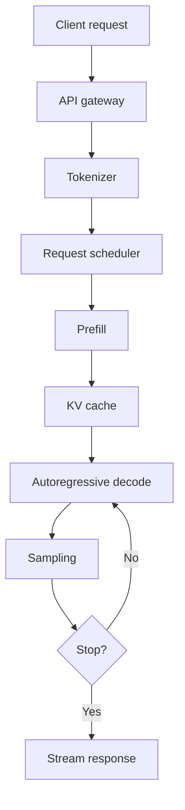
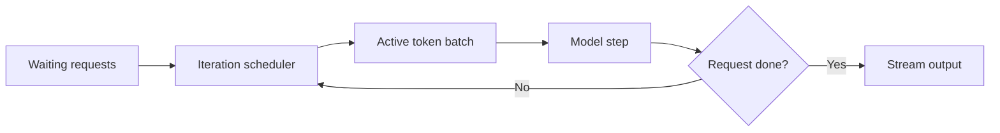
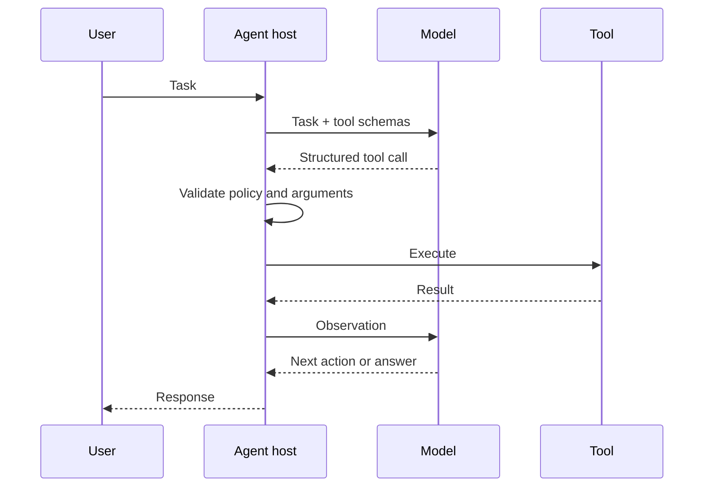
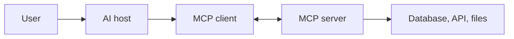
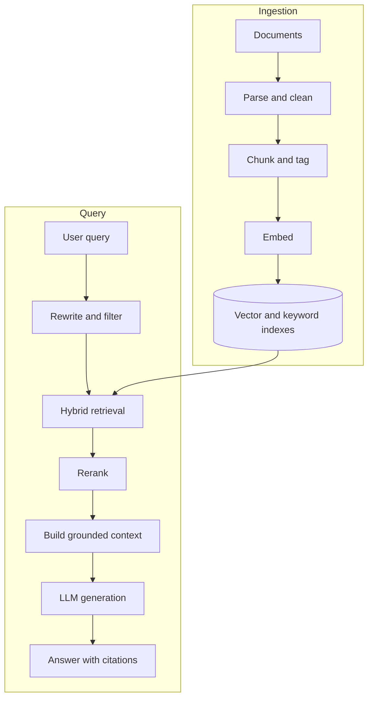
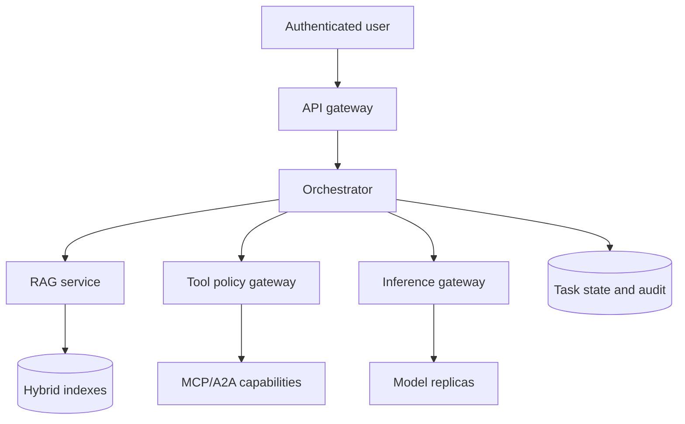

# AI Inference, Agentic AI, and RAG — Interview Study Guide

**Target:** Keysight Technology interview  
**Revision date:** 12 August 2026  
**Goal:** Give a crisp interview answer first, then enough depth for follow-up questions.

---

## How to use this guide

For each question:

1. Say the **short answer** in 30–60 seconds.
2. Draw the relevant flow if the interviewer asks for architecture.
3. Explain one **trade-off**, one **failure mode**, and one **metric**.
4. Connect it to production: latency, throughput, cost, reliability, and security.

---

# Part I — AI Inference Stack

## 1. What happens after an LLM receives a prompt?

### Interview answer

The API authenticates and validates the request, applies rate limits, and sends it to an inference scheduler. The prompt is tokenized into token IDs. The scheduler places the request into a batch and selects a model replica. During **prefill**, the model processes all prompt tokens in parallel and creates the attention KV cache. During **decode**, it generates one token at a time, reusing that cache. Each new token is selected using a decoding policy such as greedy decoding, temperature, top-k, or top-p, then streamed to the client. Finally, the system records latency, token counts, resource use, and errors.



### Production stages

| Stage | Responsibility | Common bottleneck |
|---|---|---|
| Gateway | Auth, quotas, validation, routing | CPU, connection count |
| Tokenizer | Text to token IDs | CPU for very high QPS |
| Scheduler | Admission, batching, fairness | Queueing and head-of-line blocking |
| Model loading | Weights placed in accelerator memory | Storage and network during cold start |
| Prefill | Process prompt and create KV state | GPU compute |
| Decode | Generate tokens autoregressively | HBM bandwidth and KV-cache capacity |
| Streaming | Return partial tokens | Network and client backpressure |
| Observability | Metrics, traces, logs, cost | Telemetry volume |

### Strong follow-up points

- A **cold request** may first require downloading weights and initializing GPU kernels; a warm replica avoids this.
- Safety checks can run before generation, after generation, or incrementally during streaming.
- In distributed inference, tensor/pipeline parallelism introduces collective communication overhead.
- Production serving optimizes several competing goals: TTFT, inter-token latency, total latency, throughput, fairness, and cost per token.

---

## 2. Prefill vs decode

### Interview answer

**Prefill** processes the entire input prompt, usually in parallel. It performs large matrix multiplications, creates the KV cache, and determines time to first token. It is commonly compute-bound. **Decode** generates one new token per sequence per iteration. It repeatedly reads model weights and prior KV entries, performs relatively little work for each byte moved, and is commonly memory-bandwidth-bound.

| Dimension | Prefill | Decode |
|---|---|---|
| Input per request | Many prompt tokens | One new token per iteration |
| Parallelism | High across prompt tokens | Sequential across generated tokens |
| Typical limit | Compute/FLOPS | Memory bandwidth and KV memory |
| User metric | TTFT | ITL/TPOT and tokens/sec |
| Main optimization | Prompt batching, chunked prefill | Continuous batching, KV-cache management |

### Important nuance

“Prefill is compute-bound and decode is bandwidth-bound” is a useful default, not a law. Model architecture, batch size, prompt length, quantization, kernels, speculative decoding, and hardware can change the bottleneck.

### Why separate them operationally?

Prefill and decode have different resource profiles. A system may use separate worker pools for them so large prompts do not stall decode traffic. The cost is transferring KV state between the pools, which can make the network a new bottleneck.

---

## 3. Why GPUs instead of CPUs?

### Interview answer

Transformers spend most of their time on dense linear algebra—matrix multiplications, attention, and element-wise operations. GPUs provide thousands of parallel execution units, specialized tensor cores, and much higher memory bandwidth than general-purpose CPUs. They therefore deliver substantially better throughput and cost per token for large models. CPUs remain useful for orchestration, tokenization, retrieval, small or heavily quantized models, and latency-insensitive workloads.

### CPU vs GPU

| Property | CPU | GPU |
|---|---|---|
| Design goal | Low-latency general-purpose execution | High-throughput parallel computation |
| Cores | Few powerful cores | Many smaller execution units |
| Control flow | Excellent for branching | Best for regular parallel work |
| Memory bandwidth | Lower | Much higher, especially HBM |
| LLM role | API, tokenizer, retrieval, scheduling | Model forward pass |

### Why not always use a GPU?

- Small models or low traffic may not keep an expensive GPU utilized.
- GPU memory capacity can be the limiting resource.
- Queueing to fill batches can hurt low-QPS latency.
- CPUs may be operationally simpler for edge or on-premises deployments.
- Purpose-built accelerators such as TPUs and inference ASICs can also be effective.

---

## 4. Why is decode often memory-bandwidth-bound?

### Interview answer

Decode produces only one token per sequence in each step, but the accelerator must repeatedly access the model weights and the growing KV cache. With a small batch, those bytes are not reused enough to keep the compute units busy. The arithmetic intensity—operations performed per byte transferred—is therefore low. Performance is limited by how quickly HBM can feed data, not by peak FLOPS.

### Roofline intuition

\[
\text{Attainable performance} \leq \min(\text{Peak FLOPS},\; \text{Memory bandwidth} \times \text{Arithmetic intensity})
\]

If arithmetic intensity is low, increasing compute capacity alone provides little benefit.

### How batching helps

When multiple sequences decode together, the same model weights can be used for several tokens. This increases weight reuse and arithmetic intensity. The trade-off is greater queueing, KV memory usage, and per-request latency.

### Common optimizations

- Continuous batching
- Weight and KV-cache quantization
- Paged KV-cache allocation
- FlashAttention and fused kernels
- Speculative decoding
- Prefix caching
- Faster HBM and high-bandwidth interconnects

---

## 5. What is KV cache?

### Interview answer

In each attention layer, earlier tokens produce key and value tensors. Without caching, every decode step would recompute the keys and values for the complete prefix. The KV cache stores those tensors so the next step computes K and V only for the new token and attends against the cached history. It trades memory for much lower decode computation.

### Attention context

\[
\text{Attention}(Q,K,V)=\text{softmax}\left(\frac{QK^T}{\sqrt{d_k}}\right)V
\]

At decode step \(t\), the query belongs to the new token, while K and V contain the prefix from tokens \(1\ldots t\).

### Benefits and costs

| Benefit | Cost |
|---|---|
| Avoids recomputing the complete prefix | Consumes substantial accelerator memory |
| Reduces decode latency | Grows with active sequences and sequence length |
| Enables efficient streaming | Can fragment memory |
| Can reuse common prefixes | Requires careful eviction and isolation |

### Paged KV cache

Paged allocation stores KV data in fixed-size, non-contiguous blocks and maps logical sequence positions to physical blocks. This reduces fragmentation and over-reservation, similar to virtual-memory paging.

---

## 6. How does KV-cache size grow?

### Interview answer

KV-cache memory grows approximately linearly with the batch size, number of cached tokens, number of transformer layers, KV heads, head dimension, and bytes per element. It stores both keys and values, so there is a factor of two.

\[
\text{KV bytes} \approx 2 \times B \times T \times L \times H_{kv} \times D_h \times S
\]

Where:

- \(B\): active sequences
- \(T\): cached tokens per sequence
- \(L\): transformer layers
- \(H_{kv}\): number of KV heads
- \(D_h\): head dimension
- \(S\): bytes per element

### Example

For 32 layers, 32 KV heads, head dimension 128, BF16 (2 bytes), and 4,096 cached tokens:

\[
2 \times 1 \times 4096 \times 32 \times 32 \times 128 \times 2
= 2{,}147{,}483{,}648\text{ bytes} \approx 2\text{ GiB}
\]

That is for one sequence under standard multi-head attention. Models using **multi-query attention (MQA)** or **grouped-query attention (GQA)** have fewer KV heads and require much less KV memory.

### Ways to reduce KV pressure

- GQA or MQA
- Lower-precision KV cache
- Shorter context limits
- Paged allocation
- Eviction or offloading to CPU/SSD
- Prefix sharing
- Sliding-window attention

---

## 7. What are batching and continuous batching?

### Interview answer

**Static batching** groups requests and runs them together until every sequence finishes. Short responses waste capacity while waiting for the longest response. **Continuous batching**, also called iteration-level batching, revises the active batch at each decoding step: completed requests leave and waiting requests enter. This keeps the GPU utilized despite variable prompt and output lengths.



### Scheduler responsibilities

- Token-budget enforcement
- Admission control based on available KV blocks
- Prefill/decode prioritization
- Fairness and tenant quotas
- Preemption or swapping under memory pressure
- Cancellation and deadlines

### Trade-offs

- Better utilization and throughput, but more scheduler complexity.
- Large prefills can delay decode steps; chunked prefill limits that interference.
- Greedy scheduling may starve long prompts or low-priority tenants.

---

## 8. What are TTFT and tokens/sec?

### Interview answer

**TTFT—time to first token**—measures time from request arrival until the client receives the first generated token. It includes queueing, tokenization, prefill, scheduling, and network time. **Tokens per second** can mean per-request generation speed or aggregate server throughput, so I would clarify which one is intended.

| Metric | Meaning | Main influences |
|---|---|---|
| TTFT | Request to first output token | Queueing and prefill |
| ITL | Time between successive streamed tokens | Decode and scheduling |
| TPOT | Average time per output token | Decode performance |
| E2E latency | Request to complete response | TTFT + generation |
| Output tokens/sec/request | User-perceived generation rate | ITL/TPOT |
| Aggregate tokens/sec | Total server throughput | Batch size and utilization |
| Goodput | Requests meeting an SLO | Capacity plus tail latency |

### Useful relationships

For \(N\) generated tokens:

\[
\text{E2E latency} \approx \text{TTFT} + (N-1)\times\text{average ITL}
\]

Average numbers are insufficient. Production systems track p50, p95, and p99 because queueing and long prompts create tail latency.

---

## 9. Why can increasing batch size improve throughput but hurt latency?

### Interview answer

A larger batch reuses weights across more sequences and performs larger, more efficient matrix operations, improving hardware utilization and aggregate throughput. But requests may wait longer while the batch forms, each iteration takes longer, KV-cache usage rises, and requests compete for scheduling time. Therefore throughput improves while TTFT or inter-token latency can worsen.

### Practical policy

Do not maximize batch size blindly. Optimize for **goodput under an SLO**:

\[
\text{Goodput} = \frac{\text{requests completed within latency target}}{\text{second}}
\]

Use continuous batching, a token budget, short batching windows, priority classes, and admission control.

---

## 10. Where can an inference request bottleneck?

### Interview answer

I would diagnose the request stage by stage and correlate latency with resource saturation rather than guessing. Long TTFT with high queue depth suggests scheduler or capacity pressure; high prefill time with high GPU compute utilization suggests compute saturation; slow decode with high HBM bandwidth suggests a memory-bandwidth bottleneck. Cold starts point to storage or network weight loading, and distributed inference may be limited by inter-GPU communication.

| Bottleneck | Typical symptom | Evidence | Possible response |
|---|---|---|---|
| GPU compute | Slow prefill | High SM/tensor-core utilization | More/faster GPUs, better kernels, quantization |
| HBM bandwidth | Slow decode | High memory bandwidth, low compute use | Batch, quantize, optimize cache |
| GPU memory capacity | Low concurrency/OOM | KV usage near limit | Paged KV, admission control, shorter context |
| Interconnect/network | Distributed slowdown | High collective/KV-transfer time | Better topology, parallelism tuning |
| Storage | Cold-start delay | Slow weight loading | Local cache, faster storage, warm replicas |
| Scheduler | High queueing | Idle GPU despite waiting work | Continuous batching, policy tuning |
| CPU/tokenizer | GPU starvation | CPU saturation, low GPU use | Parallel tokenizer, caching, scale frontend |
| API network | Slow streaming | RTT, packet loss, backpressure | Regional routing, compression, flow control |

### Diagnostic method

1. Break latency into gateway, queue, tokenize, prefill, decode, and network spans.
2. Correlate spans with GPU compute, HBM, VRAM, CPU, disk, and network metrics.
3. Segment by prompt length, output length, model, tenant, and batch size.
4. Reproduce with controlled load and change one variable at a time.
5. Optimize the constrained resource and remeasure p95/p99 goodput.

---

# Part II — Agentic AI

## 11. Workflow vs agent

### Interview answer

A **workflow** follows a predefined control path: the developer decides the steps and branches. An **agent** uses a model at runtime to decide the next action, tool, or subtask based on the current state. Workflows are more predictable, testable, and cheaper; agents are more flexible for ambiguous tasks but introduce nondeterminism, security risk, and harder evaluation. In production I prefer a workflow where the process is known and use agentic decisions only where flexibility adds value.

| Dimension | Workflow | Agent |
|---|---|---|
| Control | Coded in advance | Chosen at runtime |
| Predictability | High | Lower |
| Flexibility | Limited | High |
| Cost/latency | Usually lower | Usually higher |
| Testing | Conventional paths | Scenario and trajectory evaluation |
| Best fit | Stable business process | Open-ended research or troubleshooting |

### Strong design answer

The best system is often **bounded agentic orchestration**: deterministic outer workflow, explicit state machine, approved tools, and limited model-driven choices inside specific steps.

---

## 12. How does an agent decide which tool to use?

### Interview answer

The application sends the model the user request plus tool names, descriptions, and input schemas. The model predicts whether a tool is needed and emits a structured call containing a tool name and arguments. The host—not the model—validates authorization and arguments, executes the tool, returns the result as an observation, and asks the model to continue. Tool choice is therefore a model decision constrained and enforced by application code.



### Improve tool selection

- Give tools distinct names and precise descriptions.
- Use strict, small input schemas.
- Avoid overlapping tools.
- Include examples only when ambiguity remains.
- Retrieve only tools relevant to the current task instead of exposing hundreds.
- Evaluate correct-tool selection and argument accuracy separately.

---

## 13. What is function/tool calling?

### Interview answer

Tool calling is a structured interface where a model requests that the application invoke an external capability. The model produces a tool identifier and schema-conforming arguments; it does not directly execute the operation. The application validates, authorizes, executes, and supplies the result back to the model.

### Example

```json
{
  "name": "get_order_status",
  "arguments": {
    "order_id": "ORD-1942"
  }
}
```

### Safety rule

Treat model output as untrusted input. Validate types and ranges, enforce identity-based authorization, require confirmation for consequential writes, make writes idempotent, and keep an audit trail.

---

## 14. What is MCP?

### Interview answer

The **Model Context Protocol (MCP)** is an open protocol that standardizes how an AI application connects to external context and capabilities. An MCP server can expose **tools** for actions, **resources** for readable context, and **prompts** as reusable interaction templates. An MCP client inside the AI host discovers those capabilities and communicates with the server through a supported transport. MCP standardizes integration; it does not automatically make a tool safe or authorized.

### Mental model

Think of MCP as an adapter boundary between an AI host and external systems:



### Main primitives

| Primitive | Purpose | Example |
|---|---|---|
| Tools | Model-invoked operations | Search tickets, create issue |
| Resources | Context retrievable by the host | File, schema, documentation |
| Prompts | Server-provided prompt templates | Code-review template |

### Security caveat

Discovery is not authorization. The host must still control which server and capability is trusted, which user identity applies, what data can leave the boundary, and whether an action needs approval.

---

## 15. MCP server vs MCP client

### Interview answer

The **MCP server** publishes capabilities and implements access to an external system. The **MCP client** lives in or near the AI host, maintains the connection, discovers capabilities, sends protocol requests, and returns results to the host/model. One host may create multiple clients, one for each connected server.

| Component | Owns |
|---|---|
| Host | Conversation, model calls, UX, global policy |
| MCP client | Protocol session and server interaction |
| MCP server | Capability definitions and backend integration |
| Backend | Actual data or business operation |

### Example

An IDE is the host. Its GitHub MCP client connects to a GitHub MCP server. The server exposes repository tools; the host decides whether the current user and model may call them.

---

## 16. What is A2A?

### Interview answer

**Agent2Agent (A2A)** is an open protocol for interoperability between independent agentic applications. It lets agents discover capabilities, exchange messages, delegate tasks, track long-running work, and return artifacts without exposing each agent’s internal reasoning, memory, or implementation. It is useful when agents are separately deployed or owned by different teams or vendors.

### Key idea

An agent is treated as a service with an advertised capability contract. A client agent delegates a goal; the remote agent owns how that goal is executed.

### When it helps

- Cross-team or cross-vendor agent collaboration
- Long-running tasks requiring status updates
- Delegation to domain-specialist agents
- Interoperability without sharing internal tools or memory

---

## 17. MCP vs A2A

### Interview answer

MCP primarily connects an AI application to **tools, resources, and prompts**. A2A connects one autonomous **agentic application to another** for delegation and collaboration. With MCP, the calling host usually orchestrates low-level capabilities. With A2A, the remote agent controls its own internal plan and tools. They are complementary, not competitors.

| Dimension | MCP | A2A |
|---|---|---|
| Connects | Host/model to capability provider | Agent to agent |
| Abstraction | Tools and context | Goals, tasks, messages, artifacts |
| Remote side | Capability server | Autonomous agentic application |
| Orchestration | Usually caller/host | Delegated agent owns execution |
| Example | Agent reads CRM via MCP | Sales agent delegates research to market agent |

### Combined example

An orchestration agent delegates a compliance task to a specialist through A2A. The specialist uses MCP servers internally to query policies and ticketing systems.

---

## 18. How do you prevent infinite agent loops?

### Interview answer

Use hard budgets and explicit termination conditions outside the model. Limit steps, wall-clock time, tokens, tool calls, retries, and spend. Detect repeated actions or unchanged state, require measurable progress, and route uncertain or high-impact cases to a human. The model may propose stopping, but the orchestrator must enforce it.

### Controls

- `max_steps`, `max_tool_calls`, timeout, token and cost budgets
- State-machine transitions instead of an unrestricted loop
- Duplicate call detection using normalized call signatures
- Retry limits with exponential backoff only for transient failures
- No-progress detector based on state or output similarity
- Circuit breaker for failing dependencies
- Human escalation after repeated uncertainty
- Idempotency keys for write tools

### Example termination predicate

Stop if any is true:

\[
\text{goal reached} \lor \text{budget exhausted} \lor \text{no progress} \lor \text{policy blocked} \lor \text{human required}
\]

---

## 19. How do you restrict tools and permissions?

### Interview answer

Apply least privilege at multiple layers. Expose only task-relevant tools, scope credentials to the user and operation, validate every argument, and authorize the resolved resource—not just the requested tool name. Separate reads from writes, require approval for consequential actions, sandbox execution, restrict network destinations, protect secrets, and log every decision and effect.

### Defense layers

1. **Discovery:** allow-list trusted servers and expose a minimal tool set.
2. **Identity:** use short-lived, user-scoped credentials.
3. **Authorization:** check tenant, resource, action, and data sensitivity.
4. **Validation:** schema, length, enum, path, and destination checks.
5. **Execution:** sandbox, egress policy, timeouts, resource quotas.
6. **Confirmation:** human approval for payments, deletion, publication, or sending.
7. **Audit:** immutable logs with actor, tool, arguments, result, and policy decision.

### Important principle

Never give a model a broad credential and expect the prompt to enforce access control. Authorization belongs in deterministic code.

---

## 20. How do you handle prompt injection?

### Interview answer

Assume retrieved documents, web pages, emails, and tool outputs are untrusted data. Keep instructions separate from content, do not let retrieved text silently expand permissions, and enforce tool policy outside the model. Minimize accessible data and tools, validate outputs, require confirmation for consequential actions, and test known injection scenarios. There is no single prompt that eliminates prompt injection.

### Direct vs indirect injection

- **Direct:** the user explicitly tries to override system or developer instructions.
- **Indirect:** malicious instructions are embedded in retrieved content or tool output.

### Mitigations

- Mark provenance and trust level for all context.
- Delimit untrusted content and tell the model to treat it as data.
- Use allow-listed tools and destination controls.
- Do not expose secrets in model context.
- Apply data-loss-prevention checks to outgoing calls.
- Require confirmation showing the exact action and target.
- Sanitize rendered output to prevent UI/script injection.
- Run adversarial evals; log and investigate policy violations.

---

## 21. How do you maintain state and context?

### Interview answer

Separate durable application state from the model’s prompt. Store the canonical task state, tool results, approvals, and checkpoints in a database. Build each model context from the current goal, a bounded recent history, relevant retrieved memory, and a summary of older interactions. Use versioning and idempotency so retries do not duplicate effects.

### Memory layers

| Layer | Contents | Lifetime |
|---|---|---|
| Working context | Current instructions, recent turns, active tool outputs | One model call/session window |
| Task state | Plan, completed steps, pending actions, budgets | Task lifetime |
| Episodic memory | Prior interactions and outcomes | Longer term |
| Semantic memory | Stable facts/preferences with provenance | Longer term |
| External source | Business system of record | Authoritative |

### Context optimization

- Summarize old turns, but retain links to raw events.
- Retrieve only relevant memories.
- Deduplicate repeated tool output.
- Use structured state instead of prose where possible.
- Assign TTLs and invalidate stale facts.
- Never treat a generated summary as more authoritative than the source system.

---

## 22. Single-agent vs multi-agent architecture

### Interview answer

Start with a single agent because it is simpler, cheaper, faster, and easier to debug. Use multiple agents only when there is real decomposition: independent specialist capabilities, separate security boundaries, parallel work, or long-running ownership. Multi-agent systems add coordination messages, duplicated context, conflict resolution, larger failure surfaces, and harder evaluation.

| Single agent | Multi-agent |
|---|---|
| Simple orchestration | Specialist isolation |
| Lower latency/cost | Parallelizable subtasks |
| Easier tracing | Separate permissions/ownership |
| Shared context | Smaller per-agent context possible |
| May become overloaded | Coordination and consistency cost |

### Good reasons for multiple agents

- Different tools require different permissions.
- Domains need separately evaluated specialist behavior.
- Subtasks are independent enough to execute in parallel.
- A remote agent is owned by another service/team.

### Bad reason

Creating roles such as “planner,” “critic,” and “writer” without evidence that they improve quality. Measure against a strong single-agent baseline.

---

# Part III — Retrieval-Augmented Generation (RAG)

## 23. Explain RAG end to end

### Interview answer

RAG has an offline ingestion path and an online query path. Offline, documents are parsed, cleaned, split into chunks, enriched with metadata, embedded, and indexed. Online, the query may be rewritten, embedded, and used for vector and/or keyword retrieval. Results are filtered and reranked, relevant passages are assembled into a bounded context with citations, and the LLM generates an answer grounded in those passages. The system then evaluates quality, latency, safety, and user feedback.



### Production requirements

- Document-level ACL filtering
- Provenance and citations
- Incremental updates and deletion propagation
- PII handling
- Observability by retrieval and generation stage
- Abstention when evidence is weak

---

## 24. Why RAG instead of fine-tuning?

### Interview answer

Use RAG when knowledge is private, changes frequently, requires citations, or must respect document permissions. It can update knowledge by re-indexing without retraining. Fine-tuning is better for changing model behavior, style, format, or task-specific patterns; it is not a reliable database for exact, rapidly changing facts. They can be combined: fine-tune behavior and use RAG for current knowledge.

| Requirement | Prefer RAG | Prefer fine-tuning |
|---|:---:|:---:|
| Fresh/private facts | Yes | No |
| Citations/provenance | Yes | Weak |
| Change tone or format | Limited | Yes |
| Teach repeatable task behavior | Sometimes | Yes |
| Immediate deletion/update | Easier | Harder |
| Per-query retrieval latency | Added | No retrieval required |

### Caveat

RAG fails if retrieval misses the evidence; fine-tuning fails if the model memorizes stale or incorrect facts. Evaluate the two stages separately.

---

## 25. What are embeddings?

### Interview answer

An embedding is a dense numeric vector learned to represent semantic properties of text, images, or other data. Items with similar meaning tend to be near each other according to a similarity metric. In RAG, the same embedding model maps document chunks and queries into a common vector space for semantic retrieval.

### Practical details

- Embeddings capture similarity, not guaranteed truth or entailment.
- Query and document embeddings must be compatible.
- Changing the model usually requires re-embedding the corpus.
- Store the embedding-model version with every vector.
- Domain-specific evaluation matters more than generic benchmark scores.

---

## 26. What does a vector database store?

### Interview answer

A vector database stores a vector plus an identifier, metadata, and usually the source text or a pointer to it. It builds an ANN index for fast similarity search and should support metadata filtering, updates, deletion, persistence, replication, and access control.

```json
{
  "id": "policy-17#chunk-4",
  "vector": [0.021, -0.183, 0.074],
  "text": "...",
  "metadata": {
    "document_id": "policy-17",
    "section": "Refunds",
    "tenant": "acme",
    "updated_at": "2026-07-30",
    "embedding_version": "v3"
  }
}
```

### Interview nuance

The vector database is not the source of truth. Keep original documents in authoritative storage and maintain lineage from each chunk back to its source.

---

## 27. Cosine similarity vs Euclidean distance

### Cosine similarity

\[
\cos(\theta)=\frac{x\cdot y}{\|x\|\|y\|}
\]

It measures direction and ignores magnitude. It is commonly used for semantic embeddings.

### Euclidean distance

\[
d(x,y)=\sqrt{\sum_i(x_i-y_i)^2}
\]

It measures straight-line distance and is sensitive to magnitude.

### Interview answer

For L2-normalized vectors, cosine ranking, dot-product ranking, and Euclidean-distance ranking are closely related:

\[
\|x-y\|^2=2-2(x\cdot y)
\]

when \(\|x\|=\|y\|=1\). I would use the metric recommended by the embedding model and validate it on domain-specific queries rather than choosing by convention.

---

## 28. Chunking strategy

### Interview answer

Chunking should preserve semantic units while keeping each retrieval unit focused enough to rank accurately. Start with structure-aware chunks—headings, paragraphs, functions, or table sections—add modest overlap where context crosses boundaries, attach parent metadata, and tune chunk size using retrieval evaluation. A single fixed character count is a baseline, not a final strategy.

### Strategies

| Strategy | Strength | Weakness |
|---|---|---|
| Fixed token window | Simple and predictable | Breaks semantic boundaries |
| Recursive separators | Better natural boundaries | Still heuristic |
| Structure-aware | Preserves sections/code units | Parser-specific |
| Semantic chunking | Groups related sentences | More compute and complexity |
| Parent-child | Precise retrieval plus broad context | More indexing/orchestration |

### Factors

- Embedding model context limit
- Expected question granularity
- Document structure
- Tables and code boundaries
- LLM context budget
- Required citation precision

---

## 29. What happens if chunks are too small or too large?

| Too small | Too large |
|---|---|
| Lose surrounding meaning | Mix multiple unrelated concepts |
| More index entries and cost | Lower retrieval precision |
| Need many chunks to answer | Waste LLM context tokens |
| Fragmented citations | Relevant sentence diluted in embedding |

### Interview answer

Small chunks can improve precision but lose context; large chunks preserve context but reduce specificity and consume more prompt space. I would tune chunking by measuring recall@k, precision/nDCG, answer faithfulness, latency, and cost on a representative evaluation set.

### Strong pattern

Retrieve small child chunks for accuracy, then expand to the parent section for generation.

---

## 30. What is ANN search?

### Interview answer

Approximate nearest-neighbor search finds vectors close to the query without comparing against every vector. Exact brute-force search costs roughly \(O(Nd)\) per query for \(N\) vectors of dimension \(d\). ANN indexes reduce latency and improve scalability by accepting a tunable possibility of missing some true nearest neighbors.

### Core trade-off

\[
\text{Recall} \leftrightarrow \text{Latency, memory, and index-build cost}
\]

### Common families

- Graph based: HNSW
- Inverted-file based: IVF
- Compression based: product quantization (PQ)
- Tree/hash methods for some workloads

### Metrics

- Recall@k compared with exact search
- Query p95 latency
- QPS
- Index memory
- Build/update time

---

## 31. HNSW basics

### Interview answer

**Hierarchical Navigable Small World** is a graph-based ANN index. Each vector is a node connected to nearby nodes. Upper sparse layers provide long jumps across the space; lower dense layers refine the search locally. A query enters at the top, greedily moves toward closer nodes, then searches a candidate set at the bottom layer.

### Important parameters

| Parameter | Effect |
|---|---|
| `M` | Neighbors per node; higher improves recall but uses more memory/build time |
| `efConstruction` | Candidate breadth during build; higher improves index quality at higher build cost |
| `efSearch` | Candidate breadth during query; higher improves recall but adds latency |

### Strengths and weaknesses

- Excellent recall/latency for in-memory search.
- High memory overhead from graph edges.
- Index construction can be expensive.
- Deletion and high-rate updates require careful implementation.
- Filtering can reduce effective connectivity; filtered-search strategy matters.

---

## 32. Hybrid search: BM25 plus vectors

### Interview answer

Dense vector search captures semantic similarity but can miss exact identifiers, rare terms, error codes, or names. BM25 lexical search handles exact term matching but misses paraphrases. Hybrid search runs both and fuses the ranked lists, often using reciprocal rank fusion, then optionally reranks the combined candidates.

### Reciprocal rank fusion

\[
\text{RRF}(d)=\sum_{r\in R}\frac{1}{k+\operatorname{rank}_r(d)}
\]

RRF combines rankings without requiring incomparable BM25 and vector scores to be calibrated.

### Example

For “EO 14117 compliance,” keyword retrieval preserves the exact regulation number while vector retrieval finds passages using related language such as “restricted transactions” or “data-security rule.”

---

## 33. What is reranking?

### Interview answer

First-stage retrieval cheaply selects a broad candidate set. A reranker then applies a more accurate and expensive model to each query-document pair and reorders the candidates before context construction. A cross-encoder usually sees the query and passage together, capturing token-level relevance that independent embeddings miss.

### Pipeline

```text
Large corpus -> retrieve top 50 -> rerank -> keep top 5–10 -> generate
```

### Trade-off

Reranking improves precision but adds latency and compute cost. Batch candidate pairs, cap candidate count, and measure whether answer quality justifies it.

---

## 34. How do you evaluate RAG?

### Interview answer

Evaluate retrieval and generation separately, then measure end-to-end task success. Otherwise a good answer can hide poor retrieval, or correct retrieval can be blamed for a generation error. Build a versioned test set from real questions with expected sources, include unanswerable and adversarial cases, and track quality alongside latency and cost.

### Retrieval metrics

- Recall@k: did the top-k contain relevant evidence?
- Precision@k: what fraction of retrieved items were relevant?
- MRR: how early did the first relevant item appear?
- nDCG: did the ranking place highly relevant items first?
- ACL correctness: was unauthorized content ever retrieved?

### Generation metrics

- Correctness against a reference or human rubric
- Faithfulness: are claims supported by retrieved evidence?
- Citation correctness and completeness
- Relevance and completeness
- Abstention accuracy for unsupported questions

### Operational metrics

- p50/p95/p99 latency by stage
- Cost per successful answer
- Cache hit rate
- Index freshness and ingestion lag
- User resolution rate or task success

### Failure taxonomy

1. Relevant source absent from corpus.
2. Parsing/chunking damaged the source.
3. Retrieval missed the relevant chunk.
4. Reranker demoted it.
5. Context builder truncated or mixed it.
6. Generator ignored or contradicted evidence.

---

## 35. How would you cache RAG results?

### Interview answer

Cache at multiple stages, but include tenant, permissions, corpus version, model version, and relevant generation parameters in cache keys. Exact-query caching is safest; semantic caching offers more hits but risks returning an answer to a merely similar question. Use TTLs and event-driven invalidation when documents or ACLs change.

### Cache layers

| Layer | Key idea | Risk |
|---|---|---|
| Document parsing | Content hash + parser version | Stale parser output |
| Embeddings | Text hash + embedding-model version | Model mismatch |
| Retrieval | Query/filter/index version | Stale corpus or ACL |
| Reranking | Query + candidate IDs + reranker version | Candidate drift |
| Prompt/prefix | Shared token prefix | Cross-tenant leakage |
| Final answer | Exact or semantic query + full policy/version key | Stale or incorrect reuse |

### Cache invalidation events

- Document update or deletion
- ACL or tenant membership change
- Index rebuild
- Embedding/reranker/model version change
- Prompt or safety-policy change

### Security rule

Never share cached retrieval results or generated answers across authorization boundaries unless the cache entry is proven public and policy-compatible.

---

## 36. Where would Redis fit?

### Interview answer

Redis can serve as a low-latency cache and coordination layer around RAG and agents. It can cache embeddings, retrieval results, reranker results, sessions, rate-limit counters, distributed locks, job status, and exact or semantic responses. Redis can also support vector search, but whether it should be the primary vector store depends on corpus scale, durability, filtering, operational skills, and latency requirements.

### Suitable uses

- Session and conversation state
- Short-lived agent checkpoints
- Exact-query and semantic caches
- Rate limiting and quotas
- Distributed locks and idempotency records
- Pub/sub or streams for task events
- Hot document metadata
- Vector retrieval for appropriate workloads

### Cautions

- Treat Redis as volatile unless persistence and replication are configured appropriately.
- Avoid unbounded keys and large cached prompts.
- Design TTLs and eviction policy intentionally.
- Namespace every key by tenant and authorization context.
- Do not use a distributed lock as a substitute for idempotent business logic.

---

# Part IV — Integrated Production Design

## 37. Design a production enterprise RAG agent

### Interview answer

I would keep the outer request path deterministic. The gateway authenticates the user and derives tenant and permissions. A retrieval service performs hybrid search with ACL filters and reranking. The agent may call allow-listed tools through a policy gateway, but every tool executes with user-scoped authorization. The inference gateway schedules model calls and records TTFT, ITL, throughput, and cost. Durable state and audit logs live outside the model context.



### Reliability design

- Deadlines propagated to every dependency
- Retries only for safe transient failures
- Idempotency keys for writes
- Circuit breakers and bounded queues
- Graceful degradation: lexical-only retrieval or non-agentic answer
- Model/provider fallback with compatibility checks
- Checkpoint long-running tasks

### Security design

- Tenant-aware retrieval filters before ANN results are returned
- Short-lived, scoped credentials
- Human confirmation for high-impact writes
- Prompt-injection resistance at policy boundaries
- Data classification and outbound DLP
- Full trace from user request to documents and tool effects

---

## 38. How would you scale it for 10,000 concurrent requests?

### Interview answer

I would separate stateless API/orchestration services from stateful retrieval and inference layers, place bounded queues between them, and apply admission control instead of letting overload cascade. Autoscaling would use queue depth, token arrival rate, KV-cache capacity, and SLO goodput—not CPU alone. Retrieval, prefill, and decode have different scaling signals and may need separate pools.

### Key decisions

- Rate limit by tenant and token budget.
- Stream output to reduce perceived latency, with backpressure.
- Use continuous batching and paged KV-cache allocation.
- Cache common prefixes, embeddings, and safe retrieval results.
- Shard indexes by tenant/domain where appropriate.
- Use load shedding for requests unlikely to meet their deadlines.
- Prioritize interactive traffic over batch jobs.
- Measure queue time separately from service time.

---

## 39. Likely scenario: answer quality suddenly drops

### Structured answer

1. **Scope:** Which tenants, models, query types, and deployment versions changed?
2. **Retrieval:** Check recall@k, filters, index freshness, embedding drift, and empty results.
3. **Context:** Check truncation, chunk duplication, ordering, and prompt-token growth.
4. **Generation:** Check model/prompt/sampling changes and refusal rates.
5. **Data:** Check parser failures, source deletions, ACL changes, and ingestion lag.
6. **Rollback:** Revert the last model, prompt, index, or embedding version if correlated.
7. **Prevent:** Add canaries, versioned eval gates, and per-stage dashboards.

---

## 40. Likely scenario: inference latency suddenly rises

### Structured answer

1. Compare TTFT, queue time, prefill, and ITL to locate the phase.
2. Check traffic mix: prompt/output lengths, concurrency, and tenant distribution.
3. Inspect GPU compute, HBM bandwidth, VRAM/KV occupancy, CPU, disk, and network.
4. Check batch size, scheduler changes, cache hit rate, and replica health.
5. Look for cold starts, failed replicas, retry storms, or client backpressure.
6. Shed excess load, reduce context/output limits, or add capacity.
7. Reproduce under controlled load and validate p95/p99 after the fix.

---

# Part V — Rapid Revision

## 20 one-line answers

1. **Prefill:** parallel prompt processing that creates KV state; usually compute-heavy.
2. **Decode:** sequential next-token generation; usually bandwidth-heavy.
3. **KV cache:** cached attention keys/values that trade memory for lower decode compute.
4. **Continuous batching:** update the active batch every iteration as requests arrive and finish.
5. **TTFT:** request arrival to first received token.
6. **ITL:** time between streamed output tokens.
7. **Goodput:** work completed while satisfying the latency SLO.
8. **Agent:** model chooses runtime actions within enforced boundaries.
9. **Workflow:** developer predetermines steps and branches.
10. **Tool calling:** model proposes a structured call; the host validates and executes it.
11. **MCP:** host-to-capability protocol for tools, resources, and prompts.
12. **A2A:** protocol for delegation and communication between autonomous agents.
13. **Prompt injection defense:** treat external content as untrusted and enforce policy outside the model.
14. **RAG:** retrieve evidence, construct context, then generate a grounded answer.
15. **Embedding:** dense semantic representation used for similarity retrieval.
16. **ANN:** faster approximate vector search with a recall/latency trade-off.
17. **HNSW:** hierarchical proximity graph for high-recall ANN search.
18. **Hybrid search:** combine semantic vectors with lexical BM25.
19. **Reranker:** accurate second-stage model that reorders retrieved candidates.
20. **Redis:** low-latency cache/state/coordination layer; optionally a vector-search engine.

## Five trade-offs to mention

1. Batch size: throughput vs latency.
2. KV caching: compute vs memory.
3. ANN: recall vs latency/memory.
4. Chunk size: semantic context vs retrieval precision.
5. Agent autonomy: flexibility vs predictability/security/cost.

## Five interviewer traps

1. Do not say a GPU is always faster; workload size and utilization matter.
2. Do not say MCP itself provides authorization; the host/server must enforce it.
3. Do not say RAG eliminates hallucinations; it only provides evidence.
4. Do not choose multi-agent architecture without measurable need.
5. Do not report only average latency; discuss p95/p99 and queueing.

---

# Sources and further reading

- [NVIDIA — Mastering LLM Techniques: Inference Optimization](https://developer.nvidia.com/blog/mastering-llm-techniques-inference-optimization/)
- [vLLM documentation — Optimization and Tuning](https://docs.vllm.ai/en/stable/configuration/optimization/)
- [vLLM paper — Efficient Memory Management for Large Language Model Serving with PagedAttention](https://arxiv.org/abs/2309.06180)
- [Model Context Protocol — Architecture](https://modelcontextprotocol.io/docs/learn/architecture)
- [Model Context Protocol — Specification](https://modelcontextprotocol.io/specification/latest)
- [A2A Protocol — Official project](https://a2a-protocol.org/)
- [A2A Protocol — GitHub specification and SDKs](https://github.com/a2aproject/A2A)
- [HNSW paper — Efficient and Robust Approximate Nearest Neighbor Search Using HNSW Graphs](https://arxiv.org/abs/1603.09320)
- [BM25 — The Probabilistic Relevance Framework](https://www.staff.city.ac.uk/~sbrp622/papers/foundations_bm25_review.pdf)

---

## Final 10-minute revision order

1. Say prefill vs decode without notes.
2. Derive the KV-cache formula and explain GQA/MQA.
3. Explain throughput vs latency using batching.
4. Draw MCP vs A2A and state their security boundary.
5. Explain RAG ingestion and query paths.
6. Compare dense, BM25, hybrid, and reranking.
7. Recite the RAG failure taxonomy.
8. Finish with goodput, p95/p99, authorization, and observability.

