# Top 100 Spring Framework Interview Questions — Model Answers

> **Target:** Senior Backend / Senior Software Engineer (Okta — Identity Administration)
> **Format:** Concise, production-grounded answers with diagrams and code snippets.
> **Use:** Read the answer, then re-explain it in your own words. If you can't explain it without the notes, you don't own it yet.

---

# 1. Spring Core Concepts — 1–20

## 1. What problem does Dependency Injection solve, and how does Spring implement IoC?

**Problem:** Without DI, a class creates its own collaborators (`new PaymentClient()`). That hard-wires concrete implementations, making code harder to unit test in isolation, harder to reconfigure, and prone to duplicated wiring logic. You can still test tightly coupled code, but replacing collaborators becomes awkward.

**Inversion of Control (IoC):** The object no longer controls *how* its dependencies are built; the container does. The class just declares *what* it needs.

**How Spring implements it:**
- A `BeanDefinition` registry is built from component scanning + `@Configuration`.
- The `ApplicationContext` instantiates beans, resolves the dependency graph, and injects collaborators.
- Injection happens via constructor, setter, or field reflection.

```java
// Tightly coupled (bad) — cannot test without a real SMTP server
class OrderService {
    private final EmailClient email = new SmtpEmailClient();
}

// DI (good) — container supplies the collaborator; tests inject a mock
@Service
class OrderService {
    private final EmailClient email;
    OrderService(EmailClient email) { this.email = email; } // constructor injection
}
```


---

## 2. What is the difference between `BeanFactory` and `ApplicationContext`?

| Aspect | `BeanFactory` | `ApplicationContext` |
|---|---|---|
| Instantiation | Commonly on demand; behavior depends on implementation/configuration | By default pre-instantiates non-lazy singleton beans at context refresh |
| Events | No | Publishes/consumes `ApplicationEvent` |
| i18n | No | `MessageSource` support |
| AOP / annotations | Manual | Auto-detects `BeanPostProcessor`s (`@Autowired`, AOP) |
| Environment | Basic | `Environment`, property sources, profiles |

`ApplicationContext` **is-a** `BeanFactory` (it extends the interface) plus application-level infrastructure such as events, message resolution, environment/profile support, and automatic registration of common post-processors. In normal applications prefer `ApplicationContext`; lazy behavior can still be configured there with `@Lazy` or global lazy initialization.

---

## 3. Explain the complete lifecycle of a Spring Bean.

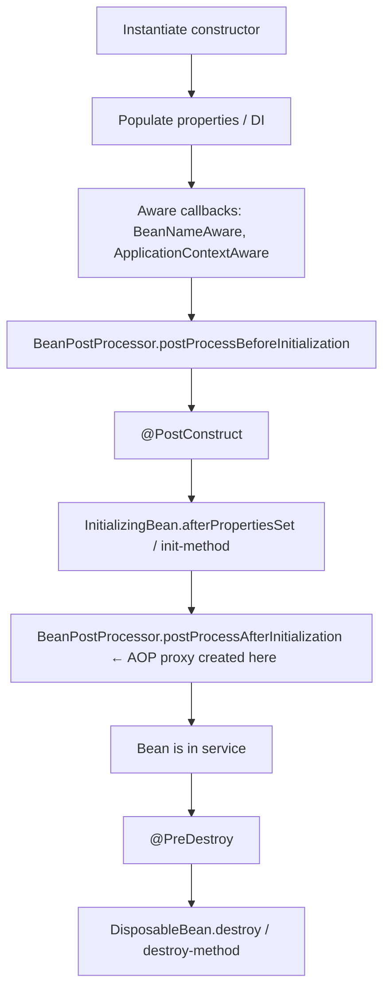

Key insight for interviews: **AOP proxies are applied in `postProcessAfterInitialization`** — the returned object may be a proxy, not your raw bean. That's why self-invocation bypasses AOP (see Q52).

```java
@Component
class CacheWarmer {
    @PostConstruct void warm() { /* runs after DI, before serving traffic */ }
    @PreDestroy   void flush() { /* runs on graceful shutdown */ }
}
```

---

## 4. How does Spring discover and register beans during component scanning?

`@ComponentScan` (implied by `@SpringBootApplication`) walks the base package, reads class metadata via ASM (no class loading needed), and registers any class annotated with a stereotype:

- `@Component` — generic
- `@Service` — business logic (semantic marker)
- `@Repository` — persistence; adds **exception translation** (`PersistenceExceptionTranslationPostProcessor` converts vendor exceptions to Spring `DataAccessException`)
- `@Controller` / `@RestController` — web endpoints

```java
@SpringBootApplication // = @Configuration + @EnableAutoConfiguration + @ComponentScan
public class App { public static void main(String[] a){ SpringApplication.run(App.class,a);} }
```

All stereotypes are meta-annotated with `@Component`; the distinction is semantic + behavioral (`@Repository`'s translation).

---

## 5. What happens internally when Spring encounters `@Autowired`?

`AutowiredAnnotationBeanPostProcessor` handles it during bean creation:

1. Finds injection points (constructor / field / setter).
2. For each dependency, resolves a candidate by **type** from the `BeanFactory`.
3. If multiple candidates → narrow by `@Qualifier`, `@Primary`, or bean name.
4. Injects via reflection. If none found and `required=true`, throws `NoSuchBeanDefinitionException`.

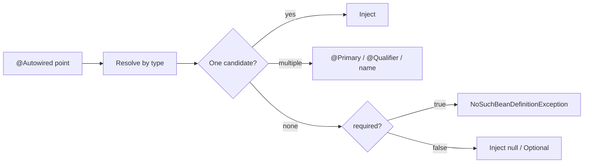

Since Spring 4.3, a **single constructor** needs no `@Autowired` annotation.

---

## 6. Constructor vs setter vs field injection — when to use each?

| Type | Use when | Pros | Cons |
|---|---|---|---|
| **Constructor** | Default choice; mandatory deps | Immutable (`final`), fully-initialized object, testable, detects cycles at startup | Verbose (mitigated by Lombok/records) |
| **Setter** | Optional / reconfigurable deps | Allows re-injection, resolves some circular deps | Object can exist half-initialized |
| **Field** | Avoid in production | Concise | Can't set `final`, hidden dependencies, needs reflection to test, encourages god-classes |

**Rule:** Prefer constructor injection. It makes dependencies explicit and allows fields to be `final`. That improves object design, but it does **not by itself make the bean thread-safe**; thread-safety still depends on the state and behavior of the dependencies and the bean.

```java
@Service
class InvoiceService {
    private final TaxCalculator tax;      // required → constructor
    private AuditSink audit = NO_OP;       // optional → setter
    InvoiceService(TaxCalculator tax) { this.tax = tax; }
    @Autowired(required=false) void setAudit(AuditSink a){ this.audit = a; }
}
```

---

## 7. How does Spring resolve multiple beans implementing the same interface?

```java
interface PaymentGateway {}
@Component("stripe") class StripeGateway implements PaymentGateway {}
@Component @Primary class AdyenGateway implements PaymentGateway {} // default winner

@Service
class Checkout {
    Checkout(@Qualifier("stripe") PaymentGateway gw) {} // explicit pick beats @Primary
}
```

Resolution order: exact `@Qualifier`/bean-name match → `@Primary` → fail with `NoUniqueBeanDefinitionException`.
You can also inject `List<PaymentGateway>` or `Map<String,PaymentGateway>` to get **all** implementations (strategy pattern).

---

## 8. Explain Spring bean scopes.

| Scope | Lifetime | Typical use |
|---|---|---|
| **singleton** (default) | One per container | Stateless services |
| **prototype** | New instance per `getBean`/injection | Stateful, non-thread-safe helpers |
| **request** | One per HTTP request | Per-request context |
| **session** | One per HTTP session | User session data |
| **application** | One per `ServletContext` | App-wide web state |
| websocket | One per WS session | WS state |

```java
@Component
@Scope(value = "prototype")
class ReportBuilder { /* mutable, short-lived */ }
```

**Singletons must be stateless** because they're shared across all threads.

---

## 9. Is a Spring singleton bean thread-safe? Why or why not?

**No — not automatically.** "Singleton" is a *container* concept (one instance), not a concurrency guarantee. If the bean holds mutable instance state, concurrent requests race on it.

They're safe **only if** they are stateless or use immutable/thread-safe state.

```java
// BUG: shared mutable field — data corruption under load
@Service class CounterService { private int count; void inc(){ count++; } }

// SAFE: no shared mutable state; per-call locals only
@Service class PricingService {
    BigDecimal price(Order o){ BigDecimal total = BigDecimal.ZERO; /* locals */ return total; }
}
```

Fixes for needed state: prefer request-local variables or immutable state; otherwise use appropriate concurrency primitives (`Atomic*`, locks, concurrent collections) or externalize shared state to DB/Redis. Avoid using `ThreadLocal` as a general state-management fix; pooled/virtual-thread execution and context propagation make it easy to misuse.

---

## 10. Prototype injected into a singleton — the lifecycle mismatch and fix.

Problem: a singleton is created **once**, so its prototype dependency is injected **once** and effectively becomes a singleton too — you never get fresh instances.

**Fixes:**
1. `@Lookup` method injection (Spring overrides it to return a fresh bean each call).
2. Inject `ObjectProvider<T>` / `Provider<T>` and call `getObject()` per use.
3. `@Scope(proxyMode = TARGET_CLASS)` on the prototype.

```java
@Service
class OrderProcessor {
    private final ObjectProvider<ReportBuilder> builders; // fresh each call
    OrderProcessor(ObjectProvider<ReportBuilder> b){ this.builders = b; }
    void run(){ ReportBuilder rb = builders.getObject(); /* new prototype */ }
}
```

---

## 11. Difference between `@Component` and `@Bean`.

| `@Component` | `@Bean` |
|---|---|
| Class-level; auto-detected by scanning | Method-level inside `@Configuration` |
| You own the class (your source) | Ideal for **third-party** classes you can't annotate |
| One bean per class | Full control over construction logic |

```java
@Configuration
class AppConfig {
    @Bean ObjectMapper objectMapper(){         // 3rd-party class → @Bean
        return new ObjectMapper().findAndRegisterModules();
    }
}
@Component class MyOwnService {}               // your class → @Component
```

---

## 12. What does `@Configuration` do internally, and why is it special?

`@Configuration` classes are enhanced by a **CGLIB proxy**. This makes `@Bean` methods "full" mode: calling one `@Bean` method from another returns the **same singleton** rather than a new object.

```java
@Configuration
class Cfg {
    @Bean A a(){ return new A(); }
    @Bean B b(){ return new B(a()); } // a() returns the SAME singleton, not a new A
}
```

With `@Configuration(proxyBeanMethods = false)` ("lite" mode) that guarantee is dropped — faster startup, but each call constructs a new object. `@Component` with `@Bean` methods is also lite mode.

---

## 13. How does Spring Boot auto-configuration work?

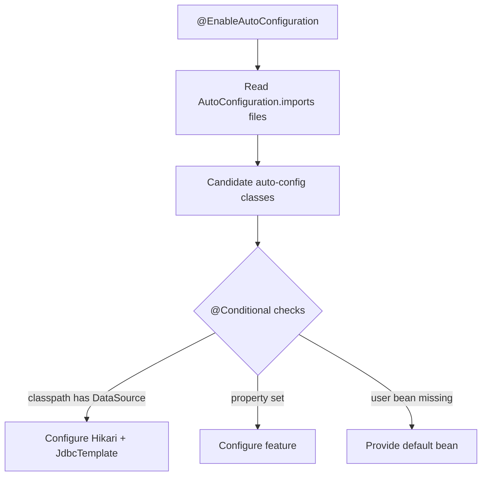

Mechanism:
- `@EnableAutoConfiguration` loads class names from `META-INF/spring/org.springframework.boot.autoconfigure.AutoConfiguration.imports`.
- Each candidate is guarded by `@Conditional*` annotations.
- `@ConfigurationProperties` binds `application.yml` values.
- **Your beans win**: `@ConditionalOnMissingBean` means auto-config backs off if you defined your own.

---

## 14. Explain the conditional annotations.

- `@ConditionalOnClass` — apply only if a class is on the classpath (e.g., Hibernate present → configure JPA).
- `@ConditionalOnMissingBean` — apply only if the user hasn't already defined that bean (lets you override defaults).
- `@ConditionalOnProperty` — apply based on a config property (`feature.x.enabled=true`).
- `@ConditionalOnBean` — apply only if another bean already exists (ordering-sensitive).

```java
@AutoConfiguration
class CacheAutoConfig {
    @Bean
    @ConditionalOnClass(RedisConnectionFactory.class)
    @ConditionalOnMissingBean
    @ConditionalOnProperty(prefix="cache", name="type", havingValue="redis")
    CacheManager redisCacheManager(RedisConnectionFactory f){ return RedisCacheManager.create(f); }
}
```

---

## 15. How does Spring Boot decide which embedded web server to start?

By **classpath detection**:
- `spring-boot-starter-web` (Tomcat) → **Tomcat** (default).
- Exclude Tomcat + add `spring-boot-starter-jetty` / `-undertow` → that server.
- `spring-boot-starter-webflux` with no servlet stack → **Netty** (reactive).

If both web and webflux are present, servlet (MVC) wins unless you force `WebApplicationType.REACTIVE`.

```groovy
implementation('org.springframework.boot:spring-boot-starter-web') { exclude module: 'spring-boot-starter-tomcat' }
implementation 'org.springframework.boot:spring-boot-starter-jetty'
```

---

## 16. Spring MVC vs Spring WebFlux — when to choose each?

| | Spring MVC | Spring WebFlux |
|---|---|---|
| Model | Thread-per-request (blocking) | Event-loop, non-blocking (Reactor) |
| API | `@Controller`, imperative | `Mono`/`Flux`, reactive |
| Best for | Blocking JDBC, most CRUD apps, simplicity | High concurrency with I/O-bound calls, streaming, back-pressure |
| Typical runtime | Servlet container such as Tomcat/Jetty | Reactor Netty by default; WebFlux can also run on supported Servlet containers |

**Choose MVC** for typical DB-backed services (JDBC is blocking anyway). **Choose WebFlux** when you have many concurrent connections calling *non-blocking* downstreams (reactive DB drivers, other HTTP services) and need back-pressure. Mixing blocking JDBC into WebFlux destroys its benefits.

---

## 17. Explain the complete request lifecycle in Spring MVC.

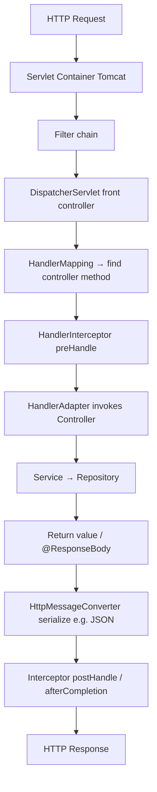

`DispatcherServlet` is the front controller orchestrating `HandlerMapping`, `HandlerAdapter`, `HttpMessageConverter`, and `HandlerExceptionResolver`.

---

## 18. How does `DispatcherServlet` locate the correct controller method?

Via `HandlerMapping` (mainly `RequestMappingHandlerMapping`). At startup it builds a map of `RequestMappingInfo` → `HandlerMethod` from every `@RequestMapping`/`@GetMapping` etc. Per request it matches on:
- URL path pattern
- HTTP method
- `consumes`/`produces` (Content-Type/Accept)
- `params`/`headers` conditions

Best match wins; ambiguous matches throw. Then a `HandlerAdapter` resolves method arguments (`@PathVariable`, `@RequestBody`, etc.) and invokes it.

---

## 19. Difference between Servlet Filters, Spring Interceptors, and AOP.


| | Scope | Sees | Use for |
|---|---|---|---|
| **Filter** | Servlet container, before Spring | Raw `ServletRequest`/`Response` | CORS, compression, security, request logging |
| **Interceptor** | Spring MVC, around handlers | `HandlerMethod`, `ModelAndView` | Auth checks, MDC, timing per controller |
| **AOP** | Any Spring bean method | Method args/return, join points | Cross-cutting: tx, metrics, retry, audit |

Order: Filter → Interceptor → AOP (deepest).

---

## 20. Design a Spring Boot service for graceful shutdown and zero-downtime deployment.

```properties
# Graceful shutdown is enabled by default in current Spring Boot versions.
spring.lifecycle.timeout-per-shutdown-phase=30s
# Set server.shutdown=immediate only if you intentionally want to disable graceful shutdown.
```

**Graceful shutdown** stops accepting new requests (exact behavior depends on the embedded server) while allowing in-flight work to finish within the configured shutdown phase timeout.

**Zero-downtime deployment** needs:
1. Use **readiness/startup/liveness probes** correctly; readiness controls traffic, while liveness should not kill merely slow startup.
2. Rolling deployment: new pods become Ready before old pods are terminated.
3. Give the platform enough `terminationGracePeriodSeconds`; optionally use a short `preStop` drain delay when the load balancer needs time to converge.
4. Use idempotent, **backward-compatible DB migrations** (expand/contract).
5. Let Spring close web servers, pools, and consumers through lifecycle hooks; avoid ad-hoc sleeps in application shutdown code.

```java
// Prefer platform/Spring lifecycle integration rather than sleeping in ContextClosedEvent.
// In Kubernetes, coordinate readiness + terminationGracePeriodSeconds (+ preStop if needed).
```

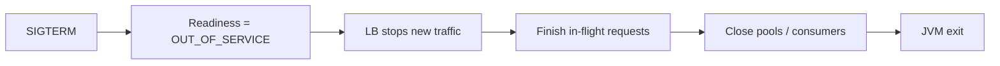

---

# 2. Database Integration — 21–34

## 21. What happens internally when a Spring Data JPA repository method is called?

Your interface has no implementation — Spring creates a **dynamic proxy** at startup (`SimpleJpaRepository` as the backing implementation).

```mermaid
flowchart LR
    A[repo.findByEmail email] --> B[JDK proxy]
    B --> C[QueryExecutorMethodInterceptor]
    C --> D{Derived / @Query / named?}
    D -->|derived| E[Parse method name → JPQL]
    D -->|@Query| F[Use provided JPQL/SQL]
    E --> G[Hibernate builds SQL]
    F --> G
    G --> H[JDBC via HikariCP]
    H --> I[Map ResultSet → entities]
```

For `findByEmailAndActiveTrue`, the method-name parser builds the query; `@Query` overrides parsing; results are mapped back to entities/DTOs.

---

## 22. Difference between JPA, Hibernate, Spring Data JPA, and JDBC.

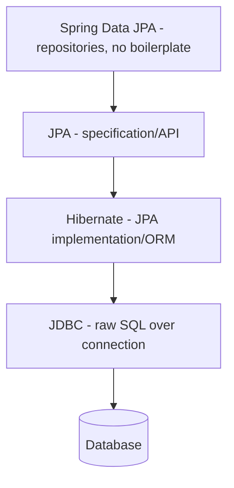

- **JDBC** — low-level API; you write SQL and map results manually.
- **JPA** — a *specification* (annotations, `EntityManager`, JPQL). No implementation itself.
- **Hibernate** — the most common JPA *implementation* (plus extras like `@Formula`).
- **Spring Data JPA** — a layer *above* JPA that generates repository implementations, derived queries, paging.

---

## 23. What is the persistence context and why is it important?

The **persistence context** is the `EntityManager`'s first-level cache of managed entities within a transaction. It provides:
- **Identity guarantee** — one row = one object instance within the context.
- **Dirty checking** — auto-detects changes and flushes UPDATEs.
- **Write-behind** — batches SQL until flush/commit.
- **First-level cache** — repeated `find` by id hits memory, not DB.

```java
@Transactional
void rename(Long id){
    User u = em.find(User.class, id); // managed
    u.setName("New");                 // no explicit save needed
} // dirty checking → UPDATE at commit
```

---

## 24. Explain the lifecycle states of a JPA entity.

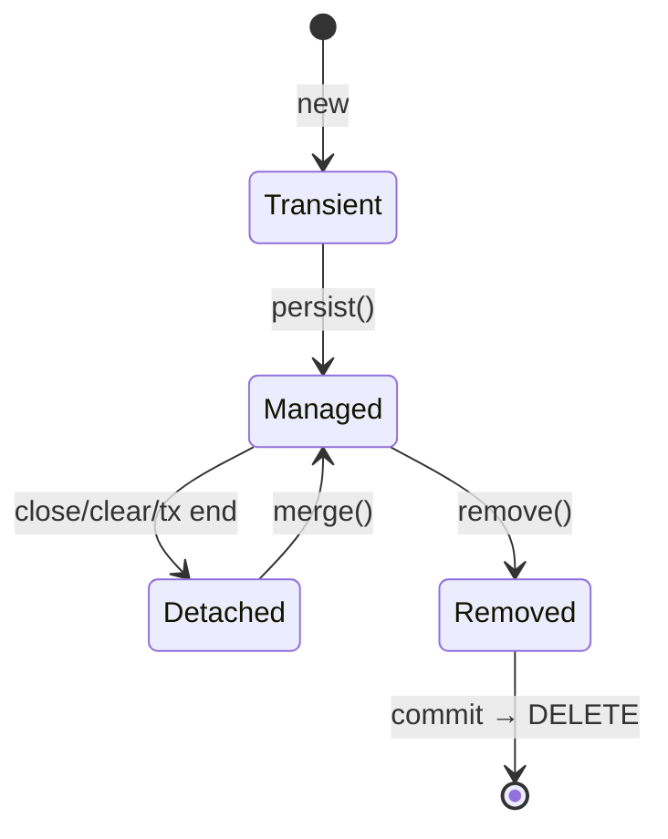

- **Transient** — new object, no DB identity, not tracked.
- **Managed** — attached to persistence context, dirty-checked.
- **Detached** — was managed, context closed; changes no longer tracked.
- **Removed** — scheduled for DELETE at flush.

---

## 25. What is Hibernate dirty checking? How does it know which UPDATEs to issue?

At load time Hibernate keeps a **snapshot** of each managed entity's state. At flush it compares the current state field-by-field against the snapshot; changed entities get an `UPDATE`. This is why you don't call `save()` on managed entities.

```java
@Transactional
void raise(Long id){
    Employee e = repo.findById(id).orElseThrow();
    e.setSalary(e.getSalary().add(BigDecimal.valueOf(1000))); // snapshot differs → UPDATE
}
```

Tuning: `@DynamicUpdate` updates only changed columns; default updates all columns.

---

## 26. Explain the N+1 query problem. How to detect and fix it?

**N+1:** one query loads N parents, then accessing a lazy association fires **one query per parent** → 1 + N queries.

```java
List<Order> orders = orderRepo.findAll();     // 1 query
for (Order o : orders) o.getItems().size();   // N queries (one per order)
```

**Detect:** enable `spring.jpa.properties.hibernate.generate_statistics=true`, SQL logging, or datasource-proxy; watch query counts in tests.

**Fixes:**
```java
// 1) JOIN FETCH
@Query("select o from Order o join fetch o.items where o.status = :s")
List<Order> withItems(@Param("s") Status s);

// 2) EntityGraph
@EntityGraph(attributePaths = "items")
List<Order> findByStatus(Status s);

// 3) Batch fetching
// hibernate.default_batch_fetch_size=100  → IN (...) instead of N queries

// 4) DTO projection (fetch only what you need)
@Query("select new com.x.OrderDto(o.id, count(i)) from Order o join o.items i group by o.id")
List<OrderDto> summaries();
```

---

## 27. `FetchType.LAZY` vs `EAGER` — why is EAGER dangerous?

- **LAZY** — association loaded on first access (proxy). Default for `@OneToMany`/`@ManyToMany`.
- **EAGER** — loaded immediately with the parent. Default for `@ManyToOne`/`@OneToOne`.

**EAGER is dangerous** because:
- It fires extra joins/queries on **every** load even when you don't need the association.
- If multiple associations are join-fetched together, the result set can suffer a **cartesian-product explosion**.
- EAGER fetching can also trigger secondary selects and hidden N+1 behavior depending on the query/provider.

**Practical rule:** prefer explicit fetch plans for each use case (`JOIN FETCH`, `@EntityGraph`, projections). Collections are usually best kept LAZY; to-one mappings should also be evaluated deliberately instead of relying blindly on JPA defaults.

---

## 28. Difference between `save()`, `saveAndFlush()`, `persist()`, `merge()`, `flush()`.

| Method | Layer | Behavior |
|---|---|---|
| `persist()` | JPA | Makes a transient entity managed; INSERT usually occurs at flush. Returns `void`. Calling it for an already-managed entity is effectively a no-op; passing a detached entity may lead to `EntityExistsException`/`PersistenceException`. |
| `merge()` | JPA | Copies detached state into a managed instance; returns the managed copy. |
| `save()` | Spring Data | `persist` if new (id null/`isNew`), else `merge`. |
| `flush()` | JPA | Forces pending SQL to the DB now (still in tx, not committed). |
| `saveAndFlush()` | Spring Data | `save` + immediate `flush` (e.g., to read generated id or trigger constraint errors early). |

```java
User managed = repo.save(new User("a@b.com")); // persist (new)
managed.setName("X");                            // dirty-checked; save() not required
repo.saveAndFlush(managed);                      // force SQL now
```

---

## 29. How does connection pooling work in Spring Boot with HikariCP?

HikariCP (Boot's default) keeps a pool of **live JDBC connections** so requests reuse them instead of paying TCP + auth handshake per query.

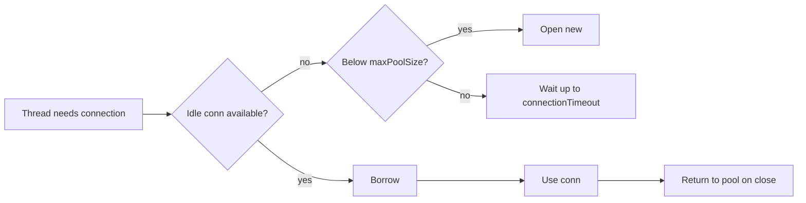

```properties
spring.datasource.hikari.maximum-pool-size=20
spring.datasource.hikari.minimum-idle=20
spring.datasource.hikari.connection-timeout=30000
spring.datasource.hikari.max-lifetime=1800000
```

`connection.close()` returns the connection to the pool (doesn't really close it). Always close in `try-with-resources` / let Spring manage it.

---

## 30. What happens when the HikariCP pool is exhausted? How to diagnose?

When all connections are borrowed, new requesters **block up to `connectionTimeout`** (default 30s), then throw `SQLTransientConnectionException: Connection is not available, request timed out`.

**Diagnose:**
- Hikari logs pool stats (`active`, `idle`, `pending`, `awaiting`).
- Micrometer metrics: `hikaricp.connections.pending`, `.active`, `.usage`.
- Take a **thread dump** — many threads parked in `getConnection` → leak or slow queries.

**Root causes:** connection leaks (not closed), long/slow queries holding connections, pool too small, calling external APIs while holding a connection (see Q44).

---

## 31. How should pool size be calculated for a high-throughput service?

There is **no universal Hikari pool-size formula**. The often-quoted `cores*2 + spindles` rule is only a historical heuristic and is weak guidance for modern SSD/cloud databases.

Use a capacity approach:
- Bound total application connections by the database's safe `max_connections` budget across **all** service instances.
- Estimate needed concurrency from throughput and average DB hold time (`concurrency ≈ throughput × average DB time`, via Little's Law).
- Start conservatively, load test, and watch Hikari `active`, `pending`, and connection-usage time together with DB CPU, lock waits, I/O, and p99 latency.
- Increase the pool only when callers wait for connections **and** the database still has capacity. Oversized pools can increase DB contention and latency.

---

## 32. Optimistic vs pessimistic locking with JPA.

**Optimistic** — no DB lock; a `@Version` column detects concurrent modification at commit. Best for low-contention.

```java
@Entity class Account {
    @Version private Long version; // Hibernate adds ...WHERE id=? AND version=?
}
// concurrent update → OptimisticLockException → retry
```

**Pessimistic** — DB row lock held for the transaction. Best for high-contention/critical sections.

```java
@Lock(LockModeType.PESSIMISTIC_WRITE) // SELECT ... FOR UPDATE
@Query("select a from Account a where a.id = :id")
Account findForUpdate(@Param("id") Long id);
```

| | Optimistic | Pessimistic |
|---|---|---|
| Lock | None until commit check | DB row lock |
| Contention | Low | High |
| Risk | Retry storms | Deadlocks, blocking |

---

## 33. Pagination for hundreds of millions of rows — why is OFFSET expensive?

`LIMIT 20 OFFSET 5_000_000` forces the DB to **scan and discard 5M rows** before returning 20 — cost grows linearly with page depth.

**Keyset / seek pagination** uses the last seen sorted key:

```sql
-- instead of OFFSET
SELECT * FROM events
WHERE (created_at, id) < (:lastCreatedAt, :lastId)  -- seek
ORDER BY created_at DESC, id DESC
LIMIT 20;
```

```java
Slice<Event> page = repo.findByCreatedAtLessThanOrderByCreatedAtDesc(cursor, PageRequest.of(0,20));
```

Keyset is O(1) per page (uses the index), stable under inserts, but can't jump to arbitrary page numbers. Use `Slice` (no `count(*)`) to avoid an expensive total-count query.

---

## 34. How to implement read/write splitting in Spring.

Route writes to the primary, reads to replicas using `AbstractRoutingDataSource` keyed by a `ThreadLocal` set from `@Transactional(readOnly=true)`.

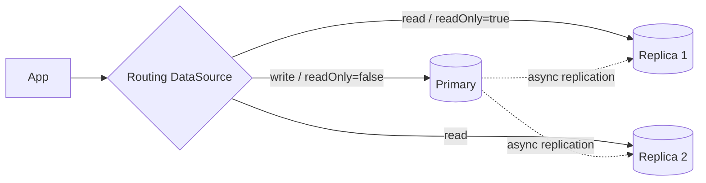

```java
class RoutingDataSource extends AbstractRoutingDataSource {
    protected Object determineCurrentLookupKey(){
        return TransactionSynchronizationManager.isCurrentTransactionReadOnly() ? "replica" : "primary";
    }
}
```

**Watch out for replication lag:** a read immediately after a write may not see it. Route read-your-writes flows to the primary.

---

# 3. Spring Transactions — 35–46

## 35. How does `@Transactional` work internally?

Spring wraps the bean in a **proxy** (`TransactionInterceptor`). The proxy begins a transaction before the method and commits/rolls back after.

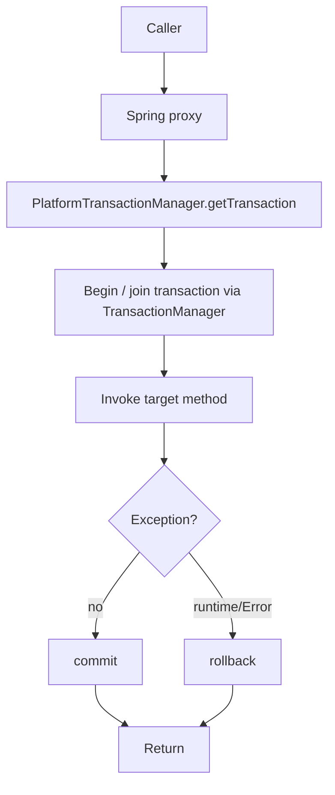

Backed by a `PlatformTransactionManager` implementation such as `JdbcTransactionManager`/`DataSourceTransactionManager` for JDBC or `JpaTransactionManager` for JPA. Spring binds transactional resources to the current execution context (traditionally the thread for imperative transactions) through `TransactionSynchronizationManager`. Exact connection/`EntityManager` handling depends on the transaction manager.

---

## 36. Why does `@Transactional` fail on self-invocation within the same class?

Because the proxy only intercepts calls that go **through the proxy**. An internal `this.method()` call bypasses the proxy entirely, so the advice never runs.

```java
@Service
class BillingService {
    public void outer(){ inner(); }          // self-call → proxy bypassed
    @Transactional public void inner(){ /* NO transaction here! */ }
}
```

**Fixes:**
- Move `inner()` to a separate bean and inject it.
- Self-inject the proxy (`@Autowired private BillingService self;` then `self.inner()`).
- Use `AopContext.currentProxy()` (requires `exposeProxy=true`).
- Use full AspectJ weaving (works on `this`).

---

## 37. JDK dynamic proxies vs CGLIB proxies.

| | JDK dynamic proxy | CGLIB |
|---|---|---|
| Requires | Target implements an **interface** | No interface needed |
| Mechanism | `java.lang.reflect.Proxy` implementing the interface | Subclass generated at runtime |
| Limitation | Only interface methods proxied | Can't proxy `final` classes/methods |

Spring Boot defaults to **CGLIB** (`proxyTargetClass=true`) so proxying works whether or not you use interfaces. `final` methods are never advised by either.

---

## 38. Explain transaction propagation modes.

| Propagation | If a tx exists | If none exists |
|---|---|---|
| **REQUIRED** (default) | Join it | Create new |
| **REQUIRES_NEW** | Suspend it, start a new independent tx | Create new |
| **SUPPORTS** | Join it | Run non-transactionally |
| **MANDATORY** | Join it | Throw exception |
| **NOT_SUPPORTED** | Suspend it, run non-transactionally | Run non-transactionally |
| **NEVER** | Throw exception | Run non-transactionally |
| **NESTED** | Typically a savepoint inside the current physical transaction **if the transaction manager/resource supports savepoints** | Usually behaves like REQUIRED when no tx exists |

```java
@Transactional(propagation = Propagation.REQUIRES_NEW)
void writeAuditLog(Event e){ /* commits even if caller rolls back */ }
```

---

## 39. What happens with `REQUIRES_NEW` when a transaction already exists?

The outer transaction is **suspended** (its connection set aside), a brand-new independent transaction with its own connection starts, runs, and commits/rolls back **independently**. Then the outer resumes.

Key consequences:
- The inner tx can commit even if the outer later rolls back (great for audit logs).
- Uses **two connections simultaneously** → risk of pool exhaustion / self-deadlock if the pool is tiny.
- Inner can't see the outer's uncommitted changes.

---

## 40. Explain transaction isolation levels.

| Level | Prevents |
|---|---|
| READ_UNCOMMITTED | nothing (allows dirty reads) |
| READ_COMMITTED | dirty reads |
| REPEATABLE_READ | dirty + non-repeatable reads |
| SERIALIZABLE | all, incl. phantom reads |

```java
@Transactional(isolation = Isolation.REPEATABLE_READ)
void transfer(...){ }
```

Higher isolation generally trades concurrency for stronger guarantees, but the implementation is **database-specific** (locks, MVCC snapshots, serialization failures, predicate locks, etc.). PostgreSQL defaults to READ COMMITTED; MySQL/InnoDB commonly defaults to REPEATABLE READ.

---

## 41. Explain the concurrency anomalies.

- **Dirty read** — read another tx's *uncommitted* change (which may roll back).
- **Non-repeatable read** — same row read twice yields different values because another tx **updated** it in between.
- **Phantom read** — same range query returns different **row sets** because another tx **inserted/deleted** matching rows.
- **Lost update** — two txns read-modify-write the same row; one overwrites the other's change.

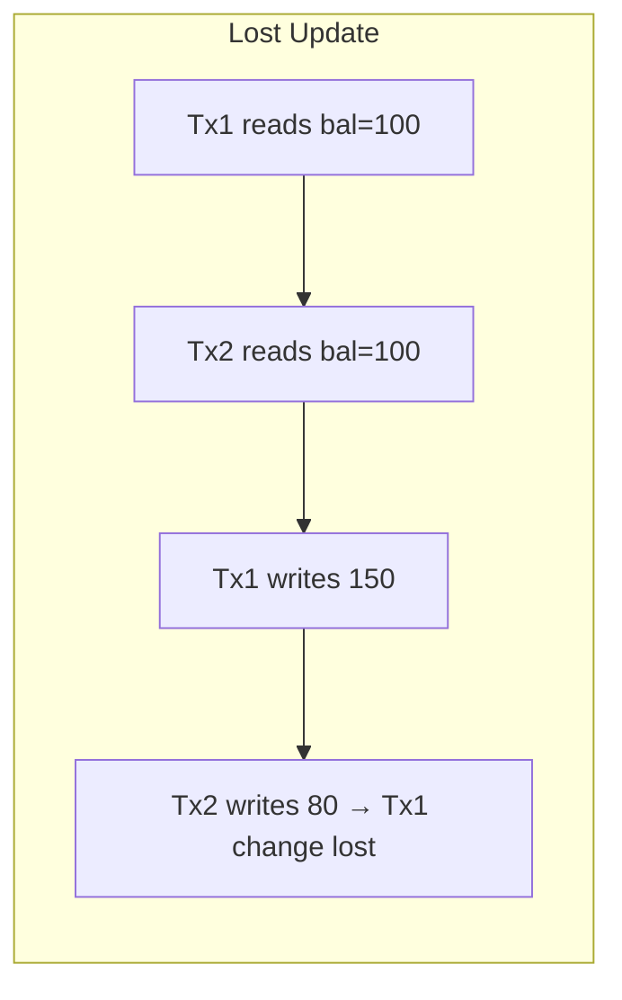

Fix lost update with optimistic (`@Version`) or pessimistic locking.

---

## 42. When does Spring roll back automatically? Checked vs unchecked.

**Default rule:** Spring rolls back on **`RuntimeException` and `Error`** (unchecked), but **commits** on checked exceptions.

```java
@Transactional
void a() throws IOException {
    repo.save(x);
    throw new IOException(); // checked → COMMITS by default! (surprising)
}

@Transactional(rollbackFor = Exception.class) // opt-in for checked
void b() throws IOException { ... }
```

Override with `rollbackFor` / `noRollbackFor`.

---

## 43. What happens when an exception is caught inside a `@Transactional` method and never rethrown?

If you swallow the exception, Spring's interceptor never sees it → the transaction **commits normally**. The partial work is persisted.

```java
@Transactional
void process(){
    repo.save(a);
    try { risky(); } catch (Exception e) { log.warn("ignored", e); } // tx still COMMITS
}
```

To force rollback while swallowing: `TransactionAspectSupport.currentTransactionStatus().setRollbackOnly();`

Also note: with `REQUIRED`, if an inner joined method marked the tx rollback-only, the outer commit throws `UnexpectedRollbackException`.

---

## 44. Why is calling an external API inside a DB transaction dangerous?

Because the **DB connection stays open** for the entire (slow, unpredictable) network call:

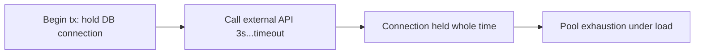

Problems: connection held → pool exhaustion; long locks → contention/deadlocks; if the API succeeds but the tx later rolls back, you have an **inconsistent external side effect**.

**Fix:** keep slow/remote calls **outside** the database transaction. If the external action must be reliable, persist intent atomically (for example, an outbox/work item) and process it asynchronously with retries/idempotency. `@TransactionalEventListener(AFTER_COMMIT)` is useful for in-process callbacks but is **not a durable delivery mechanism**—the process can crash after commit and before the listener completes.

---

## 45. How to keep a DB transaction and Kafka publication consistent?

Dual writes (DB + Kafka) aren't atomic. Use the **Transactional Outbox**:

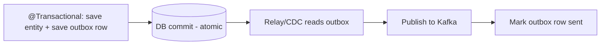

1. In the same DB transaction, write the business row **and** an `outbox` row.
2. A relay (polling job or **CDC** like Debezium) reads new outbox rows and publishes to Kafka.
3. Consumers are **idempotent** (dedupe on event id) since delivery is at-least-once.

This gives atomicity (DB commit is the single source of truth) without distributed 2PC.

---

## 46. Cross-microservice workflow without distributed ACID — how?

Use the **Saga pattern**: a sequence of local transactions, each publishing an event that triggers the next, with **compensating actions** to undo on failure.

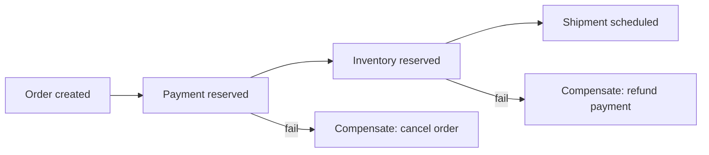

- **Choreography** — services react to each other's events (simple, but logic is spread out).
- **Orchestration** — a central saga coordinator drives steps (clearer, easier to monitor).

Requirements: **idempotency** (retries), **compensation** logic (semantic undo — you can't "rollback" a committed local tx), and an **outbox** for reliable event publishing.

---

# 4. Spring AOP — 47–54

## 47. What is AOP and what problem does it solve?

**Aspect-Oriented Programming** modularizes **cross-cutting concerns** — logic that would otherwise be scattered across many methods (logging, security, transactions, metrics, retry). Instead of copy-pasting that code, you write it once in an **aspect** and declare *where* it applies.

```java
// Without AOP: tangled boilerplate in every method
void transfer(){ log.info("start"); check(); try{...}catch{metrics.err();} log.info("end"); }

// With AOP: business method stays clean; concerns live in aspects
@Transactional @Timed
void transfer(){ /* just business logic */ }
```

Benefit: no scattering (same concern in many places) and no tangling (many concerns in one method).

---

## 48. Explain the AOP terms.

- **Aspect** — a module bundling a cross-cutting concern (`@Aspect class LoggingAspect`).
- **Advice** — the action taken at a join point (`@Before`, `@Around`, etc.).
- **Join point** — a point in execution where advice *could* apply (in Spring AOP: **method execution**).
- **Pointcut** — an expression selecting which join points match (`execution(* com.x.service..*(..))`).
- **Weaving** — linking aspects into target code (Spring does it at **runtime** via proxies).

```java
@Aspect @Component
class AuditAspect {
    @Pointcut("@annotation(com.x.Audit)") void audited(){}   // pointcut
    @Around("audited()")                                     // advice + pointcut ref
    Object around(ProceedingJoinPoint pjp) throws Throwable { // join point
        return pjp.proceed();
    }
}
```

---

## 49. Difference between the advice types.

| Advice | Runs | Can change flow? |
|---|---|---|
| `@Before` | Before method | No (but can throw to abort) |
| `@After` | After method (finally) | No — always runs |
| `@AfterReturning` | After successful return | Reads/inspects return value |
| `@AfterThrowing` | After exception thrown | Inspects exception |
| `@Around` | Wraps method | **Yes** — controls proceed, args, return, exceptions |

```java
@Around("audited()")
Object measure(ProceedingJoinPoint pjp) throws Throwable {
    long t = System.nanoTime();
    try { return pjp.proceed(); }            // must call proceed()
    finally { metrics.record(System.nanoTime()-t); }
}
```

`@Around` is the most powerful (and only one that can suppress/replace the return or skip the call).

---

## 50. How does Spring AOP work internally?

Runtime **proxy-based weaving**. During bean post-processing, if a bean matches any pointcut, Spring wraps it in a proxy (JDK dynamic proxy or CGLIB). Calls hit the proxy, which runs a chain of advice interceptors, then invokes the target.

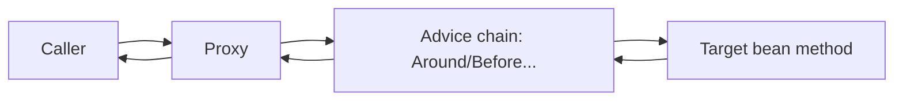

Because it is proxy-based, only calls that **go through the proxy** are advised. JDK dynamic proxies intercept public interface methods. Class-based (CGLIB) proxies can intercept public/protected and eligible package-visible methods, but cannot advise `final` methods/classes. Self-invocation still bypasses the proxy.

---

## 51. Spring AOP vs AspectJ.

| | Spring AOP | AspectJ |
|---|---|---|
| Weaving | Runtime (proxies) | Compile-time / load-time (bytecode) |
| Join points | Method execution on Spring beans only | Methods, constructors, field access, static, any object |
| Self-invocation | Not intercepted | Intercepted |
| Runtime cost | Proxy/interceptor-chain overhead | No proxy hop for woven join points, but overall performance depends on the advice and workload; do not choose AspectJ solely for speed |
| Complexity | Simple, built-in | Needs weaver/agent |

Use Spring AOP for typical needs (tx, logging on beans). Use AspectJ when you need field/constructor interception, self-invocation, or non-Spring objects.

---

## 52. Why can't Spring AOP intercept certain self-invocations?

Same root cause as Q36: advice lives on the **proxy**. When a method calls another method on `this`, the call never leaves the target object, so the proxy — and thus the advice — is bypassed.

```java
@Service
class ReportService {
    @Cacheable("r") public Report get(Long id){ return build(id); }
    public Report refresh(Long id){ return get(id); } // internal → @Cacheable NOT applied
}
```

Fixes: split into another bean, self-inject the proxy, `AopContext.currentProxy()`, or AspectJ.

---

## 53. How to implement a custom annotation like `@Audit` using AOP?

```java
@Retention(RetentionPolicy.RUNTIME)
@Target(ElementType.METHOD)
public @interface Audit { String action() default ""; }

@Aspect @Component
class AuditAspect {
    private final AuditRepository repo;
    AuditAspect(AuditRepository repo){ this.repo = repo; }

    @Around("@annotation(audit)")
    public Object record(ProceedingJoinPoint pjp, Audit audit) throws Throwable {
        String user = SecurityContextHolder.getContext().getAuthentication().getName();
        try {
            Object result = pjp.proceed();
            repo.save(new AuditLog(user, audit.action(), "SUCCESS"));
            return result;
        } catch (Exception e) {
            repo.save(new AuditLog(user, audit.action(), "FAILURE:" + e.getMessage())); // may roll back with caller tx
            throw e;
        }
    }
}

@Service
class AccountService {
    @Audit(action = "TRANSFER_MONEY")
    public void transferMoney(Long from, Long to, BigDecimal amt){ /* ... */ }
}
```

---

## 54. Where would you use AOP in production?

- **Logging / tracing** — method entry/exit, correlation IDs, distributed tracing spans.
- **Metrics** — `@Timed`, counters around service methods.
- **Transactions** — `@Transactional` is itself AOP.
- **Security** — `@PreAuthorize` method authorization.
- **Retry / circuit breaking** — `@Retryable`, resilience wrappers.
- **Auditing** — who did what, when (Q53).
- **Caching** — `@Cacheable`/`@CacheEvict`.

Rule of thumb: use AOP for **cross-cutting, non-business** concerns. Keep core business logic explicit in code. If an audit record must survive a business rollback, persist it in an independent transaction (`REQUIRES_NEW`) or a durable audit/outbox path rather than assuming an AOP `repo.save()` will commit.

---

# 5. Spring Security — In Depth — 55–74

## 55. Explain the Spring Security request-processing architecture.

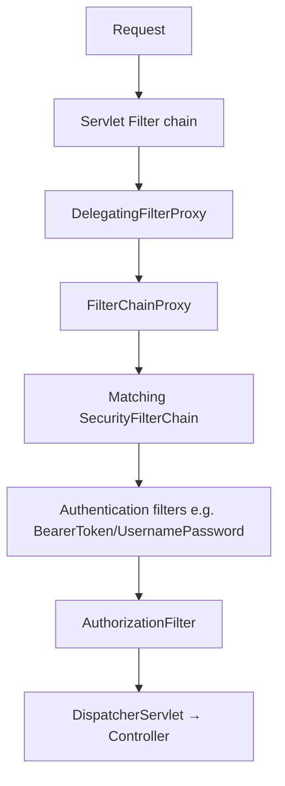

Spring Security is fundamentally **a chain of servlet filters**. `DelegatingFilterProxy` bridges the servlet container to the Spring context; `FilterChainProxy` selects the right `SecurityFilterChain` and runs its ordered filters (exception handling, authentication, authorization).

---

## 56. What is `SecurityFilterChain` and how does Spring pick one?

A `SecurityFilterChain` = a **request matcher** + an **ordered list of filters**. `FilterChainProxy` iterates chains and uses the **first** whose matcher matches the request.

```java
@Bean @Order(1)
SecurityFilterChain api(HttpSecurity http) throws Exception {
    http.securityMatcher("/api/**")
        .authorizeHttpRequests(a -> a.anyRequest().authenticated())
        .oauth2ResourceServer(o -> o.jwt(Customizer.withDefaults()));
    return http.build();
}
@Bean @Order(2)
SecurityFilterChain web(HttpSecurity http) throws Exception {
    http.authorizeHttpRequests(a -> a.requestMatchers("/","/login").permitAll()
                                     .anyRequest().authenticated())
        .formLogin(Customizer.withDefaults());
    return http.build();
}
```

Order matters — put the most specific matcher first.

---

## 57. Authentication vs authorization.

- **Authentication (AuthN)** — *Who are you?* Verify identity (password, token, certificate).
- **Authorization (AuthZ)** — *What are you allowed to do?* Check permissions/roles for a resource.

AuthN always precedes AuthZ. In Spring: authentication filters populate the `SecurityContext`; `AuthorizationFilter` / `@PreAuthorize` then enforce access. (This distinction is central to Okta's business.)

---

## 58. `Authentication`, `AuthenticationProvider`, `AuthenticationManager`, `SecurityContext`.

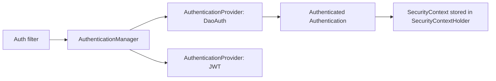

- **`Authentication`** — token holding principal, credentials, authorities, and `authenticated` flag.
- **`AuthenticationManager`** — entry point; usually `ProviderManager` delegating to providers.
- **`AuthenticationProvider`** — knows how to authenticate a specific type (e.g., `DaoAuthenticationProvider` for username/password).
- **`SecurityContext`** — holds the current `Authentication`; stored in `SecurityContextHolder`.

---

## 59. How does `SecurityContextHolder` work? Where is the user stored?

`SecurityContextHolder` holds the `SecurityContext` (containing the `Authentication`) in a **`ThreadLocal`** by default — so any code in the same request thread can call:

```java
Authentication auth = SecurityContextHolder.getContext().getAuthentication();
String username = auth.getName();
```

Strategies:
- `MODE_THREADLOCAL` (default) — per-thread.
- `MODE_INHERITABLETHREADLOCAL` — propagates to child threads.
- For `@Async`/reactive you must **propagate context explicitly** (`DelegatingSecurityContextExecutor`, or Reactor context in WebFlux). The context is cleared at the end of each request.

---

## 60. How does username/password authentication work internally?

```mermaid
flowchart TD
    A[POST /login user+pass] --> B[UsernamePasswordAuthenticationFilter]
    B --> C[AuthenticationManager]
    C --> D[DaoAuthenticationProvider]
    D --> E[UserDetailsService.loadUserByUsername]
    E --> F[PasswordEncoder.matches raw, stored hash]
    F -- ok --> G[Authenticated token → SecurityContext]
    F -- fail --> H[BadCredentialsException 401]
```

`UserDetailsService` loads the stored (hashed) credentials; `PasswordEncoder.matches()` compares. On success the authenticated token is placed in the context (and typically a session is created).

```java
@Bean UserDetailsService uds(UserRepository repo){
    return username -> repo.findByUsername(username)
        .map(u -> User.withUsername(u.getUsername()).password(u.getHash()).roles(u.getRoles()).build())
        .orElseThrow(() -> new UsernameNotFoundException(username));
}
@Bean PasswordEncoder encoder(){ return new BCryptPasswordEncoder(); }
```

---

## 61. How should passwords be stored? Why not SHA-256/MD5?

Store a **salted, slow, adaptive hash**: **BCrypt**, **Argon2**, scrypt, or PBKDF2.

Why **not** MD5/SHA-256: they're **fast** and designed for throughput — an attacker can compute *billions* of guesses/sec on a GPU and use rainbow tables. Password hashing must be **deliberately slow** and salted.

- **Salt** — unique per user; defeats rainbow tables and makes identical passwords hash differently.
- **Work factor / cost** — tunable iterations so you can slow hashing as hardware improves.

```java
PasswordEncoder enc = new BCryptPasswordEncoder(12);   // cost = 12
String hash = enc.encode(rawPassword);                 // salt embedded in output
boolean ok  = enc.matches(rawPassword, hash);
// Or DelegatingPasswordEncoder ({bcrypt}, {argon2}) for algorithm migration
```

---

## 62. Session-based vs JWT authentication — when to use each?

| | Session (stateful) | JWT (stateless) |
|---|---|---|
| Server state | Session store (memory/Redis) | None — claims in token |
| Scaling | Local sessions need stickiness; distributed sessions need a shared store | Avoids per-session server state, but key distribution, revocation and authorization data can still require shared infrastructure |
| Revocation | Easy (delete session) | Hard (must blocklist / short TTL) |
| Best for | Traditional web apps, monoliths | APIs, microservices, mobile, SPAs |

**Sessions** are attractive when you need centralized revocation and server-side session control. **JWT access tokens** are useful when independently verifiable bearer tokens fit the architecture, but they are not automatically 'better for microservices'; consider revocation, token size, key rotation, audience validation, and authorization freshness.

---

## 63. Explain the internal structure of a JWT.

`Header.Payload.Signature` — three Base64URL parts joined by dots.

```text
eyJhbGciOiJSUzI1NiJ9 . eyJzdWIiOiIxMjMiLCJyb2xlIjoiQURNSU4ifQ . <signature>
   Header                  Payload (claims)                       Signature
```

- **Header** — `alg` (e.g., RS256) and `typ`.
- **Payload** — claims: `sub`, `iss`, `aud`, `exp`, `iat`, plus custom (`roles`).
- **Signature** — `sign(base64(header) + "." + base64(payload), key)`.

Critical: the payload is **encoded, not encrypted** — anyone can read it. Never put secrets in a JWT. The signature guarantees **integrity**, not confidentiality.

---

## 64. Signing vs encrypting a JWT.

- **Signing (JWS)** — proves **integrity + authenticity** (not tampered, from a trusted issuer). Payload is still readable. Uses HMAC (HS256, shared secret) or RSA/EC (RS256/ES256, private key signs, public key verifies).
- **Encrypting (JWE)** — provides **confidentiality**; payload is unreadable without the key.

Most access tokens are **signed only** (JWS) because they carry authorization data, not secrets. Use **JWE** when the token must carry sensitive data. Prefer **RS256** for third-party verification (publish public key via JWKS; keep private key on the issuer).

---

## 65. How does a Spring Boot service act as an OAuth2 Resource Server?

It validates incoming **bearer JWTs** on each request — no login, no session.

```java
@Bean
SecurityFilterChain rs(HttpSecurity http) throws Exception {
    http.authorizeHttpRequests(a -> a.anyRequest().authenticated())
        .oauth2ResourceServer(o -> o.jwt(Customizer.withDefaults()));
    return http.build();
}
```
```yaml
spring:
  security:
    oauth2:
      resourceserver:
        jwt:
          issuer-uri: https://your-tenant.okta.com/oauth2/default
```

Spring discovers/fetches the issuer's **JWKS** (public keys), validates the signature and—under standard issuer configuration—validates `iss`, `exp`, and `nbf`. **`aud` is not automatically enforced just because `issuer-uri` is set**; configure `spring.security.oauth2.resourceserver.jwt.audiences` or a custom `OAuth2TokenValidator` when your API requires a specific audience. Scopes are mapped to authorities (commonly `SCOPE_...`).

---

## 66. OAuth 2.0 vs OpenID Connect — what does each solve?

- **OAuth 2.0** — an **authorization** framework: delegated access. It issues **access tokens** so an app can call an API *on the user's behalf*. It does **not** define how to learn *who* the user is.
- **OpenID Connect (OIDC)** — an **authentication** layer on top of OAuth2. Adds an **ID token** (a JWT with verified identity claims) and a `/userinfo` endpoint.

Slogan: **OAuth2 = authorization (access); OIDC = authentication (identity).** Okta is fundamentally an OIDC/OAuth2 provider.

---

## 67. Explain the Authorization Code + PKCE flow.

```mermaid
sequenceDiagram
    participant U as User/Browser
    participant A as SPA/Mobile (public client)
    participant Z as Authorization Server (Okta)
    participant R as Resource API
    A->>A: create code_verifier; code_challenge = SHA256(verifier)
    A->>Z: /authorize?...&code_challenge&method=S256
    U->>Z: authenticate + consent
    Z-->>A: redirect ?code=AUTH_CODE
    A->>Z: /token (code + code_verifier)
    Z->>Z: verify SHA256(verifier)==challenge
    Z-->>A: access_token (+ id_token, refresh_token)
    A->>R: Authorization: Bearer access_token
```

**PKCE** (Proof Key for Code Exchange) protects **public clients** (SPAs, mobile) that can't hold a secret. Even if the auth code is intercepted, it's useless without the original `code_verifier`. PKCE is now recommended for **all** clients.

---

## 68. How to implement service-to-service authentication?

- **Client Credentials grant** — service authenticates to the auth server with its own credentials, gets an access token (no user). Standard for machine-to-machine.
- **mTLS** — mutual TLS; both sides present certificates. Strong, network-level identity.
- **Signed JWT (private_key_jwt)** — client proves identity with a signed assertion instead of a shared secret.
- **Workload identity** — platform-issued identities (SPIFFE/SVID, cloud IAM roles) — no long-lived secrets.

```java
// Client Credentials with Spring Security OAuth2 client
ClientRegistration reg = ClientRegistration.withRegistrationId("orders")
   .tokenUri("https://auth/oauth2/token")
   .clientId("svc-a").clientSecret("...")
   .authorizationGrantType(AuthorizationGrantType.CLIENT_CREDENTIALS).build();
```

Prefer mTLS or workload identity over long-lived shared secrets.

---

## 69. Access token vs refresh token — differences and protection.

| | Access token | Refresh token |
|---|---|---|
| Purpose | Call APIs | Obtain new access tokens |
| Lifetime | Short (mins) | Long (hours–days) |
| Sent to | Resource servers (every call) | Only the auth server |
| Format | Often JWT | Usually opaque |

**Protection:** short access-token TTL limits blast radius. Refresh tokens are high-value → store in **HttpOnly, Secure** cookies (not localStorage), bind to the client, and use **rotation** (each use issues a new refresh token and invalidates the old; reuse detection revokes the family).

---

## 70. How can a JWT be revoked before expiry?

Stateless JWTs can't be "deleted." Strategies:
1. **Short TTL + refresh tokens** — the pragmatic default; a revoked session dies within minutes when refresh is denied.
2. **Token blocklist / denylist** — store revoked `jti` (token id) in Redis until it expires; resource servers check it (reintroduces state).
3. **Token versioning** — store a `tokenVersion` per user; increment on logout/compromise; reject tokens with an older version.
4. **Revoke refresh tokens** at the auth server so no new access tokens are minted.

Tradeoff: instant revocation requires checking shared state, which sacrifices pure statelessness.

---

## 71. CSRF, CORS, XSS — why fundamentally different?

- **XSS (Cross-Site Scripting)** — attacker injects **malicious script into your page**; it runs with your user's privileges and can steal tokens. *Defense:* output encoding, Content-Security-Policy, sanitize input, HttpOnly cookies.
- **CSRF (Cross-Site Request Forgery)** — attacker tricks the browser into sending a **forged authenticated request** using the victim's cookies. *Defense:* CSRF tokens and SameSite cookies. CSRF is generally not relevant when credentials are **only** sent explicitly in an `Authorization` header and are not automatically attached by the browser; it becomes relevant again if authentication uses cookies or other automatically attached credentials.
- **CORS (Cross-Origin Resource Sharing)** — a browser **relaxation** mechanism controlling which origins may call your API via JS. Misconfiguration (`*` with credentials) is the risk, not an attack itself.

| | What it is | Direction |
|---|---|---|
| XSS | Code injection into page | Runs in victim's browser |
| CSRF | Forged request abuse | Victim's browser → your server |
| CORS | Access-control policy | Governs cross-origin JS calls |

---

## 72. How does method-level authorization work? Risks of controller-only checks.

`@EnableMethodSecurity` enables annotations evaluated by an AOP proxy before the method runs:

```java
@PreAuthorize("hasRole('ADMIN')")
public void deleteUser(Long id){ }

@PreAuthorize("#userId == authentication.principal.id or hasRole('ADMIN')")
public Account getAccount(Long userId){ }        // ownership check

@PostAuthorize("returnObject.owner == authentication.name")
public Document load(Long id){ }
```

**Risk of controller-only authorization:** business logic is often reused by other controllers, schedulers, message listeners, or GraphQL resolvers that **bypass** the controller check — leaving a hole. **Defense in depth:** enforce authorization at the **service layer** where the sensitive operation actually happens, close to the data.

---

## 73. Design multi-tenant authorization (user accesses only their org's resources).

```mermaid
flowchart LR
    A[JWT with tenantId claim] --> B[Filter → TenantContext ThreadLocal]
    B --> C[Service checks resource.tenantId == context.tenantId]
    C --> D[Repository auto-filters WHERE tenant_id=?]
```

Layers:
1. **Token** carries `tenantId`/`org` claim; a filter extracts it into a `TenantContext`.
2. **Enforce at data layer** — every query filtered by tenant (Hibernate `@Filter` / row-level security), so you can't forget.
3. **Object-level checks** — verify the requested resource belongs to the caller's tenant (prevents **IDOR**).

```java
@PreAuthorize("@tenantGuard.canAccess(#resourceId, authentication)")
public Resource get(Long resourceId){ }
```

Never trust a `tenantId` sent in the request body/param — always derive it from the authenticated token.

---

## 74. How to secure a production Spring API against the common attacks?

- **Broken access control / IDOR** — enforce object-level ownership checks at the service layer; never expose direct DB ids without an auth check (Q72/73).
- **Mass assignment** — bind to explicit **DTOs**, never entities; whitelist fields.
- **SQL injection** — parameterized queries / JPA binding; never string-concatenate SQL.
- **Credential stuffing / brute force** — rate limiting, account lockout, MFA, breached-password checks, CAPTCHA.
- **Token replay** — TLS, short TTL, sender-constrained tokens where appropriate (mTLS/DPoP), refresh-token rotation/reuse detection, and targeted `jti` denylisting when immediate revocation is required.
- **Rate-limit bypass** — limit per user *and* IP *and* token; enforce at gateway.
- **Privilege escalation** — least privilege, server-side role checks, deny by default.

```java
// Mass assignment defense: DTO, not entity
record CreateUserRequest(@NotBlank String name, @Email String email) {}  // no 'role', no 'id'
@PostMapping("/users")
User create(@Valid @RequestBody CreateUserRequest r){ return service.create(r.name(), r.email()); }
```

Cross-cutting: HTTPS everywhere, security headers (HSTS, CSP), centralized authZ, audit logging, and dependency scanning.

---

# 6. Spring AI + Guardrailing — 75–84

## 75. What is Spring AI, and what abstraction does it provide over LLM providers?

Spring AI is Spring's framework for building AI applications. It provides **portable abstractions** so much of your code can target common interfaces instead of a single provider. Provider swaps are often configuration/starter changes for common features, but provider-specific capabilities/options can still require code or configuration changes.

Core pieces: `ChatClient`, `ChatModel`, `EmbeddingModel`, `VectorStore`, `Advisors`, tool/function calling, RAG helpers, evaluation, MCP, and observability (Micrometer).

```java
@RestController
class ChatController {
    private final ChatClient chat;
    ChatController(ChatClient.Builder b){ this.chat = b.build(); }

    @GetMapping("/ask")
    String ask(@RequestParam String q){
        return chat.prompt().user(q).call().content();
    }
}
```

---

## 76. `ChatClient` vs `ChatModel` vs `EmbeddingModel` vs `VectorStore`.

| Abstraction | Role |
|---|---|
| **`ChatModel`** | Low-level port to a chat LLM (`call(Prompt) → ChatResponse`). |
| **`ChatClient`** | High-level fluent API over `ChatModel`: system/user prompts, advisors, tools, entity mapping. |
| **`EmbeddingModel`** | Turns text into vectors for semantic similarity. |
| **`VectorStore`** | Stores/searches embeddings (pgvector, Redis, Pinecone, etc.). |

```mermaid
flowchart LR
    App --> CC[ChatClient]
    CC --> CM[ChatModel → LLM]
    App --> EM[EmbeddingModel]
    EM --> VS[VectorStore]
    VS --> CC
```

`ChatClient` is what you use day-to-day; the others are building blocks (embeddings + vector store power RAG).

---

## 77. How would you implement RAG using Spring AI?

**Retrieval-Augmented Generation** grounds the LLM in your own data to reduce hallucination.

```mermaid
flowchart LR
    Q[Question] --> E[EmbeddingModel → query vector]
    E --> S[VectorStore similarity search]
    S --> D[Top-k relevant chunks]
    D --> P[Augment prompt with context]
    P --> L[ChatModel]
    L --> A[Grounded answer + citations]
```

```java
String answer = chatClient.prompt()
    .advisors(new QuestionAnswerAdvisor(vectorStore))  // retrieves + injects context
    .user(question)
    .call().content();
```

`QuestionAnswerAdvisor` (or the modular `RetrievalAugmentationAdvisor`) embeds the question, searches the vector store, and injects the top matches into the prompt.

---

## 78. How to implement production-grade document ingestion?

```mermaid
flowchart LR
    A[Parse: PDF/HTML/Docx] --> B[Chunk/split with overlap]
    B --> C[Attach metadata: source, page, tenant, acl]
    C --> D[EmbeddingModel → vectors]
    D --> E[(VectorStore)]
    E --> F[Re-index on updates / versioning]
```

```java
List<Document> docs = new TikaDocumentReader(resource).get();
List<Document> chunks = new TokenTextSplitter().apply(docs);
chunks.forEach(d -> d.getMetadata().put("tenantId", tenant)); // metadata for filtering
vectorStore.add(chunks);
```

Production concerns: sensible chunk size + overlap, rich **metadata** (for filtering + citations + tenant isolation), idempotent re-indexing, and versioning so stale content is removed.

---

## 79. What are Spring AI Advisors, and how to use one for guardrails/logging/RAG/policy?

**Advisors** are an interceptor chain around chat calls (like AOP for prompts). Each advisor can inspect/modify the **request** before the model and the **response** after — perfect for cross-cutting AI concerns.

```mermaid
flowchart LR
    Req --> A1[Logging advisor] --> A2[PII redaction] --> A3[RAG advisor] --> M[Model] --> A3b[Policy check] --> Resp
```

```java
class GuardrailAdvisor implements CallAdvisor {
    public ChatClientResponse adviseCall(ChatClientRequest req, CallAdvisorChain chain){
        if (containsInjection(req.prompt())) throw new PolicyViolation("blocked input");
        ChatClientResponse resp = chain.nextCall(req);
        return redactSensitive(resp);   // validate/scrub output
    }
    public int getOrder(){ return 0; }
    public String getName(){ return "guardrail"; }
}
```

Built-ins include `QuestionAnswerAdvisor` (RAG), `MessageChatMemoryAdvisor` (memory), and `SafeGuardAdvisor` (content filtering).

---

## 80. How does tool/function calling work, and how to prevent unsafe operations?

**Tool calling:** you register methods as tools; the LLM can *request* a call with structured args; Spring executes the tool and feeds the result back.

```java
class OrderTools {
    @Tool(description = "Get order status by id")
    OrderStatus status(String orderId){ return service.status(orderId); }
}
chatClient.prompt().user(q).tools(new OrderTools()).call().content();
```

**Safety — never let the model call privileged tools freely:**
- Expose only **read-only / low-risk** tools by default.
- Wrap destructive tools with **authorization** using the *end-user's* identity (propagate `SecurityContext`), not the app's.
- Validate/whitelist arguments; enforce policy + risk checks; require **human approval** for high-risk actions.
- Apply least privilege, rate limits, and audit every tool invocation.

---

## 81. How to defend a Spring AI app against prompt injection?

Prompt injection = untrusted text (user input or retrieved docs) hijacking the model's instructions.

```mermaid
flowchart LR
    U[Untrusted input/docs] --> V[Input validation]
    V --> C[Keep trusted vs untrusted context separate]
    C --> M[Model with least-privilege tools]
    M --> O[Output validation]
    O --> R[Retrieval filtering by tenant/ACL]
```

Defenses:
- **Separate trusted vs untrusted context** — never merge user/retrieved text into system instructions; label it as data.
- **Input validation** and **output validation** (scan for policy violations, exfiltration).
- **Retrieval filtering** — only fetch docs the user is authorized to see (tenant/ACL metadata).
- **Least privilege on tools** + human approval for destructive actions.
- Assume the model *will* be tricked → put real authorization in **code**, not the prompt.

---

## 82. How to implement guardrails around destructive tool calls?

```mermaid
flowchart TD
    A[LLM requests tool: deleteAccount/refundPayment/executeSQL] --> B[Policy validation]
    B --> C[Authorization - end-user identity]
    C --> D[Risk check: amount/scope/blast radius]
    D --> E{High risk?}
    E -- yes --> F[Human-in-the-loop approval]
    E -- no --> G[Execute]
    F --> G
    G --> H[Audit log]
```

```java
@Tool(description = "Refund a payment")
RefundResult refundPayment(String paymentId, BigDecimal amount){
    authz.require("payment:refund");                 // user-scoped authorization
    policy.validateRefund(paymentId, amount);        // business rules
    if (amount.compareTo(THRESHOLD) > 0)
        return approvals.requestHumanApproval(paymentId, amount); // gate
    RefundResult r = payments.refund(paymentId, amount);
    audit.record("REFUND", paymentId, amount);
    return r;
}
```

Principle: the model *proposes*; deterministic code *authorizes and disposes*. Destructive tools always pass policy → authz → risk → (approval) → execute → audit.

---

## 83. How to prevent sensitive data leaking through prompts/responses/logs/traces/tool calls?

- **Minimize context** — send only the data needed; strip PII before it reaches the prompt.
- **Redact tool args/results** — Spring AI observability, by design, does **not** export tool call arguments/results by default because they may be sensitive; keep it that way.
- **Scrub logs/traces** — never log raw prompts/responses with secrets; mask before logging.
- **Output filtering** — an advisor that blocks responses containing secrets/PII.
- **Retrieval ACLs** — never embed/return documents the user can't access.
- **Data residency / provider settings** — disable provider training on your data; use private endpoints.

```java
class PiiRedactionAdvisor implements CallAdvisor {
    public ChatClientResponse adviseCall(ChatClientRequest req, CallAdvisorChain chain){
        var scrubbed = redact(req);                       // mask before sending
        return maskSecrets(chain.nextCall(scrubbed));     // mask before returning/logging
    }
    /* order/name ... */
}
```

---

## 84. How to productionize an LLM-backed Spring service?

| Concern | Approach |
|---|---|
| **Timeouts** | Bound every model/tool call; fail fast |
| **Retries** | Retry transient 429/5xx with backoff + jitter (idempotent only) |
| **Rate limiting** | Per-user/tenant token + request quotas |
| **Token budgets** | Cap prompt/response tokens; truncate context |
| **Model fallback** | Secondary model/provider on failure |
| **Circuit breakers** | Resilience4j around providers |
| **Caching** | Cache embeddings + deterministic responses |
| **Streaming** | Stream tokens (`Flux`) for UX + early cancel |
| **Evaluation** | Relevance/faithfulness evals in CI (`Evaluator`) |
| **Hallucination detection** | Grounding checks, citation validation, `FactCheckingEvaluator` |
| **Observability** | Micrometer metrics + tracing on every call |

```java
@Bean ChatClient chatClient(ChatClient.Builder b){
    return b.defaultAdvisors(new SafeGuardAdvisor(), loggingAdvisor)
            .defaultOptions(ChatOptions.builder().maxTokens(800).temperature(0.2).build())
            .build();
}
```

Treat the LLM as an **unreliable, slow, remote dependency**: isolate it with timeouts, retries, circuit breakers, fallbacks, and full observability.

---

# 7. JVM + Spring Performance Optimization — 85–92

## 85. How does JVM heap memory work?

```mermaid
flowchart TD
    subgraph Heap
      subgraph Young
        Eden --> S0[Survivor 0]
        Eden --> S1[Survivor 1]
      end
      Old[Old / Tenured Generation]
    end
    Eden -- survives minor GC --> S0
    S0 -- ages --> Old
    Meta[Metaspace - class metadata, off-heap]
```

- **Young generation** (Eden + 2 Survivors) — new objects; collected by fast **minor GC**. Most objects die here (generational hypothesis).
- **Old/Tenured** — long-lived objects promoted after surviving several minor GCs; collected by slower **major/full GC**.
- **Metaspace** (off-heap) — class metadata (replaced PermGen).

The weak generational hypothesis (most objects die young) motivates generational collectors. Treat the Eden/Survivor/Old diagram as the **classic generational model**; exact heap organization and collection phases differ by GC (G1, ZGC, Shenandoah, etc.).

---

## 86. What typically causes high memory usage in Spring Boot?

- **In-memory caches / collections** that grow unbounded (no eviction/TTL).
- **Large result sets** loaded fully (no pagination/streaming), N+1 hydration.
- **Session bloat** (large HTTP sessions × many users).
- **Connection/thread pools** sized too large (each thread ~stack + buffers).
- **Classloader / Metaspace leaks** (hot redeploys, dynamic proxies, bytecode gen).
- **`ThreadLocal`s not cleared** on pooled threads.
- Verbose object graphs, Hibernate first-level cache in huge transactions.

---

## 87. How to identify a memory leak in production?

```mermaid
flowchart LR
    A[GC logs: Old gen keeps growing after Full GC] --> B[Capture heap dump on OOM]
    B --> C[Analyze in Eclipse MAT]
    C --> D[Dominator tree → biggest retainers]
    D --> E[Find GC roots holding objects]
    E --> F[Fix reference retaining memory]
```

- Enable **`-XX:+HeapDumpOnOutOfMemoryError -XX:HeapDumpPath=...`**.
- **GC logs**: leak signature = live set climbs after every Full GC (memory never fully reclaimed).
- **Heap dump + Eclipse MAT**: use the **dominator tree** and **retained size** to find what's holding memory; trace **GC roots**.
- **JFR (Java Flight Recorder)** for low-overhead continuous allocation profiling.

Classic culprits: static collections, unbounded caches, listeners never deregistered, `ThreadLocal` leaks.

---

## 88. What causes `OutOfMemoryError` and what kinds exist?

| OOM type | Cause |
|---|---|
| **Java heap space** | Live objects exceed max heap (leak or under-sized `-Xmx`) |
| **GC overhead limit exceeded** | JVM spends >98% time in GC recovering <2% heap |
| **Metaspace** | Too many loaded classes (classloader leak, redeploys) |
| **Direct buffer memory** | NIO/off-heap buffers exhausted (Netty, memory-mapped) |
| **Unable to create native thread** | OS thread limit / native memory exhausted (too many threads) |

Each points at a different root cause — always read *which* OOM it is before tuning `-Xmx`.

---

## 89. How does GC affect API latency? What if p99 correlates with GC?

GC **stop-the-world (STW)** pauses freeze all app threads → requests in flight stall → **p99/p999 latency spikes** even though average looks fine. Long Old-gen/Full GC pauses are the usual cause.

If p99 spikes align with GC:
- Correlate GC logs (pause times) with latency metrics.
- Reduce **allocation rate** (fewer short-lived objects, avoid needless boxing/copies).
- Right-size heap (too small → frequent GC; too large → longer pauses with some collectors).
- Switch to a **low-pause collector**: **G1** (default) tuned via `-XX:MaxGCPauseMillis`, or **ZGC/Shenandoah** for sub-millisecond pauses on large heaps.

```bash
-XX:+UseG1GC -XX:MaxGCPauseMillis=100 -Xlog:gc*:file=gc.log:time
# or, for large heaps + tight p99:
-XX:+UseZGC
```

---

## 90. How to tune a Spring Boot JVM inside a Kubernetes container?

```mermaid
flowchart LR
    Pod[Pod memory limit] --> Heap[Heap ~50-75% via MaxRAMPercentage]
    Pod --> NonHeap[Metaspace + threads + direct buffers + code cache]
    CPU[CPU limit] --> GCthreads[GC + JIT threads sized to limit]
```

- **Memory:** rely on container awareness (JDK 11+). Set `-XX:MaxRAMPercentage=75.0` instead of fixed `-Xmx`. Leave headroom for **non-heap** (Metaspace, thread stacks, direct buffers) or the kernel **OOMKills** the pod.
- **CPU:** the JVM sizes GC/JIT threads from CPU limits; set requests/limits deliberately (avoid throttling with `-XX:ActiveProcessorCount` if needed).
- **GC:** G1 default; ZGC for large heaps.
- **Threads:** cap pools; too many threads = native memory + context switching.

```yaml
resources: { limits: { memory: "1Gi", cpu: "1" } }
env:
  - name: JAVA_TOOL_OPTIONS
    value: "-XX:MaxRAMPercentage=70 -XX:+UseG1GC -XX:MaxGCPauseMillis=100"
```

Rule: `heap + metaspace + threads*stack + direct buffers + code cache < container limit`.

---

## 91. How can too many threads make a Spring app slower?

```mermaid
flowchart TD
    T[Threads ↑] --> CS[Context switching ↑]
    T --> M[Memory per thread stack ↑]
    T --> L[Lock contention ↑]
    CS --> Lat[Latency ↑]
    M --> Lat
    L --> Lat
```

More threads than CPU cores doesn't add parallelism — it adds **overhead**:
- **Context switching** — CPU spends cycles saving/restoring state instead of doing work.
- **Memory** — each thread reserves ~512KB–1MB stack; thousands of threads = GBs + native OOM.
- **Lock contention** — more threads fighting for the same locks/DB connections → serialization.

Right-size pools to the bottleneck (CPU-bound ≈ cores; I/O-bound larger but bounded). For massive concurrent I/O, use **virtual threads (Project Loom)** or reactive instead of a huge platform-thread pool.

---

## 92. How to optimize a high-throughput Spring Boot API?

Systematic, measure-first:
1. **Profile** (async-profiler / JFR) — find the real bottleneck; don't guess.
2. **DB queries** — indexes, kill N+1, projections, batch, keyset pagination.
3. **Connection pool** — right-size Hikari (Q31); don't hold connections during I/O.
4. **Thread pools** — size to the bottleneck; use virtual threads for I/O-bound.
5. **Caching** — Redis/Caffeine for hot reads; cache computed results.
6. **Serialization** — efficient JSON (avoid over-fetching, use DTOs), consider binary formats internally.
7. **GC** — reduce allocation, tune collector (Q89).
8. **Network calls** — async/parallel, connection reuse, timeouts + circuit breakers.
9. **Back-pressure** — bound queues, reject/shed load gracefully rather than collapse.

Golden rule: **measure → change one thing → measure again.** Optimize the proven bottleneck, not assumptions.

---

# 8. Production Debugging — 93–100

## 93. A 50ms API suddenly takes 5s. How do you debug systematically?

Work the request path **layer by layer**, using data not guesses:

```mermaid
flowchart TD
    A[Client] --> B[Load balancer]
    B --> C[Tomcat/Netty threads]
    C --> D[Thread pool]
    D --> E[Controller]
    E --> F[Service]
    F --> G[Redis / DB / Kafka / External API]
```

1. **Scope it** — all endpoints or one? Started when? Correlate with a **deploy**, traffic spike, or dependency incident.
2. **Metrics/APM** — check per-layer latency (Micrometer/traces) to localize the slow hop.
3. **Thread dump** — where are threads blocked? (DB, external call, lock?)
4. **Downstreams** — DB slow-query log, Redis latency, external API p99, pool saturation.
5. **Resources** — CPU, GC pauses, memory.
6. Form a hypothesis, verify, fix, confirm latency recovers.

Most "sudden 5s" issues = a downstream dependency (DB/lock/external API) or GC/pool exhaustion.

---

## 94. CPU at 100% but memory normal — what to investigate?

```mermaid
flowchart LR
    A[Capture thread dumps x3] --> B[Find RUNNABLE threads burning CPU]
    B --> C[Map to hot methods]
    C --> D[Profile: async-profiler flame graph]
```

Suspects:
- **Infinite / tight loops** or busy-wait.
- **Inefficient algorithms** (O(n²) on big inputs), pathological **regex** (catastrophic backtracking).
- **Excessive GC** (check GC logs — high GC CPU masquerades as app CPU).
- **Serialization** of huge objects, hashing, compression hot paths.
- **Lock contention spin**.

Method: `top -H` (find hot OS threads) → convert TID to hex → match in a **thread dump**; or attach **async-profiler** for a flame graph pinpointing the hot method.

---

## 95. Memory keeps rising and never drops after GC — how to diagnose?

That pattern is a **strong leak signal**, but not proof by itself. It can also be legitimate cache growth, a larger steady-state live set, off-heap/native growth, or simply committed heap that the JVM has not returned to the OS. First distinguish *used live heap* from *committed heap* and native memory.

1. **GC logs** — confirm live set grows after each Full GC.
2. **Heap dump** (`jmap -dump` or on-OOM) → **Eclipse MAT**.
3. **Dominator tree / retained size** → biggest retainers.
4. Trace **GC roots** to see what reference chain keeps them alive.
5. Fix: unbounded caches (add eviction/TTL), static collections, unclosed resources, `ThreadLocal` not cleared on pooled threads, listeners not deregistered.

```java
// leak: static map grows forever → use a bounded cache instead
static final Map<Key,Val> CACHE = new ConcurrentHashMap<>();      // BAD
Cache<Key,Val> cache = Caffeine.newBuilder().maximumSize(10_000)  // GOOD
        .expireAfterWrite(Duration.ofMinutes(10)).build();
```

---

## 96. All Tomcat request threads are busy — how to find what they wait for?

Take a **thread dump** (2–3 spaced seconds apart) and analyze thread states:

```mermaid
flowchart LR
    TD[Thread dump] --> S{Thread states}
    S -->|BLOCKED on monitor| Lock[Lock contention / deadlock]
    S -->|WAITING on getConnection| Pool[DB pool exhausted]
    S -->|RUNNABLE in socketRead| Ext[Slow external API/DB]
```

- Many threads **WAITING** in `HikariPool.getConnection` → **pool exhaustion** (slow queries or leaks).
- Many **BLOCKED** on the same monitor → lock contention (check for a **deadlock** — jstack reports it).
- Many **RUNNABLE** in `socketRead0` → slow **downstream** (DB/external API) with no/long timeouts.

Fix by addressing the downstream, adding timeouts, or right-sizing pools. Missing timeouts on external calls is the #1 cause of full thread pools.

---

## 97. Plenty of CPU/memory but requests time out because the DB pool is exhausted — root cause?

```mermaid
flowchart LR
    A[Requests wait on getConnection] --> B[Pool 100% active, pending > 0]
    B --> C{Why held?}
    C --> D[Slow queries - missing index]
    C --> E[Connection leaks - not closed]
    C --> F[External call inside @Transactional]
    C --> G[Pool too small vs concurrency]
```

Investigate:
- **Hikari metrics/logs** — `active`, `idle`, `pending`, `awaiting`. Pending>0 = starvation.
- **Thread dump** — many threads parked in `getConnection`.
- **Slow query log** — long queries hold connections.
- **Leak detection** — set `spring.datasource.hikari.leak-detection-threshold=20000` to log connections held too long.

Root causes: slow/un-indexed queries, connection leaks (not closed), holding a connection during an external API call (Q44), or an undersized pool. Fix the holding cause first, then size the pool.

---

## 98. Works locally but crashes repeatedly in Kubernetes — what to inspect?

```mermaid
flowchart TD
    A[kubectl describe pod / logs --previous] --> B{Exit reason}
    B -->|OOMKilled 137| C[Memory limit too low / heap % wrong]
    B -->|CrashLoopBackOff| D[Startup failure / bad config]
    B -->|Liveness fails| E[Probe too aggressive / slow start]
```

Inspect:
- **`kubectl describe pod`** — exit code, `OOMKilled` (137), restart reason, events.
- **`kubectl logs --previous`** — stack trace from the crashed instance.
- **Resource limits** — heap vs container limit mismatch → OOMKilled (Q90).
- **Liveness/readiness probes** — too tight timeouts kill a slow-starting JVM; fix `initialDelaySeconds`/thresholds.
- **Config/secrets** — missing env vars, ConfigMap/Secret not mounted, wrong profile.
- **Connectivity** — DB/Redis/service reachable from the cluster? NetworkPolicy/DNS/firewall.

Local-only success usually = **environment differences**: memory limits, missing config/secrets, or network access.

---

## 99. Users get duplicate responses/actions after retries — debug and fix.

Retries (client, LB, or Kafka redelivery) re-send a request whose first attempt actually succeeded → **duplicate side effects** (double charge, double email).

```mermaid
flowchart LR
    A[Request] --> B{Idempotency-Key seen?}
    B -- yes --> C[Return stored prior result]
    B -- no --> D[Process once + store key+result]
    D --> E[Respond]
```

Fixes:
- **Idempotency keys** — client sends a unique key; server stores it with the result and returns the stored result on replay.
- **DB uniqueness constraint** — natural/business key prevents duplicate inserts.
- **Idempotent consumers** (Kafka) — dedupe on event id for external side effects. Kafka supports transactional/exactly-once processing for certain Kafka-to-Kafka workflows, but that does **not** make arbitrary database/API side effects exactly-once.
- **Sane retry policy** — retry only idempotent ops; backoff + jitter; cap attempts.

```java
@PostMapping("/payments")
Payment pay(@RequestHeader("Idempotency-Key") String key, @RequestBody PayRequest r){
    return store.find(key).orElseGet(() -> store.save(key, service.charge(r))); // once only
}
```

---

## 100. Alert: p99 latency up 10× after a deployment. Walk through the full process.

```mermaid
flowchart TD
    P[p99 ↑ 10x after deploy] --> Q{Correlate with deploy?}
    Q -->|yes| RB[Roll back first - stop the bleeding]
    Q --> CPU[Check CPU: thread dump, contention]
    Q --> JVM[Check JVM: GC/JFR, allocation]
    Q --> DEP[Check deps: DB/Redis/API latency]
    CPU --> RC[Root cause]
    JVM --> RC
    DEP --> RC
    RC --> FIX[Fix + redeploy + verify p99]
```

1. **Mitigate first** — if it correlates with the deploy, **roll back** (or feature-flag off) to restore users, then investigate calmly.
2. **Confirm scope** — which endpoints, which regions/instances, all traffic or a canary?
3. **Compare before/after** — what changed: code, config, dependency versions, query plans, pool/thread settings?
4. **CPU path** — thread dump for contention/hot methods.
5. **JVM path** — GC logs/JFR for new allocation pressure or longer pauses.
6. **Dependency path** — DB slow queries (new N+1? changed query?), Redis, external API latency, pool saturation.
7. **Identify root cause**, fix, redeploy, and **verify p99 returns to baseline**; add a regression test/alert.

Interview signal: **restore service first (rollback), diagnose second.** A common real cause is a new N+1 query, a lost index/query-plan change, or a mis-sized pool/thread setting introduced by the deploy.

---


---

# 9. Additional Senior-Level Questions — 101–120

These topics were missing or underrepresented in the original Top 100 and are particularly useful for a senior Spring/backend interview.

## 101. `@ConfigurationProperties` vs `@Value` — which should you use?

Use **`@ConfigurationProperties`** for grouped, typed, validated application configuration. It supports relaxed binding, immutable records/classes, metadata, and validation. `@Value` is convenient for one-off values or SpEL, but becomes hard to manage when configuration grows.

```java
@ConfigurationProperties(prefix = "payments")
@Validated
public record PaymentProperties(
    @NotBlank String baseUrl,
    @Min(1) int timeoutSeconds) {}
```

Prefer configuration properties for production modules because configuration becomes a typed contract.

---

## 102. How do Spring Profiles work, and what is the main production risk?

`@Profile` conditionally registers beans based on active profiles (`dev`, `prod`, etc.). Profiles are useful for environment-specific **wiring**, but avoid putting large amounts of business configuration behind profiles; that creates combinations that are difficult to test. Prefer externalized configuration for values and profiles only when bean topology truly differs.

---

## 103. How should validation and error handling be designed in a Spring REST API?

Use Bean Validation (`@Valid`, `@NotNull`, custom constraints) at API boundaries and a centralized `@RestControllerAdvice` for stable error contracts.

```java
@RestControllerAdvice
class ApiErrors {
    @ExceptionHandler(MethodArgumentNotValidException.class)
    ResponseEntity<ProblemDetail> validation(MethodArgumentNotValidException ex) {
        ProblemDetail pd = ProblemDetail.forStatus(400);
        pd.setTitle("Validation failed");
        return ResponseEntity.badRequest().body(pd);
    }
}
```

Do not leak stack traces, SQL errors, token contents, or internal class names to clients.

---

## 104. `@Async` — how does it work and what are its common traps?

`@Async` is proxy-based: a call through the Spring proxy is submitted to a configured `Executor`. Common traps:

- self-invocation bypasses the proxy;
- the default executor may not be suitable for production;
- exceptions from `void` async methods are not returned to the caller;
- `SecurityContext`, MDC and other thread-local context require explicit propagation;
- starting async work does not make a database transaction magically span threads.

Prefer explicit executors with bounded queues and named metrics.

---

## 105. When would you use Java virtual threads with Spring Boot?

Virtual threads are useful for **high-concurrency blocking I/O** while keeping imperative code. They reduce the cost of having many waiting threads, but they do not make CPU-bound work faster and they do not remove downstream limits such as DB connections.

Watch for:
- synchronized/native code that can pin carrier threads;
- unbounded concurrency hitting DB/Redis/APIs;
- thread-local assumptions;
- libraries that are not virtual-thread friendly.

Concurrency still needs bulkheads/rate limits.

---

## 106. How does Spring Cache abstraction work, and what are its major pitfalls?

`@Cacheable` checks the cache before invoking the method; `@CachePut` always invokes then updates; `@CacheEvict` removes entries. The abstraction can sit over Caffeine, Redis and other providers.

Pitfalls:
- self-invocation bypasses proxy-based caching;
- bad cache keys cause collisions;
- stale data/invalidation is the hard part;
- caching null/error responses unintentionally;
- cache stampede when a hot key expires;
- caching entities with lazy relationships.

---

## 107. How would you prevent a cache stampede in a Spring service?

Use a combination of:
- request coalescing/single-flight per key;
- randomized TTL jitter;
- stale-while-revalidate;
- distributed locking only when necessary;
- rate limiting/backpressure on cache misses.

The goal is to prevent thousands of simultaneous misses from becoming thousands of DB calls.

---

## 108. How should retries, timeouts, circuit breakers and bulkheads be combined?

Order matters. A typical outbound policy is:

```text
Caller
  -> Bulkhead / concurrency limit
  -> Overall time budget
  -> Retry (small, exponential backoff + jitter)
  -> Per-attempt timeout
  -> Remote dependency
```

A circuit breaker prevents repeatedly calling a failing dependency; a bulkhead stops one dependency from exhausting all service threads/connections. Never retry non-idempotent operations without an idempotency strategy.

---

## 109. What is Spring Boot Actuator and what should never be exposed publicly?

Actuator exposes operational endpoints such as `health`, `metrics`, `prometheus`, `loggers`, `env`, `configprops`, `threaddump`, and `heapdump` depending on configuration.

Expose only what operations actually need. Sensitive endpoints such as `env`, `configprops`, heap/thread dumps, mappings, and loggers should be strongly authenticated/isolated because they can expose secrets, topology, code paths, or production data.

---

## 110. How would you implement observability in a Spring service?

Use **Micrometer Observation/Metrics + distributed tracing + structured logs**. Propagate a trace/correlation ID across HTTP/Kafka calls. Track RED metrics:

- **Rate** — requests/sec
- **Errors** — error rate
- **Duration** — latency histogram/p95/p99

Also track saturation: JVM CPU/GC, executor queues, Hikari pending connections, Kafka consumer lag, Redis/DB latency. Avoid high-cardinality metric labels such as raw user IDs or request paths containing IDs.

---

## 111. What is the difference between liveness, readiness and startup probes?

- **Liveness:** should Kubernetes restart this process? Use only for unrecoverable stuck states.
- **Readiness:** should this instance receive traffic? Dependencies/startup/draining can make it temporarily unready.
- **Startup:** gives slow-starting applications time before liveness begins enforcing restarts.

Do not make liveness depend on every remote dependency; a DB outage could otherwise restart every healthy application pod and amplify the incident.

---

## 112. What are the main testing layers for a Spring application?

- **Unit tests:** plain JUnit/Mockito, no Spring context.
- **Slice tests:** `@WebMvcTest`, `@DataJpaTest`, etc. Load only part of Spring.
- **Integration tests:** `@SpringBootTest` plus real infrastructure where needed.
- **Testcontainers:** ephemeral PostgreSQL/Kafka/Redis for realistic integration behavior.
- **Contract tests:** API/event compatibility between services.

Avoid using `@SpringBootTest` for every test—it is slower and can hide poor object boundaries.

---

## 113. Why can `@Transactional` tests give false confidence?

Spring tests often run each test in a transaction that is rolled back afterward. That is convenient, but it can hide:

- lazy-loading problems that would happen after the web transaction closes;
- missing flush/constraint failures;
- commit-time callbacks;
- transaction-boundary bugs.

For critical persistence behavior, explicitly `flush()` and include tests that actually commit through the same boundaries as production.

---

## 114. How does OAuth2 opaque-token introspection differ from JWT resource-server validation?

**JWT:** resource server validates locally using public keys; low per-request dependency on the authorization server, but revocation/authorization freshness is harder.

**Opaque token:** resource server calls an **introspection endpoint** (or uses a cache) to learn whether the token is active and its authorities. This gives the authorization server more real-time control but adds network latency/availability concerns.

Choose based on revocation/freshness, latency, scale, and trust boundaries—not ideology.

---

## 115. How should JWKS key rotation be handled?

The authorization server publishes public keys with key IDs (`kid`). Resource servers cache the JWKS and select the key matching the token header. During rotation, publish the new key before using it and retain the old public key long enough for already-issued tokens to expire.

Failure modes to design for:
- unknown `kid`;
- stale JWKS cache;
- authorization server temporarily unavailable;
- algorithm confusion/misconfiguration.

Pin allowed algorithms and validate issuer/audience explicitly.

---

## 116. How do you propagate `SecurityContext` into asynchronous work safely?

The default servlet `SecurityContext` is associated with the request execution context and does not automatically become trustworthy global state in arbitrary executors. Use Spring Security context-aware executor wrappers/task decorators or, preferably, pass the required principal/tenant information explicitly to background work.

For queued jobs/events, put a validated actor/tenant identifier in the message and **re-authorize at execution time** if permissions may have changed.

---

## 117. What is structured output in Spring AI and why is it safer than parsing prose?

For workflows that need machine-readable data, map the model response into a typed schema/object instead of regex-parsing natural language. Validate the resulting object with deterministic rules before using it.

```java
record AccessDecision(String action, String resource, double confidence) {}

AccessDecision decision = chatClient.prompt()
    .user(prompt)
    .call()
    .entity(AccessDecision.class);
```

Typed output improves reliability but is **not authorization**; the server must still enforce policy.

---

## 118. What is MCP and how would you secure MCP/tool integrations in a Spring AI application?

MCP standardizes how an AI application discovers and interacts with external tools/resources. Security principles are the same as any privileged integration:

- allowlist trusted MCP servers/tools;
- authenticate both sides;
- least-privilege credentials;
- schema/argument validation;
- tenant-aware authorization;
- network egress restrictions;
- approval for destructive operations;
- audit tool name, actor, arguments (redacted), result and correlation ID.

Treat MCP-provided descriptions/content as **untrusted input**, not as higher-priority instructions.

---

## 119. How would you evaluate an AI feature before production deployment?

Maintain a versioned evaluation dataset covering normal, adversarial and tenant-isolation cases. Track:

- task correctness;
- retrieval precision/recall;
- groundedness/faithfulness;
- policy violations;
- tool-call correctness;
- latency and token cost;
- regression against the previous prompt/model/retriever.

Use LLM-based evaluators only as **one signal**; combine them with deterministic checks and human review for high-impact flows.

---

## 120. Production is slow: when do you use a thread dump, heap dump, JFR, async-profiler, and Native Memory Tracking?

| Tool | Best for |
|---|---|
| **Thread dump (`jcmd Thread.print`)** | deadlocks, blocked threads, pool starvation, stuck calls |
| **Heap dump** | object retention, Java-heap leaks, dominator/GC-root analysis |
| **JFR** | low-overhead production profiling: CPU, allocation, locks, GC, I/O |
| **async-profiler** | CPU/allocation/lock flame graphs with low overhead |
| **Native Memory Tracking (`jcmd VM.native_memory`)** | native/off-heap growth: threads, class metadata, code cache, JVM arenas |

Pick the diagnostic from the symptom. A heap dump is not the right first tool for 100% CPU; a thread dump alone cannot explain a retained-object leak.

## Appendix — Rapid-fire cheat sheet

| Topic | One-liner to remember |
|---|---|
| Singleton thread-safety | Container gives one instance; **you** must make it stateless |
| `@Transactional` self-call | Bypasses the proxy → no transaction |
| Rollback default | Rolls back on **unchecked** only; `rollbackFor` for checked |
| N+1 | LAZY + per-parent access; fix with `JOIN FETCH`/EntityGraph |
| OFFSET pagination | Scans+discards; use **keyset/seek** |
| BCrypt/Argon2 | Slow + salted; never MD5/SHA for passwords |
| OAuth2 vs OIDC | Authorization (access) vs authentication (identity) |
| JWT payload | Encoded, **not** encrypted — no secrets inside |
| Revoke JWT | Short TTL + refresh, or blocklist `jti` |
| AuthZ location | Enforce at **service layer**, not just controller |
| GC & p99 | STW pauses spike tail latency |
| K8s heap | `MaxRAMPercentage`, leave non-heap headroom or OOMKilled |
| Pool exhaustion | Thread dump → many `getConnection` waits |
| Retry duplicates | **Idempotency keys** + unique constraints |
| p99 after deploy | **Roll back first**, then diagnose |


---


---


---


---


---


