# Chapter 3 — File Formats

**Database Internals — Alex Petrov**

Chapter 3 moves from the *logical* B-Tree algorithms of Chapter 2 to the practical problem of representing database structures **on disk**. The central idea is that disk structures must explicitly manage offsets, serialization, fragmentation, pages, and binary compatibility. 

---

## 1. Why File Formats Matter

In memory, we can allocate objects, follow pointers, and rely heavily on the runtime/OS.

On disk:

* Data is accessed using **offsets**.
* Objects must be converted to/from **bytes**.
* Variable-sized data must be explicitly represented.
* Fragmentation and free space must be managed.
* Pointers cannot simply be memory addresses.
* Data layout strongly influences I/O efficiency. 

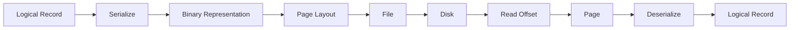

A useful mental model:

```text
In Memory
Object -> Pointer -> Object

On Disk
Page ID -> File Offset -> Bytes -> Decode -> Object
```

---

# 2. Binary Encoding

Before designing pages, the database needs a way to represent:

* integers
* floating-point numbers
* strings
* arrays
* booleans
* enums
* composite structures

Everything eventually becomes a **sequence of bytes**. Serialization converts an object into bytes; deserialization reconstructs the object. 


---

# 3. Primitive Types

Most numeric primitive types have a known fixed size.

| Type   | Typical size |
| ------ | -----------: |
| byte   |       1 byte |
| short  |      2 bytes |
| int    |      4 bytes |
| long   |      8 bytes |
| float  |      4 bytes |
| double |      8 bytes |

For multibyte numbers, the encoding and decoding sides must agree on **byte order / endianness**. 

---

## 4. Endianness

Consider:

```text
0xAABBCCDD
```

### Big Endian

Most significant byte first:

```text
Address     A      A+1    A+2    A+3
          +------+------+------+------+
Value     |  AA  |  BB  |  CC  |  DD  |
          +------+------+------+------+
```

### Little Endian

Least significant byte first:

```text
Address     A      A+1    A+2    A+3
          +------+------+------+------+
Value     |  DD  |  CC  |  BB  |  AA  |
          +------+------+------+------+
```

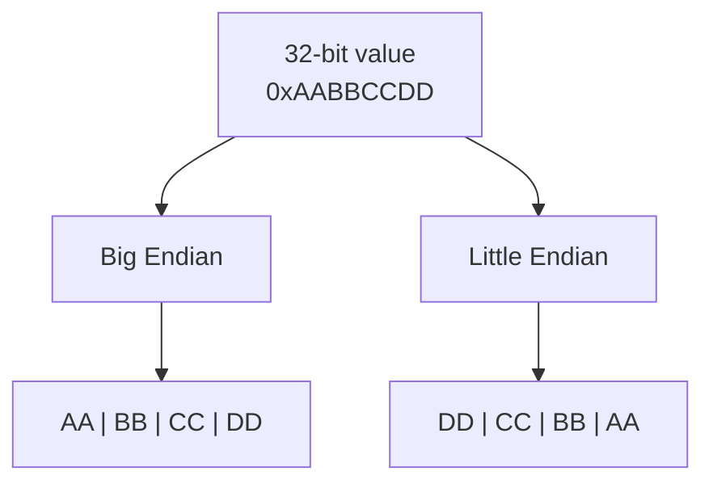

A database format should not blindly depend on the CPU's native endianness. The reader and writer must use the same convention. RocksDB, for example, accounts for platform byte order when reconstructing fixed-width values. 

---

# 5. Floating-Point Representation

Floating-point numbers are generally encoded using IEEE-754 style representations.

A 32-bit floating-point value contains:

```text
+------+----------+-----------------------+
| Sign | Exponent |       Fraction        |
| 1bit |  8 bits  |        23 bits        |
+------+----------+-----------------------+
```

The representation is approximate because floating-point values are expressed using binary fractions. 

---

# 6. Strings and Variable-Size Data

Fixed-size primitives are simple.

Strings, arrays, BLOBs, etc. are harder because their size is not known beforehand.

One approach is:

```text
[length][data]
```

For example:

```text
String {
    uint16 size;
    byte data[size];
}
```

This is essentially the **Pascal/UCSD string** representation. 

Example:

```text
"Subham"

+--------+----------------------+
|   6    | S u b h a m          |
+--------+----------------------+
 length        payload
```

---

## Pascal String vs Null-Terminated String

### Length-Prefixed

```text
[length][contents]
```

Advantages:

* Length available in **O(1)**.
* Reader immediately knows how many bytes to consume.
* Arbitrary bytes can be represented more conveniently.

### Null-Terminated

```text
H e l l o \0
```

The reader scans until `\0`.

Therefore determining the length requires scanning the data.

The chapter favors the usefulness of storing explicit lengths for binary formats. 

---

# 7. Bit-Packed Data

Storing one Boolean in an entire byte wastes seven bits.

Instead:

```text
1 byte = 8 independent boolean flags
```

Example:

```text
00000101
```

could represent:

```text
bit 0 = IS_LEAF              = 1
bit 1 = VARIABLE_SIZE        = 0
bit 2 = HAS_OVERFLOW_PAGE    = 1
```

The book also discusses representing low-cardinality values such as B-Tree node types using enums. 

Example:

```text
ROOT     = 0
INTERNAL = 1
LEAF     = 2
```

---

## Flags

Example masks:

```text
IS_LEAF             = 00000001
VARIABLE_SIZE_VALUE = 00000010
HAS_OVERFLOW_PAGE   = 00000100
```

### Set

```java
flags |= HAS_OVERFLOW_PAGE;
```

### Unset

```java
flags &= ~HAS_OVERFLOW_PAGE;
```

### Check

```java
boolean set =
    (flags & HAS_OVERFLOW_PAGE) != 0;
```

These operations use bit masks and bitwise operators to pack multiple independent properties into a compact value. 

---

# 8. General File Organization

A common database file layout looks like:

```text
+---------+--------+--------+--------+---------+
| Header  | Page 0 | Page 1 | Page 2 | Trailer |
+---------+--------+--------+--------+---------+
```

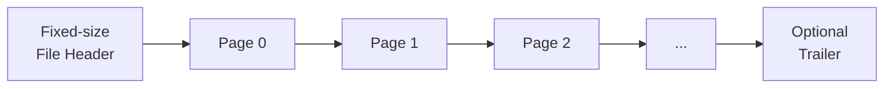

The header/trailer can contain metadata required to:

* interpret the file
* locate sections
* identify format/version
* navigate the file

Fixed-size pages are especially useful for **in-place-update** storage engines because addressing becomes simple. 

---

# 9. Fixed Schema Saves Space

Suppose every employee contains:

```text
employee_id
tax_number
birth_date
gender
first_name
last_name
```

If the schema is known, we don't need to store:

```text
"employee_id"
"tax_number"
"birth_date"
...
```

with every record.

Instead, the meaning is determined from **position**. 

Example:

```text
Fixed Area
+-------------+
| employee_id |
| tax_number  |
| birth_date  |
| gender      |
| fname_len   |
| lname_len   |
+-------------+

Variable Area
+-------------+
| first_name  |
| last_name   |
+-------------+
```

Better still, a fixed-size header can store:

```text
[offset, length]
```

for every variable-size field.

Then fields can be accessed independently without scanning preceding values.

---

# 10. Hierarchical Binary Formats

Complex storage formats are composed hierarchically:

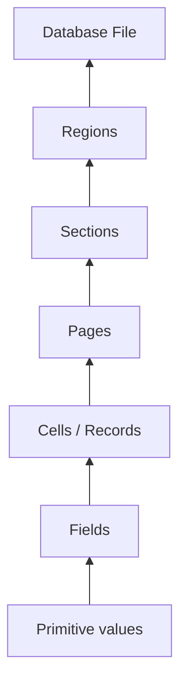

This hierarchy is one of the main ideas of the chapter:

```text
bytes
  ↓
primitive values
  ↓
fields
  ↓
cells
  ↓
pages
  ↓
file
```

---

# 11. Page Structure

Database data/index files are normally divided into **fixed-size pages**.

Typical page sizes mentioned in the chapter are roughly:

```text
4 KB – 16 KB
```

A B-Tree node often corresponds to a page, although nodes may also span multiple linked pages. 

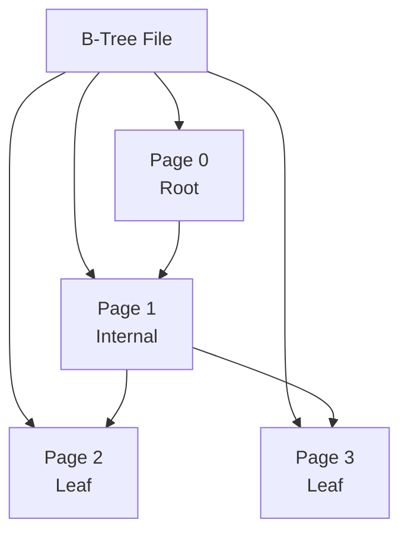

Thus:

```text
Logical concept     Disk concept
---------------------------------
B-Tree Node      ≈  Page
Child pointer    ≈  Page ID
Record pointer   ≈  Offset
```

---

# 12. Why Simple Sequential Page Layouts Are Insufficient

A naïve B-Tree page might be:

```text
[p0][k1][v1][p1][k2][v2][p2] ...
```

This works well for fixed-size data.

But it has two major problems:

1. Inserting into the middle requires **moving records**.
2. Variable-size records are difficult to manage. 

Hence the need for **slotted pages**.

---

# 13. Slotted Pages

This is the most important concept in Chapter 3.

We want a page capable of:

* storing variable-size records
* reclaiming deleted space
* referencing records without exposing their exact physical position 

The solution is the **slotted page / slot directory**.

---

## Basic Structure

```text
Low address                                      High address
┌─────────┬───────────────┬───────────────────┬──────────────┐
│ Header  │ Slot Directory│     Free Space    │    Cells     │
└─────────┴───────────────┴───────────────────┴──────────────┘
               → grows                         grows ←
```


Conceptually, the two variable regions grow **toward each other**.

```text
Slots       → → →

             FREE SPACE

                   ← ← ← Cells
```

The slotted-page representation adds a level of indirection:

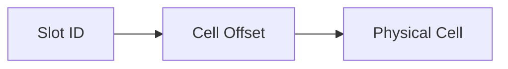

An external component uses the **slot ID**, not the physical address of the record.

Therefore the record can move internally without invalidating the external reference.

---

# 14. Why Slotted Pages Work

The chapter identifies three main benefits:

### Minimal overhead

Only the slot/offset array needs additional storage.

### Space reclamation

The page can be compacted/defragmented and records moved.

### Dynamic layout

External references use **slot IDs**, so physical record positions remain an implementation detail. 

---

# 15. Cell Layout

A page contains **cells**.

For B-Trees there are two important conceptual types:

### Internal-node cell

Contains:

```text
key + child page pointer
```

Example:

```text
+----------+---------+----------------+
| key_size | page_id | key bytes      |
| 4 bytes  | 4 bytes | variable       |
+----------+---------+----------------+
```

### Leaf/data cell

Contains:

```text
key + value
```

Example:

```text
+-------+----------+------------+----------+-------------+
| flags | key_size | value_size | key data | value data  |
+-------+----------+------------+----------+-------------+
```

The chapter recommends grouping fixed-size metadata together because its offsets can then be calculated statically. 

---

# 16. Page ID vs Cell Offset

These are different concepts.

### Page ID

Identifies a page.

```text
page ID
   ↓
page cache / lookup mechanism
   ↓
file offset
```

### Cell Offset

Identifies a location **inside the current page**.

```text
absolute_cell_position
    =
page_start_offset + cell_offset
```

Because a cell offset only needs to address locations within one page, it can usually use fewer bits than a full file offset. 

---

# 17. Variable-Sized Cells

Suppose:

```text
Header:
key_size   = 6
value_size = 10
```

Layout:

```text
+---------+------------+----------------+------------------+
| Header  | key=6bytes | value=10bytes  |
+---------+------------+----------------+------------------+
```

Then:

```text
key_offset   = header_size

value_offset = header_size + key_size
```

This gives the decoder enough information to slice the raw byte sequence into its original fields. 

---

# 18. Combining Cells into Slotted Pages

A particularly useful design is:

```text
Header
Slot pointers
       ↓

+--------+----------+------------+-----------------+
| Header | Offsets  | Free Space | Physical Cells  |
+--------+----------+------------+-----------------+
```

Cells are appended physically at one side.

The **offset array**, however, is maintained in **sorted-key order**. 

This creates an important separation:

```text
Physical Order ≠ Logical Order
```

---

# 19. Example: Tom, Leslie, Ron

Insert physically:

```text
Tom
Leslie
```

Physical cells:

```text
[Leslie][Tom]
```

But the slot directory is sorted logically:

```text
Leslie -> Tom
```

Now insert:

```text
Ron
```

The new cell is simply appended.

Physical:

```text
[Ron][Leslie][Tom]
```

Logical slot order:

```text
Leslie -> Ron -> Tom
```

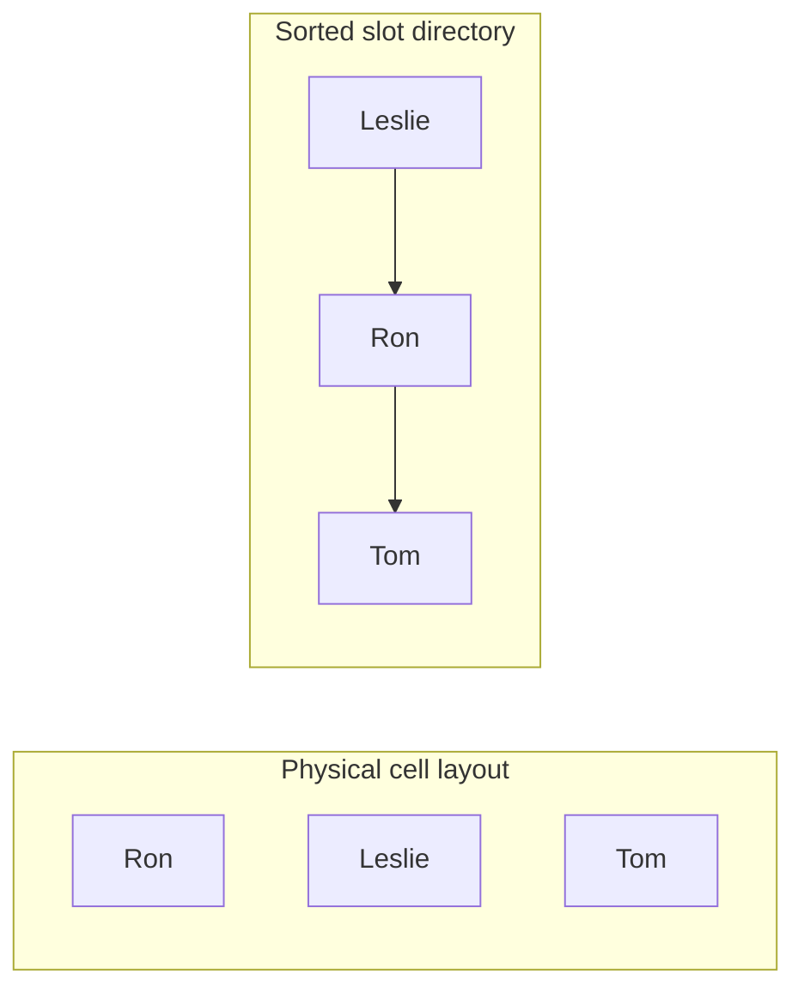

Consequently:

* cells do **not** need to be rearranged to preserve sort order
* only the small slot pointers need rearranging
* binary search can operate over the sorted slot directory

This is a major reason slotted pages are useful.

---

# 20. Deleting Variable-Size Records

Deletion does not necessarily move all remaining cells immediately.

Instead:

```text
1. Mark/remove the slot.
2. Record freed region.
3. Add region to availability/free list.
4. Reuse it later.
```

The free-space metadata may look like:

```text
Free list:

(offset=150, size=32)
(offset=420, size=75)
(offset=700, size=20)
```

The chapter notes that SQLite uses similar free-space segments called **freeblocks**. 

---

# 21. Fragmentation

After many inserts/deletes:

```text
+------+----+------+----+------+----------+
| Cell |free| Cell |free| Cell | free     |
+------+----+------+----+------+----------+
```

Total available space might be:

```text
100 bytes
```

but the largest contiguous section might be only:

```text
40 bytes
```

Therefore a 70-byte record still cannot be inserted directly.

Solution:

```text
Defragment / compact page
```

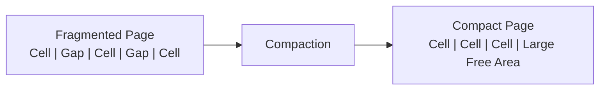

---

# 22. Free-Space Allocation Strategies

When a new record must fit into a freed region, two strategies are discussed.

### First Fit

Choose the first free segment large enough.

```text
Request = 30

Free blocks:
50, 80, 35

Choose 50.
```

Fast/simple, but may produce badly sized leftovers.

### Best Fit

Choose the block that leaves the smallest remainder.

```text
Request = 30

Free blocks:
50, 80, 35

Choose 35.
```

Only `5 bytes` remain unused.

The trade-off is that finding the best block can require more work. 

---

# 23. Defragmentation and Overflow

Insertion logic can be understood as:

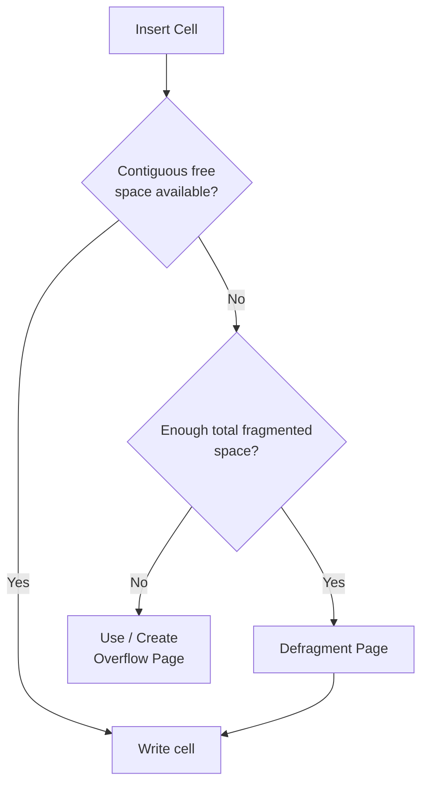

If sufficient total space exists but it is fragmented, compact the page.

If insufficient space exists even after compaction, an **overflow page** is required. 

---

# 24. Final B-Tree Page Model

A simplified page becomes:

```text
+----------------------------------------------------------+
|                      PAGE                                |
+----------------------------------------------------------+
| Header                                                   |
+----------------------------------------------------------+
| Slot 0 | Slot 1 | Slot 2 | Slot 3 | ...                  |
+----------------------------------------------------------+
|                       Free Space                         |
+----------------------------------------------------------+
| Cell N | ... | Cell 2 | Cell 1 | Cell 0                  |
+----------------------------------------------------------+
```

For an internal B-Tree node:

```text
Cell = key + child_page_id
```

For a leaf:

```text
Cell = key + value
```

Pointers have two levels:

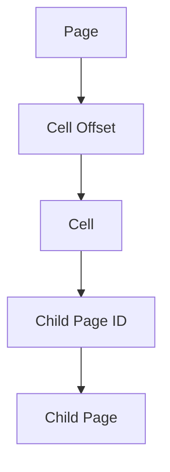

So the hierarchy is:

```text
Page ID  -> locates page
Cell ID  -> locates cell inside page
```

---

# 25. Versioning

File formats inevitably evolve.

For example:

```text
Version 1
[key_size][key][value]

Version 2
[flags][key_size][value_size][key][value]
```

A new database version may still need to read files produced by an older version.

Therefore files require some way to identify their encoding version. 

Approaches mentioned include:

* version in filename
* separate version file
* version field in file header
* magic numbers

Examples from the chapter:

```text
Cassandra:
na-1-big-Data.db
^^
format version
```

PostgreSQL uses:

```text
PG_VERSION
```

Once the version is known:

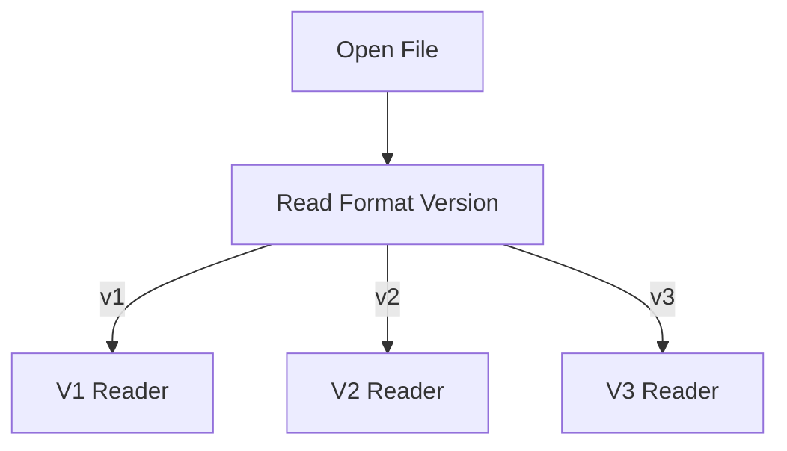

The stable portion used to determine the format must itself remain interpretable across versions. 

---

# 26. Checksumming

Disk contents can become corrupted because of:

* hardware failure
* storage errors
* software bugs
* accidental bit changes

The system can detect such corruption by storing a checksum/CRC alongside the data. 

### Write Path


### Read Path

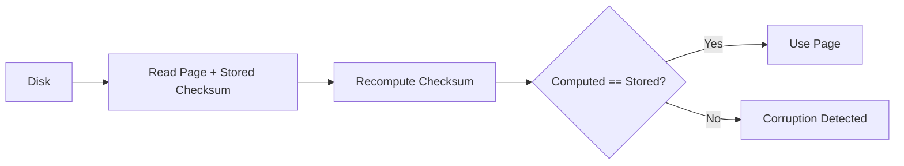

The book stresses that CRCs/noncryptographic hashes detect **accidental corruption**, not malicious tampering. Security-sensitive integrity requires cryptographic hashes. 

---

# 27. Why Checksum Per Page?

Instead of:

```text
Checksum(entire 500 GB DB file)
```

databases generally benefit from checksumming smaller units such as pages.

```text
Page 0 -> checksum 0
Page 1 -> checksum 1
Page 2 -> checksum 2
...
```

Benefits:

* verify only the page being read
* corruption is localized
* no need to read/checksum the entire file
* one corrupt page does not automatically imply discarding the entire file

The chapter specifically describes storing page checksums in the **page header**. 

---

# 28. Complete Mental Model

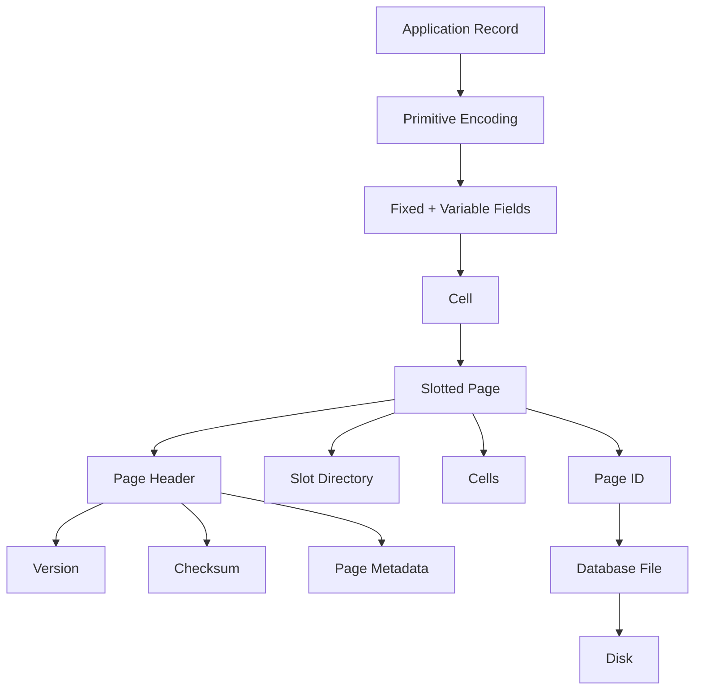

---

# 29. Core Design Idea

Chapter 3 can essentially be reduced to this abstraction:

```text
                FILE
                  │
        ┌─────────┴──────────┐
        │                    │
      Header               Pages
                             │
                       ┌─────┴─────┐
                       │           │
                 Slot Directory   Cells
                       │           │
                       └────┬──────┘
                            │
                          Fields
                            │
                    Primitive Bytes
```

The key transition from Chapter 2 to Chapter 3 is:

```text
Chapter 2
B-Tree as an algorithm/data structure

                ↓

Chapter 3
How B-Tree nodes can actually exist
as bytes inside disk pages
```

The chapter ends by summarizing binary organization, serialization, variable-size data, cells, slotted pages, and the separation between insertion order and logical key order. 

---

# 30. Interview Cheat Sheet

| Concept            | Remember                                     |
| ------------------ | -------------------------------------------- |
| Serialization      | Object → byte sequence                       |
| Deserialization    | Byte sequence → object                       |
| Endianness         | Order of bytes in multibyte values           |
| Pascal string      | `[length][data]`                             |
| Flags              | Multiple booleans packed into bits           |
| Page               | Fixed-sized disk-management unit             |
| Page ID            | Identifies a page                            |
| Cell offset        | Position relative to page start              |
| Slotted page       | Slot directory + free space + variable cells |
| Slot ID            | Stable logical reference to movable cell     |
| Physical order     | Usually insertion/layout order               |
| Logical order      | Can be maintained through sorted offsets     |
| Fragmentation      | Free space exists but is noncontiguous       |
| Defragmentation    | Rewrite live records contiguously            |
| First fit          | First sufficiently large free segment        |
| Best fit           | Segment leaving smallest remainder           |
| Overflow page      | Handles data that cannot fit in the page     |
| Versioning         | Allows old/new file formats to coexist       |
| Checksum / CRC     | Detect accidental corruption                 |
| Cryptographic hash | Needed for adversarial integrity protection  |

### The most important takeaway

```text
A database does NOT need to physically sort every record
inside a page to maintain sorted logical access.

Instead:

sorted Slot Directory
        ↓
unsorted / append-friendly physical Cells
```

That **indirection between logical location and physical location** is the central idea behind the slotted-page design described in this chapter. 
