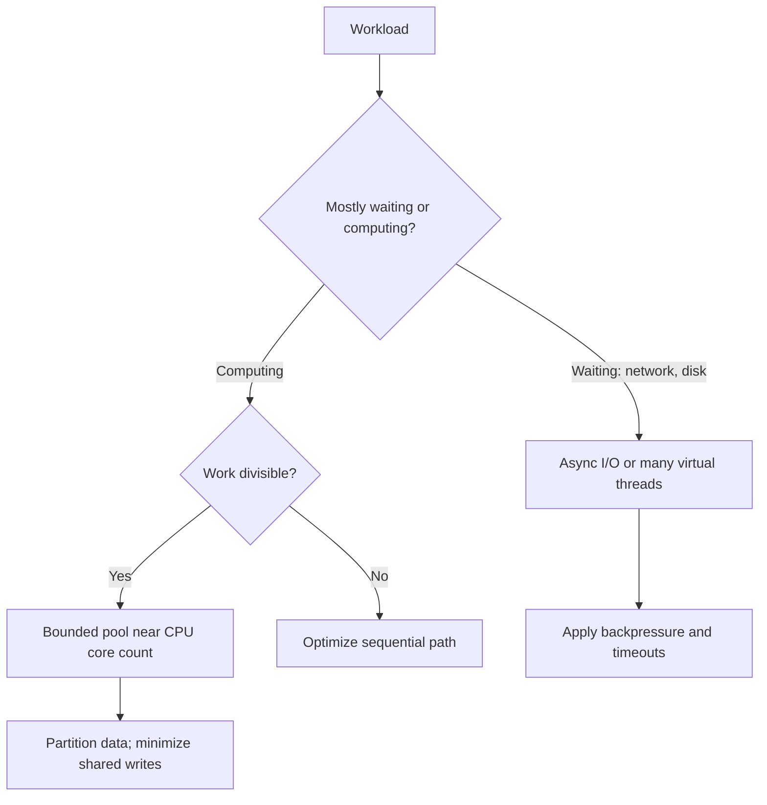
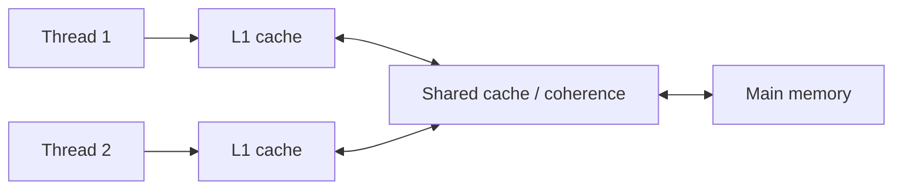
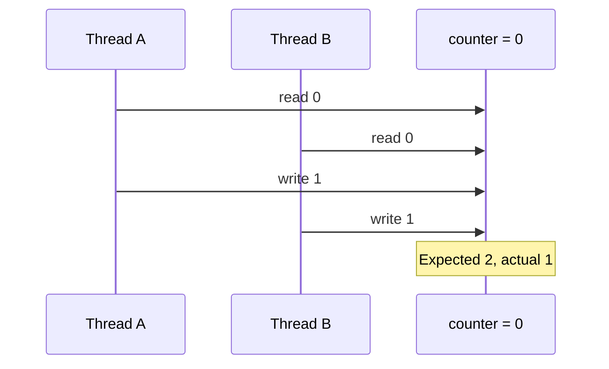
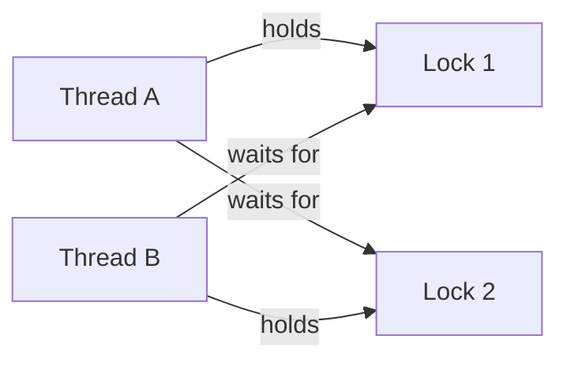
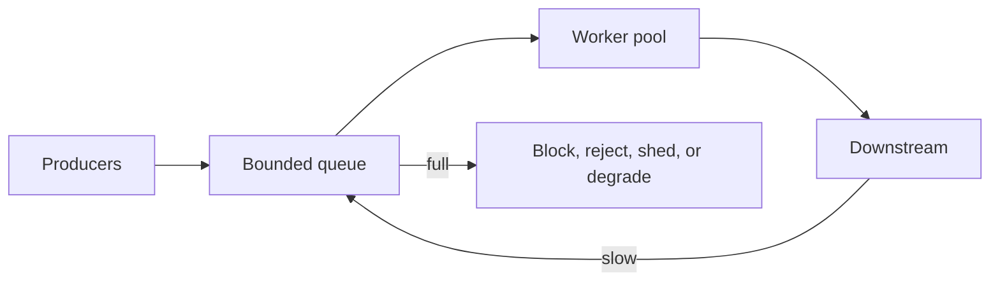
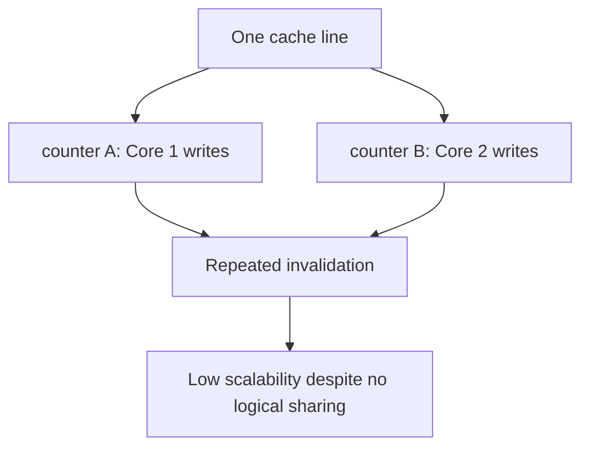
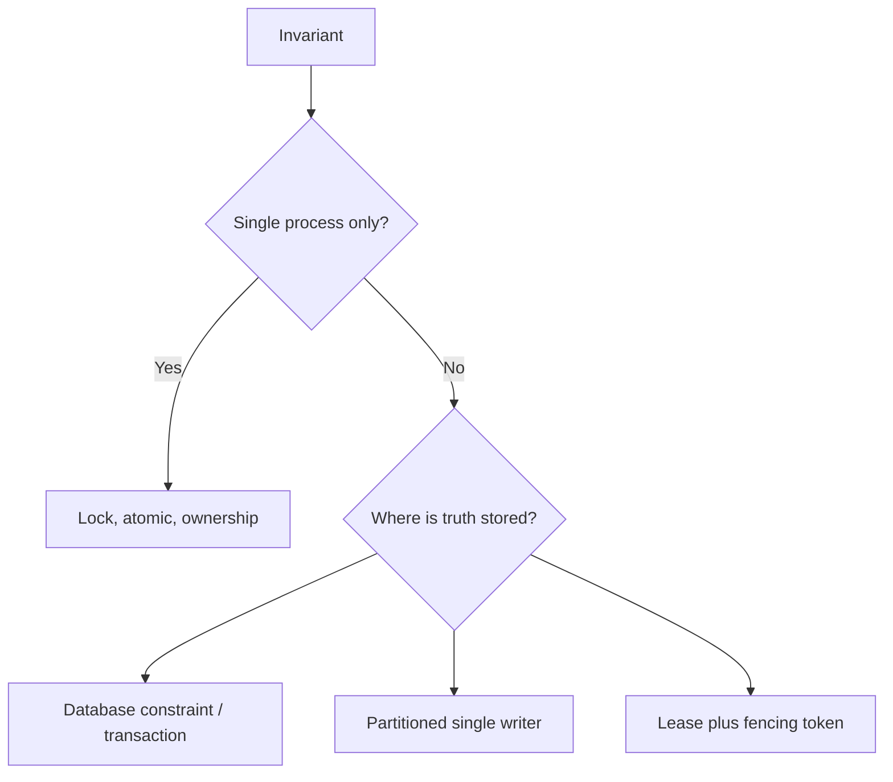
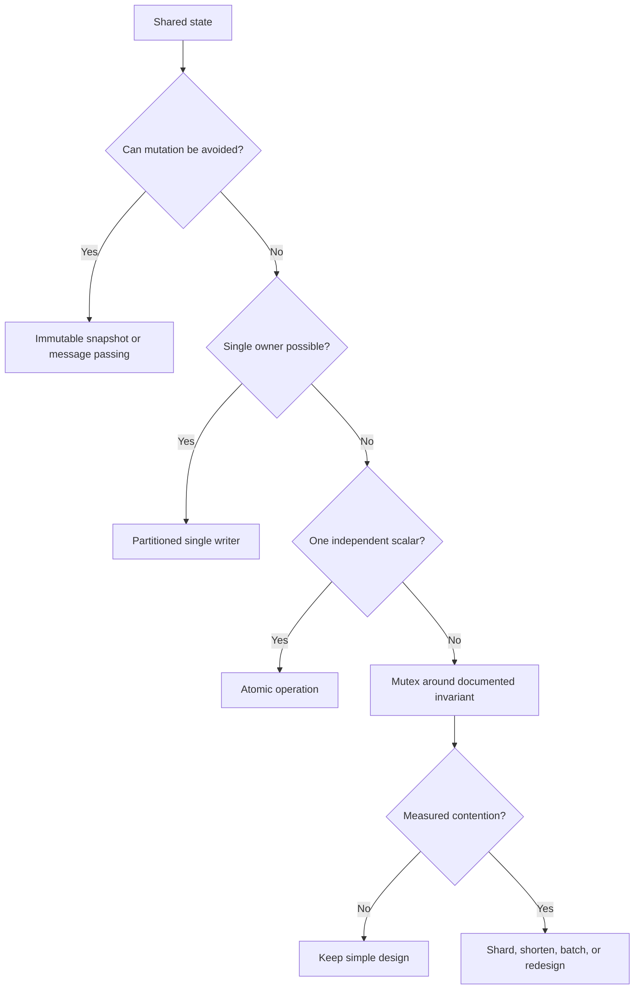

# Concurrency and Multithreading: Java + C++ Deep Study Guide

> A practical, interview-ready guide to reasoning about correctness, performance, and trade-offs. Examples target Java 21+ and C++20 unless stated otherwise.

## 1. The mental model

Concurrency means multiple tasks can make progress during overlapping periods. Parallelism means multiple tasks literally execute at the same instant on different cores.

| Term | Meaning | Typical use |
|---|---|---|
| Process | Independent address space and OS resources | Isolation, security, fault containment |
| Thread | Execution stream sharing a process's memory | Low-cost communication and parallel work |
| Task | Unit of work scheduled onto a thread | Decouple work from physical threads |
| Async I/O | A thread need not block while waiting for I/O | High-concurrency network services |
| Data parallelism | Same operation over partitions | CPU-heavy arrays, analytics |
| Task parallelism | Different operations concurrently | Pipelines, request fan-out |



### Why concurrency is hard

A correct concurrent program must satisfy:

1. **Safety:** nothing bad happens—no invalid state, data race, double processing, or broken invariant.
2. **Liveness:** something good eventually happens—no deadlock, livelock, or starvation.
3. **Visibility:** writes by one thread become observable by another under defined rules.
4. **Ordering:** relevant operations appear in an order sufficient to preserve invariants.
5. **Bounded resource use:** threads, queues, memory, and downstream load do not grow without limit.

## 2. Hardware and memory-model foundations

Each core may have registers, store buffers, and caches. Compilers and CPUs may reorder instructions when single-thread behavior is preserved. Therefore, source-code order alone is not a cross-thread guarantee.



### Data race vs race condition

- A **race condition** is a correctness bug whose outcome depends on timing.
- In Java, a **data race** occurs when conflicting accesses are not ordered by happens-before and at least one is a write.
- In C++, a data race on non-atomic memory causes **undefined behavior**. The compiler may make transformations that render intuitive reasoning invalid.
- Race conditions can still exist with atomics: individual operations may be safe while a multi-step business invariant is not.

### Happens-before

Happens-before is a visibility and ordering relationship—not wall-clock chronology.

Common edges:

| Java | C++ |
|---|---|
| Program order within one thread | Sequenced-before within one thread |
| Unlock happens-before later lock on same monitor/lock | Release unlock synchronizes with acquiring lock |
| Volatile write happens-before later volatile read | Release operation read by an acquire operation |
| `Thread.start()` publishes prior actions | Passing fully initialized state before thread start |
| Thread actions happen-before successful `join()` return | Thread completion synchronizes with successful `join()` |

If A happens-before B, B must observe A's effects, subject to later writes.

## 3. The lost-update problem

`counter++` is read, add, write—not one indivisible action.



### Java: lock and atomic alternatives

```java
final class Counters {
    private long guarded;
    private final Object lock = new Object();
    private final java.util.concurrent.atomic.AtomicLong atomic =
            new java.util.concurrent.atomic.AtomicLong();
    private final java.util.concurrent.atomic.LongAdder striped =
            new java.util.concurrent.atomic.LongAdder();

    void incrementGuarded() {
        synchronized (lock) { guarded++; }
    }

    void incrementAtomic() { atomic.incrementAndGet(); }
    void incrementStriped() { striped.increment(); }
}
```

### C++: lock and atomic alternatives

```cpp
#include <atomic>
#include <mutex>

class Counters {
    long long guarded_ = 0;
    std::mutex mutex_;
    std::atomic<long long> atomic_{0};
public:
    void increment_guarded() {
        std::lock_guard lock(mutex_);
        ++guarded_;
    }
    void increment_atomic() {
        atomic_.fetch_add(1, std::memory_order_relaxed);
    }
};
```

| Choice | Strength | Cost / limitation |
|---|---|---|
| Mutex / `synchronized` | Protects compound invariants and multiple fields | Contention, blocking, deadlock risk |
| Atomic counter | Fast, non-blocking single-variable update | Does not automatically protect compound state |
| Java `LongAdder` | Excellent contended write throughput | `sum()` is not an atomic snapshot; more memory |
| Thread-local counters + merge | Minimal sharing | Aggregation complexity and delayed global result |

## 4. Mutual exclusion and lock design

### Java locks

- `synchronized`: lexical, simple, automatic unlock, JVM-optimized.
- `ReentrantLock`: timed/interruptible acquisition, multiple conditions, optional fairness.
- `ReentrantReadWriteLock`: useful only when reads dominate, sections are substantial, and writes are rare.
- `StampedLock`: optimistic reads but is not reentrant; validation is mandatory and usage is easy to get wrong.

```java
private final java.util.concurrent.locks.ReentrantLock lock =
        new java.util.concurrent.locks.ReentrantLock();

boolean transfer(Account from, Account to, long amount)
        throws InterruptedException {
    if (!lock.tryLock(100, java.util.concurrent.TimeUnit.MILLISECONDS)) {
        return false;
    }
    try {
        if (from.balance() < amount) return false;
        from.debit(amount);
        to.credit(amount);
        return true;
    } finally {
        lock.unlock();
    }
}
```

### C++ locks and RAII

```cpp
void transfer(Account& from, Account& to, long amount) {
    // Deadlock-safe acquisition; RAII guarantees release on exceptions.
    std::scoped_lock lock(from.mutex, to.mutex);
    if (from.balance < amount) return;
    from.balance -= amount;
    to.balance += amount;
}
```

### Locking rules that scale

1. State the invariant and which lock guards it.
2. Keep critical sections small, but never split an atomic business invariant merely to shorten a lock.
3. Do not perform slow network/disk calls while holding a lock.
4. Avoid callbacks into unknown code under a lock.
5. Use a global lock order when multiple locks are unavoidable.
6. Prefer immutable snapshots, ownership transfer, partitioning, or message passing to shared mutable state.

## 5. Deadlock, livelock, and starvation

Deadlock requires all four Coffman conditions: mutual exclusion, hold-and-wait, no preemption, and circular wait. Break any one to prevent it.



```java
// Stable global ordering prevents circular wait.
void transfer(Account a, Account b, long amount) {
    Account first = a.id() < b.id() ? a : b;
    Account second = a.id() < b.id() ? b : a;
    synchronized (first) {
        synchronized (second) {
            if (a.balance() >= amount) {
                a.debit(amount);
                b.credit(amount);
            }
        }
    }
}
```

- **Livelock:** threads run and react to each other but make no progress. Use randomized/exponential backoff or centralized arbitration.
- **Starvation:** one task rarely gets CPU/lock access. Fair locks can help but usually reduce throughput.
- **Priority inversion:** high-priority work waits for a lock held by low-priority work. OS priority inheritance may help; application-level prevention is better.

## 6. Condition variables: wait for state, not time

Always test the predicate in a loop. Wakeups may be spurious; another thread may consume the condition before the awakened thread reacquires the lock.

### Java bounded queue

```java
final class BoundedQueue<T> {
    private final java.util.ArrayDeque<T> q = new java.util.ArrayDeque<>();
    private final int capacity;

    BoundedQueue(int capacity) { this.capacity = capacity; }

    synchronized void put(T item) throws InterruptedException {
        while (q.size() == capacity) wait();
        q.addLast(item);
        notifyAll();
    }

    synchronized T take() throws InterruptedException {
        while (q.isEmpty()) wait();
        T item = q.removeFirst();
        notifyAll();
        return item;
    }
}
```

In production, prefer `ArrayBlockingQueue`: it is tested, supports timeouts, and expresses backpressure directly.

### C++ bounded queue

```cpp
template<class T>
class BoundedQueue {
    std::mutex mutex_;
    std::condition_variable not_empty_, not_full_;
    std::deque<T> queue_;
    std::size_t capacity_;
public:
    explicit BoundedQueue(std::size_t capacity) : capacity_(capacity) {}

    void put(T item) {
        std::unique_lock lock(mutex_);
        not_full_.wait(lock, [&] { return queue_.size() < capacity_; });
        queue_.push_back(std::move(item));
        lock.unlock();
        not_empty_.notify_one();
    }

    T take() {
        std::unique_lock lock(mutex_);
        not_empty_.wait(lock, [&] { return !queue_.empty(); });
        T item = std::move(queue_.front());
        queue_.pop_front();
        lock.unlock();
        not_full_.notify_one();
        return item;
    }
};
```

Why notify after unlock? It can reduce immediate wake-then-block behavior. Correctness still depends on changing the predicate while holding the lock.

## 7. Thread lifecycle and structured ownership

### Java virtual threads

```java
try (var executor = java.util.concurrent.Executors.newVirtualThreadPerTaskExecutor()) {
    var futures = urls.stream()
            .map(url -> executor.submit(() -> fetch(url)))
            .toList();
    for (var future : futures) {
        System.out.println(future.get());
    }
}
```

Virtual threads make thread-per-request practical for blocking I/O. They do not make CPU work faster, remove races, or eliminate downstream capacity limits. Avoid long blocking operations inside `synchronized` regions because pinning behavior and contention can reduce scalability; keep critical sections short.

### C++20 `std::jthread`

```cpp
#include <chrono>
#include <stop_token>
#include <thread>

std::jthread worker([](std::stop_token stop) {
    while (!stop.stop_requested()) {
        do_one_unit();
    }
});
// Destructor requests stop and joins automatically.
```

Prefer `jthread` over raw `thread` when cooperative cancellation and automatic joining fit. A joinable `std::thread` destroyed without `join()` or `detach()` terminates the process.

## 8. Thread pools, queues, and backpressure



### Java bounded executor

```java
int cores = Runtime.getRuntime().availableProcessors();
var executor = new java.util.concurrent.ThreadPoolExecutor(
        cores, cores,
        0L, java.util.concurrent.TimeUnit.MILLISECONDS,
        new java.util.concurrent.ArrayBlockingQueue<>(1_000),
        new java.util.concurrent.ThreadPoolExecutor.CallerRunsPolicy());
```

`CallerRunsPolicy` slows producers, creating backpressure. It can increase caller latency and must not execute blocking work on a latency-sensitive event-loop thread.

### Pool sizing

For CPU-bound independent work, start near the number of available cores. For blocking work, a rough model is:

\[
N_{threads} \approx N_{cores} \times U_{target} \times \left(1 + \frac{W}{S}\right)
\]

where `W` is wait time and `S` is compute/service time. Treat this as an initial estimate; measure queue delay, throughput, utilization, memory, and downstream saturation.

Unbounded queues hide overload until latency and memory explode. A production pool needs:

- bounded concurrency and queue capacity;
- rejection/overload policy;
- deadlines and cancellation;
- metrics for active workers, queue depth/age, rejection rate, service time, and end-to-end latency.

## 9. Futures, composition, and exception handling

### Java `CompletableFuture`

```java
var user = java.util.concurrent.CompletableFuture
        .supplyAsync(() -> loadUser(id), ioPool);
var orders = java.util.concurrent.CompletableFuture
        .supplyAsync(() -> loadOrders(id), ioPool);

var page = user.thenCombine(orders, UserPage::new)
        .orTimeout(500, java.util.concurrent.TimeUnit.MILLISECONDS)
        .exceptionally(ex -> fallbackPage(id, ex));
```

Specify executors explicitly. The common pool is shared process-wide and may be harmed by blocking operations. Cancellation of a `CompletableFuture` does not guarantee the underlying operation stops; propagate a deadline/cancellation signal to the I/O itself.

### C++ futures

```cpp
auto future = std::async(std::launch::async, [] { return compute(); });
try {
    auto result = future.get(); // returns or rethrows task exception
} catch (const std::exception& e) {
    handle(e);
}
```

Standard C++ futures provide limited native continuation/composition support compared with `CompletableFuture`. Real services commonly use an executor/task library, coroutines, or an asynchronous framework. Always make the `std::async` launch policy explicit; otherwise execution may be deferred.

## 10. Atomics and compare-and-set

Atomics linearize operations on an atomic object. They do not automatically make a whole algorithm correct.

### CAS loop

```java
void updateMax(java.util.concurrent.atomic.AtomicInteger max, int candidate) {
    int observed;
    do {
        observed = max.get();
        if (candidate <= observed) return;
    } while (!max.compareAndSet(observed, candidate));
}
```

```cpp
void update_max(std::atomic<int>& maximum, int candidate) {
    int observed = maximum.load(std::memory_order_relaxed);
    while (observed < candidate &&
           !maximum.compare_exchange_weak(
               observed, candidate,
               std::memory_order_relaxed,
               std::memory_order_relaxed)) {
        // On failure, observed is updated to the current value.
    }
}
```

### C++ memory orders

| Order | Meaning | Good use |
|---|---|---|
| `relaxed` | Atomicity only; no cross-object ordering | Statistics/counters not used for publication |
| `release` | Prior operations cannot move after this publication | Publishing initialized data |
| `acquire` | Later operations cannot move before this observation | Consuming published data |
| `acq_rel` | Both on read-modify-write | Ownership/state transitions |
| `seq_cst` | Strongest global order among seq-cst operations | Default when correctness matters more than marginal tuning |

```cpp
Data data;
std::atomic<bool> ready{false};

// Producer
data = build_data();
ready.store(true, std::memory_order_release);

// Consumer
if (ready.load(std::memory_order_acquire)) {
    use(data); // initialized data is visible
}
```

Use weaker C++ ordering only with a written proof and benchmarked benefit. Java `volatile` supplies visibility and ordering for that field but does not make compound operations such as `x++` atomic.

### ABA and reclamation

In lock-free pointer algorithms, a value can change A→B→A, causing CAS to succeed despite intervening mutation. Version tags may address ABA. Safe memory reclamation is harder: hazard pointers, epochs, or reference counting may be needed. Garbage collection makes some Java designs easier, but logical ABA remains possible.

## 11. Safe publication and immutability

Never expose `this` before construction completes. Prefer final/const immutable state.

```java
final class Config {
    private final String endpoint;
    private final int timeoutMs;
    Config(String endpoint, int timeoutMs) {
        this.endpoint = endpoint;
        this.timeoutMs = timeoutMs;
    }
}

private volatile Config config = new Config("primary", 500);
void reload(Config next) { config = next; } // atomic snapshot publication
```

Readers see either the old or new complete snapshot, without locking. This copy-on-write style is excellent for read-heavy, infrequently updated configuration but expensive for large/frequently mutated state.

### Double-checked locking

```java
private volatile Client client;

Client client() {
    Client local = client;
    if (local == null) {
        synchronized (this) {
            local = client;
            if (local == null) client = local = new Client();
        }
    }
    return local;
}
```

Without `volatile`, publication can be unsafe. Prefer simpler initialization-on-demand holder patterns where possible. In C++, prefer thread-safe function-local static initialization:

```cpp
Client& client() {
    static Client instance;
    return instance;
}
```

## 12. Concurrent collections

| Need | Java | C++ standard library |
|---|---|---|
| Concurrent key/value access | `ConcurrentHashMap` | No standard concurrent map; shard + mutex or library |
| Producer/consumer queue | `BlockingQueue` variants | Build with mutex/CV or use library |
| Copy-on-write list | `CopyOnWriteArrayList` | Immutable snapshot + `shared_ptr` pattern |
| Concurrent sorted map | `ConcurrentSkipListMap` | No direct standard equivalent |

### Java atomic per-key update

```java
counts.compute(key, (k, oldValue) -> oldValue == null ? 1 : oldValue + 1);
```

The mapping function should be short and side-effect-free; it may block competing updates. Iterators of many Java concurrent collections are weakly consistent, not global snapshots.

### C++ sharded map

```cpp
template<class K, class V, std::size_t N = 64>
class ShardedMap {
    struct Shard { std::mutex m; std::unordered_map<K, V> map; };
    std::array<Shard, N> shards_;
    Shard& shard(const K& key) { return shards_[std::hash<K>{}(key) % N]; }
public:
    void increment(const K& key) {
        auto& s = shard(key);
        std::lock_guard lock(s.m);
        ++s.map[key];
    }
};
```

Sharding raises concurrency but makes global snapshots, resizing, and multi-key atomic operations harder.

## 13. False sharing and cache contention

Independent variables on the same cache line can cause cores to repeatedly invalidate each other's cache line.



```cpp
struct alignas(64) PaddedCounter {
    std::atomic<std::uint64_t> value{0};
};
```

Padding trades memory for reduced coherence traffic. Measure first: cache-line size and layout are platform-dependent. Java offers `LongAdder` for a common case; internal padding annotations are not stable public APIs.

## 14. Readers-writers and optimistic reads

```java
final java.util.concurrent.locks.StampedLock lock =
        new java.util.concurrent.locks.StampedLock();
private double x, y;

double distance() {
    long stamp = lock.tryOptimisticRead();
    double localX = x, localY = y;
    if (!lock.validate(stamp)) {
        stamp = lock.readLock();
        try { localX = x; localY = y; }
        finally { lock.unlockRead(stamp); }
    }
    return Math.hypot(localX, localY);
}
```

Optimistic reads are suitable when writes are rare and copying fields is safe before validation. Do not dereference a potentially inconsistent object graph before validation. A plain mutex may outperform a read-write lock when critical sections are short or writes are frequent.

## 15. Cancellation, interruption, and shutdown

Cancellation should be cooperative and bounded by a deadline.

### Java

```java
void runLoop() {
    try {
        while (!Thread.currentThread().isInterrupted()) {
            Work work = queue.take();
            process(work);
        }
    } catch (InterruptedException e) {
        Thread.currentThread().interrupt(); // preserve cancellation signal
    } finally {
        releaseResources();
    }
}
```

Never swallow `InterruptedException`. Either propagate it or restore the interrupt flag when the method cannot throw it.

### C++

```cpp
std::jthread worker([&](std::stop_token token) {
    while (!token.stop_requested()) {
        if (!process_next_with_timeout(token)) break;
    }
});
worker.request_stop();
```

Cancellation must reach blocking operations. Polling only between indefinitely blocking calls is not responsive.

## 16. Common concurrency patterns

### Producer-consumer

Use a bounded queue to separate production rate from consumption while limiting memory. Decide explicitly what happens when full: block, reject, drop newest/oldest, spill, or degrade.

### Fan-out/fan-in

Parallelize independent calls, then combine. Use one overall deadline rather than granting every branch the full timeout. Cancel branches no longer needed.

### Single-writer / actor

Route mutations for a state partition to one owner thread. This eliminates locks within the partition but introduces mailbox latency, queue backpressure, and partition hot spots.

### Work stealing

Workers take tasks from other workers' queues when idle. Good for irregular recursive CPU work. Locality and blocking tasks can complicate behavior. Java's `ForkJoinPool` is designed for small non-blocking tasks; use managed blocking or a separate executor for blocking I/O.

### Read-copy-update / immutable snapshot

Readers access immutable snapshots; writers build and publish replacements. Excellent read latency, but writes copy data and old snapshots remain alive until readers release them.

## 17. Concurrency versus distributed systems

An in-memory lock protects only one process. It does not protect multiple service instances. Across machines, use a database constraint/transaction, idempotency key, partition ownership, fencing token, or consensus-backed coordination depending on the invariant.



A distributed lease without a fencing token can allow a paused former owner to write after its lease expires.

## 18. Performance engineering

### Amdahl's law

If fraction `P` is parallelizable and `N` processors are used:

\[
Speedup(N) = \frac{1}{(1-P) + \frac{P}{N}}
\]

With 90% parallel work, unlimited processors cap theoretical speedup at 10×. Synchronization, communication, load imbalance, and memory bandwidth reduce it further.

### Little's law

For a stable system:

\[
Concurrency = Throughput \times Latency
\]

At 2,000 requests/s and 50 ms average latency, approximately 100 requests are in flight. This helps estimate capacity, but tail latency and bursts still matter.

### What to measure

- throughput and CPU utilization;
- p50/p95/p99 end-to-end and queue latency;
- lock contention and time held;
- context switches, runnable threads, allocation/GC;
- cache misses and memory bandwidth for native workloads;
- queue depth/age, rejection, timeout, and cancellation rates.

Avoid microbenchmark traps: dead-code elimination, missing warm-up, unrealistic contention, coordinated omission, and measuring debug builds. Use JMH for Java. Use an established C++ harness such as Google Benchmark and profile optimized builds.

## 19. Testing and debugging

Concurrency bugs are schedule-dependent. A passing stress test is evidence, not proof.

### Strategy

1. Put invariants into assertions.
2. Start many operations simultaneously using a barrier/latch.
3. Repeat with randomized delays and different worker counts.
4. Test cancellation, timeout, overload, exceptions, and shutdown.
5. Use deterministic fakes for clocks and I/O where possible.
6. Separate algorithm correctness from concurrency correctness.

### Tools

| Java | C++ |
|---|---|
| Thread dumps (`jstack`, JFR) | ThreadSanitizer (`-fsanitize=thread`) |
| Java Flight Recorder | gdb/lldb thread backtraces |
| JMH | Google Benchmark |
| jcstress for memory-model tests | Helgrind/DRD where appropriate |

ThreadSanitizer finds many data races but not every higher-level race, deadlock, or missing business invariant.

## 20. Java and C++ trade-off map

| Dimension | Java | C++ |
|---|---|---|
| Memory safety | Managed memory removes many lifetime errors | Manual/RAII lifetime control; dangling access is possible |
| Memory model | Strong standard model; `volatile`, monitors, rich concurrency library | Precise atomics and memory orders; data-race UB raises risk |
| Threading APIs | Executors, futures, concurrent collections, virtual threads | Low-level standard primitives; ecosystem libraries fill gaps |
| Cancellation | Interrupts, future cancellation, framework support | `stop_token`/`jthread`; library-specific async cancellation |
| Latency control | GC may add variability, though modern collectors reduce it | No GC; allocator and ownership design still affect latency |
| Low-level tuning | Less layout/control, easier safety | Cache layout, atomics, allocators, affinity; greater complexity |
| I/O concurrency | Virtual threads and async frameworks | Coroutines/framework event loops; standard networking support varies |

## 21. Decision framework



Default order of preference:

1. No sharing: immutable values, confinement, ownership transfer.
2. High-level tested abstraction: blocking queue, executor, concurrent map.
3. Simple mutex protecting a clear invariant.
4. Sharded/striped locks after measurement.
5. Atomics for truly independent state.
6. Custom lock-free structure only when justified by evidence and expertise.

## 22. Interview-quality reasoning template

When solving a concurrency problem, say:

1. **Invariant:** “Balance must never go negative; both account updates are atomic together.”
2. **Shared state:** identify exactly what multiple threads access.
3. **Synchronization boundary:** state which lock/atomic/owner protects it.
4. **Visibility proof:** explain the happens-before relationship.
5. **Liveness:** discuss lock ordering, blocking, timeouts, and cancellation.
6. **Overload:** bound workers/queues and define rejection behavior.
7. **Failure behavior:** exceptions, partial work, retries, and idempotency.
8. **Performance:** contention, granularity, cache behavior, and measurement plan.

### High-value interview questions

1. Why is `volatile int count; count++` unsafe in Java?
2. Why is a C++ data race worse than merely reading a stale value?
3. Explain acquire/release publication with an example.
4. When would `LongAdder` be wrong despite higher throughput?
5. Why must condition-variable waits use a loop/predicate?
6. How can an unbounded executor queue cause an outage?
7. What happens if a Java interrupt is swallowed?
8. Why can a read-write lock perform worse than a mutex?
9. What is false sharing, and how would you prove it is happening?
10. Why does CAS not automatically make a compound algorithm lock-free or correct?
11. What are ABA and safe memory reclamation?
12. How do virtual threads change server design, and what do they not solve?
13. Design a deadlock-free bank transfer.
14. Design graceful shutdown for a producer-consumer service.
15. How would you test a concurrency invariant that fails once per million runs?

## 23. Compact revision sheet

- Source order is not necessarily cross-thread visibility.
- Java: unsafe shared conflicting access gives a data race; C++: it can be undefined behavior.
- Locks protect invariants, not merely lines of code.
- Atomics protect atomic variables; business transactions may need a lock or ownership model.
- `volatile` gives visibility/order, not compound atomicity.
- Wait in a predicate loop.
- Use RAII / `finally` for lock release.
- Impose lock ordering or acquire multiple locks atomically.
- Bound queues and concurrency; overload is a design state, not an exception.
- Propagate deadlines and cancellation to underlying work.
- Prefer immutable snapshots, confinement, and message passing.
- Avoid blocking I/O in CPU pools and event loops.
- Measure contention and tail latency before complex optimization.
- Lock-free does not mean wait-free, starvation-free, or faster.
- An in-process lock cannot enforce a distributed invariant.

## 24. Suggested learning sequence

1. Implement a counter, bounded queue, and deadlock-free transfer using locks.
2. Explain happens-before and safe publication without code.
3. Rebuild the counter using atomics and identify what cannot be made atomic trivially.
4. Build a bounded worker pool with cancellation and metrics.
5. Benchmark mutex vs atomic vs striped/thread-local counters under varying contention.
6. Diagnose an intentional deadlock and data race using runtime tools.
7. Study acquire/release, ABA, and reclamation only after mastering lock-based correctness.

---

### Final principle

The smartest concurrent design usually minimizes the number of things that must be reasoned about simultaneously. Start with ownership and immutability, express overload explicitly, establish a correctness proof, and optimize only where measurement shows contention.
