# Trees & Heaps — In-Depth Notes (Beginner → Advanced)

> A complete, exam-and-interview-ready reference covering Binary Trees, N-ary Trees,
> Binary Search Trees, AVL Trees, Red-Black Trees, Heaps, and Priority Queues.
> Every section has: concepts → diagrams → operations → complexity → code → pitfalls → practice.

---

## Table of Contents

1. [Foundations & Terminology](#0-foundations--terminology)
2. [(A) Binary Tree — All Operations](#a-binary-tree--all-operations)
3. [(B) N-ary Tree — All Operations](#b-n-ary-tree--all-operations)
4. [(C) Binary Search Tree — Operations & Height Balancing](#c-binary-search-tree--operations--height-balancing)
5. [(D) AVL Tree — All Operations](#d-avl-tree--all-operations)
6. [(E) Red-Black Tree — All Operations](#e-red-black-tree--all-operations)
7. [(F) Max Heap & Min Heap — All Operations](#f-max-heap--min-heap--all-operations)
8. [(G) Priority Queue — All Operations](#g-priority-queue--all-operations)
9. [Extended Operations & Advanced Concepts](#extended-operations--advanced-concepts)
10. [Master-Level Topics](#master-level-topics)
11. [Cheat Sheet — Complexity of Everything](#cheat-sheet--complexity-of-everything)
12. [Practice Problems (Codeforces / CodeChef / SPOJ / AtCoder / LeetCode)](#practice-problems)

---

## 0. Foundations & Terminology

A **tree** is a connected, acyclic graph. In DSA we usually deal with **rooted trees**.

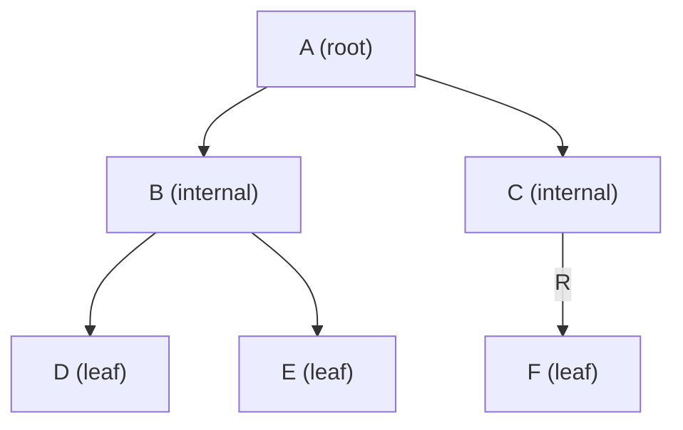

| Term | Meaning |
|------|---------|
| **Root** | Topmost node, has no parent. |
| **Parent / Child** | Direct predecessor / successor. |
| **Leaf (external)** | Node with no children. |
| **Internal node** | Node with at least one child. |
| **Edge** | Link between parent and child. |
| **Path** | Sequence of nodes connected by edges. |
| **Depth of node** | Number of edges from **root** to the node (root depth = 0). |
| **Height of node** | Number of edges on the **longest path down** to a leaf (leaf height = 0). |
| **Height of tree** | Height of the root. |
| **Level** | `depth + 1` (some texts use depth). |
| **Degree of node** | Number of children. |
| **Subtree** | A node and all its descendants. |
| **Ancestor / Descendant** | Node on the path up / down. |
| **Sibling** | Nodes sharing a parent. |

### Key numeric facts

- A tree with `n` nodes has exactly `n − 1` edges.
- A **binary tree** of height `h` has at most `2^(h+1) − 1` nodes.
- A binary tree with `n` nodes has minimum height `⌊log₂ n⌋`.
- **Full binary tree**: every node has 0 or 2 children.
- **Complete binary tree**: all levels filled except possibly the last, which is filled left→right (heaps use this).
- **Perfect binary tree**: all internal nodes have 2 children and all leaves are at the same level.
- **Balanced binary tree**: height is `O(log n)`.
- **Degenerate/skewed tree**: each parent has one child → behaves like a linked list, height `O(n)`.

**Full** (every node has 0 or 2 children):

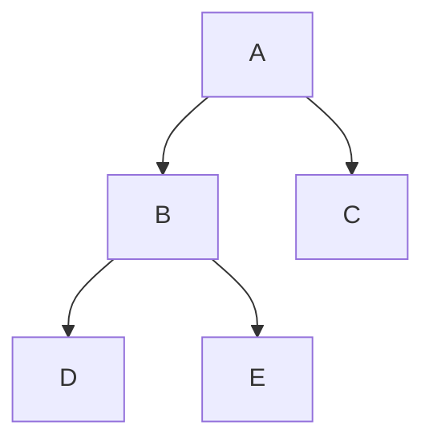

**Complete** (all levels full except the last, filled left→right):

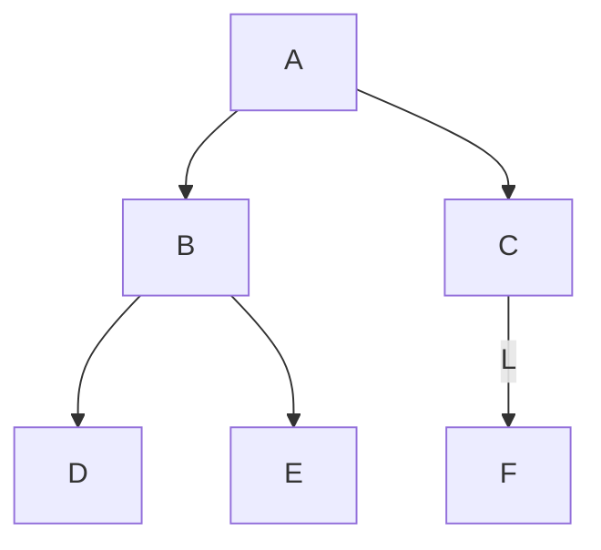

**Perfect** (all internal nodes have 2 children, all leaves on the same level):

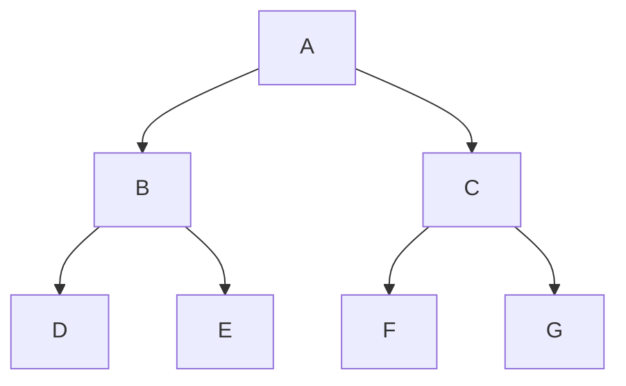

---

## (A) Binary Tree — All Operations

A **binary tree**: each node has **at most two** children (`left`, `right`). No ordering constraint (that comes with BSTs).

### Node structure

```cpp
struct Node {
    int val;
    Node* left  = nullptr;
    Node* right = nullptr;
    Node(int v) : val(v) {}
};
```

### A.1 Traversals (the heart of tree problems)

There are two families: **Depth-First (DFS)** and **Breadth-First (BFS / level order)**.

Tree used for all examples:

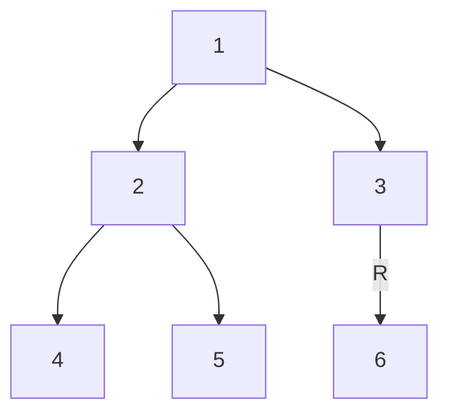

#### DFS variants — remember by WHERE you "visit" the root

| Traversal | Order | Result for tree above |
|-----------|-------|------------------------|
| **Preorder** | Root → Left → Right | `1 2 4 5 3 6` |
| **Inorder** | Left → Root → Right | `4 2 5 1 3 6` |
| **Postorder** | Left → Right → Root | `4 5 2 6 3 1` |

```cpp
void preorder(Node* r, vector<int>& out) {
    if (!r) return;
    out.push_back(r->val);      // visit
    preorder(r->left, out);
    preorder(r->right, out);
}
void inorder(Node* r, vector<int>& out) {
    if (!r) return;
    inorder(r->left, out);
    out.push_back(r->val);      // visit
    inorder(r->right, out);
}
void postorder(Node* r, vector<int>& out) {
    if (!r) return;
    postorder(r->left, out);
    postorder(r->right, out);
    out.push_back(r->val);      // visit
}
```

#### Iterative traversals (interviewers love these)

**Iterative preorder** (stack):

```cpp
vector<int> preorderIt(Node* root) {
    vector<int> out;
    if (!root) return out;
    stack<Node*> st;
    st.push(root);
    while (!st.empty()) {
        Node* n = st.top(); st.pop();
        out.push_back(n->val);
        if (n->right) st.push(n->right);  // push right first
        if (n->left)  st.push(n->left);   // so left is processed first
    }
    return out;
}
```

**Iterative inorder** (stack, go left as far as possible):

```cpp
vector<int> inorderIt(Node* root) {
    vector<int> out; stack<Node*> st;
    Node* cur = root;
    while (cur || !st.empty()) {
        while (cur) { st.push(cur); cur = cur->left; }
        cur = st.top(); st.pop();
        out.push_back(cur->val);
        cur = cur->right;
    }
    return out;
}
```

**Morris Inorder Traversal** — `O(1)` space (advanced): temporarily rewires
tree using threaded links (predecessor's right pointer), then restores it.

```cpp
vector<int> morrisInorder(Node* root) {
    vector<int> out; Node* cur = root;
    while (cur) {
        if (!cur->left) { out.push_back(cur->val); cur = cur->right; }
        else {
            Node* pred = cur->left;
            while (pred->right && pred->right != cur) pred = pred->right;
            if (!pred->right) { pred->right = cur; cur = cur->left; }   // create thread
            else { pred->right = nullptr; out.push_back(cur->val); cur = cur->right; } // remove thread
        }
    }
    return out;
}
```

#### BFS — Level Order (queue)

```
Level 0: 1
Level 1: 2 3
Level 2: 4 5 6
```

```cpp
vector<vector<int>> levelOrder(Node* root) {
    vector<vector<int>> res;
    if (!root) return res;
    queue<Node*> q; q.push(root);
    while (!q.empty()) {
        int sz = q.size();
        vector<int> level;
        for (int i = 0; i < sz; i++) {
            Node* n = q.front(); q.pop();
            level.push_back(n->val);
            if (n->left)  q.push(n->left);
            if (n->right) q.push(n->right);
        }
        res.push_back(level);
    }
    return res;
}
```

### A.2 Insertion (level-order / first empty slot)

For a plain binary tree (no ordering), a common rule is to insert at the first
free position in level order to keep it compact:

```cpp
void insertLevelOrder(Node* root, int val) {
    queue<Node*> q; q.push(root);
    while (!q.empty()) {
        Node* n = q.front(); q.pop();
        if (!n->left)  { n->left  = new Node(val); return; }
        else q.push(n->left);
        if (!n->right) { n->right = new Node(val); return; }
        else q.push(n->right);
    }
}
```

### A.3 Deletion (replace with deepest node)

To delete a node in a plain binary tree and keep it compact: replace the target's
value with the **deepest, rightmost** node's value, then delete that deepest node.

```cpp
void deleteNode(Node* root, int key) {
    if (!root) return;
    Node *target = nullptr, *deepest = nullptr;
    queue<Node*> q; q.push(root);
    while (!q.empty()) {
        deepest = q.front(); q.pop();
        if (deepest->val == key) target = deepest;
        if (deepest->left)  q.push(deepest->left);
        if (deepest->right) q.push(deepest->right);
    }
    if (!target) return;
    target->val = deepest->val;      // copy deepest value into target
    // remove the deepest node (need its parent) — omitted parent-tracking for brevity
}
```

### A.4 Core computed properties

```cpp
int height(Node* r) {                          // edges on longest downward path
    if (!r) return -1;                         // height of empty = -1, leaf = 0
    return 1 + max(height(r->left), height(r->right));
}
int countNodes(Node* r) {
    if (!r) return 0;
    return 1 + countNodes(r->left) + countNodes(r->right);
}
int countLeaves(Node* r) {
    if (!r) return 0;
    if (!r->left && !r->right) return 1;
    return countLeaves(r->left) + countLeaves(r->right);
}
int diameter(Node* r, int& best) {             // longest path (in edges) between any 2 nodes
    if (!r) return -1;
    int lh = diameter(r->left, best);
    int rh = diameter(r->right, best);
    best = max(best, lh + rh + 2);
    return 1 + max(lh, rh);
}
bool isBalanced(Node* r, int& h) {             // height-balanced check in O(n)
    if (!r) { h = -1; return true; }
    int lh, rh;
    bool lb = isBalanced(r->left, lh);
    bool rb = isBalanced(r->right, rh);
    h = 1 + max(lh, rh);
    return lb && rb && abs(lh - rh) <= 1;
}
```

### A.5 Lowest Common Ancestor (LCA) in a plain binary tree

```cpp
Node* lca(Node* r, Node* p, Node* q) {
    if (!r || r == p || r == q) return r;
    Node* L = lca(r->left, p, q);
    Node* R = lca(r->right, p, q);
    if (L && R) return r;      // p and q found on different sides → r is LCA
    return L ? L : R;
}
```

### A.6 Serialize / Deserialize (preorder with null markers)

```cpp
void serialize(Node* r, string& s) {
    if (!r) { s += "# "; return; }
    s += to_string(r->val) + " ";
    serialize(r->left, s);
    serialize(r->right, s);
}
Node* deserialize(istringstream& in) {
    string tok; in >> tok;
    if (tok == "#") return nullptr;
    Node* r = new Node(stoi(tok));
    r->left  = deserialize(in);
    r->right = deserialize(in);
    return r;
}
```

### A.7 Complexity summary (binary tree)

| Operation | Time | Space |
|-----------|------|-------|
| Traversal (any) | `O(n)` | `O(h)` recursion / `O(n)` BFS queue |
| Morris inorder | `O(n)` | `O(1)` |
| Insert (level order) | `O(n)` | `O(n)` |
| Delete | `O(n)` | `O(n)` |
| Height / count / diameter | `O(n)` | `O(h)` |
| LCA | `O(n)` | `O(h)` |

### Pitfalls

- Confusing **height** (edges) vs **depth**; be consistent (empty = −1 vs 0).
- Forgetting the `O(h)` recursion stack can blow up on skewed trees (`h = n`).
- Level-order deletion must actually unlink the deepest node's pointer from **its parent**.

---

## (B) N-ary Tree — All Operations

An **N-ary tree**: each node can have **any number** of children (0..k). Used for
file systems, DOM/XML, org charts, trie-like structures, game trees.

### Node structure

```cpp
struct NNode {
    int val;
    vector<NNode*> children;
    NNode(int v) : val(v) {}
};
```

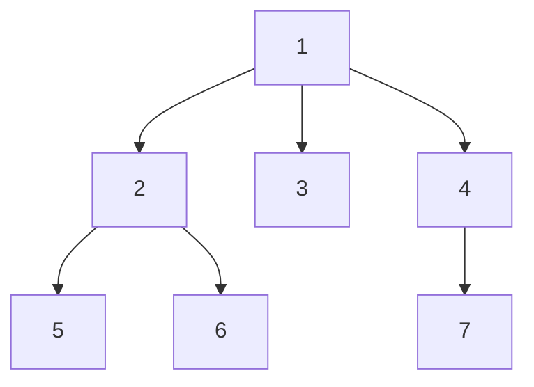

### B.1 Traversals

**Preorder** (root before children), **Postorder** (children before root).
There is **no canonical inorder** for N-ary trees (ambiguous with >2 children).

```cpp
void preorderN(NNode* r, vector<int>& out) {
    if (!r) return;
    out.push_back(r->val);
    for (NNode* c : r->children) preorderN(c, out);
}
void postorderN(NNode* r, vector<int>& out) {
    if (!r) return;
    for (NNode* c : r->children) postorderN(c, out);
    out.push_back(r->val);
}
```

Preorder above → `1 2 5 6 3 4 7`; Postorder → `5 6 2 3 7 4 1`.

**Level order (BFS):**

```cpp
vector<vector<int>> levelOrderN(NNode* root) {
    vector<vector<int>> res;
    if (!root) return res;
    queue<NNode*> q; q.push(root);
    while (!q.empty()) {
        int sz = q.size(); vector<int> lvl;
        for (int i = 0; i < sz; i++) {
            NNode* n = q.front(); q.pop();
            lvl.push_back(n->val);
            for (NNode* c : n->children) q.push(c);
        }
        res.push_back(lvl);
    }
    return res;
}
```

### B.2 Insert / Delete

```cpp
// Insert child under a parent found by value (BFS search)
void insertChild(NNode* root, int parentVal, int childVal) {
    queue<NNode*> q; q.push(root);
    while (!q.empty()) {
        NNode* n = q.front(); q.pop();
        if (n->val == parentVal) { n->children.push_back(new NNode(childVal)); return; }
        for (NNode* c : n->children) q.push(c);
    }
}
// Delete a child (and its subtree) from a parent
void deleteChild(NNode* parent, int childVal) {
    auto& ch = parent->children;
    ch.erase(remove_if(ch.begin(), ch.end(),
             [&](NNode* c){ return c->val == childVal; }), ch.end());
    // (free the subtree memory in real code)
}
```

### B.3 Height, count, diameter

```cpp
int heightN(NNode* r) {
    if (!r) return -1;
    int h = -1;
    for (NNode* c : r->children) h = max(h, heightN(c));
    return h + 1;
}
int countN(NNode* r) {
    if (!r) return 0;
    int total = 1;
    for (NNode* c : r->children) total += countN(c);
    return total;
}
// Diameter of N-ary tree: at each node combine the two tallest child heights
int diameterN(NNode* r, int& best) {
    if (!r) return 0;                    // height in nodes
    int max1 = 0, max2 = 0;
    for (NNode* c : r->children) {
        int h = diameterN(c, best);
        if (h > max1) { max2 = max1; max1 = h; }
        else if (h > max2) max2 = h;
    }
    best = max(best, max1 + max2);       // path through this node
    return max1 + 1;
}
```

### B.4 Representations (important for interviews & contests)

1. **List of children** (above): natural, flexible.
2. **Left-Child Right-Sibling (LCRS)**: convert N-ary → binary tree.
   Each node stores `firstChild` and `nextSibling`. Saves memory, lets you reuse
   binary-tree algorithms.

Original N-ary tree (node 2 has children 5, 6):

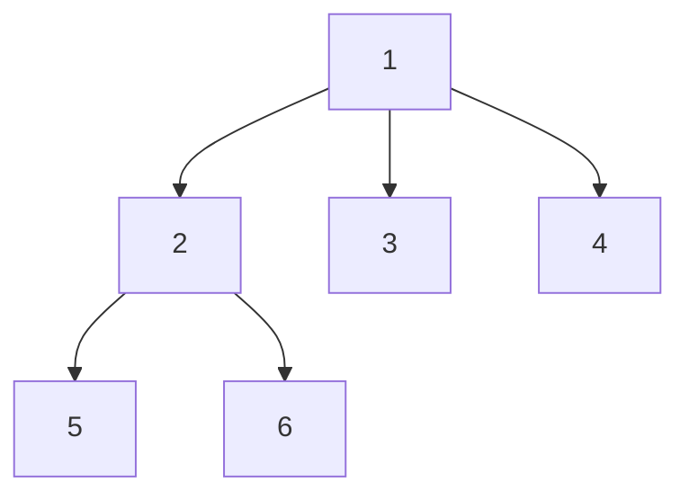

LCRS form — solid = `firstChild` (down), dashed = `nextSibling` (right):

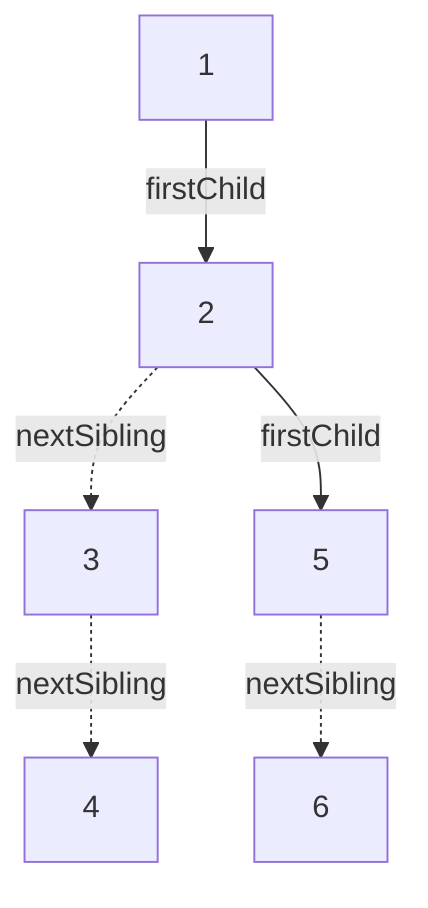

```cpp
struct LCRSNode { int val; LCRSNode* firstChild=nullptr; LCRSNode* nextSibling=nullptr; };
```

### B.5 Complexity summary (N-ary tree)

| Operation | Time | Space |
|-----------|------|-------|
| Traversal (pre/post/level) | `O(n)` | `O(h)` or `O(width)` |
| Insert child | `O(n)` to find parent, `O(1)` to attach | `O(n)` |
| Delete child subtree | `O(children)` | — |
| Height / count / diameter | `O(n)` | `O(h)` |

### Pitfalls

- No inorder traversal for N-ary trees.
- Diameter: combine the **two** largest child heights, not just one.

---

## (C) Binary Search Tree — Operations & Height Balancing

A **BST** is a binary tree with the ordering invariant:

> For every node: **all keys in the left subtree < node.key < all keys in the right subtree** (assuming unique keys).

**Consequence:** an **inorder traversal yields keys in sorted order**. This is the single most useful BST property.

Insert order `8,3,10,1,6,14,4,7,13`:

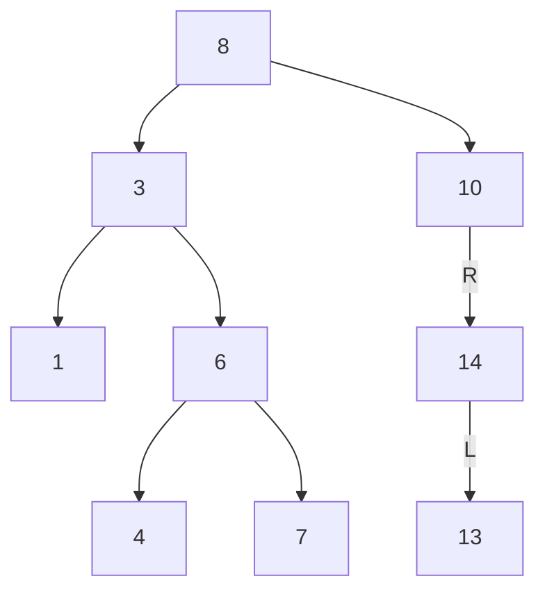

Inorder → `1 3 4 6 7 8 10 13 14`  (sorted!)

### Node

```cpp
struct BstNode { int key; BstNode* left=nullptr; BstNode* right=nullptr;
                 BstNode(int k):key(k){} };
```

### C.1 Search — `O(h)`

```cpp
BstNode* search(BstNode* r, int key) {
    while (r && r->key != key)
        r = (key < r->key) ? r->left : r->right;
    return r;   // nullptr if not found
}
```

### C.2 Insert — `O(h)`

```cpp
BstNode* insert(BstNode* r, int key) {
    if (!r) return new BstNode(key);
    if (key < r->key)      r->left  = insert(r->left, key);
    else if (key > r->key) r->right = insert(r->right, key);
    // equal → ignore (or keep count for multiset)
    return r;
}
```

### C.3 Find min / max / successor / predecessor

```cpp
BstNode* minNode(BstNode* r){ while(r&&r->left) r=r->left; return r; }
BstNode* maxNode(BstNode* r){ while(r&&r->right)r=r->right;return r; }
```

- **Inorder successor**: if node has right subtree → min of right subtree;
  otherwise → the lowest ancestor whose left subtree contains the node.
- **Inorder predecessor**: symmetric (max of left subtree, or ancestor logic).

### C.4 Deletion — the 3 cases (`O(h)`)

```
Case 1: leaf              → just remove it.
Case 2: one child         → replace node with its single child.
Case 3: two children      → replace key with inorder successor
                            (min of right subtree), then delete that successor.
```

```cpp
BstNode* deleteKey(BstNode* r, int key) {
    if (!r) return nullptr;
    if (key < r->key)      r->left  = deleteKey(r->left, key);
    else if (key > r->key) r->right = deleteKey(r->right, key);
    else {
        if (!r->left)  { BstNode* t = r->right; delete r; return t; }  // 0/1 child
        if (!r->right) { BstNode* t = r->left;  delete r; return t; }
        BstNode* succ = minNode(r->right);   // 2 children
        r->key = succ->key;
        r->right = deleteKey(r->right, succ->key);
    }
    return r;
}
```

**Delete example — remove 8 (root, two children):**

Before:


After (successor `10` promoted, `14` takes its place):

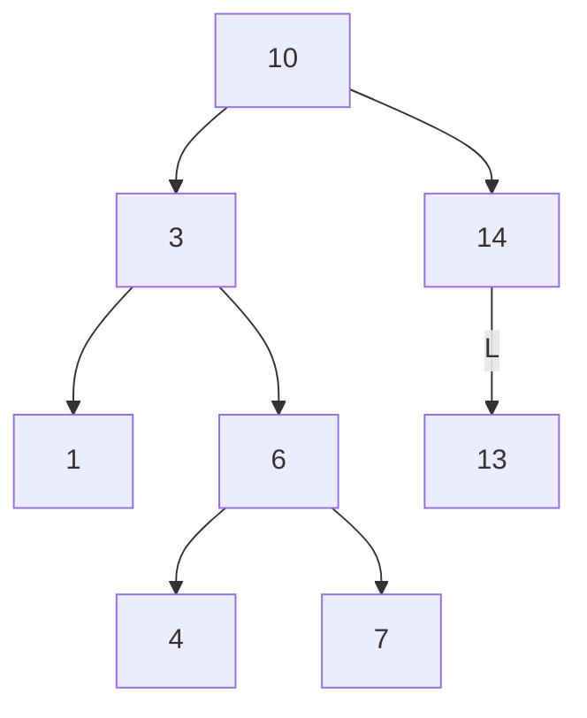

### C.5 Validate a BST

```cpp
bool isBST(BstNode* r, long lo=LONG_MIN, long hi=LONG_MAX) {
    if (!r) return true;
    if (r->key <= lo || r->key >= hi) return false;
    return isBST(r->left, lo, r->key) && isBST(r->right, r->key, hi);
}
```

> ⚠️ A common wrong approach only compares a node with its immediate children.
> You must carry down a valid **(min, max) range**.

### C.6 Order statistics (augmented BST)

Store `subtreeSize` in each node to answer:

- **k-th smallest** in `O(h)`.
- **rank of a key** (how many keys are smaller) in `O(h)`.

```cpp
struct SNode { int key, size=1; SNode *l=nullptr,*r=nullptr; };
int sz(SNode* n){ return n? n->size : 0; }
int kth(SNode* r, int k) {                 // 1-indexed
    int leftSize = sz(r->l);
    if (k == leftSize + 1) return r->key;
    if (k <= leftSize)     return kth(r->l, k);
    return kth(r->r, k - leftSize - 1);
}
```

### C.7 Height balancing — WHY it matters

The catch with a plain BST: operations are `O(h)`, and `h` can degrade to `O(n)`.

Insert sorted `1,2,3,4,5` → fully skewed (a linked list), `h = n-1`:

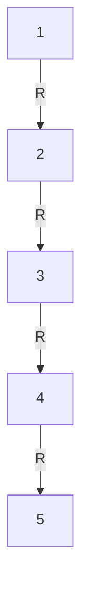

→ search/insert/delete become `O(n)`!

**Solutions:**

1. **Self-balancing trees** — maintain `h = O(log n)` automatically:
   - **AVL** (strict balance, faster lookups) → Section D.
   - **Red-Black** (looser balance, faster updates) → Section E.
   - Others: Splay, Treap, Scapegoat, B-Tree/B+Tree (disk).

2. **Rebalance a static BST — DSW algorithm (Day–Stout–Warren)** `O(n)` time, `O(1)` extra:
   - Step 1: flatten BST into a right-leaning "vine" (linked list) via right rotations.
   - Step 2: repeatedly rotate left to convert the vine into a balanced tree.

3. **Rebuild from sorted inorder array** (simplest, `O(n)`):

```cpp
BstNode* buildBalanced(vector<int>& a, int lo, int hi) {
    if (lo > hi) return nullptr;
    int mid = lo + (hi - lo) / 2;
    BstNode* root = new BstNode(a[mid]);
    root->left  = buildBalanced(a, lo, mid - 1);
    root->right = buildBalanced(a, mid + 1, hi);
    return root;
}
// usage: inorder → sorted array `a`, then buildBalanced(a, 0, a.size()-1)
```

### C.8 Complexity summary (BST)

| Operation | Balanced | Skewed (worst) |
|-----------|----------|----------------|
| Search / Insert / Delete | `O(log n)` | `O(n)` |
| Min / Max / Succ / Pred | `O(log n)` | `O(n)` |
| Inorder (sorted output) | `O(n)` | `O(n)` |
| k-th smallest (augmented) | `O(log n)` | `O(n)` |

### Pitfalls

- Duplicate handling policy (ignore / count / left-or-right) must be consistent.
- `isBST` range check, not local check.
- Deleting with two children: use successor **or** predecessor consistently.

---

## (D) AVL Tree — All Operations

An **AVL tree** (Adelson-Velsky & Landis, 1962) is a **self-balancing BST** where, for every node:

> **Balance Factor** `BF(node) = height(left) − height(right) ∈ {−1, 0, +1}`.

If any insertion/deletion makes `|BF| = 2`, we **rotate** to restore balance.
AVL keeps height `≤ 1.44 · log₂(n)`, so it's more strictly balanced than Red-Black → **faster lookups**, but slightly more rotations on updates.

### Node (store height)

```cpp
struct AvlNode {
    int key, height = 1;               // height in nodes; leaf = 1
    AvlNode *left=nullptr, *right=nullptr;
    AvlNode(int k):key(k){}
};
int h(AvlNode* n){ return n? n->height : 0; }
int bf(AvlNode* n){ return n? h(n->left) - h(n->right) : 0; }
void update(AvlNode* n){ n->height = 1 + max(h(n->left), h(n->right)); }
```

### D.1 The four rotation cases

Imbalance is always fixed with **single** or **double** rotations. Identify the case
by the balance factor of the node `z` (first unbalanced ancestor) and its heavy child.

**LL case** (left-left) → `rightRotate(z)`:

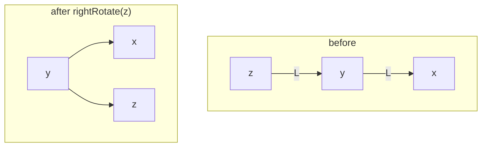

**RR case** (right-right) → `leftRotate(z)`:

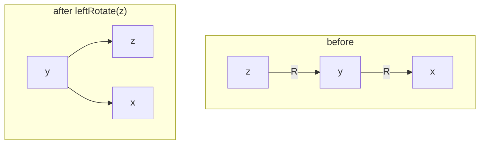

**LR case** (left-right) → `leftRotate(z.left)` then `rightRotate(z)`:


**RL case** (right-left) → `rightRotate(z.right)` then `leftRotate(z)`:


Decision rule at unbalanced node `z`:

| `bf(z)` | child balance | Case | Fix |
|--------|----------------|------|-----|
| `> 1`  | `bf(left) ≥ 0` | LL | `rightRotate(z)` |
| `> 1`  | `bf(left) < 0` | LR | `leftRotate(z.left)` then `rightRotate(z)` |
| `< -1` | `bf(right) ≤ 0`| RR | `leftRotate(z)` |
| `< -1` | `bf(right) > 0`| RL | `rightRotate(z.right)` then `leftRotate(z)` |

### D.2 Rotations

```cpp
AvlNode* rightRotate(AvlNode* z) {
    AvlNode* y = z->left;
    AvlNode* T = y->right;
    y->right = z;               // rotate
    z->left  = T;
    update(z); update(y);       // order matters: update z first (now lower)
    return y;                   // new subtree root
}
AvlNode* leftRotate(AvlNode* z) {
    AvlNode* y = z->right;
    AvlNode* T = y->left;
    y->left  = z;
    z->right = T;
    update(z); update(y);
    return y;
}
```

### D.3 Insert (`O(log n)`)

```cpp
AvlNode* insert(AvlNode* r, int key) {
    if (!r) return new AvlNode(key);
    if (key < r->key)      r->left  = insert(r->left, key);
    else if (key > r->key) r->right = insert(r->right, key);
    else return r;                          // no duplicates
    update(r);
    int b = bf(r);
    if (b > 1 && key < r->left->key)  return rightRotate(r);           // LL
    if (b < -1 && key > r->right->key) return leftRotate(r);            // RR
    if (b > 1 && key > r->left->key) {                                 // LR
        r->left = leftRotate(r->left); return rightRotate(r); }
    if (b < -1 && key < r->right->key) {                               // RL
        r->right = rightRotate(r->right); return leftRotate(r); }
    return r;
}
```

**Worked insertion — insert 10, 20, 30:**

After inserting 30, node 10 has `BF = -2` (right-right chain) → `leftRotate(10)`:

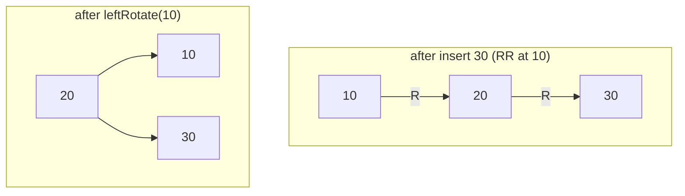

**Insert 40, 50 next:**

Inserting 40 keeps balance; inserting 50 makes node 30 have `BF = -2` (RR) → `leftRotate(30)`:

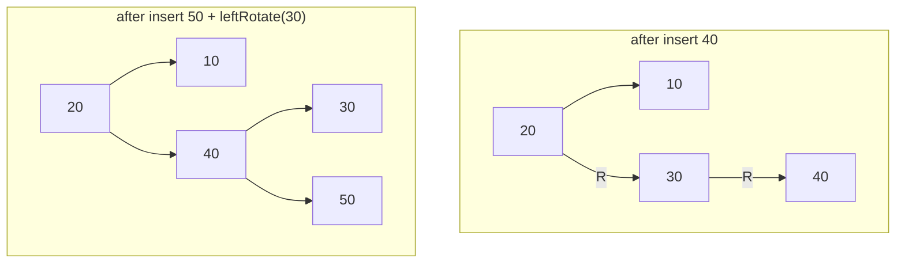

### D.4 Delete (`O(log n)`)

Do a standard BST delete, then walk back up updating heights and rebalancing.
Unlike insert, a single delete may require **multiple rotations** up the path.

```cpp
AvlNode* deleteKey(AvlNode* r, int key) {
    if (!r) return nullptr;
    if (key < r->key)      r->left  = deleteKey(r->left, key);
    else if (key > r->key) r->right = deleteKey(r->right, key);
    else {
        if (!r->left || !r->right) {           // 0 or 1 child
            AvlNode* child = r->left ? r->left : r->right;
            delete r;
            return child;                      // may be nullptr
        }
        AvlNode* succ = r->right;              // 2 children: inorder successor
        while (succ->left) succ = succ->left;
        r->key = succ->key;
        r->right = deleteKey(r->right, succ->key);
    }
    update(r);
    int b = bf(r);
    if (b > 1  && bf(r->left)  >= 0) return rightRotate(r);            // LL
    if (b > 1  && bf(r->left)  <  0) { r->left = leftRotate(r->left); return rightRotate(r);}  // LR
    if (b < -1 && bf(r->right) <= 0) return leftRotate(r);            // RR
    if (b < -1 && bf(r->right) >  0) { r->right = rightRotate(r->right); return leftRotate(r);}// RL
    return r;
}
```

### D.5 AVL vs Red-Black (when to choose which)

| | AVL | Red-Black |
|--|-----|-----------|
| Balance | Strict (`|BF| ≤ 1`) | Loose (`height ≤ 2·log₂(n+1)`) |
| Height | `≤ 1.44 log n` | `≤ 2 log n` |
| Lookups | **Faster** (shorter tree) | Slightly slower |
| Insert/Delete rotations | More | **Fewer** (≤ 2 rotations + recoloring) |
| Best for | Read-heavy workloads | Write-heavy workloads (`std::map`, Linux CFS, Java `TreeMap`) |

### D.6 Complexity summary (AVL)

| Operation | Time | Space |
|-----------|------|-------|
| Search / Insert / Delete | `O(log n)` guaranteed | `O(log n)` recursion |
| Min / Max / Succ / Pred | `O(log n)` | — |
| Rotation | `O(1)` | — |

### Pitfalls

- **Update heights before checking balance**, and update the **lower** node first in a rotation.
- Delete may trigger rotations at multiple ancestors — don't stop after the first.
- Use `bf(child)` (not the inserted key) to pick the case during **deletion** (there's no "inserted key").

---

## (E) Red-Black Tree — All Operations

A **Red-Black (RB) tree** is a self-balancing BST that guarantees `O(log n)` by
enforcing **5 color invariants** rather than strict height balance. It's what
backs `std::map`/`std::set` (C++), `TreeMap`/`TreeSet` (Java), and the Linux kernel.

### The 5 Red-Black Properties

1. Every node is **RED** or **BLACK**.
2. The **root is BLACK**.
3. Every **leaf (NIL/null sentinel) is BLACK**.
4. **No red node has a red child** (no two reds in a row → "red-red violation").
5. Every root-to-NIL path has the **same number of BLACK nodes** (this count is the node's **black-height**, `bh`).

> These together force the longest path ≤ 2× the shortest path ⇒ `height ≤ 2·log₂(n+1)`.

Example valid RB tree (dark = BLACK, red = RED; every root-to-leaf path has the same black count):

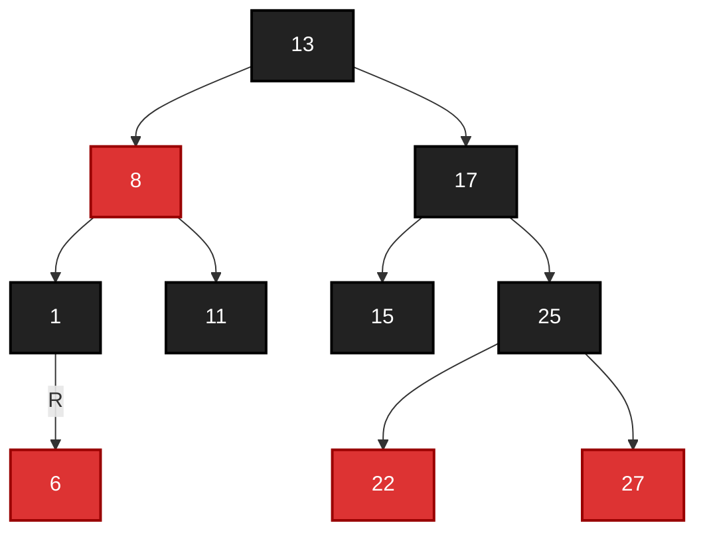

### Node

```cpp
enum Color { RED, BLACK };
struct RBNode {
    int key;
    Color color = RED;                 // new nodes start RED
    RBNode *left, *right, *parent;
};
RBNode* NIL;                            // shared black sentinel
```

> Using a single `NIL` sentinel (instead of `nullptr`) makes the algorithms cleaner:
> every "leaf" and the root's parent point to `NIL`, which is always BLACK.

### E.1 Rotations (same as BST rotations, but maintain `parent`)

```cpp
void leftRotate(RBNode*& root, RBNode* x) {
    RBNode* y = x->right;
    x->right = y->left;
    if (y->left != NIL) y->left->parent = x;
    y->parent = x->parent;
    if (x->parent == NIL) root = y;
    else if (x == x->parent->left) x->parent->left = y;
    else x->parent->right = y;
    y->left = x;
    x->parent = y;
}
// rightRotate is the mirror image (swap left <-> right)
```

### E.2 Insertion

**Idea:** BST-insert the node colored **RED** (to preserve property 5), then fix
any red-red violation (property 4) by **recoloring + rotations**, walking upward.

**Insert-fixup cases** (let `z` = new red node, `u` = uncle):

**Case 1 — Uncle is RED:** recolor parent & uncle BLACK, grandparent RED, then move `z` up to grandparent and repeat.

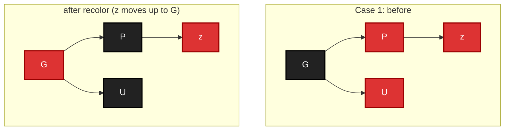

**Case 2 — Uncle BLACK, `z` is inner grandchild (triangle):** rotate parent to convert into Case 3.

```mermaid
graph TD
    subgraph c2b["Case 2 (triangle): before"]
        G1["G"] --> P1["P"]
        P1 -->|R| z1["z"]
    end
    subgraph c2a["after leftRotate(P) → Case 3"]
        G2["G"] --> z2["z"]
        z2 -->|L| P2["P"]
    end
    classDef black fill:#222,color:#fff,stroke:#000,stroke-width:2px;
    classDef red fill:#d33,color:#fff,stroke:#900,stroke-width:2px;
    class G1,G2 black
    class P1,z1,z2,P2 red
```

**Case 3 — Uncle BLACK, `z` is outer grandchild (line):** recolor parent BLACK + grandparent RED, then rotate grandparent.

```mermaid
graph TD
    subgraph c3b["Case 3 (line): before"]
        G1["G"] --> P1["P"]
        P1 --> z1["z"]
    end
    subgraph c3a["after recolor + rightRotate(G)"]
        P2["P"] --> z2["z"]
        P2 --> G2["G"]
    end
    classDef black fill:#222,color:#fff,stroke:#000,stroke-width:2px;
    classDef red fill:#d33,color:#fff,stroke:#900,stroke-width:2px;
    class G1,P2 black
    class P1,z1,z2,G2 red
```

```cpp
void insertFixup(RBNode*& root, RBNode* z) {
    while (z->parent->color == RED) {
        RBNode* gp = z->parent->parent;
        if (z->parent == gp->left) {
            RBNode* u = gp->right;               // uncle
            if (u->color == RED) {               // Case 1
                z->parent->color = BLACK; u->color = BLACK;
                gp->color = RED; z = gp;
            } else {
                if (z == z->parent->right) {     // Case 2 (triangle)
                    z = z->parent; leftRotate(root, z);
                }
                z->parent->color = BLACK;        // Case 3 (line)
                gp->color = RED;
                rightRotate(root, gp);
            }
        } else {                                 // mirror (parent is right child)
            RBNode* u = gp->left;
            if (u->color == RED) {
                z->parent->color = BLACK; u->color = BLACK;
                gp->color = RED; z = gp;
            } else {
                if (z == z->parent->left) { z = z->parent; rightRotate(root, z); }
                z->parent->color = BLACK;
                gp->color = RED;
                leftRotate(root, gp);
            }
        }
    }
    root->color = BLACK;                          // Property 2
}
```

**Worked insertion — insert 10, 20, 30 into empty RB tree:**

Insert 10 (root, forced BLACK), then 20 (RED right child, no violation):

```mermaid
graph TD
    10 -->|R| 20
    classDef black fill:#222,color:#fff,stroke:#000,stroke-width:2px;
    classDef red fill:#d33,color:#fff,stroke:#900,stroke-width:2px;
    class 10 black
    class 20 red
```

Insert 30 (RED): parent 20 is red, uncle is NIL (black), `z` is an outer grandchild (line) → **Case 3**: recolor + `leftRotate(10)`:

```mermaid
graph TD
    20 --> 10
    20 --> 30
    classDef black fill:#222,color:#fff,stroke:#000,stroke-width:2px;
    classDef red fill:#d33,color:#fff,stroke:#900,stroke-width:2px;
    class 20 black
    class 10,30 red
```

### E.3 Deletion

RB deletion is the trickiest classic operation. High-level:

1. BST-delete as usual. Track the node `y` actually removed/moved and its
   **original color**, plus `x` = the node that takes `y`'s place.
2. If the removed color was **BLACK**, we've broken property 5 → `x` carries an
   extra "**doubly-black**" token. Fix with `deleteFixup`.

**Delete-fixup cases** (`x` doubly-black, `w` = sibling):

```
CASE 1 — sibling w is RED:
   recolor w BLACK, parent RED, rotate parent toward x.
   (converts to case 2/3/4 with a black sibling)

CASE 2 — w BLACK, both of w's children BLACK:
   recolor w RED, move the extra-black up to parent (x = parent), repeat.

CASE 3 — w BLACK, w's near child RED, far child BLACK:
   recolor + rotate w to turn it into Case 4.

CASE 4 — w BLACK, w's far child RED:
   recolor and rotate parent — this REMOVES the doubly-black. Done.
```

```cpp
void deleteFixup(RBNode*& root, RBNode* x) {
    while (x != root && x->color == BLACK) {
        if (x == x->parent->left) {
            RBNode* w = x->parent->right;
            if (w->color == RED) {                       // Case 1
                w->color = BLACK; x->parent->color = RED;
                leftRotate(root, x->parent); w = x->parent->right;
            }
            if (w->left->color == BLACK && w->right->color == BLACK) { // Case 2
                w->color = RED; x = x->parent;
            } else {
                if (w->right->color == BLACK) {          // Case 3
                    w->left->color = BLACK; w->color = RED;
                    rightRotate(root, w); w = x->parent->right;
                }
                w->color = x->parent->color;             // Case 4
                x->parent->color = BLACK; w->right->color = BLACK;
                leftRotate(root, x->parent); x = root;
            }
        } else {
            // mirror image: swap left <-> right, leftRotate <-> rightRotate
            RBNode* w = x->parent->left;
            if (w->color == RED) {
                w->color = BLACK; x->parent->color = RED;
                rightRotate(root, x->parent); w = x->parent->left;
            }
            if (w->right->color == BLACK && w->left->color == BLACK) {
                w->color = RED; x = x->parent;
            } else {
                if (w->left->color == BLACK) {
                    w->right->color = BLACK; w->color = RED;
                    leftRotate(root, w); w = x->parent->left;
                }
                w->color = x->parent->color;
                x->parent->color = BLACK; w->left->color = BLACK;
                rightRotate(root, x->parent); x = root;
            }
        }
    }
    x->color = BLACK;
}
```

### E.4 Search / Min / Max / Successor

Identical to a normal BST — RB coloring doesn't affect ordering; only insert/delete maintain balance.

### E.5 Complexity summary (Red-Black)

| Operation | Time | Notes |
|-----------|------|-------|
| Search / Insert / Delete | `O(log n)` guaranteed | height ≤ `2 log₂(n+1)` |
| Rotations per insert | ≤ 2 | plus `O(log n)` recolorings |
| Rotations per delete | ≤ 3 | plus `O(log n)` recolorings |
| Space | `O(n)` | one color bit per node |

### Pitfalls

- Always finish by forcing the root **BLACK**.
- Use a shared **NIL sentinel** so `w->left->color` etc. never dereference null.
- Deletion's "doubly-black" bookkeeping is the #1 source of bugs — track `y`'s
  **original** color and `x` carefully.

### Where RB trees are used in the real world

- C++ STL `std::map`, `std::set`, `std::multimap`, `std::multiset`.
- Java `TreeMap`, `TreeSet`.
- Linux kernel: Completely Fair Scheduler (CFS), virtual memory areas, epoll, etc.

---

## (F) Max Heap & Min Heap — All Operations

A **binary heap** is a **complete binary tree** stored in an **array**, satisfying the **heap property**:

- **Max Heap**: every parent `≥` its children ⇒ **max at root**.
- **Min Heap**: every parent `≤` its children ⇒ **min at root**.

Because it's complete, we store it in an array with no pointers.

### Array index math (0-indexed)

```
For node at index i:
    parent(i)      = (i - 1) / 2
    leftChild(i)   = 2*i + 1
    rightChild(i)  = 2*i + 2
```

Max Heap example — array `[100, 19, 36, 17, 3, 25, 1, 2, 7]` (index shown after the colon):

```mermaid
graph TD
    A["100 : 0"] --> B["19 : 1"]
    A --> C["36 : 2"]
    B --> D["17 : 3"]
    B --> E["3 : 4"]
    C --> F["25 : 5"]
    C --> G["1 : 6"]
    D --> H["2 : 7"]
    D --> I["7 : 8"]
```

> ⚠️ A heap is **weakly ordered**: siblings/cousins have no order. It is NOT a BST.
> Inorder traversal of a heap is meaningless.

### F.1 The two core primitives: sift-up & sift-down

```cpp
// MAX-HEAP over vector<int> a
void siftUp(vector<int>& a, int i) {          // used after insert
    while (i > 0 && a[(i-1)/2] < a[i]) {
        swap(a[i], a[(i-1)/2]);
        i = (i-1)/2;
    }
}
void siftDown(vector<int>& a, int n, int i) { // used after extract / heapify
    while (true) {
        int l = 2*i+1, r = 2*i+2, largest = i;
        if (l < n && a[l] > a[largest]) largest = l;
        if (r < n && a[r] > a[largest]) largest = r;
        if (largest == i) break;
        swap(a[i], a[largest]);
        i = largest;
    }
}
```

(For a **min heap**, flip every comparison: `>` → `<`.)

### F.2 Insert — `O(log n)`

Append to the end (keeps completeness), then **sift up**.

```cpp
void push(vector<int>& a, int val) {
    a.push_back(val);
    siftUp(a, a.size() - 1);
}
```

```
Insert 50 into max-heap [40,30,20,10]:
append → [40,30,20,10,50]
50 > parent 30 → swap → [40,50,20,10,30]
50 > parent 40 → swap → [50,40,20,10,30]   done
```

### F.3 Peek — `O(1)`

```cpp
int top(vector<int>& a){ return a[0]; }        // max (or min) is always root
```

### F.4 Extract root (delete max/min) — `O(log n)`

Swap root with last element, pop last, then **sift down** the new root.

```cpp
int pop(vector<int>& a) {
    int root = a[0];
    a[0] = a.back(); a.pop_back();
    if (!a.empty()) siftDown(a, a.size(), 0);
    return root;
}
```

```
Extract-max from [50,40,20,10,30]:
save 50; move last 30 to root → [30,40,20,10]
siftDown: 30 < child 40 → swap → [40,30,20,10]  done, return 50
```

### F.5 Build heap (heapify) — `O(n)` (not `O(n log n)`!)

Sift-down from the last internal node up to the root.

```cpp
void buildHeap(vector<int>& a) {
    int n = a.size();
    for (int i = n/2 - 1; i >= 0; i--)
        siftDown(a, n, i);
}
```

> **Why `O(n)`?** Nodes near the bottom (most numerous) sift down few levels.
> Summing `Σ (nodes at height h) · h = O(n)`. Inserting one-by-one would be `O(n log n)`.

### F.6 Change key / delete arbitrary index — `O(log n)`

```cpp
void changeKey(vector<int>& a, int i, int newVal) {  // max-heap
    int old = a[i]; a[i] = newVal;
    if (newVal > old) siftUp(a, i);
    else              siftDown(a, a.size(), i);
}
void eraseAt(vector<int>& a, int i) {
    a[i] = a.back(); a.pop_back();
    if (i < (int)a.size()) { siftDown(a, a.size(), i); siftUp(a, i); }
}
```

### F.7 Heap Sort — `O(n log n)`, in-place, not stable

Build a max-heap, then repeatedly swap root to the end and sift down the reduced heap.

```cpp
void heapSort(vector<int>& a) {
    int n = a.size();
    buildHeap(a);                        // O(n)
    for (int end = n - 1; end > 0; end--) {
        swap(a[0], a[end]);              // largest to its final place
        siftDown(a, end, 0);             // restore heap on a[0..end-1]
    }
}   // result: ascending order
```

### F.8 d-ary heaps (advanced)

Generalize to `d` children per node: `child_k(i) = d*i + k`. Shallower tree ⇒
faster `decrease-key` (fewer levels) but slower `extract` (more children to compare).
Used to tune Dijkstra/Prim. `parent(i) = (i-1)/d`.

### F.9 Complexity summary (binary heap)

| Operation | Time |
|-----------|------|
| Peek (top) | `O(1)` |
| Insert (push) | `O(log n)` |
| Extract root (pop) | `O(log n)` |
| Build heap (heapify) | `O(n)` |
| Change / delete key | `O(log n)` |
| Search arbitrary | `O(n)` |
| Heap sort | `O(n log n)` |

### Pitfalls

- Heap is complete ⇒ always insert at the end, delete via swap-with-last.
- `O(n)` heapify only if you sift **down** from `n/2−1`; building by repeated insert is `O(n log n)`.
- Heap is not sorted and not searchable in `O(log n)`.

---

## (G) Priority Queue — All Operations

A **Priority Queue (PQ)** is an **abstract data type (ADT)**: a collection where
each element has a priority and you always remove the **highest** (or lowest)
priority element next. A binary heap is the most common **implementation**.

> Queue = FIFO. Priority Queue = "highest priority first", regardless of insertion order.

### Interface

| Operation | Meaning | Heap-based cost |
|-----------|---------|-----------------|
| `push(x, p)` / `insert` | add element with priority | `O(log n)` |
| `top()` / `peek()` | view highest-priority element | `O(1)` |
| `pop()` / `extract` | remove highest-priority element | `O(log n)` |
| `size()` / `empty()` | count | `O(1)` |
| `decreaseKey` / `changePriority` | update a priority | `O(log n)`* |
| `merge` / `meld` | combine two PQs | varies by structure |

\* requires a handle/index map to find the element.

### Implementation choices

| Backing structure | insert | extract-max | decrease-key | merge | notes |
|-------------------|--------|-------------|--------------|-------|-------|
| Unsorted array/list | `O(1)` | `O(n)` | `O(1)` | `O(1)` | lazy |
| Sorted array/list | `O(n)` | `O(1)` | `O(n)` | `O(n)` | eager |
| **Binary heap** | `O(log n)` | `O(log n)` | `O(log n)` | `O(n)` | the default |
| Binomial heap | `O(log n)` | `O(log n)` | `O(log n)` | `O(log n)` | fast merge |
| **Fibonacci heap** | `O(1)`* | `O(log n)`* | `O(1)`* | `O(1)`* | *amortized; great for Dijkstra/Prim theory |
| Pairing heap | `O(1)` | `O(log n)`* | `O(log n)`* | `O(1)` | simple, fast in practice |

### G.1 C++ `std::priority_queue` (max-heap by default)

```cpp
#include <queue>
priority_queue<int> maxpq;                 // largest on top
maxpq.push(5); maxpq.push(1); maxpq.push(9);
maxpq.top();   // 9
maxpq.pop();

// MIN-heap:
priority_queue<int, vector<int>, greater<int>> minpq;

// Custom comparator (e.g., by second field ascending):
struct Cmp { bool operator()(const pair<int,int>& a, const pair<int,int>& b){
    return a.second > b.second;   // note: "return true" means a has LOWER priority
}};
priority_queue<pair<int,int>, vector<pair<int,int>>, Cmp> pq;
```

> ⚠️ STL comparator semantics are inverted vs intuition: the comparator defines a
> "less-than"; the element for which everything else is "greater" ends up on top.
> `less<>` (default) → **max-heap**; `greater<>` → **min-heap**.

### G.2 Java / Python quick reference

```java
// Java: min-heap by default
PriorityQueue<Integer> pq = new PriorityQueue<>();               // min
PriorityQueue<Integer> mx = new PriorityQueue<>(Collections.reverseOrder()); // max
```

```python
import heapq                 # Python heapq is a MIN-heap
h = []
heapq.heappush(h, 3); heapq.heappush(h, 1)
heapq.heappop(h)             # 1
# max-heap trick: push negated values, or use heapq._heapify_max
```

### G.3 Classic uses of a Priority Queue

- **Dijkstra** shortest path & **Prim** MST (min-PQ keyed by distance/weight).
- **Huffman coding** (repeatedly extract two smallest frequencies).
- **A\*** search (min-PQ keyed by `f = g + h`).
- **k-th largest / k closest points** (size-`k` heap).
- **Merge k sorted lists** (min-PQ of list heads).
- **Median of a stream** (two heaps: max-heap for low half, min-heap for high half).
- **Task scheduling / event simulation** (next event by time).
- **Top-K frequent elements**.

### G.4 Pattern: two-heap running median

```cpp
priority_queue<int> lo;                                   // max-heap: lower half
priority_queue<int, vector<int>, greater<int>> hi;        // min-heap: upper half
void add(int x){
    if (lo.empty() || x <= lo.top()) lo.push(x); else hi.push(x);
    if (lo.size() > hi.size()+1){ hi.push(lo.top()); lo.pop(); }   // rebalance
    else if (hi.size() > lo.size()){ lo.push(hi.top()); hi.pop(); }
}
double median(){ return lo.size()>hi.size() ? lo.top() : (lo.top()+hi.top())/2.0; }
```

### G.5 Pattern: Dijkstra with a min-PQ

```cpp
priority_queue<pair<int,int>, vector<pair<int,int>>, greater<>> pq; // (dist, node)
dist[src] = 0; pq.push({0, src});
while (!pq.empty()) {
    auto [d, u] = pq.top(); pq.pop();
    if (d > dist[u]) continue;                 // stale entry, skip (lazy deletion)
    for (auto [v, w] : adj[u])
        if (dist[u] + w < dist[v]) {
            dist[v] = dist[u] + w;
            pq.push({dist[v], v});
        }
}
```

### Pitfalls

- STL comparator direction is the #1 gotcha (max vs min).
- Binary-heap PQ has no efficient `decreaseKey` unless you store handles; the
  common workaround is **lazy deletion** (push new entry, skip stale ones — see Dijkstra).
- Python `heapq` is min-only; negate for a max-heap.

---

## Extended Operations & Advanced Concepts

> This section covers additional operations and advanced techniques that build on
> A–G. Organized by the same letters, followed by cross-cutting engineering notes.

### (A+) Binary Tree — extra operations

#### A.8 Iterative postorder (two-stack — easiest to remember)

```cpp
vector<int> postorderIt(Node* root) {
    vector<int> out; if (!root) return out;
    stack<Node*> s1, s2;
    s1.push(root);
    while (!s1.empty()) {
        Node* n = s1.top(); s1.pop();
        s2.push(n);
        if (n->left)  s1.push(n->left);   // reverse of preorder(root,right,left)
        if (n->right) s1.push(n->right);
    }
    while (!s2.empty()) { out.push_back(s2.top()->val); s2.pop(); }
    return out;
}
```

#### A.9 Construct a tree from two traversals

`preorder` gives the **root first**; `inorder` splits **left/right** around it.
(Values assumed unique — with duplicates, reconstruction is ambiguous.)

```cpp
unordered_map<int,int> pos;   // inorder value -> index
int preIdx = 0;
Node* build(vector<int>& preorder, int lo, int hi) {
    if (lo > hi) return nullptr;
    int rootVal = preorder[preIdx++];
    Node* root = new Node(rootVal);
    int mid = pos[rootVal];
    root->left  = build(preorder, lo, mid - 1);
    root->right = build(preorder, mid + 1, hi);
    return root;
}
// prep: for(i) pos[inorder[i]]=i;  then build(preorder,0,n-1)
```

> `inorder + postorder` works the same way (consume postorder from the **end**,
> build right subtree before left). `preorder + postorder` only works for **full** trees.

#### A.10 Structural checks & transforms

```cpp
Node* invert(Node* r) {                 // mirror the tree
    if (!r) return nullptr;
    swap(r->left, r->right);
    invert(r->left); invert(r->right);
    return r;
}
bool sameTree(Node* a, Node* b) {
    if (!a || !b) return a == b;
    return a->val == b->val && sameTree(a->left,b->left) && sameTree(a->right,b->right);
}
bool mirror(Node* a, Node* b) {
    if (!a || !b) return a == b;
    return a->val == b->val && mirror(a->left,b->right) && mirror(a->right,b->left);
}
bool isSymmetric(Node* r) { return !r || mirror(r->left, r->right); }

bool isComplete(Node* root) {           // BFS: no node may appear after a gap
    if (!root) return true;
    queue<Node*> q; q.push(root); bool seenGap = false;
    while (!q.empty()) {
        Node* n = q.front(); q.pop();
        if (!n) seenGap = true;
        else {
            if (seenGap) return false;
            q.push(n->left); q.push(n->right);
        }
    }
    return true;
}
```

#### A.11 Views

```cpp
vector<int> rightView(Node* root) {     // last node of each BFS level
    vector<int> out; if (!root) return out;
    queue<Node*> q; q.push(root);
    while (!q.empty()) {
        int sz = q.size();
        for (int i = 0; i < sz; i++) {
            Node* n = q.front(); q.pop();
            if (i == sz-1) out.push_back(n->val);
            if (n->left)  q.push(n->left);
            if (n->right) q.push(n->right);
        }
    }
    return out;
}
```

**Vertical order**: assign each node a column — `root = 0`, left child `col-1`,
right child `col+1`; BFS and bucket values by column (use a `map<int,vector<int>>`).
Left view / top view / bottom view are the same BFS with a different pick rule.

#### A.12 Zigzag (spiral) level order

```cpp
vector<vector<int>> zigzag(Node* root) {
    vector<vector<int>> res; if (!root) return res;
    deque<Node*> q{root}; bool ltr = true;
    while (!q.empty()) {
        int sz = q.size(); vector<int> level(sz);
        for (int i = 0; i < sz; i++) {
            Node* n = q.front(); q.pop_front();
            level[ltr ? i : sz-1-i] = n->val;   // fill from correct end
            if (n->left)  q.push_back(n->left);
            if (n->right) q.push_back(n->right);
        }
        res.push_back(level); ltr = !ltr;
    }
    return res;
}
```

#### A.13 Flatten to a "linked list" (preorder, in place)

```cpp
Node* prevNode = nullptr;               // reverse-preorder trick
void flatten(Node* root) {
    if (!root) return;
    flatten(root->right);
    flatten(root->left);
    root->right = prevNode;             // rewire to preorder successor
    root->left  = nullptr;
    prevNode = root;
}
```

#### A.14 Path problems

```cpp
bool hasPathSum(Node* r, int target) {          // any root-to-leaf == target?
    if (!r) return false;
    if (!r->left && !r->right) return target == r->val;
    return hasPathSum(r->left, target - r->val) || hasPathSum(r->right, target - r->val);
}
int maxPathSum(Node* r, int& best) {            // max path between ANY two nodes
    if (!r) return 0;
    int l = max(0, maxPathSum(r->left,  best)); // clamp negatives to 0
    int rr = max(0, maxPathSum(r->right, best));
    best = max(best, r->val + l + rr);          // path bends through r
    return r->val + max(l, rr);                 // straight path continuing up
}
```

#### A.15 Nodes at distance K / "burn the tree"

Build a `child → parent` map (one DFS/BFS), then BFS outward from the target in
all three directions (left, right, parent) marking visited nodes. The number of
BFS layers to reach every node = time to "burn" the whole tree from the target.

```cpp
void mapParents(Node* r, Node* par, unordered_map<Node*,Node*>& up) {
    if (!r) return;
    up[r] = par;
    mapParents(r->left, r, up); mapParents(r->right, r, up);
}
// then BFS from target using neighbors {left, right, up[node]}, counting levels
```

#### A.16 Euler tour + Binary-lifting LCA (fast repeated LCA)

For **many** LCA queries, preprocessing beats the `O(n)`-per-query method.

- **Euler tour / `tin`,`tout` timestamps**: a DFS records entry/exit times. Node `u`
  is an ancestor of `v` iff `tin[u] ≤ tin[v]` and `tout[v] ≤ tout[u]`. This also
  turns "subtree of `u`" into the contiguous index range `[tin[u], tout[u]]`, so a
  Fenwick/segment tree over Euler order answers subtree sum/update in `O(log n)`.
- **Binary lifting**: precompute `up[k][v]` = the `2^k`-th ancestor of `v`.

```cpp
int LOG; vector<vector<int>> up; vector<int> depth;
void dfs(int u, int p, vector<vector<int>>& adj) {
    up[0][u] = p;
    for (int k = 1; k < LOG; k++)
        up[k][u] = up[k-1][u] == -1 ? -1 : up[k-1][ up[k-1][u] ];
    for (int v : adj[u]) if (v != p) { depth[v] = depth[u]+1; dfs(v, u, adj); }
}
int lca(int a, int b) {
    if (depth[a] < depth[b]) swap(a, b);
    int d = depth[a] - depth[b];
    for (int k = 0; k < LOG; k++) if (d & (1<<k)) a = up[k][a];
    if (a == b) return a;
    for (int k = LOG-1; k >= 0; k--)
        if (up[k][a] != up[k][b]) { a = up[k][a]; b = up[k][b]; }
    return up[0][a];
}
```

Build `O(n log n)`, query `O(log n)`.

#### A.17 Special binary-tree types

- **Threaded binary tree**: null child pointers are reused to point to the inorder
  predecessor/successor, enabling `O(1)`-space traversal without recursion (Morris
  is the transient version of this idea).
- **Expression tree**: internal nodes are operators, leaves are operands.
  Inorder → infix, postorder → postfix (RPN), preorder → prefix; a postorder
  DFS evaluates it.

---

### (B+) N-ary Tree — extra operations

#### B.6 Serialize / Deserialize (value + child-count)

Store each node as `value` followed by its `number of children`; recursion depth
handles the structure — no null markers needed.

```cpp
void serialize(NNode* r, vector<string>& out) {
    if (!r) return;
    out.push_back(to_string(r->val));
    out.push_back(to_string(r->children.size()));
    for (NNode* c : r->children) serialize(c, out);
}
NNode* deserialize(queue<string>& q) {
    if (q.empty()) return nullptr;
    int val = stoi(q.front()); q.pop();
    int cnt = stoi(q.front()); q.pop();
    NNode* r = new NNode(val);
    for (int i = 0; i < cnt; i++) r->children.push_back(deserialize(q));
    return r;
}
```

#### B.7 Encode N-ary ↔ Binary (Left-Child Right-Sibling)

```cpp
Node* encode(NNode* root) {              // N-ary -> binary
    if (!root) return nullptr;
    Node* b = new Node(root->val);
    if (root->children.empty()) return b;
    b->left = encode(root->children[0]); // first child -> left
    Node* cur = b->left;
    for (int i = 1; i < (int)root->children.size(); i++) {
        cur->right = encode(root->children[i]);  // next sibling -> right
        cur = cur->right;
    }
    return b;
}
```

Decoding reverses it: `left` = first child, follow the `right` chain for siblings.

#### B.8 Advanced N-ary techniques

| Technique | Idea | Cost |
|-----------|------|------|
| **Tree DP** | postorder combine children results | `O(n)` |
| **Rerooting DP** | compute answer for root, then transfer down to make every node the root | `O(n)` |
| **Euler tour + Fenwick** | subtree = contiguous range → point-update/subtree-query | `O(log n)` |
| **Binary lifting LCA** | `2^k` ancestors | build `O(n log n)`, query `O(log n)` |
| **Heavy-Light Decomposition** | split into heavy chains for path queries | `O(log² n)` per query |

---

### (C+) BST — extra operations

#### C.9 Floor / Ceil

```cpp
int floorBST(BstNode* r, int key) {      // greatest key <= key
    int ans = INT_MIN;
    while (r) {
        if (r->key == key) return key;
        if (r->key < key) { ans = r->key; r = r->right; }
        else r = r->left;
    }
    return ans;                          // INT_MIN if none
}
int ceilBST(BstNode* r, int key) {       // smallest key >= key
    int ans = INT_MAX;
    while (r) {
        if (r->key == key) return key;
        if (r->key > key) { ans = r->key; r = r->left; }
        else r = r->right;
    }
    return ans;
}
```

#### C.10 Predecessor / Successor (without parent pointers)

```cpp
int successor(BstNode* r, int key) {     // smallest key > key
    int ans = INT_MAX;
    while (r) {
        if (r->key > key) { ans = r->key; r = r->left; }
        else r = r->right;
    }
    return ans;
}
int predecessor(BstNode* r, int key) {   // largest key < key
    int ans = INT_MIN;
    while (r) {
        if (r->key < key) { ans = r->key; r = r->right; }
        else r = r->left;
    }
    return ans;
}
```

#### C.11 Rank & range query (augmented `size`)

```cpp
int rank(SNode* r, int key) {            // # keys strictly < key
    if (!r) return 0;
    if (key <= r->key) return rank(r->l, key);
    return sz(r->l) + 1 + rank(r->r, key);
}
void rangeQuery(BstNode* r, int lo, int hi, vector<int>& out) {  // keys in [lo,hi]
    if (!r) return;
    if (r->key > lo) rangeQuery(r->left, lo, hi, out);
    if (lo <= r->key && r->key <= hi) out.push_back(r->key);
    if (r->key < hi) rangeQuery(r->right, lo, hi, out);
}   // O(h + output)
```

#### C.12 Split & Join (ordered-set surgery)

- **`split(root, k)`** → two trees: keys `< k` and keys `≥ k`.
- **`join(L, R)`** → one tree, assuming every key in `L` < every key in `R`.

These are the building blocks of **treaps / balanced BSTs** for `O(log n)` insert,
erase, k-th, and range operations, and underpin ropes and persistent ordered sets.
On a plain BST they don't preserve balance; on a **treap** (BST by key + heap by
random priority) both run in expected `O(log n)` and are trivial to implement — a
common competitive-programming substitute for hand-rolled AVL/RB trees.

---

### (E+) Red-Black Tree — full deletion scaffolding

RB deletion needs a `transplant` helper (replace subtree `u` with subtree `v`) and
tracks the **original color** of the spliced node to decide whether fixup is needed.

```text
RB-TRANSPLANT(T, u, v):
    if u.parent == NIL:       T.root = v
    else if u == u.parent.left:  u.parent.left  = v
    else:                        u.parent.right = v
    v.parent = u.parent

RB-DELETE(T, z):
    y = z;  yOrig = y.color
    if z.left == NIL:
        x = z.right;  RB-TRANSPLANT(T, z, z.right)
    else if z.right == NIL:
        x = z.left;   RB-TRANSPLANT(T, z, z.left)
    else:
        y = TREE-MINIMUM(z.right);  yOrig = y.color;  x = y.right
        if y.parent == z:  x.parent = y
        else:
            RB-TRANSPLANT(T, y, y.right);  y.right = z.right;  y.right.parent = y
        RB-TRANSPLANT(T, z, y);  y.left = z.left;  y.left.parent = y;  y.color = z.color
    if yOrig == BLACK:  RB-DELETE-FIXUP(T, x)   // (fixup cases already in §E.3)
```

> Key insight: if the physically removed node `y` was **red**, no property breaks.
> If it was **black**, `x` inherits an extra "black" that `RB-DELETE-FIXUP` resolves.

---

### (F+) Heap — extra operations

#### F.10 Increase / decrease key & merge

- **Max-heap**: increase-key → `siftUp`; decrease-key → `siftDown` (min-heap is the mirror).
- **Merge two binary heaps**: concatenate both arrays and `buildHeap` once → `O(n+m)`
  (beats re-inserting element by element). For fast repeated melds use a
  **binomial**, **pairing**, or **Fibonacci** heap (`O(log n)` / `O(1)` meld).

#### F.11 Indexed (addressable) heap

A plain heap can't find an arbitrary element to update it. An **indexed heap**
keeps a `pos` map (`id → heap index`) updated on every swap, giving `O(log n)`
`changePriority(id, p)` and `delete(id)`, and `O(1)` `contains(id)`.

```cpp
struct IndexedHeap {                     // min-heap of (priority) keyed by id
    vector<int> heap;                    // heap[i] = id
    vector<int> priority;                // priority[id]
    vector<int> pos;                     // pos[id] = index in heap, -1 if absent
    void swapNodes(int i, int j) {
        swap(heap[i], heap[j]);
        pos[heap[i]] = i; pos[heap[j]] = j;
    }
    // siftUp/siftDown compare priority[heap[i]] and call swapNodes(...)
    // changePriority(id, p): priority[id]=p; siftUp(pos[id]); siftDown(pos[id]);
};
```

Used in **Dijkstra/Prim with real decrease-key**, schedulers, and event simulation.

#### F.12 Lazy deletion (the simpler alternative)

When you can't address elements, don't delete eagerly — mark them and skip stale
tops. This is what most contest Dijkstra code does.

```cpp
void popValid(priority_queue<int>& pq, unordered_map<int,int>& removed) {
    while (!pq.empty()) {
        int x = pq.top();
        auto it = removed.find(x);
        if (it == removed.end() || it->second == 0) break;   // valid top
        pq.pop();
        if (--it->second == 0) removed.erase(it);
    }
}
```

---

### (G+) Priority Queue — extra operations

#### G.6 Stable priority queue (deterministic ties)

A heap is **not stable**: equal-priority items may come out in any order. Add a
monotonically increasing **sequence number** as a tie-breaker to get FIFO-on-ties.

```cpp
struct Item { int val, prio; long long seq; };
struct Cmp {
    bool operator()(const Item& a, const Item& b) const {
        if (a.prio != b.prio) return a.prio > b.prio;   // smaller prio first (min-PQ)
        return a.seq > b.seq;                           // earlier insertion first on tie
    }
};
priority_queue<Item, vector<Item>, Cmp> pq;             // increment a global seq on push
```

#### G.7 Bucket queue / Dial's algorithm

When priorities are **small bounded integers** `[0, C]`, skip the heap entirely:
keep an array of buckets `bucket[p]` and scan for the next non-empty bucket.
Insert/extract become `O(1)` amortized → **Dial's algorithm** solves Dijkstra in
`O(V·C + E)`, beating `O(E log V)` for small edge weights. A **radix/multi-level
bucket** heap extends this to larger weight ranges.

#### G.8 Comparator pitfalls

- **Never** sort/compare with `a - b` for ints — it **overflows**. Use an explicit
  `a < b` (C++) or `Integer.compare(a, b)` (Java).
- A comparator must define a **strict weak ordering** (irreflexive, transitive).
  A broken comparator causes undefined behavior / runtime crashes in STL.
- Don't mutate a field that affects ordering while an item sits in the queue —
  remove & reinsert, or use lazy deletion.

---

### Cross-cutting engineering notes

#### Memory & cache behavior

- **Pointer trees** (BST/AVL/RB): flexible, ordered navigation, but poor cache
  locality and per-node allocation overhead.
- **Array heaps**: compact, excellent cache locality, simple index math — but weak
  at arbitrary search/delete. On disk, **B-trees / B+-trees** win because their high
  fan-out minimizes page fetches. In practice cache locality can outweigh Big-O.

#### Recursion / stack-overflow risk

Recursive DFS on a **skewed** tree recurses `O(n)` deep and can overflow the stack.
Mitigate with iterative traversal (explicit stack), Morris (`O(1)` space), or by
keeping the tree balanced. (C++ has no guaranteed tail-call optimization.)

#### Duplicate-handling policy

| Structure | Recommended duplicate strategy |
|-----------|-------------------------------|
| Binary / N-ary tree | store freely; use node identity/ids if it matters |
| BST / AVL / RB | store a **count** per node, or use a composite key `(value, uniqueId)` |
| Heap / Priority Queue | duplicates are natural; add a tie-breaker only if you need stability |

#### Common mistakes (quick audit)

- Assuming inorder is sorted for a **non-BST** binary tree.
- Validating a BST by comparing only with immediate children (must carry a range).
- Recomputing height inside diameter/balance checks → `O(n²)` instead of `O(n)`.
- AVL: updating height before children are fixed; using the inserted-key rule during
  **deletion** (use child balance factors instead).
- RB: forgetting to force the root black; mixing up near/far nephew in delete fixup;
  rotating without updating `parent`.
- Heap: assuming the array is sorted; forgetting the stale-entry check in Dijkstra.

#### Advanced structures — where to go next

| Structure | Why it matters |
|-----------|----------------|
| **Treap / Randomized BST** | easy `split`/`join`, expected `O(log n)`; contest-friendly balanced BST |
| **Splay tree** | self-adjusting, great for access locality / caches |
| **B-tree / B+-tree** | database & filesystem indexes (disk-optimized, high fan-out) |
| **Segment tree / Fenwick (BIT)** | range queries + updates; pairs with Euler tour on trees |
| **Persistent trees** | keep every historical version (functional / version-control-like) |
| **Heavy-Light Decomposition** | path queries on trees in `O(log² n)` |
| **Link-Cut tree / Euler-Tour tree** | fully dynamic forests (add/remove edges) |
| **Fibonacci / pairing heap** | `O(1)` amortized decrease-key → theoretical Dijkstra/Prim speedups |
| **d-ary heap** | tune branching factor for decrease-key vs extract trade-off |

---

## Master-Level Topics

> The gap between "advanced" and "master" is these implementations and techniques.
> Each entry lists the crux idea + complexity; the most practical ones include code.

### M1. Balanced BST implementations you can actually code

#### Treap (tree + heap) — the pragmatic balanced BST

A **treap** is a BST by `key` **and** a max-heap by a random `priority`. Random
priorities make the expected height `O(log n)`. Its superpower is `split`/`merge`,
which make insert/erase/k-th/range-reverse trivial. This is the go-to hand-rolled
balanced BST in competitive programming.

```cpp
struct T { int key, pr, sz = 1; T *l = nullptr, *r = nullptr;
           T(int k): key(k), pr(rand()) {} };
int gsz(T* t){ return t ? t->sz : 0; }
void upd(T* t){ if (t) t->sz = 1 + gsz(t->l) + gsz(t->r); }

// split by key: L gets keys < key, R gets keys >= key
void split(T* t, int key, T*& L, T*& R) {
    if (!t) { L = R = nullptr; return; }
    if (t->key < key) { split(t->r, key, t->r, R); L = t; }
    else              { split(t->l, key, L, t->l); R = t; }
    upd(t);
}
// merge assumes every key in A < every key in B
T* merge(T* A, T* B) {
    if (!A || !B) return A ? A : B;
    if (A->pr > B->pr) { A->r = merge(A->r, B); upd(A); return A; }
    else               { B->l = merge(A, B->l); upd(B); return B; }
}
T* insert(T* t, int key) { T *L,*R; split(t,key,L,R); return merge(merge(L,new T(key)),R); }
T* erase (T* t, int key) {
    T *L,*M,*R; split(t,key,L,R); split(R,key+1,M,R);
    if (M) { T* one = merge(M->l, M->r); delete M; M = one; }  // drop one copy
    return merge(merge(L,M),R);
}
```

> **Implicit treap** (key = position, not value) supports `O(log n)` sequence
> insert/erase-at-index and **range reverse/rotate** — how rope/text-editor buffers work.

#### The rest of the balanced-BST family

| Structure | Idea | Balance | Notes |
|-----------|------|---------|-------|
| **Splay tree** | on every access, rotate the node to the root ("splay") | amortized | `O(log n)` **amortized**, superb for access locality / LRU-like patterns; no stored metadata |
| **Scapegoat tree** | rebuild the subtree of the first "too unbalanced" ancestor | amortized | `O(log n)` amortized; no per-node color/height, only a global α |
| **Weight-balanced (BB[α])** | balance by **subtree sizes**, not heights | worst-case | supports order statistics naturally |
| **Cartesian tree** | BST by index + heap by value | — | built in `O(n)`; the static form of a treap; RMQ ↔ LCA duality |
| **B-tree / B+-tree** | each node holds many keys; high fan-out | worst-case | **disk/DB indexes**; node ≈ one disk page; B+-tree keeps data in leaves + linked list for range scans |

**B-tree of order `m`**: every node has ≤ `m` children and ≥ `⌈m/2⌉` (except root);
all leaves at the same depth. Insert splits full nodes; delete merges/borrows.
Height ≈ `log_m n`, so a few page reads reach any key — that's why databases and
filesystems (NTFS, ext4, PostgreSQL, MySQL) use B+-trees, not RB trees.

### M2. Prefix & string trees (a whole missing family)

| Structure | Purpose | Cost |
|-----------|---------|------|
| **Trie (prefix tree)** | store strings by shared prefixes; prefix search, autocomplete | `O(L)` per op |
| **Compressed trie / Radix / PATRICIA** | collapse single-child chains | space-efficient trie |
| **Ternary search tree** | trie with BST-ordered children | memory-friendly trie |
| **Suffix tree / suffix automaton** | all substrings of a text | `O(n)` build, powerful string queries |
| **Aho–Corasick** | trie + failure links = multi-pattern search | `O(text + matches)` |

```cpp
struct Trie {
    Trie* next[26] = {};
    bool end = false;
    void insert(const string& s) {
        Trie* cur = this;
        for (char c : s) { int i = c-'a'; if (!cur->next[i]) cur->next[i] = new Trie(); cur = cur->next[i]; }
        cur->end = true;
    }
    bool search(const string& s) {
        Trie* cur = this;
        for (char c : s) { int i = c-'a'; if (!cur->next[i]) return false; cur = cur->next[i]; }
        return cur->end;
    }
};
```

### M3. Range-query trees (the competitive-programming workhorses)

#### Fenwick / Binary Indexed Tree (BIT) — prefix sums with updates

```cpp
struct BIT {
    vector<long long> t;
    BIT(int n): t(n+1, 0) {}
    void add(int i, long long v){ for (; i < (int)t.size(); i += i & -i) t[i] += v; }
    long long sum(int i){ long long s = 0; for (; i > 0; i -= i & -i) s += t[i]; return s; }
    long long range(int l, int r){ return sum(r) - sum(l-1); }   // 1-indexed
};
```

`O(log n)` point-update + prefix-query, tiny constant, 4 lines of logic. A 2D BIT
handles grid updates; a BIT over Euler-tour order handles **subtree** updates.

#### Segment tree + lazy propagation — range update **and** range query

```cpp
struct SegTree {                    // range-add, range-sum
    int n; vector<long long> sum, lazy;
    SegTree(int n): n(n), sum(4*n, 0), lazy(4*n, 0) {}
    void apply(int nd, int len, long long v){ sum[nd] += v*len; lazy[nd] += v; }
    void push(int nd, int len){
        if (lazy[nd]) { int h = len/2;
            apply(2*nd, h, lazy[nd]); apply(2*nd+1, len-h, lazy[nd]); lazy[nd] = 0; }
    }
    void update(int nd, int lo, int hi, int i, int j, long long v){
        if (j < lo || hi < i) return;
        if (i <= lo && hi <= j) { apply(nd, hi-lo+1, v); return; }
        int m = (lo+hi)/2; push(nd, hi-lo+1);
        update(2*nd, lo, m, i, j, v); update(2*nd+1, m+1, hi, i, j, v);
        sum[nd] = sum[2*nd] + sum[2*nd+1];
    }
    long long query(int nd, int lo, int hi, int i, int j){
        if (j < lo || hi < i) return 0;
        if (i <= lo && hi <= j) return sum[nd];
        int m = (lo+hi)/2; push(nd, hi-lo+1);
        return query(2*nd, lo, m, i, j) + query(2*nd+1, m+1, hi, i, j);
    }
};
```

| Variant | What it adds |
|---------|-------------|
| **Merge-sort tree** | each node stores a sorted list → "count ≤ x in range" |
| **Persistent segment tree** | version per update → k-th in range, offline queries |
| **Li Chao tree** | insert lines / query min at x (CHT alternative) |
| **Segment tree beats** | range `min=/max=` chmin/chmax updates |
| **Wavelet tree** | k-th smallest / rank in a range on values |
| **Sqrt decomposition / Mo's algorithm** | offline range queries when no clean segtree exists |

### M4. Advanced & specialized heaps

| Heap | Superpower | Notes |
|------|-----------|-------|
| **Binomial heap** | `O(log n)` **meld** | forest of binomial trees |
| **Fibonacci heap** | `O(1)` amortized insert & **decrease-key** | best theoretical Dijkstra/Prim; big constants |
| **Pairing heap** | fast, simple meld & decrease-key | best *practical* mergeable heap |
| **Leftist / Skew heap** | `O(log n)` meld via merging right spines | easiest mergeable heaps to code |
| **Min-Max heap (interval heap)** | `O(1)` **both** min and max | double-ended PQ; levels alternate min/max |
| **Radix / bucket heap** | `O(1)`-ish for bounded int keys | Dial's algorithm for Dijkstra |
| **Soft heap** | `O(1)` ops by allowing bounded "corruption" | used in linear-time MST theory |

```cpp
// Leftist heap merge — the crux of all mergeable heaps
struct LNode { int val, rank = 0; LNode *l = nullptr, *r = nullptr; };
int rnk(LNode* t){ return t ? t->rank : 0; }
LNode* meld(LNode* a, LNode* b) {           // min-heap
    if (!a || !b) return a ? a : b;
    if (a->val > b->val) swap(a, b);        // a is the smaller root
    a->r = meld(a->r, b);
    if (rnk(a->l) < rnk(a->r)) swap(a->l, a->r);   // leftist property
    a->rank = rnk(a->r) + 1;
    return a;
}   // push = meld with single node; pop = meld(left, right) of root
```

> A **double-ended priority queue** (min *and* max in one structure) is achievable
> with a min-max heap, an interval heap, or simply **two heaps + lazy deletion**.

### M5. Tree-algorithm toolkit (graph-on-trees mastery)

| Technique | Solves | Cost |
|-----------|--------|------|
| **Euler tour + sparse table (±1 RMQ)** | LCA with `O(1)` query | `O(n log n)` / `O(n)` build |
| **Binary lifting** (in §A.16) | LCA, k-th ancestor, path aggregates | `O(log n)` query |
| **Heavy-Light Decomposition (HLD)** | path update/query on trees | `O(log² n)` |
| **Centroid decomposition** | path-counting / distance queries | `O(n log n)` |
| **Small-to-large (DSU on tree)** | subtree frequency queries offline | `O(n log n)` |
| **Rerooting DP** (in §B.8) | answer for every node as root | `O(n)` |
| **Virtual / auxiliary tree** | run tree DP on a subset of `k` nodes | `O(k log k)` |
| **Mo's algorithm on trees** | offline path queries via Euler flatten | `O((n+q)√n)` |
| **Tree hashing / AHU** | subtree isomorphism / canonical form | `O(n)` |
| **Link-Cut tree / Euler-Tour tree** | fully dynamic forests (link/cut edges) | `O(log n)` amortized |

**Centroid decomposition** (skeleton): repeatedly find the **centroid** (removing it
leaves all parts ≤ n/2), solve cross-centroid paths, recurse on each part. The
decomposition has depth `O(log n)`, so each node appears in `O(log n)` layers.

```cpp
// find subtree sizes, then the centroid of a component
int subtreeSize(int u, int p, vector<vector<int>>& g, vector<bool>& removed, vector<int>& sz){
    sz[u] = 1;
    for (int v : g[u]) if (v != p && !removed[v]) sz[u] += subtreeSize(v, u, g, removed, sz);
    return sz[u];
}
int centroid(int u, int p, int compSize, vector<vector<int>>& g, vector<bool>& removed, vector<int>& sz){
    for (int v : g[u]) if (v != p && !removed[v] && sz[v] > compSize/2)
        return centroid(v, u, compSize, g, removed, sz);
    return u;   // no child holds more than half → u is the centroid
}
```

**Small-to-large / DSU on tree**: to answer subtree queries offline, keep the
**largest child's** data and merge the smaller children into it. Each element is
merged `O(log n)` times → `O(n log n)` total.

### M6. Persistence & amortized analysis (the theory that ties it together)

- **Persistent (functional) trees** — instead of mutating, **copy the path** from
  the root to the change (`O(log n)` new nodes) and return a new root. Every past
  version stays queryable. Powers persistent segment trees, version control, and
  "time-travel" queries.
- **Amortized analysis (potential method)** — why splay trees, Fibonacci heaps, and
  the DSW/scapegoat rebuilds are `O(log n)` *per operation on average* even though a
  single operation can be `O(n)`. Define a potential Φ; amortized cost = actual +
  ΔΦ. Master this to reason about why "occasionally expensive" structures are fast.

### M7. Integer-key structures (beating the comparison bound)

For keys in a bounded universe `[0, U)`, comparison-based `O(log n)` isn't the limit:

| Structure | Bound | Use |
|-----------|-------|-----|
| **van Emde Boas tree** | `O(log log U)` per op | successor/predecessor on integers |
| **y-fast trie** | `O(log log U)` expected, linear space | practical vEB alternative |
| **Radix heap** | `O(log U)` amortized | monotone priority queues (Dijkstra) |

### Mastery checklist

You've mastered this area when you can, from scratch and without reference:

- [ ] Implement a **treap** with `split`/`merge` and use it for order statistics + range ops.
- [ ] Explain and code **RB-insert and RB-delete** (all 4 delete cases) correctly.
- [ ] Prove heap **build is `O(n)`** and derive AVL's `1.44 log n` height bound.
- [ ] Implement **Fenwick** and a **lazy segment tree**, and know when each wins.
- [ ] Code a **trie** and extend it to Aho–Corasick or XOR-basis problems.
- [ ] Do **LCA** three ways (binary lifting, Euler+RMQ, offline Tarjan).
- [ ] Apply **HLD**, **centroid decomposition**, and **small-to-large** to path/subtree problems.
- [ ] Meld heaps (**leftist/pairing**) and build a **double-ended PQ**.
- [ ] Reason about a structure's cost with the **potential method**.
- [ ] Pick the right structure under real constraints (cache, disk, integer keys, persistence).

---

## Cheat Sheet — Complexity of Everything

| Structure | Search | Insert | Delete | Min/Max | Ordered? | Guarantees |
|-----------|--------|--------|--------|---------|----------|------------|
| Binary Tree (plain) | `O(n)` | `O(n)`* | `O(n)` | `O(n)` | No | none |
| N-ary Tree | `O(n)` | `O(n)`* | `O(n)` | `O(n)` | No | none |
| BST (average) | `O(log n)` | `O(log n)` | `O(log n)` | `O(log n)` | Yes | none (worst `O(n)`) |
| BST (worst/skewed) | `O(n)` | `O(n)` | `O(n)` | `O(n)` | Yes | — |
| AVL Tree | `O(log n)` | `O(log n)` | `O(log n)` | `O(log n)` | Yes | strict balance |
| Red-Black Tree | `O(log n)` | `O(log n)` | `O(log n)` | `O(log n)` | Yes | `h ≤ 2 log n` |
| Binary Heap | `O(n)` | `O(log n)` | `O(log n)` | `O(1)` | Weak | complete tree |
| Priority Queue (heap) | `O(n)` | `O(log n)` | `O(log n)` | `O(1)` | Weak | ADT |

\* `O(1)` if position/parent is already known.

**Rules of thumb**

- Need **sorted order + fast dynamic search** → self-balancing BST (AVL / RB).
- Read-heavy → **AVL**; write-heavy → **Red-Black**.
- Only need repeated **min/max** → **Heap / Priority Queue**.
- Ordered iteration & range queries → BST family (or B-Tree on disk).

---

## Practice Problems

Grouped by topic and roughly ordered easy → hard. Links point to the problem pages.

### (A) Binary Trees & Traversals

- LeetCode 144 — Binary Tree Preorder Traversal — <https://leetcode.com/problems/binary-tree-preorder-traversal/>
- LeetCode 94 — Binary Tree Inorder Traversal — <https://leetcode.com/problems/binary-tree-inorder-traversal/>
- LeetCode 102 — Binary Tree Level Order Traversal — <https://leetcode.com/problems/binary-tree-level-order-traversal/>
- LeetCode 104 — Maximum Depth of Binary Tree — <https://leetcode.com/problems/maximum-depth-of-binary-tree/>
- LeetCode 543 — Diameter of Binary Tree — <https://leetcode.com/problems/diameter-of-binary-tree/>
- LeetCode 236 — Lowest Common Ancestor of a Binary Tree — <https://leetcode.com/problems/lowest-common-ancestor-of-a-binary-tree/>
- LeetCode 297 — Serialize and Deserialize Binary Tree — <https://leetcode.com/problems/serialize-and-deserialize-binary-tree/>
- LeetCode 124 — Binary Tree Maximum Path Sum — <https://leetcode.com/problems/binary-tree-maximum-path-sum/>
- SPOJ — PT07Z "Longest path in a tree" (tree diameter) — <https://www.spoj.com/problems/PT07Z/>
- Codeforces 1092F — Tree with Maximum Cost (rerooting) — <https://codeforces.com/problemset/problem/1092/F>
- AtCoder DP Contest V — Subtree (rerooting DP) — <https://atcoder.jp/contests/dp/tasks/dp_v>

### (B) N-ary Trees

- LeetCode 589 — N-ary Tree Preorder Traversal — <https://leetcode.com/problems/n-ary-tree-preorder-traversal/>
- LeetCode 590 — N-ary Tree Postorder Traversal — <https://leetcode.com/problems/n-ary-tree-postorder-traversal/>
- LeetCode 429 — N-ary Tree Level Order Traversal — <https://leetcode.com/problems/n-ary-tree-level-order-traversal/>
- LeetCode 559 — Maximum Depth of N-ary Tree — <https://leetcode.com/problems/maximum-depth-of-n-ary-tree/>
- LeetCode 428 — Serialize and Deserialize N-ary Tree — <https://leetcode.com/problems/serialize-and-deserialize-n-ary-tree/>
- Codeforces 580C — Kefa and Park (tree DFS with constraints) — <https://codeforces.com/problemset/problem/580/C>
- SPOJ — ONP / tree building from expression — <https://www.spoj.com/problems/ONP/>

### (C) Binary Search Trees

- LeetCode 700 — Search in a BST — <https://leetcode.com/problems/search-in-a-binary-search-tree/>
- LeetCode 701 — Insert into a BST — <https://leetcode.com/problems/insert-into-a-binary-search-tree/>
- LeetCode 450 — Delete Node in a BST — <https://leetcode.com/problems/delete-node-in-a-bst/>
- LeetCode 98 — Validate Binary Search Tree — <https://leetcode.com/problems/validate-binary-search-tree/>
- LeetCode 230 — Kth Smallest Element in a BST — <https://leetcode.com/problems/kth-smallest-element-in-a-bst/>
- LeetCode 235 — LCA of a BST — <https://leetcode.com/problems/lowest-common-ancestor-of-a-binary-search-tree/>
- LeetCode 108 — Convert Sorted Array to BST (balancing) — <https://leetcode.com/problems/convert-sorted-array-to-binary-search-tree/>
- LeetCode 1382 — Balance a BST (DSW-style) — <https://leetcode.com/problems/balance-a-binary-search-tree/>
- LeetCode 99 — Recover Binary Search Tree — <https://leetcode.com/problems/recover-binary-search-tree/>
- SPOJ — GCPC11J "Time to live" / BST practice — <https://www.spoj.com/problems/>

### (D) AVL / Balanced BST & Order Statistics

- Codeforces — EDU "Balanced Binary Search Trees" section — <https://codeforces.com/edu/courses>
- SPOJ — ORDERSET "Order statistic set" (balanced BST / policy tree) — <https://www.spoj.com/problems/ORDERSET/>
- SPOJ — MATCHING / QMAX (via balanced BST / BIT) — <https://www.spoj.com/problems/>
- LeetCode 315 — Count of Smaller Numbers After Self (order statistics) — <https://leetcode.com/problems/count-of-smaller-numbers-after-self/>
- LeetCode 327 — Count of Range Sum — <https://leetcode.com/problems/count-of-range-sum/>
- Codeforces 459D — Pashmak and Parmida's problem (order statistics) — <https://codeforces.com/problemset/problem/459/D>
- AtCoder ABC 217 D — Cutting Woods (ordered set) — <https://atcoder.jp/contests/abc217/tasks/abc217_d>

> Tip: In C++ contests, an AVL is usually replaced by GNU PBDS `tree` (order-statistics tree):
> `#include <ext/pb_ds/assoc_container.hpp>` — `tree<...,tree_order_statistics_node_update>`.

### (E) Red-Black Tree / std::set / TreeMap

- LeetCode 220 — Contains Duplicate III (ordered set / window) — <https://leetcode.com/problems/contains-duplicate-iii/>
- LeetCode 855 — Exam Room (ordered set) — <https://leetcode.com/problems/exam-room/>
- LeetCode 729 — My Calendar I (balanced BST / std::map) — <https://leetcode.com/problems/my-calendar-i/>
- LeetCode 731 — My Calendar II — <https://leetcode.com/problems/my-calendar-ii/>
- Codeforces 4C — Registration System (map) — <https://codeforces.com/problemset/problem/4/C>
- Codeforces 702F — T-Shirts (advanced balanced-BST / treap) — <https://codeforces.com/problemset/problem/702/F>
- AtCoder ABC 170 E — Smart Infants (multiset) — <https://atcoder.jp/contests/abc170/tasks/abc170_e>

> RB trees back `std::set/std::map` (C++) and `TreeSet/TreeMap` (Java); most
> "ordered set" problems are solved with these directly.

### (F) Heaps / Heap Sort

- LeetCode 215 — Kth Largest Element in an Array — <https://leetcode.com/problems/kth-largest-element-in-an-array/>
- LeetCode 703 — Kth Largest Element in a Stream — <https://leetcode.com/problems/kth-largest-element-in-a-stream/>
- LeetCode 1046 — Last Stone Weight — <https://leetcode.com/problems/last-stone-weight/>
- LeetCode 973 — K Closest Points to Origin — <https://leetcode.com/problems/k-closest-points-to-origin/>
- SPOJ — HEAP / EKO (binary search) & NHAY practice — <https://www.spoj.com/problems/>
- CodeChef — RRPARTY / any "heap" tagged practice — <https://www.codechef.com/practice>
- AtCoder ABC 137 D — Prizes (greedy + heap) — <https://atcoder.jp/contests/abc137/tasks/abc137_d>

### (G) Priority Queue applications

- LeetCode 23 — Merge k Sorted Lists — <https://leetcode.com/problems/merge-k-sorted-lists/>
- LeetCode 295 — Find Median from Data Stream (two heaps) — <https://leetcode.com/problems/find-median-from-data-stream/>
- LeetCode 347 — Top K Frequent Elements — <https://leetcode.com/problems/top-k-frequent-elements/>
- LeetCode 621 — Task Scheduler — <https://leetcode.com/problems/task-scheduler/>
- LeetCode 502 — IPO (two heaps / greedy) — <https://leetcode.com/problems/ipo/>
- LeetCode 1631 — Path With Minimum Effort (Dijkstra-style PQ) — <https://leetcode.com/problems/path-with-minimum-effort/>
- SPOJ — DIJKSTRA / SHPATH "Shortest Path" — <https://www.spoj.com/problems/SHPATH/>
- Codeforces 20C — Dijkstra? (shortest path with PQ) — <https://codeforces.com/problemset/problem/20/C>
- AtCoder — Practice / "Grid" Dijkstra problems — <https://atcoder.jp/contests/practice2>
- CodeChef — FIBEASY / any "priority-queue" practice tag — <https://www.codechef.com/practice>

### Structured learning tracks

- CSES Problem Set — Tree Algorithms (11 problems) — <https://cses.fi/problemset/list/>
- LeetCode — "Binary Tree" & "Heap (Priority Queue)" study plans — <https://leetcode.com/studyplan/>
- Codeforces EDU — DSU / Segment Tree / Balanced BST courses — <https://codeforces.com/edu/courses>
- AtCoder Educational DP Contest (tree DP) — <https://atcoder.jp/contests/dp>

---

## How to practice (suggested order)

1. Master **traversals** (recursive + iterative + BFS) — everything builds on these.
2. Do **BST** insert/delete/validate by hand, then code them.
3. Implement **AVL** rotations from scratch once — you'll never fear rotations again.
4. Read one full **Red-Black** insert+delete walkthrough (CLRS Ch. 13) and trace it.
5. Implement a **binary heap** and **heap sort** from scratch; then switch to `std::priority_queue`.
6. Grind the **PQ patterns**: k-th largest, merge-k, two-heap median, Dijkstra.

> Reference: CLRS (Cormen et al.) Chapters 10, 12, 13, 6; Sedgewick *Algorithms*; cp-algorithms.com.

```
