# Walmart IN4 DSA — Java 21 Last-Minute Notes

Compact interview revision notes with **Java 21 snippets** and **Mermaid mental models**.

---

## Contents

- [1. House Robber II](#q1)
- [2. Rotated Array Search](#q2)
- [3. Merge Intervals](#q3)
- [4. Copy Random List](#q4)
- [5. Word Search](#q5)
- [6. Course Schedule](#q6)
- [7. Subarray Sum K](#q7)
- [8. Character Replacement](#q8)
- [9. Coin Change](#q9)
- [10. Median from Stream](#q10)
- [11. Target Sum](#q11)
- [12. Combination Sum II](#q12)
- [13. Find Celebrity](#q13)
- [14. LFU Cache](#q14)
- [15. LRU Cache](#q15)
- [16. K-th Stair](#q16)
- [17. Zigzag Traversal](#q17)
- [18. Level Order](#q18)
- [19. Binary Tree Game](#q19)
- [20. Word Wrap](#q20)
- [Core Patterns](#patterns)

---

<a id="q1"></a>

## 1. House Robber II

**Pattern:** DP

**Idea:** Circle ⇒ solve two linear cases: exclude first, or exclude last.

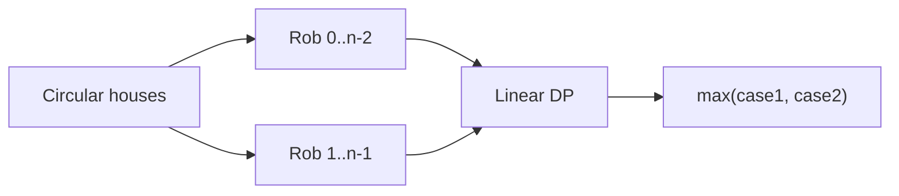

```java
int rob(int[] nums) {
    int n = nums.length;
    if (n == 1) return nums[0];

    return Math.max(
        robLinear(nums, 0, n - 2),
        robLinear(nums, 1, n - 1)
    );
}

int robLinear(int[] a, int l, int r) {
    int prev2 = 0, prev1 = 0;

    for (int i = l; i <= r; i++) {
        int cur = Math.max(prev1, prev2 + a[i]);
        prev2 = prev1;
        prev1 = cur;
    }
    return prev1;
}
```

**Complexity:** O(n) time, O(1) space.

---

<a id="q2"></a>

## 2. Search in Rotated Sorted Array

**Pattern:** Binary Search

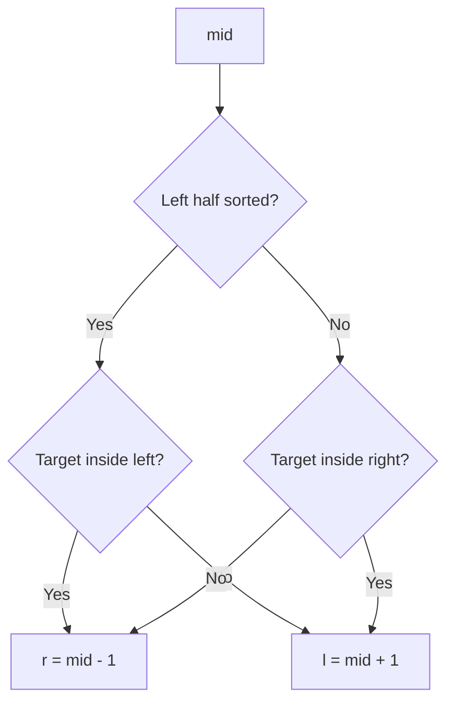

```java
int search(int[] nums, int target) {
    int l = 0, r = nums.length - 1;

    while (l <= r) {
        int mid = l + (r - l) / 2;

        if (nums[mid] == target) return mid;

        if (nums[l] <= nums[mid]) {
            if (nums[l] <= target && target < nums[mid])
                r = mid - 1;
            else
                l = mid + 1;
        } else {
            if (nums[mid] < target && target <= nums[r])
                l = mid + 1;
            else
                r = mid - 1;
        }
    }
    return -1;
}
```

---

<a id="q3"></a>

## 3. Merge Intervals

**Pattern:** Sorting

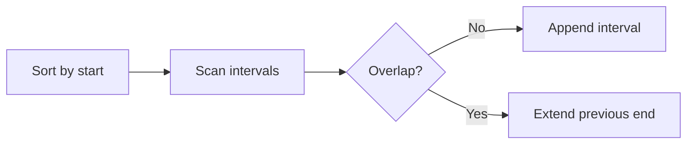

```java
int[][] merge(int[][] intervals) {
    Arrays.sort(intervals, Comparator.comparingInt(a -> a[0]));

    List<int[]> ans = new ArrayList<>();

    for (int[] cur : intervals) {
        if (ans.isEmpty() || ans.get(ans.size() - 1)[1] < cur[0]) {
            ans.add(cur);
        } else {
            int[] last = ans.get(ans.size() - 1);
            last[1] = Math.max(last[1], cur[1]);
        }
    }

    return ans.toArray(int[][]::new);
}
```

---

<a id="q4"></a>

## 4. Copy List with Random Pointer

**Pattern:** Linked List

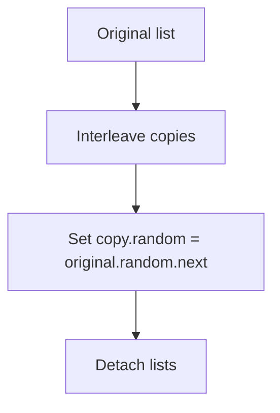

```java
Node copyRandomList(Node head) {
    if (head == null) return null;

    for (Node cur = head; cur != null; cur = cur.next.next) {
        Node copy = new Node(cur.val);
        copy.next = cur.next;
        cur.next = copy;
    }

    for (Node cur = head; cur != null; cur = cur.next.next) {
        if (cur.random != null)
            cur.next.random = cur.random.next;
    }

    Node dummy = new Node(0);
    Node tail = dummy;

    for (Node cur = head; cur != null;) {
        Node copy = cur.next;
        cur.next = copy.next;

        tail.next = copy;
        tail = copy;

        cur = cur.next;
    }

    return dummy.next;
}
```

---

<a id="q5"></a>

## 5. Word Search

**Pattern:** DFS / Backtracking

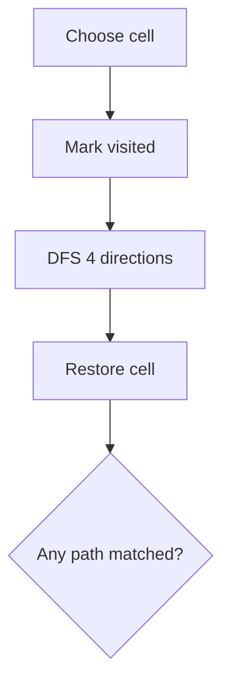

```java
boolean exist(char[][] board, String word) {
    int m = board.length, n = board[0].length;

    for (int r = 0; r < m; r++)
        for (int c = 0; c < n; c++)
            if (dfs(board, word, r, c, 0))
                return true;

    return false;
}

boolean dfs(char[][] b, String w, int r, int c, int i) {
    if (i == w.length()) return true;

    if (r < 0 || r >= b.length ||
        c < 0 || c >= b[0].length ||
        b[r][c] != w.charAt(i))
        return false;

    char old = b[r][c];
    b[r][c] = '#';

    boolean found =
        dfs(b, w, r + 1, c, i + 1) ||
        dfs(b, w, r - 1, c, i + 1) ||
        dfs(b, w, r, c + 1, i + 1) ||
        dfs(b, w, r, c - 1, i + 1);

    b[r][c] = old;
    return found;
}
```

---

<a id="q6"></a>

## 6. Course Schedule

**Pattern:** Topological Sort

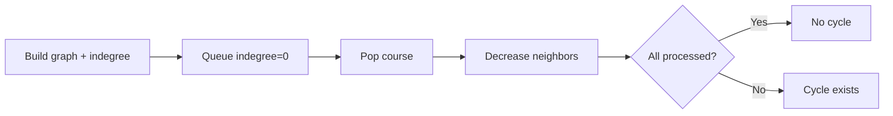

```java
boolean canFinish(int n, int[][] prerequisites) {
    List<List<Integer>> graph = new ArrayList<>();
    for (int i = 0; i < n; i++) graph.add(new ArrayList<>());

    int[] indegree = new int[n];

    for (int[] p : prerequisites) {
        graph.get(p[1]).add(p[0]);
        indegree[p[0]]++;
    }

    Queue<Integer> q = new ArrayDeque<>();
    for (int i = 0; i < n; i++)
        if (indegree[i] == 0) q.offer(i);

    int processed = 0;

    while (!q.isEmpty()) {
        int u = q.poll();
        processed++;

        for (int v : graph.get(u))
            if (--indegree[v] == 0)
                q.offer(v);
    }

    return processed == n;
}
```

---

<a id="q7"></a>

## 7. Subarray Sum Equals K

**Pattern:** Prefix Sum

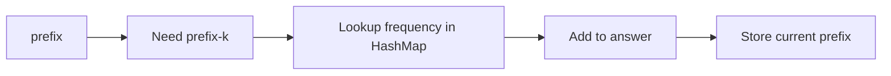

```java
int subarraySum(int[] nums, int k) {
    Map<Integer, Integer> freq = new HashMap<>();
    freq.put(0, 1);

    int prefix = 0, count = 0;

    for (int x : nums) {
        prefix += x;
        count += freq.getOrDefault(prefix - k, 0);
        freq.merge(prefix, 1, Integer::sum);
    }

    return count;
}
```

---

<a id="q8"></a>

## 8. Longest Repeating Character Replacement

**Pattern:** Sliding Window

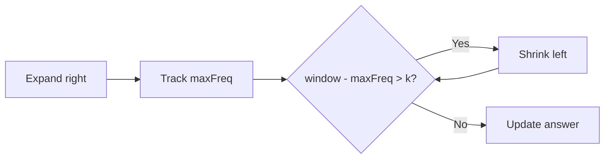

```java
int characterReplacement(String s, int k) {
    int[] freq = new int[26];
    int l = 0, maxFreq = 0, ans = 0;

    for (int r = 0; r < s.length(); r++) {
        int idx = s.charAt(r) - 'A';
        freq[idx]++;
        maxFreq = Math.max(maxFreq, freq[idx]);

        while ((r - l + 1) - maxFreq > k) {
            freq[s.charAt(l) - 'A']--;
            l++;
        }

        ans = Math.max(ans, r - l + 1);
    }

    return ans;
}
```

---

<a id="q9"></a>

## 9. Coin Change

**Pattern:** DP

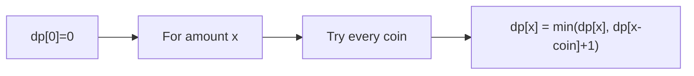

```java
int coinChange(int[] coins, int amount) {
    int INF = amount + 1;

    int[] dp = new int[amount + 1];
    Arrays.fill(dp, INF);
    dp[0] = 0;

    for (int x = 1; x <= amount; x++)
        for (int coin : coins)
            if (coin <= x)
                dp[x] = Math.min(dp[x], dp[x - coin] + 1);

    return dp[amount] == INF ? -1 : dp[amount];
}
```

---

<a id="q10"></a>

## 10. Median from Data Stream

**Pattern:** Two Heaps

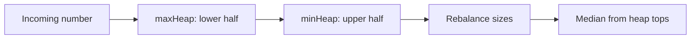

```java
class MedianFinder {
    private final PriorityQueue<Integer> maxHeap =
        new PriorityQueue<>(Comparator.reverseOrder());

    private final PriorityQueue<Integer> minHeap =
        new PriorityQueue<>();

    public void addNum(int num) {
        maxHeap.offer(num);
        minHeap.offer(maxHeap.poll());

        if (minHeap.size() > maxHeap.size())
            maxHeap.offer(minHeap.poll());
    }

    public double findMedian() {
        if (maxHeap.size() > minHeap.size())
            return maxHeap.peek();

        return ((long) maxHeap.peek() + minHeap.peek()) / 2.0;
    }
}
```

---

<a id="q11"></a>

## 11. Target Sum

**Pattern:** Subset DP

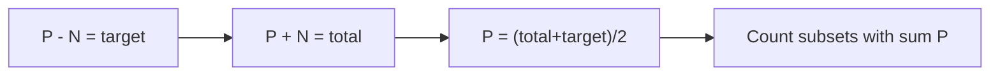

```java
int findTargetSumWays(int[] nums, int target) {
    int total = Arrays.stream(nums).sum();

    if (Math.abs(target) > total) return 0;
    if ((total + target) % 2 != 0) return 0;

    int sum = (total + target) / 2;

    int[] dp = new int[sum + 1];
    dp[0] = 1;

    for (int num : nums)
        for (int s = sum; s >= num; s--)
            dp[s] += dp[s - num];

    return dp[sum];
}
```

---

<a id="q12"></a>

## 12. Combination Sum II

**Pattern:** Backtracking

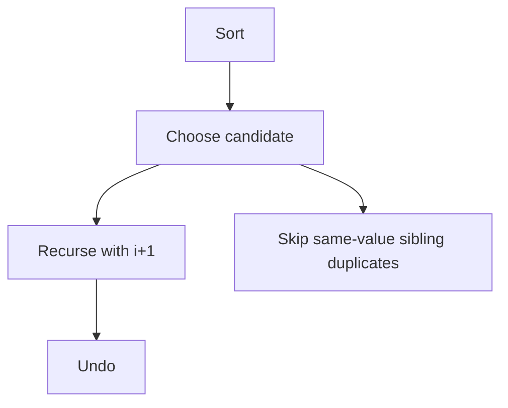

```java
List<List<Integer>> combinationSum2(int[] candidates, int target) {
    Arrays.sort(candidates);

    List<List<Integer>> ans = new ArrayList<>();
    backtrack(candidates, target, 0, new ArrayList<>(), ans);
    return ans;
}

void backtrack(int[] a, int remain, int start,
               List<Integer> cur,
               List<List<Integer>> ans) {
    if (remain == 0) {
        ans.add(new ArrayList<>(cur));
        return;
    }

    for (int i = start; i < a.length; i++) {
        if (i > start && a[i] == a[i - 1]) continue;
        if (a[i] > remain) break;

        cur.add(a[i]);
        backtrack(a, remain - a[i], i + 1, cur, ans);
        cur.remove(cur.size() - 1);
    }
}
```

---

<a id="q13"></a>

## 13. Find the Celebrity

**Pattern:** Elimination

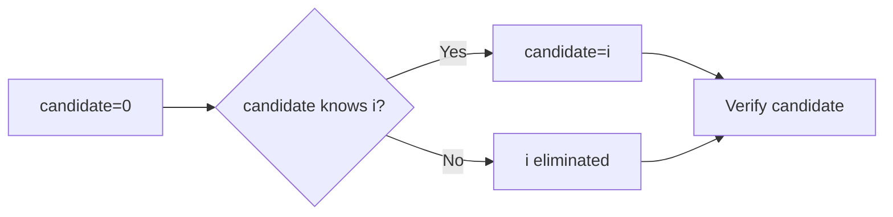

```java
int findCelebrity(int n) {
    int candidate = 0;

    for (int i = 1; i < n; i++)
        if (knows(candidate, i))
            candidate = i;

    for (int i = 0; i < n; i++) {
        if (i == candidate) continue;

        if (knows(candidate, i) || !knows(i, candidate))
            return -1;
    }

    return candidate;
}
```

---

<a id="q14"></a>

## 14. LFU Cache

**Pattern:** HashMap + Frequency Buckets

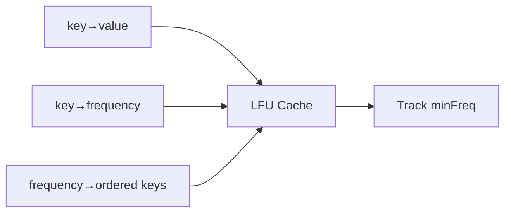

```java
class LFUCache {
    private final int capacity;
    private int minFreq = 0;

    private final Map<Integer, Integer> values = new HashMap<>();
    private final Map<Integer, Integer> freq = new HashMap<>();
    private final Map<Integer, LinkedHashSet<Integer>> groups =
        new HashMap<>();

    LFUCache(int capacity) {
        this.capacity = capacity;
    }

    int get(int key) {
        if (!values.containsKey(key)) return -1;
        touch(key);
        return values.get(key);
    }

    void put(int key, int value) {
        if (capacity == 0) return;

        if (values.containsKey(key)) {
            values.put(key, value);
            touch(key);
            return;
        }

        if (values.size() == capacity) {
            int victim = groups.get(minFreq).iterator().next();
            groups.get(minFreq).remove(victim);
            values.remove(victim);
            freq.remove(victim);
        }

        values.put(key, value);
        freq.put(key, 1);

        groups.computeIfAbsent(1, x -> new LinkedHashSet<>())
              .add(key);

        minFreq = 1;
    }

    private void touch(int key) {
        int f = freq.get(key);

        groups.get(f).remove(key);

        if (f == minFreq && groups.get(f).isEmpty())
            minFreq++;

        freq.put(key, f + 1);

        groups.computeIfAbsent(f + 1, x -> new LinkedHashSet<>())
              .add(key);
    }
}
```

---

<a id="q15"></a>

## 15. LRU Cache

**Pattern:** HashMap + DLL

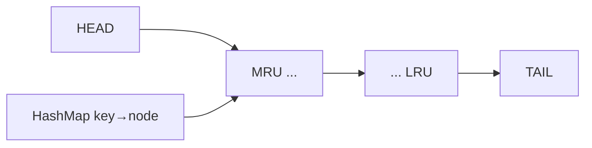

```java
class LRUCache {
    class Node {
        int key, value;
        Node prev, next;

        Node(int key, int value) {
            this.key = key;
            this.value = value;
        }
    }

    private final int capacity;
    private final Map<Integer, Node> map = new HashMap<>();

    private final Node head = new Node(0, 0);
    private final Node tail = new Node(0, 0);

    LRUCache(int capacity) {
        this.capacity = capacity;
        head.next = tail;
        tail.prev = head;
    }

    int get(int key) {
        Node node = map.get(key);
        if (node == null) return -1;

        remove(node);
        addFirst(node);

        return node.value;
    }

    void put(int key, int value) {
        if (map.containsKey(key)) {
            Node node = map.get(key);
            node.value = value;
            remove(node);
            addFirst(node);
            return;
        }

        if (map.size() == capacity) {
            Node lru = tail.prev;
            remove(lru);
            map.remove(lru.key);
        }

        Node node = new Node(key, value);
        map.put(key, node);
        addFirst(node);
    }

    private void remove(Node node) {
        node.prev.next = node.next;
        node.next.prev = node.prev;
    }

    private void addFirst(Node node) {
        node.next = head.next;
        node.prev = head;
        head.next.prev = node;
        head.next = node;
    }
}
```

---

<a id="q16"></a>

## 16. Ways to Reach K-th Stair

**Pattern:** Memoized DFS

```mermaid
stateDiagram-v2
    [*] --> State
    State: (position, jumpExponent, lastDown)
    State --> Down: move -1 if allowed
    State --> Up: move +2^jump
    Down --> State
    Up --> State
```

```java
Map<String, Integer> memo = new HashMap<>();

int waysToReachStair(int k) {
    return dfs(1L, 0, false, k);
}

int dfs(long pos, int jump, boolean lastDown, int k) {
    if (pos > k + 1) return 0;

    String key = pos + "," + jump + "," + lastDown;

    if (memo.containsKey(key))
        return memo.get(key);

    int ways = pos == k ? 1 : 0;

    if (!lastDown && pos > 0)
        ways += dfs(pos - 1, jump, true, k);

    ways += dfs(
        pos + (1L << jump),
        jump + 1,
        false,
        k
    );

    memo.put(key, ways);
    return ways;
}
```

---

<a id="q17"></a>

## 17. Zigzag Binary Tree Traversal

**Pattern:** BFS

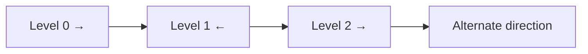

```java
List<List<Integer>> zigzagLevelOrder(TreeNode root) {
    List<List<Integer>> ans = new ArrayList<>();
    if (root == null) return ans;

    Queue<TreeNode> q = new ArrayDeque<>();
    q.offer(root);

    boolean leftToRight = true;

    while (!q.isEmpty()) {
        int size = q.size();
        LinkedList<Integer> level = new LinkedList<>();

        for (int i = 0; i < size; i++) {
            TreeNode node = q.poll();

            if (leftToRight) level.addLast(node.val);
            else level.addFirst(node.val);

            if (node.left != null) q.offer(node.left);
            if (node.right != null) q.offer(node.right);
        }

        ans.add(level);
        leftToRight = !leftToRight;
    }

    return ans;
}
```

---

<a id="q18"></a>

## 18. Level Order Traversal

**Pattern:** BFS

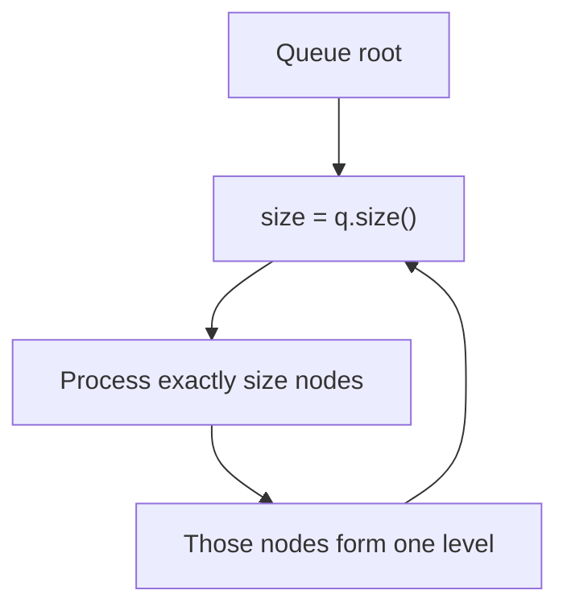

```java
List<List<Integer>> levelOrder(TreeNode root) {
    List<List<Integer>> ans = new ArrayList<>();
    if (root == null) return ans;

    Queue<TreeNode> q = new ArrayDeque<>();
    q.offer(root);

    while (!q.isEmpty()) {
        int size = q.size();
        List<Integer> level = new ArrayList<>();

        while (size-- > 0) {
            TreeNode node = q.poll();
            level.add(node.val);

            if (node.left != null) q.offer(node.left);
            if (node.right != null) q.offer(node.right);
        }

        ans.add(level);
    }

    return ans;
}
```

---

<a id="q19"></a>

## 19. Binary Tree Game / Two Players

**Pattern:** Tree Sizes

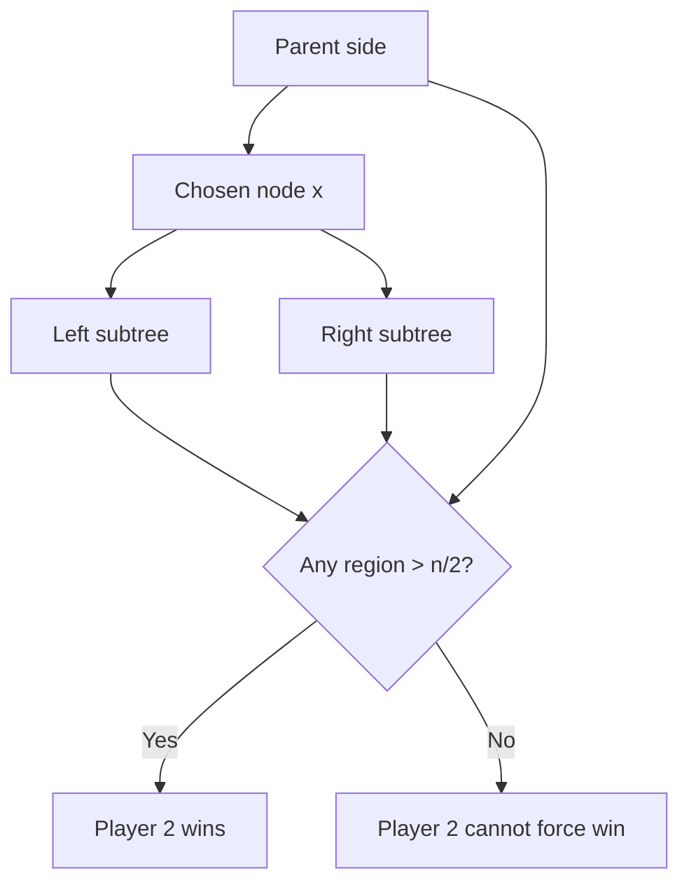

```java
int leftSize;
int rightSize;

boolean btreeGameWinningMove(TreeNode root, int n, int x) {
    count(root, x);

    int parentSide = n - leftSize - rightSize - 1;

    int largest = Math.max(
        parentSide,
        Math.max(leftSize, rightSize)
    );

    return largest > n / 2;
}

int count(TreeNode node, int x) {
    if (node == null) return 0;

    int left = count(node.left, x);
    int right = count(node.right, x);

    if (node.val == x) {
        leftSize = left;
        rightSize = right;
    }

    return left + right + 1;
}
```

---

<a id="q20"></a>

## 20. Word Wrap

**Pattern:** DP

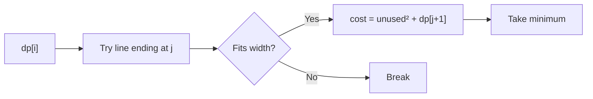

```java
int wordWrap(int[] words, int width) {
    int n = words.length;

    int[] dp = new int[n + 1];
    Arrays.fill(dp, Integer.MAX_VALUE);
    dp[n] = 0;

    for (int i = n - 1; i >= 0; i--) {
        int lineLength = 0;

        for (int j = i; j < n; j++) {
            if (j > i) lineLength++;
            lineLength += words[j];

            if (lineLength > width) break;

            int cost;

            if (j == n - 1) {
                cost = 0;
            } else {
                int remaining = width - lineLength;
                cost = remaining * remaining + dp[j + 1];
            }

            dp[i] = Math.min(dp[i], cost);
        }
    }

    return dp[0];
}
```

---

<a id="patterns"></a>

## Core Interview Patterns

### 1D DP

```java
int prev2 = 0, prev1 = 0;

for (int x : nums) {
    int cur = Math.max(prev1, prev2 + x);
    prev2 = prev1;
    prev1 = cur;
}
```

### Binary Search

```java
int l = 0, r = n - 1;

while (l <= r) {
    int mid = l + (r - l) / 2;

    if (...) ...
    else if (...) l = mid + 1;
    else r = mid - 1;
}
```

### Sliding Window

```java
for (int r = 0; r < n; r++) {
    add(r);

    while (invalid()) {
        remove(l);
        l++;
    }

    ans = Math.max(ans, r - l + 1);
}
```

### Prefix Sum

```java
Map<Integer, Integer> map = new HashMap<>();
map.put(0, 1);

int prefix = 0;

for (int x : nums) {
    prefix += x;
    // inspect prefix - target
    map.merge(prefix, 1, Integer::sum);
}
```

### BFS by Level

```java
while (!q.isEmpty()) {
    int size = q.size();

    while (size-- > 0) {
        var node = q.poll();
        ...
    }
}
```

### Backtracking

```java
for (...) {
    choose();
    backtrack(...);
    undo();
}
```

---

## Last-Minute Priority

Revise twice: **House Robber II → Rotated Binary Search → Merge Intervals → Word Search → Course Schedule → Subarray Sum K → Sliding Window → Coin Change → LRU → Copy Random List**.

Interview flow: **state the invariant/state → explain algorithm → give complexity → code → test edge cases**.
