# Hadoop — Internal Architecture, System Design, Trade-offs, and Spark Integration

> Focus: how Hadoop works internally, how the major components interact, where Hadoop fits in a modern data platform, and how Spark jobs execute on top of Hadoop infrastructure.

---

# 1. What Hadoop Actually Is

Apache Hadoop is not one single system. It is a set of components designed to store and process very large datasets across clusters of commodity machines.

The classic Hadoop stack has four major parts:

1. **HDFS** — distributed storage
2. **YARN** — cluster resource management and scheduling
3. **MapReduce** — batch computation engine
4. **Hadoop Common** — shared libraries, RPC, configuration, serialization, filesystem abstractions, etc.

Modern deployments often keep:

- HDFS for storage
- YARN for cluster scheduling

while replacing MapReduce with:

- Spark
- Flink
- Tez
- Hive execution engines

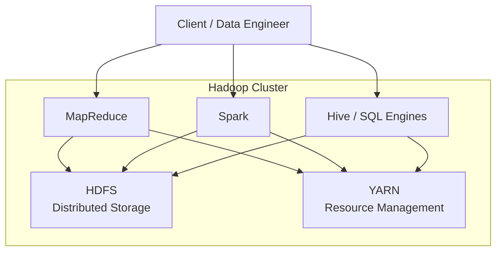

---

# 2. Why Hadoop Was Needed

A single machine has limits:

- limited disk capacity
- limited memory
- limited CPU
- limited I/O throughput
- single-machine failure risk

Hadoop solves this by distributing both:

- **data**
- **computation**

across many machines.

Core principle:

> Move computation close to the data instead of moving huge amounts of data across the network.

For large datasets, network transfer can be significantly more expensive than reading from local disks.

---

# 3. HDFS Architecture

HDFS is Hadoop's distributed filesystem.

It is optimized for:

- very large files
- sequential reads
- streaming data access
- high throughput
- fault tolerance

It is not optimized for:

- millions of tiny files
- very low-latency random access
- frequent in-place updates
- OLTP workloads

## Core Components

### NameNode

The NameNode manages filesystem metadata.

It stores information such as:

- directory tree
- filenames
- permissions
- file -> block mapping
- block -> DataNode locations

The NameNode does **not normally store file contents**.

### DataNode

DataNodes store the actual HDFS blocks.

Responsibilities:

- store blocks on local disks
- serve read/write requests
- send heartbeats
- send block reports
- replicate blocks when instructed by NameNode

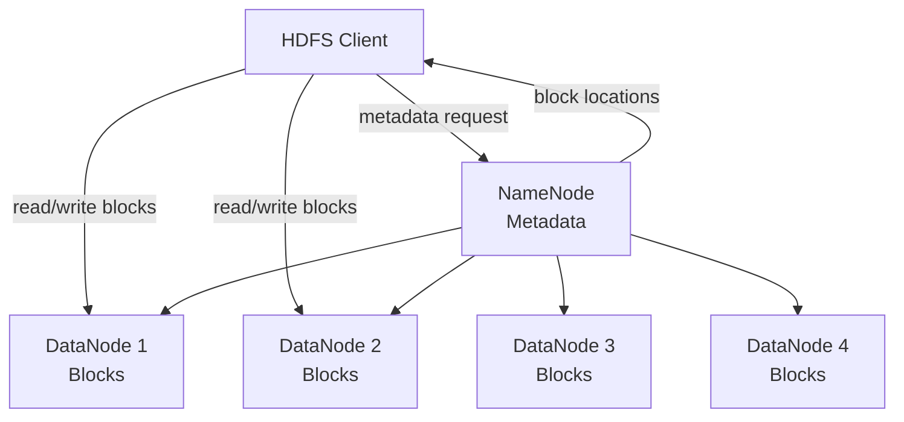

---

# 4. HDFS Blocks

Large files are divided into large blocks.

Typical block size:

- commonly 128 MB
- sometimes 256 MB or larger

Example:

A 500 MB file with 128 MB blocks may become:

- Block A: 128 MB
- Block B: 128 MB
- Block C: 128 MB
- Block D: 116 MB

Each block can be stored independently across the cluster.

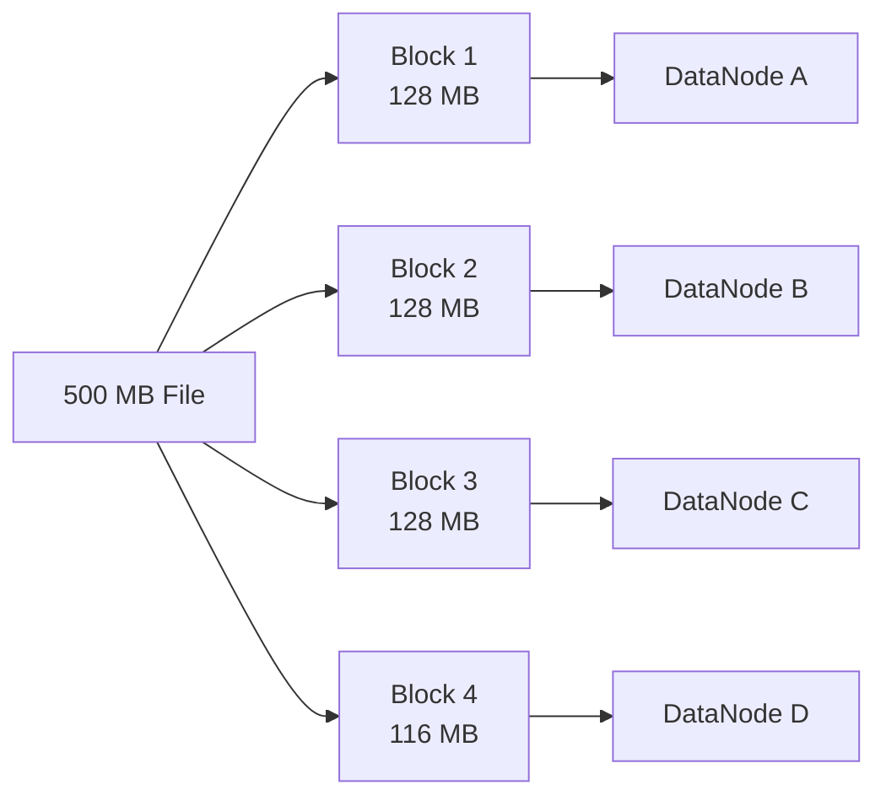

## Why Large Blocks?

Large blocks reduce metadata overhead.

For a 1 TB file:

With 4 KB blocks, Hadoop would need to track hundreds of millions of blocks.

With 128 MB blocks:

```text
1 TB / 128 MB ~= 8192 blocks
```

Much easier for the NameNode to manage.

---

# 5. Replication and Fault Tolerance

HDFS normally keeps multiple copies of every block.

A common replication factor is:

```text
3
```

Meaning each block exists on three DataNodes.

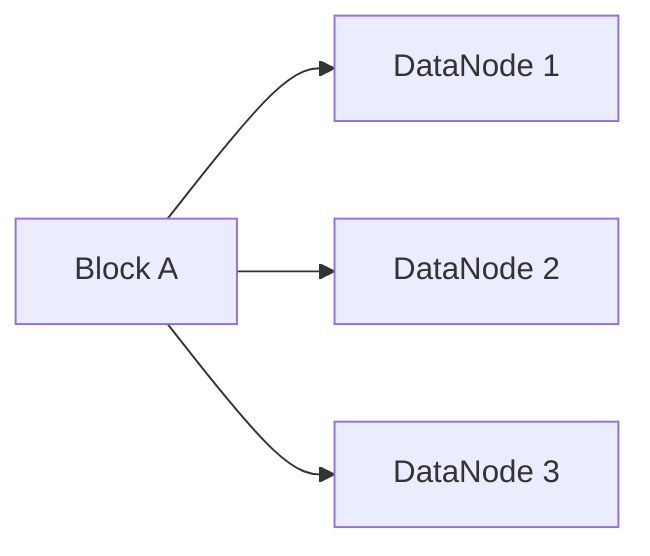

If DataNode 2 fails:

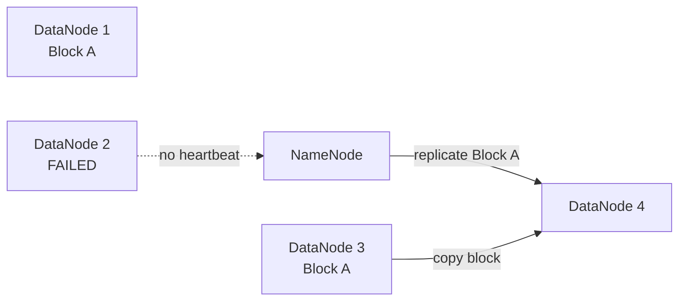

The NameNode detects failure through missing heartbeats and schedules replacement replicas.

---

# 6. Rack Awareness

Hadoop tries not to place all replicas inside the same rack.

Why?

Because failures can affect an entire rack:

- network switch failure
- rack power failure
- top-of-rack switch failure

Typical strategy:

- one replica on local node
- one replica on another node in same rack
- one replica in another rack

Conceptually:

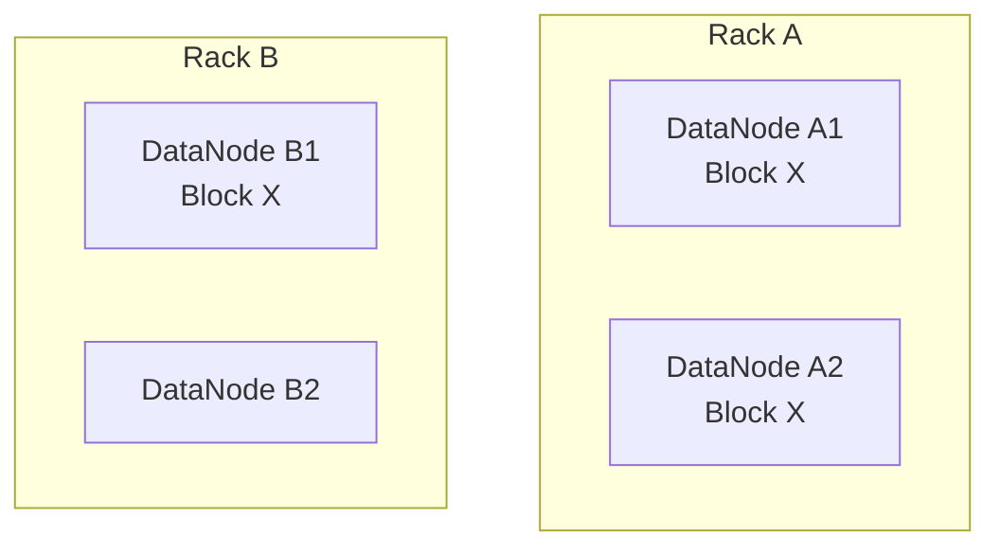

This balances:

- fault tolerance
- network cost

---

# 7. HDFS Read Path

Suppose a client wants to read:

```text
/data/events.parquet
```

Flow:

1. Client contacts NameNode.
2. NameNode returns block locations.
3. Client chooses the closest DataNode.
4. Client reads block directly from DataNode.
5. For the next block, it may read from another DataNode.
6. If one replica fails, client switches to another replica.

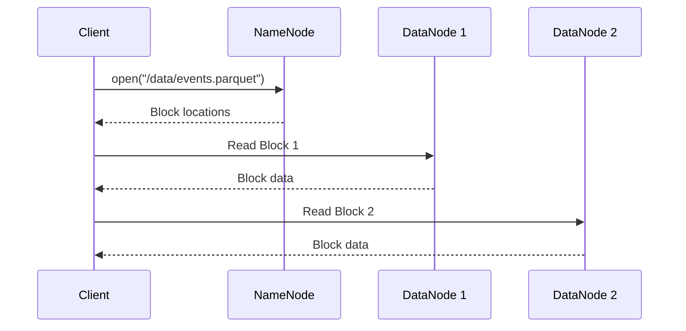

Important:

> File data does not pass through the NameNode.

Otherwise the NameNode would become a massive network bottleneck.

---

# 8. HDFS Write Path

Suppose replication factor = 3.

The client asks NameNode where to place a block.

NameNode chooses:

- DataNode A
- DataNode B
- DataNode C

The client writes using a pipeline.

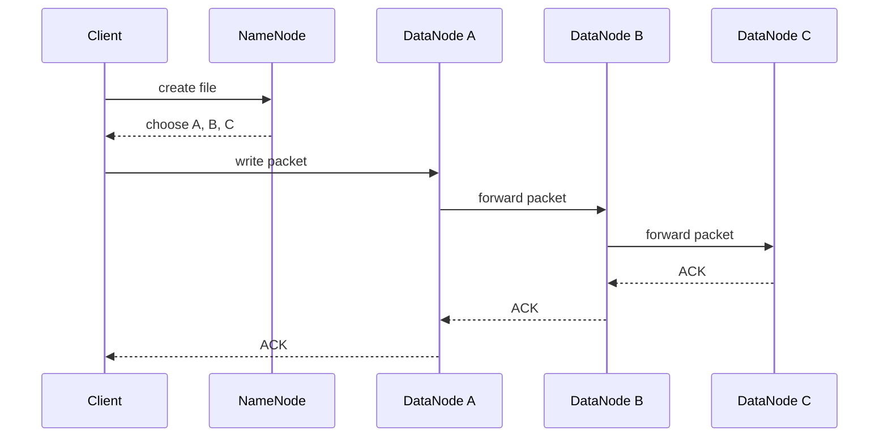

The client does not independently send three full copies.

Instead:

```text
Client -> DN1 -> DN2 -> DN3
```

This reduces client network overhead.

---

# 9. NameNode Metadata

The NameNode keeps much of the filesystem namespace metadata in memory.

This makes metadata operations fast.

Persistent metadata includes:

### FsImage

Snapshot of filesystem metadata.

### EditLog

Changes after the snapshot.

Example operations:

- create file
- delete file
- rename file
- change permissions

Conceptually:

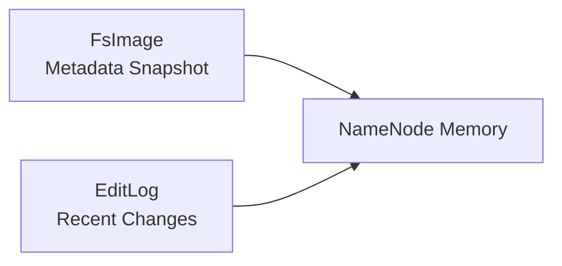

---

# 10. NameNode High Availability

Historically, NameNode was a single point of failure.

Modern Hadoop can run:

- Active NameNode
- Standby NameNode

Shared edits are commonly coordinated using JournalNodes.

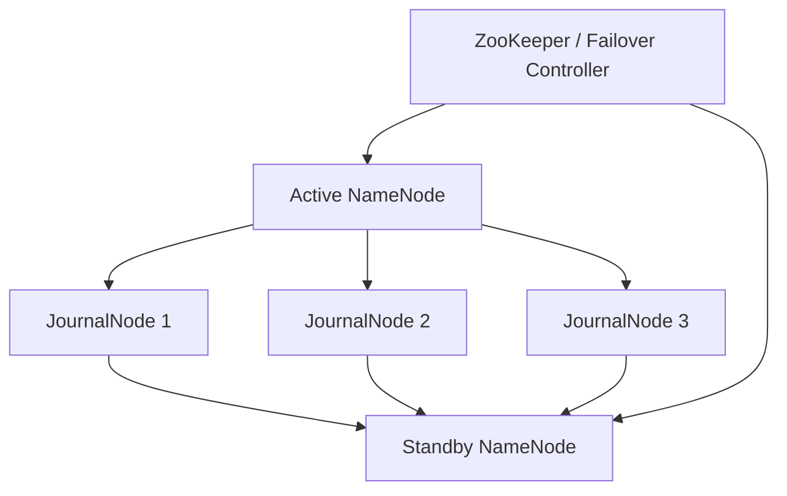

The standby continuously follows filesystem changes.

On Active failure:

```text
Standby -> Active
```

---

# 11. NameNode Federation

For very large clusters, one NameNode may become a metadata scalability bottleneck.

Federation allows multiple NameNodes.

Example:

```text
NameNode A -> /analytics
NameNode B -> /logs
NameNode C -> /warehouse
```

Each manages an independent namespace.

DataNodes may store blocks belonging to all namespaces.

---

# 12. The Small Files Problem

HDFS performs poorly when storing huge numbers of tiny files.

Why?

Every file and block requires NameNode metadata.

Example:

```text
100 million files
```

can consume enormous NameNode memory.

Problems:

- metadata pressure
- slow listings
- excessive task scheduling overhead
- inefficient reads

Common solutions:

- combine files
- Parquet
- ORC
- Avro container files
- compaction
- table formats such as Iceberg / Delta / Hudi

---

# 13. YARN

YARN means:

```text
Yet Another Resource Negotiator
```

YARN separates:

- cluster resource management
- application execution

This allows many engines to share a cluster:

- Spark
- MapReduce
- Hive
- Tez
- Flink

---

# 14. YARN Architecture

Core components:

### ResourceManager

Cluster-wide resource coordinator.

Responsibilities:

- track available CPU/memory
- accept applications
- allocate resources
- coordinate scheduling

### NodeManager

Runs on every worker machine.

Responsibilities:

- monitor machine resources
- launch containers
- report status to ResourceManager

### ApplicationMaster

Created per application.

Responsibilities:

- negotiate resources
- request containers
- coordinate tasks
- monitor execution

### Container

A resource allocation such as:

```text
4 vCPU
8 GB memory
```

A container is not necessarily Docker.

In YARN terminology it means:

> A bundle of allocated cluster resources.

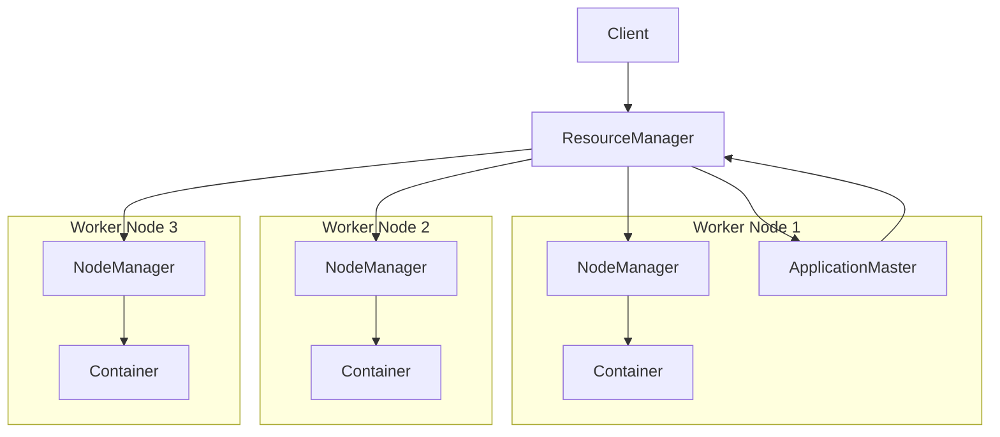

---

# 15. How a YARN Application Starts

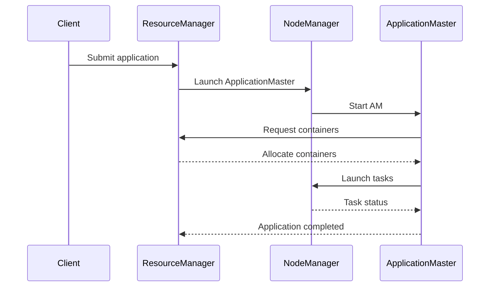

---

# 16. Resource Scheduling

YARN schedulers decide how resources are shared.

Common models include:

- Capacity Scheduler
- Fair Scheduler

Typical concerns:

- cluster utilization
- team quotas
- priorities
- multi-tenancy
- queue capacity
- preemption

Example:

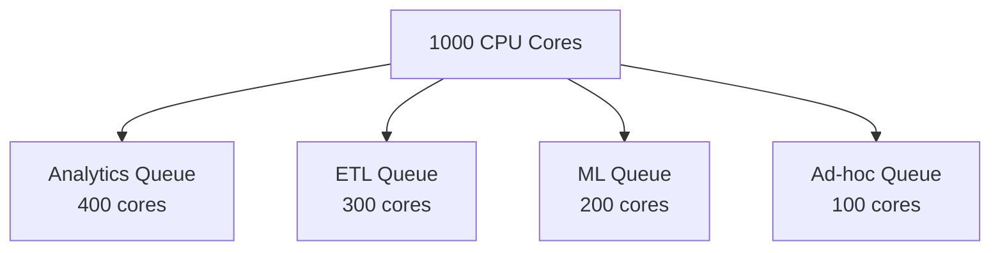

---

# 17. Classic MapReduce

MapReduce processes data using two main stages:

```text
Map
Reduce
```

Example:

Count words across billions of documents.

Input:

```text
hello world
hello hadoop
```

Mapper:

```text
hello -> 1
world -> 1
hello -> 1
hadoop -> 1
```

Shuffle groups keys:

```text
hello -> [1,1]
world -> [1]
hadoop -> [1]
```

Reducer:

```text
hello -> 2
world -> 1
hadoop -> 1
```

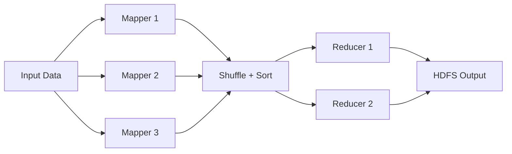

---

# 18. Why Shuffle Is Expensive

Shuffle may involve:

- serialization
- local disk writes
- network transfer
- sorting
- merging
- remote reads
- deserialization

For distributed systems, shuffle is often the most expensive stage.

Typical optimization goal:

> Reduce the amount of data that crosses the network.

Examples:

- filters before joins
- map-side aggregation
- partition pruning
- broadcast joins
- better partitioning

---

# 19. Data Locality

Suppose Block A exists on:

```text
Node 7
```

Instead of copying Block A to Node 3, Hadoop tries to execute the task on Node 7.

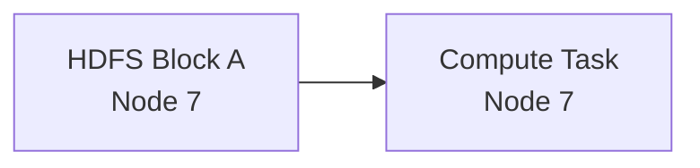

This is called:

```text
data locality
```

Levels may include:

1. node-local
2. rack-local
3. off-rack

Node-local is generally preferred.

---

# 20. Where Spark Fits

Spark is a compute engine.

Hadoop is broader infrastructure.

Spark can use:

### HDFS

for storage.

### YARN

for cluster resource management.

So a very common architecture is:

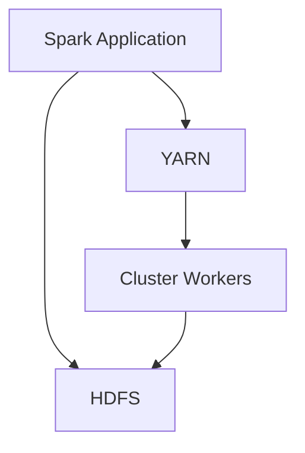

In other words:

```text
HDFS = where data lives
YARN = who gets CPU/memory
Spark = how computation is executed
```

---

# 21. Spark Architecture

A Spark application contains:

### Driver

Responsible for:

- creating SparkSession / SparkContext
- building execution plans
- dividing jobs into stages
- scheduling tasks
- tracking executors

### Executors

Worker processes responsible for:

- running tasks
- caching partitions
- shuffle operations
- returning results

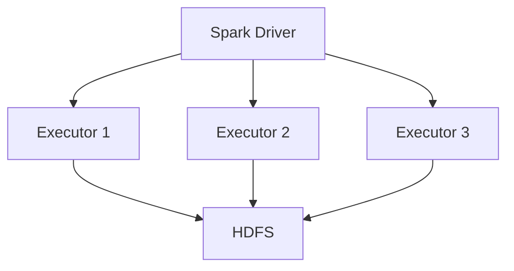

---

# 22. Spark on YARN

When Spark uses YARN, the exact mapping depends on deployment mode.

Conceptually:

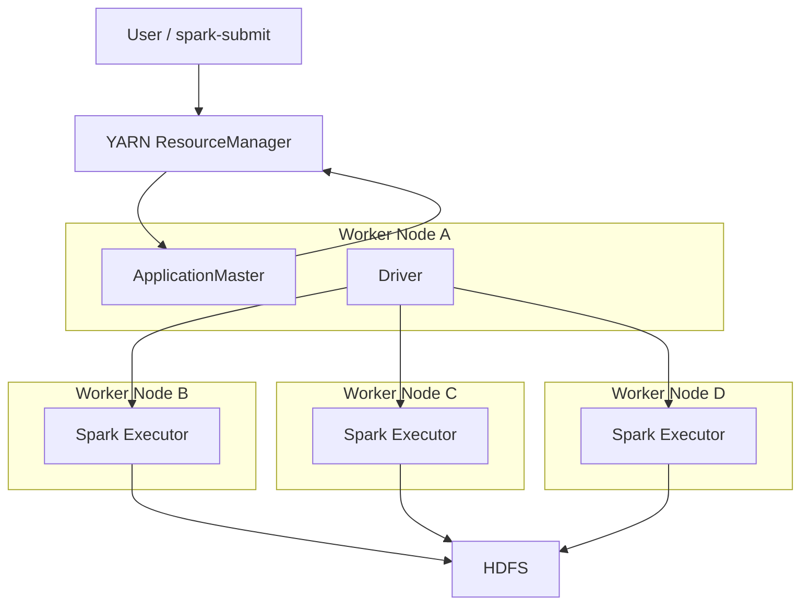

---

# 23. Spark Job Lifecycle

Suppose:

```scala
spark.read.parquet("/events")
  .filter($"country" === "IN")
  .groupBy("userId")
  .count()
  .write.parquet("/output")
```

Conceptually:


Spark does not immediately execute every transformation.

Transformations are lazy.

Execution starts when an **action** occurs.

Examples:

- `count()`
- `collect()`
- `save()`
- `write`

---

# 24. Spark Job, Stage, and Task

Spark execution hierarchy:

```text
Application
   |
   +-- Job
       |
       +-- Stage
           |
           +-- Task
```

### Job

Created by an action.

### Stage

A group of tasks that can execute without requiring a shuffle boundary.

### Task

Smallest unit of execution.

Typically:

```text
one partition -> one task
```

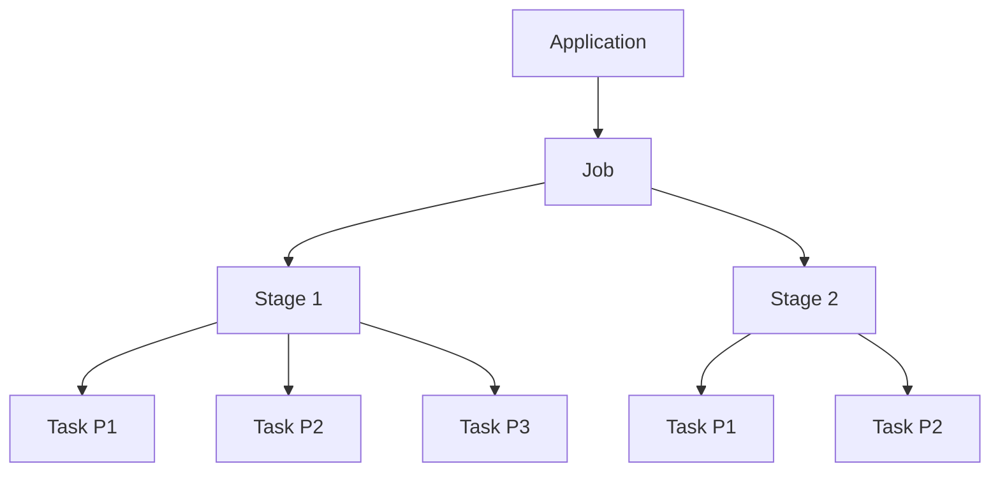

---

# 25. Narrow vs Wide Transformations

## Narrow Transformation

Each output partition depends on only one/few input partitions.

Examples:

- map
- filter
- flatMap

Usually no shuffle.

```mermaid
flowchart LR
    P1[Partition 1] --> O1[Partition 1]
    P2[Partition 2] --> O2[Partition 2]
    P3[Partition 3] --> O3[Partition 3]
```

## Wide Transformation

Output partitions depend on many input partitions.

Examples:

- groupByKey
- reduceByKey
- join
- repartition

Requires shuffle.

```mermaid
flowchart LR
    P1[Partition 1] --> O1[Output 1]
    P1 --> O2[Output 2]

    P2[Partition 2] --> O1
    P2 --> O2

    P3[Partition 3] --> O1
    P3 --> O2
```

---

# 26. Spark vs MapReduce

Spark became popular partly because MapReduce writes intermediate stages to disk very aggressively.

Simplified comparison:

## MapReduce

```text
Read HDFS
-> Map
-> Write intermediate data
-> Shuffle
-> Reduce
-> Write HDFS
```

## Spark

```text
Read
-> Transform
-> Cache / keep intermediate partitions where useful
-> Shuffle only when necessary
-> Continue pipeline
```

Spark often performs better for:

- iterative ML
- repeated transformations
- interactive analytics
- multi-stage pipelines

---

# 27. Spark Is Not "Purely In-Memory"

A common interview mistake:

> "Spark stores everything in RAM."

Incorrect.

Spark can use:

- memory
- disk
- network shuffle
- recomputation

Storage levels can include combinations such as:

```text
MEMORY_ONLY
MEMORY_AND_DISK
DISK_ONLY
```

Spark will spill data when memory is insufficient.

---

# 28. Fault Tolerance: Hadoop vs Spark

## HDFS

Fault tolerance comes from replication.

```text
Block lost on one node
-> read another replica
-> create replacement replica
```

## MapReduce

Failed tasks are rerun.

## Spark

Spark can recover partitions using lineage.

Example:

```text
RDD C = map(RDD B)
RDD B = filter(RDD A)
```

If one partition of C is lost:

Spark can recompute that partition from its ancestors.

```mermaid
flowchart LR
    A[Source Partition]
    B[Filter]
    C[Map]

    A --> B --> C

    Lost[Lost C Partition]
    Lost -. recompute .-> A
```

---

# 29. Spark Data Locality with HDFS

Spark executors may be scheduled close to HDFS blocks.

```mermaid
flowchart TB
    subgraph Node1
        DN1[HDFS DataNode]
        E1[Spark Executor]
    end

    subgraph Node2
        DN2[HDFS DataNode]
        E2[Spark Executor]
    end

    DN1 --> E1
    DN2 --> E2
```

However, modern architectures increasingly store data in cloud object storage:

- S3
- Azure Data Lake Storage
- Google Cloud Storage

In those cases, strict compute-data colocation matters less.

---

# 30. Hadoop in Modern Cloud Architecture

Traditional Hadoop:

```text
Compute + Storage colocated
```

Modern cloud architecture:

```text
Compute separated from Storage
```

Example:

```mermaid
flowchart TB
    S3[Object Storage<br/>S3 / ADLS / GCS]

    SparkA[Spark Cluster A]
    SparkB[Spark Cluster B]
    Trino[Trino / Presto]
    ML[ML Platform]

    SparkA --> S3
    SparkB --> S3
    Trino --> S3
    ML --> S3
```

Benefits:

- independent scaling
- easier ephemeral clusters
- cheaper storage
- simpler sharing
- less infrastructure management

---

# 31. Hadoop System Design Example

## Problem

Design a pipeline processing 20 TB of clickstream logs per day.

Requirements:

- retain raw logs
- perform daily aggregation
- tolerate node failures
- allow multiple analytics jobs
- produce reporting datasets

Possible design:

```mermaid
flowchart LR
    Producers[Web / App Events]

    Ingest[Kafka / Ingestion]

    Raw[HDFS Raw Zone]

    Spark[Spark ETL on YARN]

    Curated[HDFS / Hive<br/>Curated Tables]

    BI[BI / Analytics]
    ML[ML Pipelines]

    Producers --> Ingest
    Ingest --> Raw
    Raw --> Spark
    Spark --> Curated
    Curated --> BI
    Curated --> ML
```

---

# 32. Data Partitioning

Partitioning determines how data is physically or logically divided.

Example:

```text
/events/date=2026-08-10/country=IN/
/events/date=2026-08-10/country=US/
/events/date=2026-08-11/country=IN/
```

A query:

```sql
WHERE date='2026-08-11'
AND country='IN'
```

can avoid scanning unrelated data.

This is called:

```text
partition pruning
```

Benefits:

- lower I/O
- faster queries
- lower compute cost

---

# 33. Why Parquet Is Common

Parquet is column-oriented.

Example table:

| userId | country | age | revenue |
|---|---|---|---|

If a query needs only:

```text
country
revenue
```

Parquet can avoid reading unrelated columns.

Advantages:

- compression
- column pruning
- predicate pushdown
- efficient analytics

HDFS stores bytes.

Formats such as Parquet determine how those bytes are organized.

---

# 34. Hadoop System Design Trade-offs

## Replication

Higher replication:

### Advantages

- better fault tolerance
- more read locality
- more read parallelism

### Disadvantages

- higher storage cost
- more network traffic during writes

Example:

```text
Replication 3
100 TB logical data
~= 300 TB raw storage
```

---

# 35. HDFS vs Object Storage

| Dimension | HDFS | S3 / ADLS / GCS |
|---|---|---|
| Storage location | Cluster machines | Remote object service |
| Compute/storage coupling | Stronger | Decoupled |
| Data locality | Strong | Usually irrelevant |
| Operations | Cluster managed | Cloud managed |
| Scaling | Add DataNodes | Independent |
| Cost model | Machines/disks | Usage based |
| Best fit | On-prem clusters | Cloud data platforms |

---

# 36. Hadoop Advantages

Hadoop is strong when you need:

- huge-scale batch processing
- distributed storage
- sequential scans
- fault tolerance
- commodity/on-prem hardware
- high throughput rather than low latency
- large data lakes
- multi-node parallel ETL

---

# 37. Hadoop Disadvantages

Major trade-offs:

### Operational Complexity

Running a large Hadoop cluster requires:

- capacity planning
- disk replacement
- NameNode management
- YARN tuning
- rack configuration
- security configuration
- upgrades
- monitoring

### High Latency

Hadoop is not ideal for request-response APIs requiring:

```text
5 ms
20 ms
50 ms
```

### Small Files

Metadata overhead becomes expensive.

### Compute/Storage Coupling

Classic HDFS clusters scale storage by adding worker nodes even when additional compute is unnecessary.

---

# 38. When Hadoop/HDFS Is Used

Typical workloads:

- large-scale ETL
- log processing
- historical analytics
- search indexing pipelines
- data warehouse staging
- machine learning preprocessing
- offline recommendation pipelines
- fraud analytics
- clickstream processing
- telemetry aggregation
- batch financial processing
- archival analytics

---

# 39. When Not to Use Hadoop

Avoid Hadoop/HDFS as the main technology for:

### OLTP

Use:

- PostgreSQL
- MySQL
- distributed SQL databases

### Millisecond Key-Value Lookups

Use:

- Redis
- DynamoDB
- Cassandra

### Search

Use:

- Elasticsearch
- OpenSearch

### Pure Streaming

Consider:

- Kafka
- Flink
- Spark Structured Streaming

### Small datasets

A distributed cluster may create more overhead than benefit.

---

# 40. Data Processing Pipeline — End to End

A typical large-scale pipeline might look like:

```mermaid
flowchart LR
    Apps[Applications]

    Kafka[Kafka]

    HDFS[HDFS / Data Lake]

    Spark[Spark]

    Warehouse[Warehouse / Curated Data]

    BI[BI]

    ML[ML]

    Apps --> Kafka
    Kafka --> HDFS
    HDFS --> Spark
    Spark --> Warehouse
    Warehouse --> BI
    Warehouse --> ML
```

---

# 41. Spark Join Behavior

Suppose:

```text
Orders = 5 TB
Countries = 10 MB
```

A normal distributed join might shuffle both datasets.

Better option:

```text
broadcast Countries
```

```mermaid
flowchart TB
    Small[Countries<br/>10 MB]
    Big1[Orders Partition 1]
    Big2[Orders Partition 2]
    Big3[Orders Partition 3]

    Small --> E1[Executor 1]
    Small --> E2[Executor 2]
    Small --> E3[Executor 3]

    Big1 --> E1
    Big2 --> E2
    Big3 --> E3
```

This avoids shuffling the massive Orders dataset.

---

# 42. Data Skew

Suppose data is partitioned by `country`.

Distribution:

```text
IN = 70%
US = 10%
GB = 5%
Others = 15%
```

One partition may become huge.

```mermaid
flowchart LR
    Data[Dataset]

    Data --> P1[IN<br/>Huge]
    Data --> P2[US]
    Data --> P3[GB]
    Data --> P4[Others]
```

Result:

- one slow task
- most executors idle
- long tail latency

Solutions:

- salting keys
- increase partition granularity
- broadcast smaller side
- adaptive query execution
- custom partitioning

---

# 43. Spark Partition Count

Too few partitions:

- insufficient parallelism
- large tasks
- memory pressure

Too many partitions:

- scheduler overhead
- tiny files
- excessive task startup overhead

General principle:

```text
Partition size should be large enough to be efficient,
but small enough to parallelize well.
```

---

# 44. Exactly-Once vs At-Least-Once

Hadoop batch processing often simplifies correctness because datasets are immutable.

For streaming systems, delivery semantics matter more.

Typical options:

### At-most-once

Possible data loss.

### At-least-once

No loss, but duplicates possible.

### Exactly-once

Harder; usually requires coordinated state + idempotent or transactional sinks.

Spark Structured Streaming often uses checkpointing and replay mechanisms to provide strong processing guarantees when supported by the source/sink design.

---

# 45. Hadoop Security

Enterprise Hadoop commonly integrates:

### Kerberos

Authentication.

### HDFS ACLs

Authorization.

### Ranger

Centralized policies and auditing.

### Encryption

- encryption in transit
- encryption at rest
- HDFS encryption zones

System design concern:

```text
Authentication != Authorization
```

They are separate problems.

---

# 46. Failure Scenarios

## DataNode Failure

Detected via heartbeats.

Effect:

- existing replicas serve reads
- NameNode schedules replication

## NameNode Failure

With HA:

```text
Standby becomes Active
```

## Spark Executor Failure

Tasks are rescheduled.

Lost cached partitions can often be recomputed.

## Spark Driver Failure

Usually more serious because the driver owns application coordination.

Recovery depends on:

- deployment mode
- checkpointing
- cluster manager
- job orchestration

---

# 47. Backpressure and Cluster Saturation

Large distributed workloads may overload:

- disk
- network
- CPU
- executor memory
- YARN queues

Common symptoms:

- long container allocation times
- executor OOM
- heavy GC
- slow shuffle
- disk spill
- network congestion

System design must include:

- quotas
- queues
- concurrency limits
- workload isolation

---

# 48. MapReduce vs Spark vs Flink

| Feature | MapReduce | Spark | Flink |
|---|---|---|---|
| Primary model | Batch | Batch + streaming | Streaming-first |
| Iterative processing | Weak | Strong | Strong |
| In-memory execution | Limited | Strong | Strong |
| Stateful streaming | Limited | Good | Excellent |
| Latency | High | Medium/low | Low |
| Hadoop integration | Native | Strong | Strong |

---

# 49. Hadoop vs Modern Lakehouse

Classic Hadoop:

```text
HDFS
+
Hive
+
YARN
+
Spark
```

Modern lakehouse:

```text
Object Storage
+
Spark / Trino
+
Iceberg / Delta / Hudi
+
Managed Catalog
```

The underlying concepts remain similar:

- distributed data
- partitioning
- fault tolerance
- parallel execution
- metadata management

But operational ownership changes significantly.

---

# 50. Important Interview Question: Why Spark Is Faster Than MapReduce

Do not answer only:

> Spark is faster because it uses RAM.

Better answer:

Spark improves performance because:

1. It supports DAG-based multi-stage execution.
2. It avoids unnecessary materialization between every stage.
3. It can cache reused datasets.
4. It pipelines narrow transformations.
5. It has more sophisticated query optimization.
6. It reduces repeated HDFS reads for iterative workloads.

Memory helps, but architecture is the bigger reason.

---

# 51. Important Interview Question: NameNode Bottleneck

NameNode scaling issues include:

- metadata memory
- namespace operations
- huge numbers of files
- block reports
- cluster coordination

Solutions include:

- federation
- larger files
- compaction
- HA for availability
- namespace design

Important distinction:

> HA improves availability. Federation improves namespace scalability.

---

# 52. Important Interview Question: Why HDFS Is Write-Once

HDFS is designed mainly around:

```text
write once
read many times
```

This simplifies:

- replication
- consistency
- distributed coordination
- large sequential I/O

Frequent random updates would require expensive synchronization across replicas.

---

# 53. Important Interview Question: What Happens When a Block Replica Dies?

1. DataNode stops sending heartbeat.
2. NameNode marks it unavailable.
3. Blocks become under-replicated.
4. NameNode chooses another DataNode.
5. A surviving replica is copied.
6. Desired replication factor is restored.

---

# 54. Important Interview Question: What Happens When a Spark Executor Dies?

1. Driver notices executor loss.
2. Tasks running there fail.
3. Scheduler resubmits tasks.
4. Lost shuffle/cached data may need recomputation.
5. New executor resources may be requested from YARN.
6. Job continues unless recovery fails repeatedly.

---

# 55. Full Architecture View

```mermaid
flowchart TB
    User[Data Engineer / Service]

    Submit[spark-submit]

    RM[YARN ResourceManager]

    subgraph Workers
        NM1[NodeManager]
        NM2[NodeManager]
        NM3[NodeManager]

        E1[Spark Executor]
        E2[Spark Executor]
        E3[Spark Executor]

        DN1[HDFS DataNode]
        DN2[HDFS DataNode]
        DN3[HDFS DataNode]
    end

    NN[HDFS NameNode]

    User --> Submit
    Submit --> RM

    RM --> NM1
    RM --> NM2
    RM --> NM3

    NM1 --> E1
    NM2 --> E2
    NM3 --> E3

    E1 --> DN1
    E2 --> DN2
    E3 --> DN3

    NN --> DN1
    NN --> DN2
    NN --> DN3
```

---

# 56. Request Flow: Spark Reads HDFS

```mermaid
sequenceDiagram
    participant D as Spark Driver
    participant NN as NameNode
    participant E as Spark Executor
    participant DN as DataNode

    D->>NN: Request file metadata
    NN-->>D: Blocks + locations

    D->>E: Schedule task near block
    E->>DN: Read HDFS block
    DN-->>E: Data

    E->>E: Execute transformations
    E-->>D: Task status/result metadata
```

---

# 57. System Design Heuristics

When discussing Hadoop/Spark in a system-design interview, reason in this order:

## 1. Data Volume

```text
GB?
TB?
PB?
```

## 2. Processing Mode

```text
batch?
streaming?
interactive?
```

## 3. Latency Requirement

```text
milliseconds?
seconds?
hours?
```

## 4. Storage

```text
HDFS?
S3?
ADLS?
```

## 5. File Format

```text
Parquet?
ORC?
Avro?
JSON?
```

## 6. Partitioning

```text
date?
tenant?
region?
customer?
```

## 7. Compute Engine

```text
Spark?
Flink?
Trino?
```

## 8. Failure Handling

```text
retries?
replication?
checkpointing?
```

## 9. Cost

```text
storage replication?
shuffle?
compute?
```

## 10. Operational Complexity

```text
self-managed?
managed service?
```

---

# 58. Example: Design 1 PB Analytics Platform

Possible architecture:

```mermaid
flowchart TB
    Sources[Applications / DB CDC / Logs]

    Kafka[Kafka]

    Raw[Raw Data Lake]

    Spark[Spark ETL]

    Curated[Curated Parquet / Iceberg]

    Query[Trino / Spark SQL]

    BI[BI Dashboards]
    ML[ML Features]

    Catalog[Hive Metastore / Catalog]

    Sources --> Kafka
    Kafka --> Raw

    Raw --> Spark
    Spark --> Curated

    Curated --> Query
    Query --> BI

    Curated --> ML

    Catalog --> Spark
    Catalog --> Query
```

Key design decisions:

- immutable raw zone
- columnar curated zone
- partition by time where useful
- compaction to avoid small files
- use idempotent writes
- separate storage from compute where cloud economics favor it

---

# 59. Common Anti-Patterns

## Collecting Large Datasets to Driver

```scala
df.collect()
```

Potential result:

```text
Driver OOM
```

## Too Many Small Output Files

Example:

```text
100,000 partitions
-> 100,000 tiny files
```

Causes metadata and query overhead.

## Blind groupByKey

Can cause huge shuffles.

Prefer aggregation patterns that reduce data earlier where possible.

## Bad Partition Key

Can create severe skew.

## Over-Caching

Caching everything can create:

- memory pressure
- GC overhead
- spilling
- worse performance

---

# 60. Mental Model

Think of the stack like this:

```text
                Application Logic
                      |
                    Spark
          distributed computation
                      |
                    YARN
          CPU / memory allocation
                      |
                    HDFS
             distributed storage
                      |
             Commodity Machines
```

Or, in modern cloud systems:

```text
Application
    |
Spark / Flink / Trino
    |
Kubernetes / YARN
    |
S3 / ADLS / GCS
```

---

# 61. 30-Second Interview Explanation

> Hadoop is a distributed data platform originally built around HDFS for fault-tolerant distributed storage, YARN for cluster resource management, and MapReduce for batch computation. HDFS splits large files into blocks distributed and replicated across DataNodes, while a NameNode manages metadata. YARN allocates CPU and memory to applications through ResourceManagers, NodeManagers, ApplicationMasters, and containers. Spark commonly replaces MapReduce as the execution engine: Spark executors read HDFS blocks in parallel, perform DAG-based transformations, shuffle data when partition boundaries change, and write results back to HDFS or another data lake. Hadoop is optimized for throughput and large-scale batch analytics rather than low-latency transactional workloads.

---

# 62. Key Trade-off Summary

| Decision | Benefit | Cost |
|---|---|---|
| Large HDFS blocks | Less metadata | Less useful for tiny files |
| Replication | Availability + locality | Storage overhead |
| Data locality | Less network I/O | Couples storage and compute |
| Spark caching | Faster reuse | Memory pressure |
| More partitions | More parallelism | Scheduler + file overhead |
| Fewer partitions | Lower overhead | Poor parallelism |
| Broadcast join | Avoids large shuffle | Requires small build side |
| HDFS | High-throughput local storage | Operational complexity |
| Object storage | Decoupled scaling | Remote I/O |
| YARN multi-tenancy | Shared cluster | Scheduling complexity |

---

# 63. Final Takeaways

1. **HDFS solves distributed storage.**
2. **NameNode stores metadata; DataNodes store actual blocks.**
3. **Replication provides HDFS fault tolerance.**
4. **YARN manages cluster CPU and memory.**
5. **MapReduce is only one compute engine in Hadoop.**
6. **Spark commonly runs on YARN and reads/writes HDFS.**
7. **Spark jobs are divided into jobs -> stages -> tasks.**
8. **Shuffle is one of the most expensive distributed operations.**
9. **Data locality matters strongly in classic HDFS clusters.**
10. **Modern cloud platforms often replace HDFS with object storage while keeping many Hadoop-era design principles.**
11. **Hadoop favors throughput over low latency.**
12. **Partitioning, file size, skew, shuffle, and failure handling are core system-design concerns.**
