# How an LLM Works: From Text to GPU Inference

> An intuition-first, backend/infrastructure-oriented guide.

## 1. The shortest correct mental model

An LLM is a function that receives existing tokens and predicts a probability distribution for the next token.

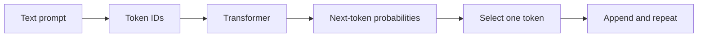

If the prompt is:

```text
The capital of France is
```

the model might produce:

| Candidate token | Probability |
|---|---:|
| ` Paris` | 0.91 |
| ` Lyon` | 0.02 |
| ` located` | 0.01 |
| Other tokens | 0.06 |

The chosen token is appended, and the model runs again:

```text
The capital of France is Paris
```

This loop continues until the model emits a stop token, reaches a limit, or the request is cancelled.

---

## 2. Training versus inference

The same Transformer is used in two very different operating modes.

| Training | Inference |
|---|---|
| Learns model weights | Uses fixed model weights |
| Processes huge datasets | Processes user prompts |
| Forward pass + backward pass | Forward pass only |
| Calculates gradients | Does not calculate gradients |
| Updates weights with an optimizer | Stores temporary KV cache |
| Usually optimized for throughput | Must balance latency and throughput |

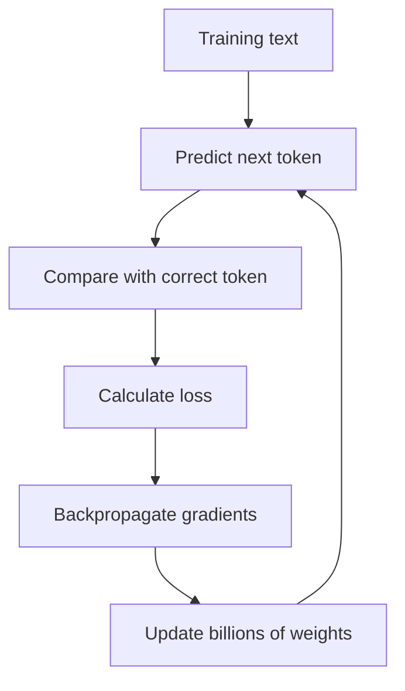

Training gradually adjusts billions of numbers called **parameters**. The parameters do not store sentences like rows in a database. They encode statistical patterns: grammar, associations, relationships, styles, procedures, and imperfect compressed knowledge.

Inference loads those learned parameters and repeatedly performs next-token prediction.

---

## 3. End-to-end inference request

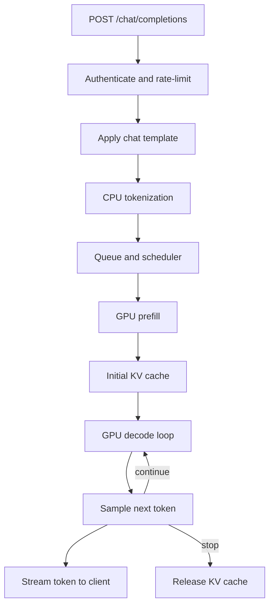

### Step 1: The backend receives the request

The serving layer performs familiar backend work:

- authentication and authorization;
- rate limiting and quota checks;
- request validation;
- safety and policy checks;
- model and adapter selection;
- timeout and cancellation propagation;
- admission control.

The inference engine may reject or queue a request if GPU memory, KV-cache capacity, or latency budgets are exhausted.

### Step 2: A chat template converts messages into model text

An API request such as:

```json
{
  "messages": [
    {"role": "system", "content": "Be concise."},
    {"role": "user", "content": "What is attention?"}
  ]
}
```

becomes a model-specific sequence containing role markers and special tokens. Models must receive the format on which they were trained.

### Step 3: The tokenizer converts text into token IDs

Models operate on integer token IDs, not raw characters or words.

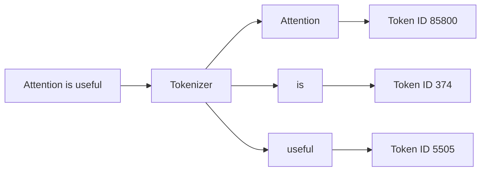

A token can be a word, part of a word, punctuation, whitespace, or a byte-like unit. Tokenization normally runs on the CPU. The resulting integer array is sent to the GPU.

### Step 4: The scheduler forms a batch

A GPU is most efficient when it performs large amounts of parallel work. An inference scheduler combines work from multiple requests.

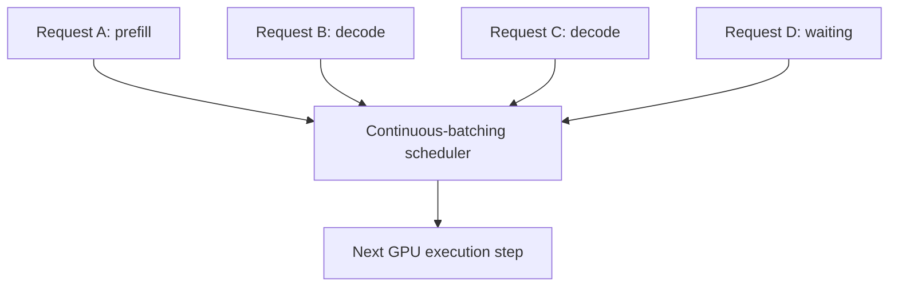

Unlike static batching, **continuous batching** can insert and remove sequences between decoding iterations. Finished requests do not force the entire batch to wait.

---

## 4. Tokens become vectors

A token ID is only an index. The embedding table maps it to a learned vector.

```text
token ID 85800 -> [0.13, -0.42, 0.07, ..., 0.31]
```

For a prompt containing `S` tokens and a model hidden size `D`, the initial representation has shape:

$$X \in \mathbb{R}^{S \times D}$$

For 2,048 tokens and hidden size 4,096:

```text
X shape = [2048, 4096]
```

Each row represents one token. Its meaning is initially based on token identity and position. Transformer layers progressively make it contextual.

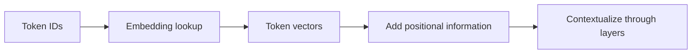

Modern models commonly encode position using methods such as rotary positional embeddings. Without position information, attention would know which tokens exist but not their order.

---

## 5. What one Transformer layer does

An LLM consists of many similar Transformer layers. Exact details vary by model, but a decoder-only layer is approximately:

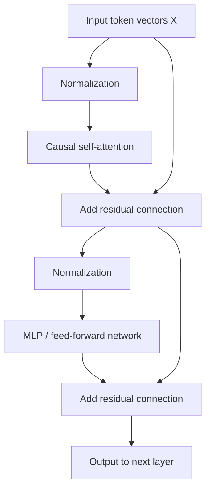

### Attention and MLP have different jobs

- **Attention mixes information across tokens.** It lets the representation of `bank` incorporate relevant information from `money` or `river` elsewhere in the context.
- **The MLP transforms each token's features.** It applies learned nonlinear computation independently at each token position.
- **Residual connections preserve and accumulate information.** A sublayer contributes a change rather than replacing everything.
- **Normalization stabilizes numeric scale.**

---

## 6. Attention: the intuition

Consider the sentence:

```text
The animal did not cross the street because it was tired.
```

To build a useful representation for `it`, the model should retrieve information from `animal`, not primarily from `street`.

Attention works like a differentiable retrieval system:

| Component | Retrieval analogy | Question |
|---|---|---|
| Query `Q` | Search request | What information does this token need? |
| Key `K` | Search index label | What kind of information does this token offer? |
| Value `V` | Retrieved payload | What information should be copied if selected? |

The analogy is useful, but Q, K, and V are learned vectors—not human-readable labels.

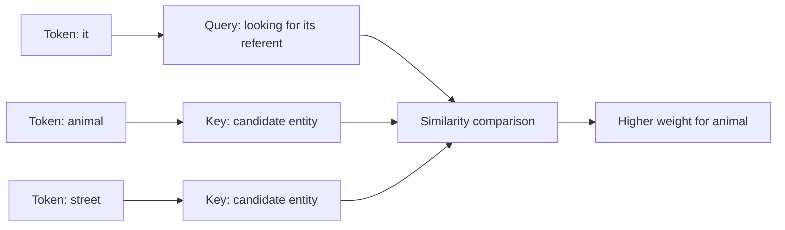

No programmer writes a rule saying `it` must select `animal`. During training, the model learns projections that make useful query-key pairs align.

---

## 7. Attention mathematics, step by step

### 7.1 Produce Q, K, and V

For input matrix `X`, the model has learned parameter matrices `W_Q`, `W_K`, and `W_V`:

$$Q=XW_Q, \qquad K=XW_K, \qquad V=XW_V$$

Every token therefore gets a query, key, and value vector.

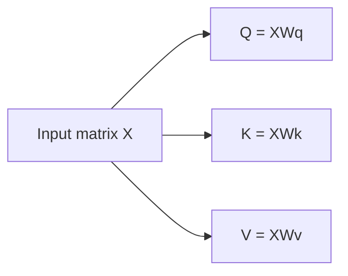

These operations are matrix multiplications. They are learned feature projections: the same input representation is viewed through three different learned lenses.

### 7.2 Compare each query with all eligible keys

The raw attention score from token `i` to token `j` is a dot product:

$$score(i,j)=q_i \cdot k_j$$

The dot product is high when the two vectors point in similar directions in the learned feature space.

Small illustration:

```text
query for "it"       = [0.8, 0.6]
key for "animal"     = [0.9, 0.5]  -> dot = 1.02
key for "street"     = [0.1, 0.2]  -> dot = 0.20
```

So `animal` receives the stronger raw match. Real models use much larger vectors and learned features that are not individually interpretable.

For all tokens simultaneously:

$$Scores = QK^T$$

If the sequence has `S` tokens, this conceptually produces an `S x S` score matrix.

### 7.3 Scale the scores

The scores are divided by the square root of the key dimension:

$$ScaledScores=\frac{QK^T}{\sqrt{d_k}}$$

As vector width grows, raw dot products tend to grow in magnitude. Very large values make softmax extremely peaked and its gradients poorly behaved. Scaling keeps values in a useful numeric range.

### 7.4 Apply the causal mask

A decoder-only LLM must not inspect future tokens while predicting the next token.

```text
                Keys
              T1  T2  T3  T4
Query T1       yes  X   X   X
Query T2       yes yes  X   X
Query T3       yes yes yes  X
Query T4       yes yes yes yes
```

Disallowed future positions receive a value effectively equal to negative infinity before softmax, so their final probability becomes zero.

### 7.5 Softmax turns scores into weights

For one query, softmax converts arbitrary scores into positive weights that sum to one:

$$\alpha_{ij}=\frac{e^{score(i,j)}}{\sum_m e^{score(i,m)}}$$

Example:

| Candidate | Raw score | Attention weight |
|---|---:|---:|
| `animal` | 4.2 | 0.72 |
| `street` | 2.1 | 0.09 |
| `tired` | 3.5 | 0.19 |

This is not necessarily a linguistic explanation. It is a routing weight inside one head of one layer.

### 7.6 Retrieve a weighted combination of values

The output for token `i` is:

$$output_i=\sum_j \alpha_{ij}v_j$$

In matrix form:

$$Attention(Q,K,V)=softmax\left(\frac{QK^T+Mask}{\sqrt{d_k}}\right)V$$

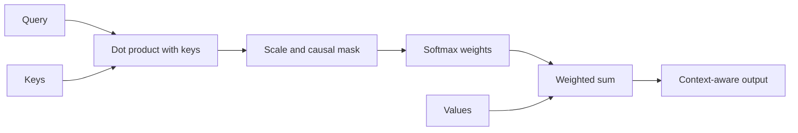

The important separation is:

- **Q and K decide where to retrieve from.**
- **V supplies the content that is retrieved.**

---

## 8. Why multiple attention heads exist

One retrieval pattern is insufficient. Multi-head attention creates several independent Q/K/V projections.

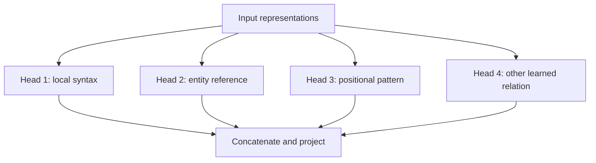

The labels above are intuition, not guaranteed fixed roles. Heads can learn overlapping, distributed, or hard-to-interpret behavior. The practical point is that multiple heads let the model attend through multiple learned subspaces at once.

Some serving-efficient models use grouped-query or multi-query attention. They share fewer K/V heads across more query heads, shrinking the KV cache and memory bandwidth requirement.

---

## 9. What the MLP does

After attention mixes information between tokens, the MLP transforms each token independently.

A simplified MLP is:

$$MLP(x)=W_2\,activation(W_1x)$$

Many modern models use gated variants such as SwiGLU.

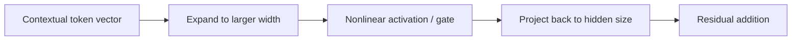

Intuitively, attention gathers relevant information; the MLP computes with the gathered features. Both contain large learned matrices and consume substantial compute and memory.

---

## 10. From final hidden state to the next token

After the last Transformer layer, the representation at the last sequence position is projected to one score per vocabulary token.

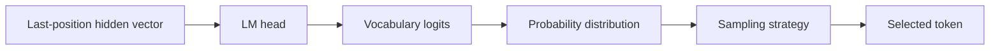

The raw scores are called **logits**. Selection may use:

- greedy decoding: choose the highest score;
- temperature: control distribution sharpness;
- top-k: consider only the best `k` candidates;
- top-p: consider the smallest candidate set reaching probability `p`;
- penalties or constraints: modify candidate scores.

The model itself produces logits. The inference runtime applies decoding policy and randomness.

---

## 11. Prefill: processing the prompt

During prefill, all prompt positions pass through every Transformer layer. Causal masking still applies, but the computations for the prompt tokens can be parallelized.

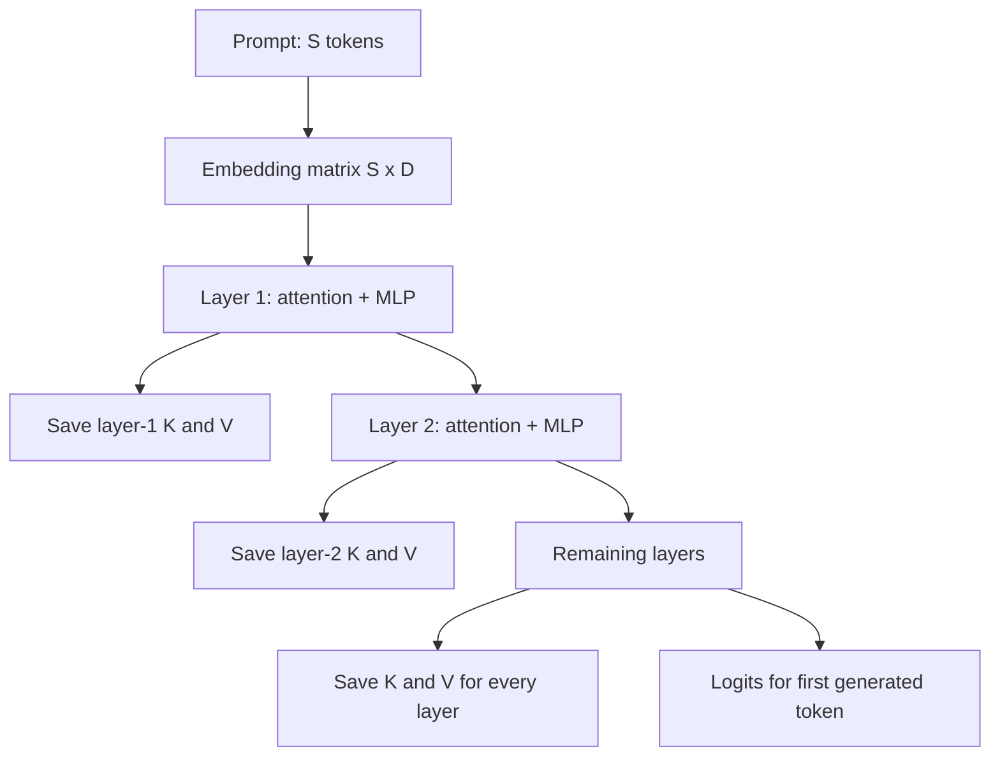

Prefill produces:

1. logits from which the first output token can be selected;
2. a KV cache containing each prompt token's keys and values at every layer.

Prefill mainly uses large matrix-matrix multiplications. With sufficiently large prompts or batches, this can drive GPU Tensor Cores efficiently and is often compute-bound.

### FlashAttention intuition

Naive attention can create large intermediate score matrices and repeatedly move them to and from HBM. FlashAttention computes attention in tiles, keeping useful intermediate data in faster on-chip memory.

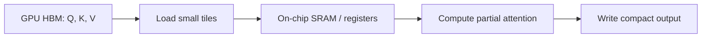

It calculates the same attention result, apart from normal floating-point differences; the optimization is primarily about memory movement and kernel execution.

---

## 12. KV cache: avoiding repeated work

For every layer and previous token, inference stores K and V. During generation, previous tokens' K and V do not change.

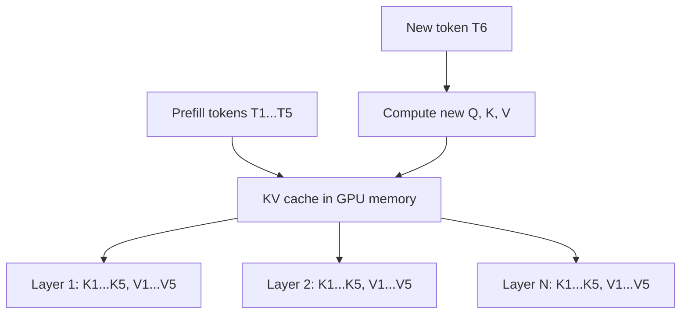

Without a KV cache, the engine would recompute K and V for the entire growing sequence on every generation step. With it, the engine computes Q/K/V only for the new position and lets its query attend to cached keys and values.

A simplified KV-cache size estimate is:

$$2 \times layers \times tokens \times kv\_heads \times head\_dimension \times bytes\_per\_element$$

The factor `2` represents K and V. Batch size and concurrent sequences multiply memory usage. Long context and high concurrency therefore consume substantial GPU memory.

Paged KV-cache systems manage cache storage in blocks rather than requiring one large contiguous allocation per request. This reduces fragmentation and enables sharing for cached prefixes.

---

## 13. Decode: generating tokens one at a time

After prefill, generation is sequential at the sequence level.

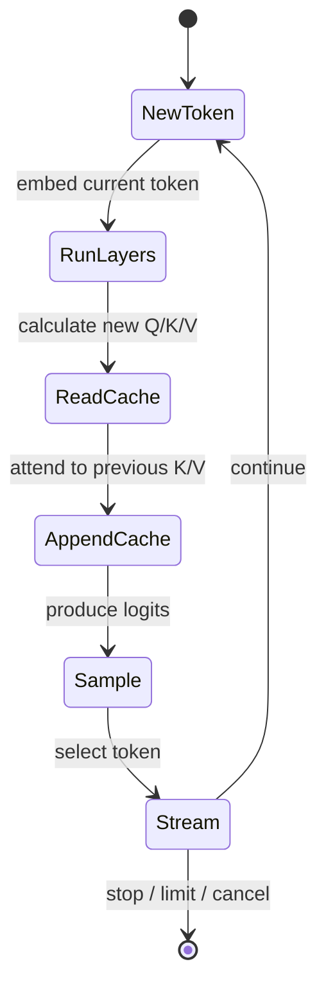

One sequence cannot generate token 102 before token 101 is known. This dependency limits parallelism across time. Serving systems recover GPU utilization by decoding many independent sequences together through continuous batching.

Decode often has small matrix operations per sequence while repeatedly reading large model weights and the growing KV cache. It is therefore commonly memory-bandwidth-bound.

---

## 14. Why GPUs are preferred

### 14.1 LLM computation is dominated by matrix operations

Transformer inference repeatedly performs operations such as:

```text
X x WQ
X x WK
X x WV
attention weights x V
X x MLP weights
hidden state x vocabulary weights
```

These contain enormous numbers of multiply-accumulate operations that can be executed in parallel.

### 14.2 CPU and GPU design priorities differ

| CPU | GPU |
|---|---|
| Few powerful, general-purpose cores | Many parallel execution units |
| Optimized for low-latency control flow | Optimized for high-throughput numeric work |
| Large caches and branch prediction | Massive parallelism and high memory bandwidth |
| Excellent for API logic, scheduling, tokenization | Excellent for dense tensor operations |

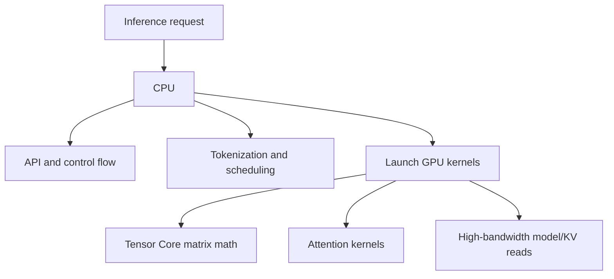

### 14.3 Specialized tensor hardware

Modern GPUs contain Tensor Cores designed for matrix multiply-accumulate operations in formats such as FP16, BF16, FP8, and integer formats. LLM inference can tolerate reduced precision when it is applied carefully, increasing throughput and reducing memory use.

### 14.4 High-bandwidth memory matters

Arithmetic is only useful if data reaches the compute units quickly. GPU HBM provides much higher bandwidth than ordinary server memory. This is critical during decode, when model weights and KV-cache data must be read repeatedly.

### 14.5 The programming ecosystem matters

CUDA, optimized kernels, compiler stacks, communication libraries, and frameworks make GPUs practical for production LLM serving. Hardware speed alone is not the full explanation.

### Important correction

GPUs are not universally better than CPUs. CPUs remain suitable for small models, low request volumes, highly quantized workloads, cost-constrained deployments, tokenization, routing, and orchestration. GPUs win for most large-model workloads because the workload matches their parallel compute and memory architecture.

---

## 15. Compute-bound versus memory-bound

Performance is limited by whichever resource cannot keep up: arithmetic throughput or memory movement.

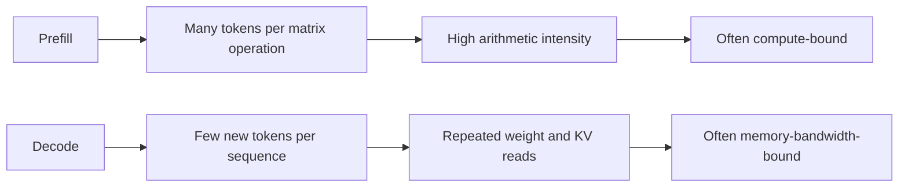

| Property | Prefill | Decode |
|---|---|---|
| New positions processed | Entire prompt/chunk | Usually one per sequence |
| Typical operation shape | Matrix-matrix | Smaller matrix/vector-like work |
| Parallelism | High across prompt tokens | High mainly across batched sequences |
| Common bottleneck | Compute | HBM bandwidth |
| User-facing metric | TTFT | TPOT / inter-token latency |

This is a tendency, not a law. Model size, prompt length, batch size, hardware, parallelism, kernels, and quantization can move either phase to a different bottleneck.

---

## 16. How a model spans multiple GPUs

A model may not fit on one GPU, or one GPU may not meet the throughput target.

| Technique | Basic idea | Main trade-off |
|---|---|---|
| Tensor parallelism | Split a layer's matrix work across GPUs | Frequent communication within layers |
| Pipeline parallelism | Put different layer ranges on different GPUs | Pipeline bubbles and scheduling complexity |
| Data parallelism | Replicate the model and route requests to replicas | Requires a full model copy per replica group |
| Expert parallelism | Place different MoE experts on different GPUs | Token routing and all-to-all communication |

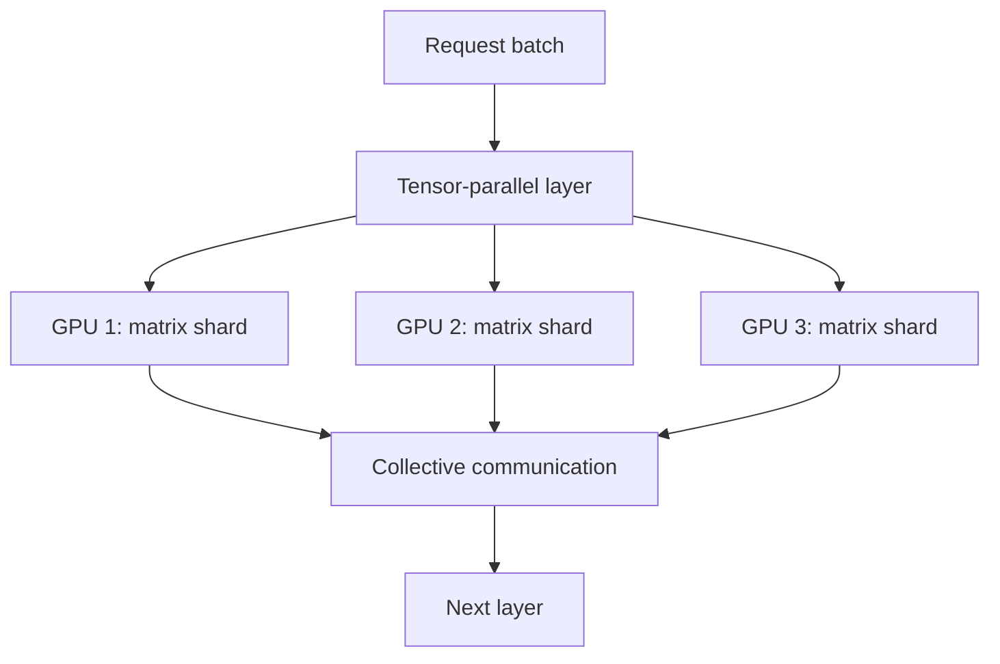

NVLink/NVSwitch can provide fast intra-node GPU communication. Multi-node serving may use high-speed network fabrics and collective communication libraries. Poor communication topology can erase gains from added GPUs.

---

## 17. Production serving architecture

```mermaid
flowchart TB
    U["Clients"] --> G["API gateway"]
    G --> R["Model-aware router"]
    R --> Q["Admission control / queue"]
    Q --> S["Inference scheduler"]
    S --> P["GPU worker replicas"]
    P --> K["Model weights + KV cache"]
    P --> T["Token stream"]
    T --> U
    P --> M["Metrics and tracing"]
    M --> A["Autoscaling / capacity policy"]
```

The infrastructure must handle:

- model loading and warm-up;
- GPU placement and topology awareness;
- continuous batching and fairness;
- KV-cache allocation and eviction;
- prompt-prefix caching;
- backpressure and overload rejection;
- request cancellation and cache cleanup;
- multi-tenancy and isolation;
- retries without duplicating streamed output;
- autoscaling despite long model-load times;
- observability at request, scheduler, worker, and GPU levels.

### Metrics that matter

| Metric | Meaning |
|---|---|
| TTFT | Time from request arrival to first output token |
| TPOT | Average time per output token after the first |
| Inter-token latency | Gap between consecutive streamed tokens |
| Tokens/second | Token throughput per request, worker, or deployment |
| Requests/second | Completed request throughput |
| Queue time | Time waiting before GPU execution |
| KV-cache utilization | Fraction of cache capacity in use |
| GPU utilization | How busy GPU execution units are |
| HBM bandwidth utilization | How heavily GPU memory bandwidth is used |
| p95/p99 latency | Tail latency experienced by slower requests |

Throughput and latency conflict. Larger batches usually use hardware more efficiently but can increase queueing and per-request latency.

---

## 18. Common inference optimizations

| Optimization | Core idea | Primary benefit |
|---|---|---|
| Continuous batching | Rebuild the active batch every iteration | Better utilization under variable request lengths |
| PagedAttention / paged KV cache | Allocate KV memory in blocks | Less fragmentation and flexible allocation |
| Prefix caching | Reuse KV cache for identical prefixes | Avoid repeated prefill work |
| Chunked prefill | Split long prefills into chunks | Prevent long prompts from blocking decode work |
| Quantization | Store/compute weights at lower precision | Lower memory and potentially higher throughput |
| FlashAttention | Tile attention to reduce HBM traffic | Faster, memory-efficient attention |
| Speculative decoding | Draft several tokens with a cheaper method, verify with target model | Reduce target-model decode steps |
| CUDA graphs | Replay stable GPU execution graphs | Reduce CPU/kernel-launch overhead |
| Prefill/decode disaggregation | Use separate worker pools for different phases | Independently tune and scale dissimilar workloads |

---

## 19. What an LLM is and is not doing

### It is doing

- learned vector transformations;
- content-dependent information routing through attention;
- nonlinear feature computation through MLPs;
- next-token probability estimation;
- repeated autoregressive generation.

### It is not doing

- searching a relational database of memorized sentences on every token;
- assigning fixed human-readable meanings to individual neurons;
- guaranteeing factual correctness because a token is probable;
- executing symbolic logic in the same explicit way as conventional code;
- understanding attention weights as explanations intended for humans.

The model can implement behavior resembling retrieval, reasoning, planning, or algorithms through learned numeric computation, but its output remains probabilistic and can be wrong.

---

## 20. Complete sequence: prompt to streamed response

```mermaid
sequenceDiagram
    participant Client
    participant API as API / Router
    participant Scheduler
    participant GPU
    Client->>API: Prompt request
    API->>API: Validate, template, tokenize
    API->>Scheduler: Token IDs and generation config
    Scheduler->>GPU: Batched prefill
    GPU->>GPU: Embeddings, layers, build KV cache
    GPU-->>Scheduler: First-token logits
    Scheduler->>GPU: Batched decode iteration
    GPU->>GPU: Read weights/KV, append new KV
    GPU-->>Scheduler: Next-token logits
    Scheduler-->>Client: Stream selected token
    loop Until stop, limit, or cancel
        Scheduler->>GPU: Next decode iteration
        GPU-->>Scheduler: Next-token logits
        Scheduler-->>Client: Stream token
    end
    Scheduler->>GPU: Release request KV blocks
```

---

## 21. A compact worked example

Prompt:

```text
The dog chased the ball because it was
```

1. The CPU tokenizer produces token IDs.
2. The scheduler places the sequence into a prefill batch.
3. The GPU maps IDs to embeddings and adds positional information.
4. Each Transformer layer creates Q, K, and V.
5. Queries compare against eligible keys; the causal mask blocks future positions.
6. Softmax creates routing weights; weighted values contextualize each token.
7. MLPs transform the contextual features.
8. K and V for every prompt position are stored in the KV cache.
9. The final hidden vector produces vocabulary logits, perhaps favoring ` moving`, ` red`, or ` fast` depending on learned context.
10. A decoding policy selects one token and streams it.
11. For the next step, only the new position is processed; old K/V values are reused.
12. Generation continues until a stop condition.

---

## 22. Interview-ready summary

> An LLM is a decoder-only Transformer that repeatedly predicts the next token. Text is tokenized on the CPU, then token IDs are embedded and processed by many GPU Transformer layers. Self-attention creates learned queries, keys, and values: query-key dot products measure routing compatibility, scaling stabilizes them, causal masking blocks future tokens, softmax converts scores to weights, and the weighted sum of values retrieves context. MLPs then perform nonlinear feature transformations. During prefill, the GPU processes prompt tokens in parallel and builds a per-layer KV cache. During decode, it processes one new position per sequence and reuses cached K/V. GPUs are preferred because Transformer inference is dominated by massively parallel matrix operations and high-bandwidth memory access. Prefill is commonly compute-bound, while decode is commonly memory-bandwidth-bound, which drives optimizations such as continuous batching, paged KV caches, FlashAttention, quantization, prefix caching, and disaggregated prefill/decode serving.

## 23. Check your understanding

You understand the core system if you can answer these without memorization:

1. Why does an LLM generate one output token at a time?
2. Why can prompt tokens be processed in parallel despite causal attention?
3. What different roles do Q, K, and V serve?
4. Why use a query-key dot product?
5. Why divide by `sqrt(d_k)` before softmax?
6. What does the causal mask prevent?
7. Why is attention output a weighted sum of values?
8. Why do we need multiple attention heads?
9. What is stored in the KV cache, and why?
10. Why is prefill often compute-bound while decode is memory-bound?
11. How does continuous batching improve GPU utilization?
12. Which backend controls are needed before work reaches the GPU?

