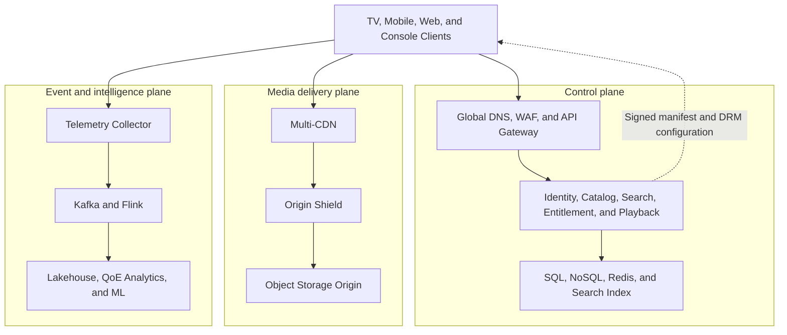
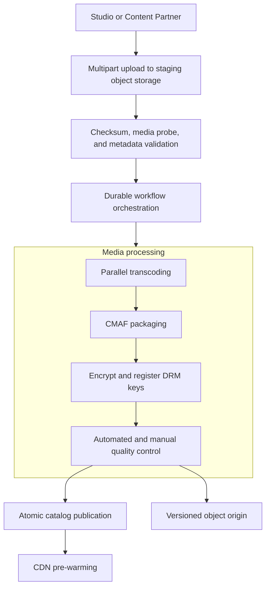
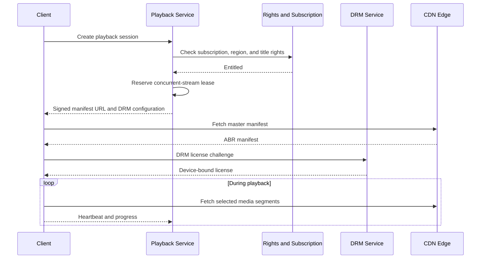
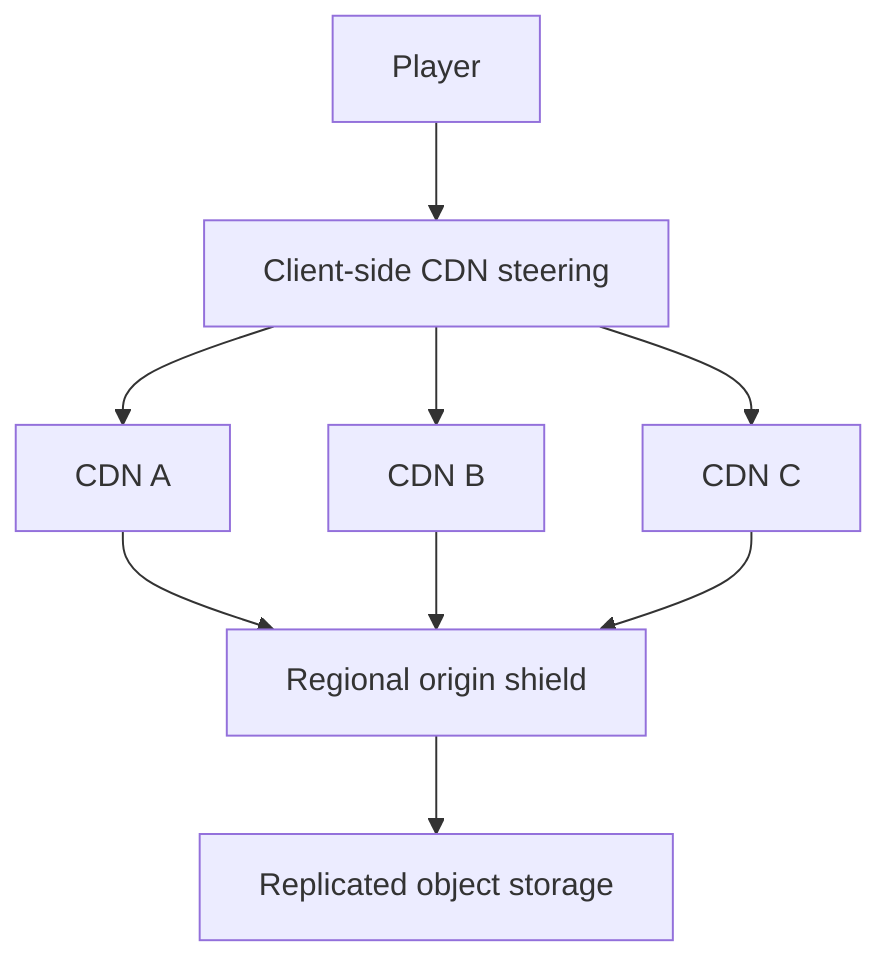
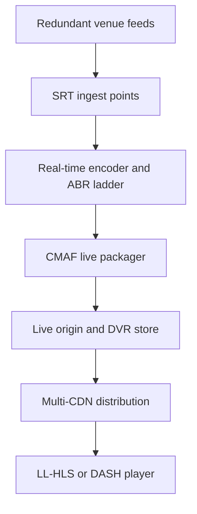
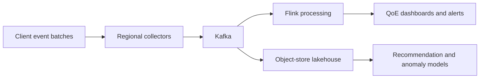

# End-to-End OTT Streaming Platform Design

The core design principle:

> Application servers authorize playback; CDNs deliver video. Never stream media through backend services.

This design supports:

- Video on demand: movies, episodes, and clips
- Scheduled premieres and live events
- Web, mobile, TV, and gaming-console clients
- Multiple audio tracks and subtitles
- Subscription and ad-supported plans
- DRM, geo-restrictions, and concurrent-stream limits
- Personalized catalog, search, and recommendations

## 1. Scale assumptions

| Metric | Assumption |
|---|---:|
| Monthly active users | 50 million |
| Daily active users | 10 million |
| Peak concurrent viewers | 2 million |
| Average watch time | 2 hours/day |
| Average delivered bitrate | 5 Mbps |
| Catalog | 100,000 titles |
| Playback sessions/day | 30 million |
| QoE event interval | 10 seconds |
| Progress checkpoint interval | 30 seconds |

### Bandwidth

Peak CDN bandwidth:

$$
2{,}000{,}000 \times 5\text{ Mbps} = 10\text{ Tbps}
$$

Daily delivery:

$$
10M \times 2h \times 5Mbps \div 8 \approx 45PB/day
$$

At an illustrative effective CDN cost of `$0.01/GB`:

$$
45M\ GB/day \times \$0.01 \approx \$450K/day
$$

Bandwidth dominates cost. A 10% bitrate reduction saves roughly `4.5 PB/day`. This is why per-title encoding, AV1, and CDN optimization have huge business value.

### Segment request rate

With separate audio/video tracks and four-second segments:

$$
2M \times \frac{2}{4} \approx 1M\ segment\ requests/sec
$$

At a 98% CDN cache hit rate:

$$
1M \times 2\% = 20K\ origin\ requests/sec
$$

An origin shield can reduce object-store requests further.

### Event traffic

QoE telemetry every 10 seconds:

$$
2M / 10 = 200K\ events/sec
$$

Progress updates every 30 seconds:

$$
2M / 30 \approx 67K\ writes/sec
$$

Progress should therefore be handled asynchronously, not as synchronous relational writes.

### Media storage

| Rendition | Bitrate |
|---|---:|
| 2160p | 15 Mbps |
| 1080p | 6 Mbps |
| 720p | 3 Mbps |
| 480p | 1.5 Mbps |
| 360p | 0.8 Mbps |
| Audio and overhead | 0.7 Mbps |
| **Total** | **27 Mbps** |

For an average two-hour asset:

$$
27Mbps \times 7200 / 8 \approx 24.3GB
$$

For 100,000 assets:

$$
24.3GB \times 100K \approx 2.43PB
$$

Adding high-quality mezzanine files, alternate audio, and three-region replication can push total storage above `15–20 PB`.

---

## 2. High-level architecture



The planes scale independently:

- **Control plane:** thousands to tens of thousands of requests per second.
- **Media plane:** terabits per second and millions of requests per second.
- **Event plane:** hundreds of thousands of events per second.

---

## 3. Main services

| Service | Responsibility | Preferred storage |
|---|---|---|
| Identity | Login, tokens, devices | Identity provider + SQL |
| Account | Subscription and billing state | Strongly consistent SQL |
| Profile | Preferences, maturity settings | DynamoDB/Cassandra/Cosmos DB |
| Catalog | Titles, seasons, episodes, availability | SQL source + NoSQL read model |
| Rights | Region, plan, and time-window licensing | SQL with cached projections |
| Search | Text, language, genre, actors | OpenSearch/Elasticsearch |
| Recommendation | Personalized rows and ranking | Feature store + model serving |
| Playback session | Entitlement, concurrency, and manifest issuance | Redis + durable event log |
| Progress | Resume position and watch history | NoSQL + Kafka |
| DRM | License issuance and content-key access | HSM/KMS-backed system |
| Content workflow | Ingest, encode, QC, package, and publish | Workflow engine + object store |
| Telemetry | QoE, business, and security events | Kafka + lakehouse |
| Notification | New episode and subscription events | Kafka + push/email providers |

Use REST or GraphQL from clients and gRPC internally where low latency and typed contracts matter.

---

## 4. VOD ingestion and publishing



### Processing sequence

1. The content partner requests a multipart, presigned upload URL.
2. The mezzanine file uploads directly to object storage.
3. Validate checksum, codecs, frame rate, resolution, audio, subtitles, and container integrity.
4. Create a durable workflow execution.
5. Produce a per-title adaptive-bitrate ladder.
6. Align keyframes across every rendition.
7. Package into CMAF fragmented MP4 segments.
8. Encrypt segments and register content keys.
9. Run automated and manual quality checks.
10. Write immutable, versioned assets.
11. Atomically switch the catalog pointer to the new version.
12. Pre-warm popular episodes before scheduled release.

Quality checks cover:

- VMAF/PSNR quality
- Audio loudness and synchronization
- Black and frozen frames
- Subtitle alignment
- Missing or corrupt segments

### Why immutable versions?

Never overwrite published segments. Use paths such as:

```text
/content/{contentId}/{version}/{rendition}/{segment}.m4s
```

Benefits:

- Maximum CDN cacheability
- Safe rollback
- No partially published assets
- No stale segment/manifest mismatch

### Transcoding choices

- **CPU:** H.264 and cost-efficient batch processing.
- **GPU/ASIC:** faster turnaround for premieres and live events.
- **Per-title encoding:** better quality per byte but more processing complexity.
- **H.264:** universal compatibility.
- **HEVC:** good compression and strong Apple/TV support, but licensing complexity.
- **VP9:** good browser and Android support.
- **AV1:** better compression, but expensive encoding and incomplete legacy support.

---

## 5. Playback flow



### Playback-session API

```http
POST /v1/playback-sessions
Authorization: Bearer <access-token>
```

```json
{
  "profileId": "profile-42",
  "contentId": "episode-981",
  "deviceId": "tv-123",
  "capabilities": {
    "codecs": ["av1", "hevc", "h264"],
    "maxResolution": "2160p",
    "drm": ["widevine"],
    "hdr": ["hdr10"]
  }
}
```

Response:

```json
{
  "sessionId": "ps-123",
  "manifestUrl": "https://cdn.example.com/.../master.m3u8?token=...",
  "licenseUrl": "https://drm.example.com/widevine",
  "heartbeatIntervalSeconds": 30,
  "expiresAt": "2026-09-05T18:30:00Z"
}
```

### Playback authorization checks

1. Access token and profile
2. Subscription or transactional entitlement
3. Title availability window
4. Country and regional rights
5. Device capability
6. Parental control
7. Concurrent-stream limit
8. VPN/proxy or fraud policy
9. Applicable ads and playback policy

The service returns a short-lived signed manifest URL. It never returns raw DRM keys.

---

## 6. Adaptive bitrate streaming

The client receives a master manifest with several renditions:

| Resolution | Bitrate |
|---|---:|
| 2160p | 15 Mbps |
| 1080p | 6 Mbps |
| 720p | 3 Mbps |
| 480p | 1.5 Mbps |
| 360p | 0.8 Mbps |

The player estimates:

- Recent download throughput
- Current buffer duration
- Decoder capability and display resolution
- Battery and data-saving mode
- Playback errors and CDN health

A simplified selection rule:

$$
SelectedBitrate < EstimatedBandwidth \times 0.75
$$

The safety margin avoids aggressive switching and rebuffers. The player starts with a modest rendition, upgrades conservatively after throughput stabilizes, and downgrades aggressively when the buffer falls.

Important QoE metrics:

- Video-start failure rate
- Time to first frame
- Rebuffer ratio
- Average delivered bitrate
- Fatal playback errors
- Quality-switch frequency
- DRM license latency
- CDN throughput and error rate

---

## 7. Media formats and protocols

| Area | Choice | Reason |
|---|---|---|
| Client APIs | HTTPS REST/GraphQL | Broad compatibility |
| Internal RPC | gRPC over HTTP/2 | Typed, efficient service communication |
| VOD playback | HLS and MPEG-DASH | Device ecosystem coverage |
| Shared media format | CMAF/fMP4 | Reuse segments across HLS and DASH |
| CDN transport | HTTP/2 and HTTP/3/QUIC | Multiplexing and better loss recovery |
| Live contribution | SRT or RIST | Reliable transport over the public internet |
| Legacy ingest | RTMP | Encoder compatibility |
| Event streaming | Kafka/Pulsar | High-throughput durable log |
| Stream processing | Flink/Kafka Streams | Stateful real-time processing |
| DRM | Widevine, FairPlay, PlayReady | Android/web, Apple, Microsoft/TV coverage |
| Authentication | OAuth 2.0/OIDC | Standardized identity |
| Service authorization | mTLS + workload identity | Zero-trust internal communication |

### HLS versus DASH

| HLS | DASH |
|---|---|
| Required for Apple ecosystems | Open MPEG standard |
| Excellent device support | Flexible codec and DRM combinations |
| FairPlay integration | Widevine/PlayReady commonly used |
| LL-HLS supports lower latency | Low-latency DASH is also available |

Use CMAF segments underneath both to avoid duplicated storage.

---

## 8. CDN and origin design



### Multi-CDN routing signals

- User geography and ISP
- Real-user QoE measurements
- CDN price and capacity commitments
- Current errors and throughput
- Content availability
- Live-event health

DNS-only steering reacts slowly because of DNS caching. Client-side steering can switch during playback but increases player complexity. A mature system uses both.

### Cache strategy

- Versioned video segments: cache for months
- VOD manifests: cache for minutes
- Live manifests: cache for one segment duration or less
- Personalized ad manifests: uncacheable or partially cacheable
- Subtitle and artwork assets: long TTL
- Request collapsing at the shield to prevent cache stampedes

For a major release, encode and publish early, warm the first segments in major regions, add retry jitter, use origin shields, pre-scale DRM/playback authorization, and keep content inaccessible via entitlement metadata until release time.

---

## 9. Live streaming



Live-specific requirements:

- Dual encoders and redundant input feeds
- Two independent ingest regions
- Automated feed failover
- Frame-synchronized keyframes
- DVR/windowed playback
- Live clipping and replay generation
- SCTE-35 markers for ad breaks
- Fast event teardown after completion

| Technology | Typical latency | Trade-off |
|---|---:|---|
| Standard HLS/DASH | 15–30 seconds | Reliable and highly cacheable |
| LL-HLS/LL-DASH | 3–8 seconds | More origin, CDN, and client complexity |
| WebRTC | Under 1 second | Expensive at massive broadcast scale |

LL-HLS is usually sufficient for OTT episodes and sports. WebRTC is justified for interactive watch parties, auctions, or betting—not ordinary viewing.

---

## 10. Data and consistency model

| Data | Consistency | Reason |
|---|---|---|
| Payment and subscription | Strong | Financial correctness |
| Content rights | Strong source, cached reads | Prevent unauthorized playback |
| Concurrent-stream counter | Lease-based, near-strong | Strict global locking hurts availability |
| Catalog metadata | Eventual | Short propagation delays are acceptable |
| Recommendations | Eventual | Staleness is acceptable |
| Watch progress | Read-your-writes where possible | Users expect resume continuity |
| Likes and watchlist | Read-your-writes | Direct user action |
| QoE events | At-least-once | Duplicates are preferable to blocking playback |

### Concurrent-stream enforcement

Store a lease for each active session:

```text
Key: accountId
Value: {sessionId, deviceId, expiresAt}
TTL: 60 seconds
Renewal: every 30 seconds
```

Use an atomic Redis/Lua or conditional NoSQL operation. If the client disappears, the lease expires. During a regional partition, limited temporary over-subscription may occur. Perfect global enforcement would add latency and reduce playback availability.

### Watch progress

```text
(profileId, contentId) -> position, eventTime, sessionId, sequence
```

- The client checkpoints every 30 seconds.
- Pause or stop sends an immediate update.
- Events enter Kafka.
- Consumers compact multiple checkpoints.
- Conflicts use server time plus session sequence.
- Clients retry with an idempotency key.

End-to-end exactly-once delivery is unrealistic because mobile clients retry. Use at-least-once delivery and idempotent processing.

---

## 11. Telemetry pipeline



Example event:

```json
{
  "eventId": "uuid",
  "sessionId": "ps-123",
  "sequence": 140,
  "eventType": "rebuffer_end",
  "contentId": "episode-981",
  "cdn": "cdn-a",
  "bitrateKbps": 3000,
  "bufferMs": 8500,
  "durationMs": 721,
  "timestamp": 1788632400000
}
```

Partition playback events by `sessionId` so events for a single session remain ordered.

Processing outputs:

- CDN health by ISP and region
- Startup failure and rebuffer anomaly detection
- Content popularity and concurrent-viewer metrics
- Recommendation features
- Fraud and credential-sharing signals

---

## 12. Regional architecture and reliability

Use independent regional cells instead of one globally coupled deployment. Each cell contains an API gateway, playback and entitlement services, Redis, regional database replicas, Kafka ingestion, DRM license capacity, and an origin shield.

Users have a home cell, but playback can fail over to another healthy cell.

| Failure | Behavior |
|---|---|
| Recommendation unavailable | Return cached trending/popular rows |
| Search unavailable | Preserve browse and direct playback |
| Progress service unavailable | Buffer locally and retry |
| Telemetry unavailable | Drop low-priority events before affecting playback |
| One CDN fails | Player switches to another CDN |
| Origin region fails | CDN/shield uses replicated origin |
| DRM region fails | Route to another HSM-backed DRM region |
| Rights service fails | Use short-lived cached signed entitlement |
| Primary live feed fails | Switch to secondary synchronized feed |
| Kafka overloaded | Sample analytics events; preserve security/billing events |

The playback path must not synchronously depend on recommendations, analytics, or notifications.

### Suggested SLOs

| Metric | Target |
|---|---:|
| Playback authorization availability | 99.99% |
| Successful video starts | >99.8% |
| API p99 latency | <250 ms |
| Manifest p95 latency | <200 ms |
| Time to first frame p95 | <2–3 seconds |
| Rebuffer ratio | <0.5% |
| VOD media durability | 11 nines via object storage |
| Control-plane regional RTO | <15 minutes |
| Published media RPO | Near zero |

---

## 13. Security and content protection

Use layered protection:

- OAuth/OIDC access tokens
- Short-lived signed manifests, URLs, or CDN cookies
- TLS everywhere
- Widevine, FairPlay, and PlayReady DRM
- Content keys stored in HSM/KMS
- Device-bound DRM licenses
- HDCP requirements for premium resolutions
- Geo-rights enforcement
- Rooted-device and emulator risk signals
- Forensic watermarking for premium releases
- Credential-sharing and impossible-travel detection
- DDoS/WAF protection
- Rate limits by account, device, IP, and token
- Audit logs for content and rights changes

A CDN token prevents casual URL sharing. DRM protects encrypted media after download. They solve different problems, and both are required.

---

## 14. Ad-supported streaming

For server-side ad insertion (SSAI):

1. The player requests playback.
2. The ad decision service chooses a campaign.
3. A manifest manipulator inserts ad segments.
4. Content and ads use compatible codecs and segment boundaries.
5. Playback appears continuous.
6. Client and server generate impression events.

| SSAI | Client-side ad insertion |
|---|---|
| Harder to block | Easier to implement |
| Smoother TV experience | Better client interactivity |
| Personalized manifests hurt cacheability | Main content manifests stay cacheable |
| Complex measurement and stitching | More playback discontinuities |

A hybrid is common: server-side stitching with client-side measurement and interactive overlays.

---

## 15. Recommended technology stack

These are examples, not mandatory prescriptions.

| Layer | Options |
|---|---|
| Clients | Kotlin, Swift, React, TV-native SDKs |
| Edge gateway | Envoy, NGINX, managed API gateway |
| Backend | Java/Kotlin + Spring Boot, Go, Rust |
| Service orchestration | Kubernetes |
| Workflow engine | Temporal, Step Functions, Durable Functions |
| Transactional database | PostgreSQL, Aurora, CockroachDB |
| High-scale key-value | DynamoDB, Cassandra, Cosmos DB |
| Cache and leases | Redis |
| Search | OpenSearch/Elasticsearch |
| Event backbone | Kafka/Pulsar |
| Stream processing | Flink/Kafka Streams |
| Media processing | FFmpeg + GPU/ASIC encoding workers |
| Object storage | S3, Blob Storage, GCS |
| Analytics | Iceberg/Delta Lake + Spark/Trino |
| Real-time analytics | ClickHouse, Druid, Pinot |
| Observability | OpenTelemetry, Prometheus, Grafana |
| Secrets and keys | Vault, cloud KMS, HSM |
| Infrastructure | Terraform + GitOps |

---

## 16. Important trade-offs

| Decision | Choice | Cost/trade-off |
|---|---|---|
| Segment duration | 4–6 seconds for normal VOD | Better cache efficiency but higher latency |
| Low-latency segments | 1–2 seconds or CMAF chunks | Lower latency but more requests and overhead |
| Fixed bitrate ladder | Simple and predictable | Wastes bandwidth on easy-to-encode content |
| Per-title ladder | Better quality per byte | More analysis and encoding cost |
| Single CDN | Operationally simple | Vendor outage and pricing risk |
| Multi-CDN | Resilience and negotiation leverage | Steering and observability complexity |
| Strict stream limits | Prevents account sharing | Global coordination can block legitimate playback |
| Lease-based limits | Highly available | Brief over-subscription is possible |
| Global database | Easier logical model | High write latency and failure coupling |
| Regional cells | Failure isolation | Replication and routing complexity |
| SSAI | Better ad delivery | Reduces manifest cacheability |
| H.264 only | Maximum compatibility | Higher bandwidth |
| AV1 | Large bandwidth savings | Encoding and device-support cost |
| Very short DRM licenses | Better security | More requests and outage sensitivity |
| Longer DRM licenses | Better offline/resilience | Increased content-leak risk |

---

## 17. Staff-level architectural decisions

The most important decisions to defend in an interview are:

1. **Separate control, media, and event planes.**
2. **Use CDNs and immutable media objects; never proxy video through application services.**
3. **Standardize on CMAF while exposing HLS and DASH manifests.**
4. **Build regional cells to limit blast radius.**
5. **Keep playback independent of noncritical services.**
6. **Use lease-based concurrency instead of global distributed locks.**
7. **Treat client events as at-least-once and build idempotent consumers.**
8. **Optimize bitrate because network delivery—not compute—is the dominant cost.**
9. **Use multi-CDN steering driven by actual player QoE.**
10. **Publish content atomically using versioned manifests and assets.**

For an interview, begin with scale and the playback critical path. Then cover ingestion, CDN delivery, data consistency, failure handling, and trade-offs. Search, recommendations, and billing should remain supporting systems unless the interviewer explicitly drills into them.
