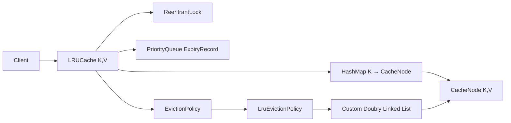

# Production-Quality LRU Cache in Java 21

> Interview-focused implementation covering:
>
> - Generic `LRUCache<K, V>`
> - `HashMap + Doubly Linked List`
> - Pluggable `EvictionPolicy`
> - Thread safety
> - `synchronized` vs `ReentrantLock`
> - TTL support
> - LRU → LFU extension
> - Runnable Java 21 code

---

## 1. Requirements

We want a bounded in-memory cache with:

```text
get(key)
put(key, value)
put(key, value, ttl)
remove(key)
size()
```

For normal LRU operations:

```text
get    -> O(1)
put    -> O(1)
remove -> O(1)
```

TTL maintenance adds heap work:

```text
put with TTL        -> O(log n)
expired-entry purge -> O(k log n)
```

where `k` is the number of expired expiry records removed.

---

## 2. Why HashMap + Doubly Linked List?

A `HashMap<K, Node<K,V>>` gives O(1) lookup.

A doubly linked list gives O(1):

- remove arbitrary node
- move node to MRU position
- remove LRU node

Recency ordering:

```text
HEAD <-> least recently used ... most recently used <-> TAIL
```

### Example

```text
put(A)
put(B)
put(C)

LRU                           MRU
HEAD <-> A <-> B <-> C <-> TAIL

get(A)

LRU                           MRU
HEAD <-> B <-> C <-> A <-> TAIL
```

If capacity is 3 and we now execute:

```text
put(D)
```

`B` is evicted.

---

## 3. Architecture



The cache owns synchronization.

`LruEvictionPolicy` itself is intentionally not thread-safe because every policy operation is invoked while the cache lock is held.

---

# 4. Complete Runnable Java 21 Code

Save as:

```text
CacheDemo.java
```

```java
import java.time.Duration;
import java.util.HashMap;
import java.util.Map;
import java.util.Objects;
import java.util.Optional;
import java.util.PriorityQueue;
import java.util.concurrent.locks.ReentrantLock;

public final class CacheDemo {

    public static void main(String[] args) throws Exception {
        System.out.println("=== LRU ===");
        LRUCache<String, Integer> lru = new LRUCache<>(2, new LruEvictionPolicy<>());
        lru.put("A", 1);
        lru.put("B", 2);
        lru.get("A");              // A becomes MRU; B becomes LRU.
        lru.put("C", 3);           // Evicts B.

        System.out.println("A = " + lru.get("A"));
        System.out.println("B = " + lru.get("B"));
        System.out.println("C = " + lru.get("C"));

        System.out.println("\n=== TTL ===");
        lru.put("TEMP", 99, Duration.ofMillis(50));
        Thread.sleep(80);
        System.out.println("TEMP = " + lru.get("TEMP"));
        System.out.println("size = " + lru.size());

        System.out.println("\n=== LFU ===");
        LFUCache<String, Integer> lfu = new LFUCache<>(2);
        lfu.put("A", 1);
        lfu.put("B", 2);
        lfu.get("A");              // freq(A)=2, freq(B)=1
        lfu.put("C", 3);           // Evicts B.

        System.out.println("A = " + lfu.get("A"));
        System.out.println("B = " + lfu.get("B"));
        System.out.println("C = " + lfu.get("C"));
    }

    // ---------------------------------------------------------------------
    // Shared node type used by the LRU cache and its eviction policy.
    // ---------------------------------------------------------------------

    static final class CacheNode<K, V> {
        final K key;
        V value;
        CacheNode<K, V> prev;
        CacheNode<K, V> next;

        // Long.MAX_VALUE means "no expiry".
        long expiresAtNanos = Long.MAX_VALUE;

        // Incremented whenever the entry is updated. This lets the TTL heap
        // ignore stale expiry records without doing O(n) heap deletions.
        long version;

        CacheNode(K key, V value) {
            this.key = key;
            this.value = value;
        }

        boolean isExpired(long nowNanos) {
            return expiresAtNanos != Long.MAX_VALUE
                    && nowNanos - expiresAtNanos >= 0;
        }
    }

    interface EvictionPolicy<K, V> {
        void onAccess(CacheNode<K, V> node);

        void onInsert(CacheNode<K, V> node);

        void onRemove(CacheNode<K, V> node);

        CacheNode<K, V> evictionCandidate();
    }

    /**
     * LRU policy implemented using a custom doubly linked list.
     * head.next = least recently used
     * tail.prev = most recently used
     *
     * This class deliberately has no internal locking. LRUCache owns the lock
     * and invokes every policy method while that lock is held.
     */
    static final class LruEvictionPolicy<K, V> implements EvictionPolicy<K, V> {
        private final CacheNode<K, V> head = new CacheNode<>(null, null);
        private final CacheNode<K, V> tail = new CacheNode<>(null, null);

        LruEvictionPolicy() {
            head.next = tail;
            tail.prev = head;
        }

        @Override
        public void onAccess(CacheNode<K, V> node) {
            unlink(node);
            linkBeforeTail(node);
        }

        @Override
        public void onInsert(CacheNode<K, V> node) {
            linkBeforeTail(node);
        }

        @Override
        public void onRemove(CacheNode<K, V> node) {
            unlink(node);
        }

        @Override
        public CacheNode<K, V> evictionCandidate() {
            return head.next == tail ? null : head.next;
        }

        private void unlink(CacheNode<K, V> node) {
            if (node.prev == null || node.next == null) {
                return;
            }

            node.prev.next = node.next;
            node.next.prev = node.prev;
            node.prev = null;
            node.next = null;
        }

        private void linkBeforeTail(CacheNode<K, V> node) {
            CacheNode<K, V> last = tail.prev;
            last.next = node;
            node.prev = last;
            node.next = tail;
            tail.prev = node;
        }
    }

    static final class ExpiryRecord<K> implements Comparable<ExpiryRecord<K>> {
        final K key;
        final long expiresAtNanos;
        final long version;

        ExpiryRecord(K key, long expiresAtNanos, long version) {
            this.key = key;
            this.expiresAtNanos = expiresAtNanos;
            this.version = version;
        }

        @Override
        public int compareTo(ExpiryRecord<K> other) {
            return Long.compare(this.expiresAtNanos, other.expiresAtNanos);
        }
    }

    /**
     * Generic, bounded, thread-safe LRU cache.
     *
     * Core LRU operations are O(1):
     *   - HashMap: key -> node
     *   - Doubly linked list: recency ordering
     *
     * TTL support adds a min-heap of expiry records:
     *   - put with TTL: O(log n)
     *   - expired cleanup: O(k log n) for k expired heap records popped
     *
     * Null keys and values are rejected so Optional<V> can represent misses.
     */
    static final class LRUCache<K, V> {
        private final int capacity;
        private final Map<K, CacheNode<K, V>> entries;
        private final EvictionPolicy<K, V> evictionPolicy;
        private final PriorityQueue<ExpiryRecord<K>> expiryQueue;
        private final ReentrantLock lock = new ReentrantLock();

        LRUCache(int capacity, EvictionPolicy<K, V> evictionPolicy) {
            if (capacity <= 0) {
                throw new IllegalArgumentException("capacity must be > 0");
            }

            this.capacity = capacity;
            this.entries = new HashMap<>(capacity * 2);
            this.evictionPolicy = Objects.requireNonNull(evictionPolicy);
            this.expiryQueue = new PriorityQueue<>();
        }

        Optional<V> get(K key) {
            Objects.requireNonNull(key, "key");

            lock.lock();
            try {
                purgeExpired(System.nanoTime());

                CacheNode<K, V> node = entries.get(key);
                if (node == null) {
                    return Optional.empty();
                }

                evictionPolicy.onAccess(node);
                return Optional.of(node.value);
            } finally {
                lock.unlock();
            }
        }

        void put(K key, V value) {
            put(key, value, null);
        }

        /**
         * ttl == null => entry does not expire.
         * ttl <= 0     => entry is removed / not inserted.
         */
        void put(K key, V value, Duration ttl) {
            Objects.requireNonNull(key, "key");
            Objects.requireNonNull(value, "value");

            if (ttl != null && (ttl.isZero() || ttl.isNegative())) {
                remove(key);
                return;
            }

            lock.lock();
            try {
                long now = System.nanoTime();
                purgeExpired(now);

                CacheNode<K, V> existing = entries.get(key);
                if (existing != null) {
                    existing.value = value;
                    existing.version++;
                    existing.expiresAtNanos = deadline(now, ttl);
                    evictionPolicy.onAccess(existing);
                    addExpiryRecordIfNeeded(existing);
                    return;
                }

                if (entries.size() >= capacity) {
                    CacheNode<K, V> victim = evictionPolicy.evictionCandidate();
                    if (victim == null) {
                        throw new IllegalStateException("eviction policy returned no victim");
                    }
                    removeNode(victim);
                }

                CacheNode<K, V> node = new CacheNode<>(key, value);
                node.version = 1;
                node.expiresAtNanos = deadline(now, ttl);

                entries.put(key, node);
                evictionPolicy.onInsert(node);
                addExpiryRecordIfNeeded(node);
            } finally {
                lock.unlock();
            }
        }

        boolean remove(K key) {
            Objects.requireNonNull(key, "key");

            lock.lock();
            try {
                CacheNode<K, V> node = entries.get(key);
                if (node == null) {
                    return false;
                }
                removeNode(node);
                return true;
            } finally {
                lock.unlock();
            }
        }

        int size() {
            lock.lock();
            try {
                purgeExpired(System.nanoTime());
                return entries.size();
            } finally {
                lock.unlock();
            }
        }

        int cleanupExpired() {
            lock.lock();
            try {
                return purgeExpired(System.nanoTime());
            } finally {
                lock.unlock();
            }
        }

        private void removeNode(CacheNode<K, V> node) {
            if (entries.remove(node.key, node)) {
                evictionPolicy.onRemove(node);
                node.version++;
            }
        }

        private int purgeExpired(long now) {
            int removed = 0;

            while (!expiryQueue.isEmpty()) {
                ExpiryRecord<K> record = expiryQueue.peek();
                if (now - record.expiresAtNanos < 0) {
                    break;
                }

                expiryQueue.poll();
                CacheNode<K, V> node = entries.get(record.key);

                // Stale heap records are expected after updates/removals.
                if (node == null
                        || node.version != record.version
                        || node.expiresAtNanos != record.expiresAtNanos) {
                    continue;
                }

                if (node.isExpired(now)) {
                    removeNode(node);
                    removed++;
                }
            }

            return removed;
        }

        private void addExpiryRecordIfNeeded(CacheNode<K, V> node) {
            if (node.expiresAtNanos != Long.MAX_VALUE) {
                expiryQueue.add(new ExpiryRecord<>(
                        node.key,
                        node.expiresAtNanos,
                        node.version
                ));
            }
        }

        private static long deadline(long now, Duration ttl) {
            if (ttl == null) {
                return Long.MAX_VALUE;
            }

            try {
                long ttlNanos = ttl.toNanos();
                return Math.addExact(now, ttlNanos);
            } catch (ArithmeticException overflow) {
                // Treat an unrealistically huge TTL as effectively non-expiring.
                return Long.MAX_VALUE;
            }
        }
    }

    // ---------------------------------------------------------------------
    // LFU extension.
    // ---------------------------------------------------------------------

    static final class LfuNode<K, V> {
        final K key;
        V value;
        int frequency = 1;
        LfuNode<K, V> prev;
        LfuNode<K, V> next;

        LfuNode(K key, V value) {
            this.key = key;
            this.value = value;
        }
    }

    static final class FrequencyList<K, V> {
        private final LfuNode<K, V> head = new LfuNode<>(null, null);
        private final LfuNode<K, V> tail = new LfuNode<>(null, null);
        private int size;

        FrequencyList() {
            head.next = tail;
            tail.prev = head;
        }

        void addLast(LfuNode<K, V> node) {
            LfuNode<K, V> last = tail.prev;
            last.next = node;
            node.prev = last;
            node.next = tail;
            tail.prev = node;
            size++;
        }

        void remove(LfuNode<K, V> node) {
            node.prev.next = node.next;
            node.next.prev = node.prev;
            node.prev = null;
            node.next = null;
            size--;
        }

        LfuNode<K, V> removeFirst() {
            if (size == 0) {
                return null;
            }
            LfuNode<K, V> node = head.next;
            remove(node);
            return node;
        }

        boolean isEmpty() {
            return size == 0;
        }
    }

    /**
     * Thread-safe O(1) LFU cache.
     *
     * Eviction rule:
     *   1. Lowest frequency first.
     *   2. If frequencies tie, evict the LRU entry within that frequency.
     */
    static final class LFUCache<K, V> {
        private final int capacity;
        private final Map<K, LfuNode<K, V>> entries = new HashMap<>();
        private final Map<Integer, FrequencyList<K, V>> frequencies = new HashMap<>();
        private final ReentrantLock lock = new ReentrantLock();
        private int minFrequency;

        LFUCache(int capacity) {
            if (capacity <= 0) {
                throw new IllegalArgumentException("capacity must be > 0");
            }
            this.capacity = capacity;
        }

        Optional<V> get(K key) {
            Objects.requireNonNull(key, "key");

            lock.lock();
            try {
                LfuNode<K, V> node = entries.get(key);
                if (node == null) {
                    return Optional.empty();
                }

                increaseFrequency(node);
                return Optional.of(node.value);
            } finally {
                lock.unlock();
            }
        }

        void put(K key, V value) {
            Objects.requireNonNull(key, "key");
            Objects.requireNonNull(value, "value");

            lock.lock();
            try {
                LfuNode<K, V> existing = entries.get(key);
                if (existing != null) {
                    existing.value = value;
                    increaseFrequency(existing);
                    return;
                }

                if (entries.size() >= capacity) {
                    FrequencyList<K, V> leastFrequent = frequencies.get(minFrequency);
                    LfuNode<K, V> victim = leastFrequent.removeFirst();
                    entries.remove(victim.key);

                    if (leastFrequent.isEmpty()) {
                        frequencies.remove(minFrequency);
                    }
                }

                LfuNode<K, V> node = new LfuNode<>(key, value);
                entries.put(key, node);
                frequencies.computeIfAbsent(1, ignored -> new FrequencyList<>())
                        .addLast(node);
                minFrequency = 1;
            } finally {
                lock.unlock();
            }
        }

        int size() {
            lock.lock();
            try {
                return entries.size();
            } finally {
                lock.unlock();
            }
        }

        private void increaseFrequency(LfuNode<K, V> node) {
            int oldFrequency = node.frequency;
            FrequencyList<K, V> oldList = frequencies.get(oldFrequency);
            oldList.remove(node);

            if (oldList.isEmpty()) {
                frequencies.remove(oldFrequency);
                if (minFrequency == oldFrequency) {
                    minFrequency = oldFrequency + 1;
                }
            }

            node.frequency++;
            frequencies.computeIfAbsent(node.frequency, ignored -> new FrequencyList<>())
                    .addLast(node);
        }
    }
}

```

---

# 5. Run It

```bash
javac --release 21 CacheDemo.java
java CacheDemo
```

Expected output:

```text
=== LRU ===
A = Optional[1]
B = Optional.empty
C = Optional[3]

=== TTL ===
TEMP = Optional.empty
size = 1

=== LFU ===
A = Optional[1]
B = Optional.empty
C = Optional[3]
```

---

# 6. Core LRU Operations

## `get(key)`

Conceptually:

```java
Node node = map.get(key);

if (node == null) {
    return MISS;
}

moveToMRU(node);
return node.value;
```

The important point is that a read changes LRU state.

Therefore `get()` is **not logically read-only**.

```text
before:
A -> B -> C

get(A)

after:
B -> C -> A
```

This matters for thread safety.

---

## `put(key, value)`

There are two cases.

### Existing key

```text
update value
update TTL/version
move node to MRU
```

No new node is required.

### New key

If capacity is available:

```text
HashMap.put()
append node at MRU
```

If capacity is full:

```text
find LRU node
remove from DLL
remove from HashMap
insert new node
```

---

# 7. Why the Doubly Linked List Is Required

Suppose we used a singly linked list.

Removing an arbitrary node requires finding its predecessor:

```text
O(n)
```

But with:

```java
node.prev
node.next
```

removal is:

```java
node.prev.next = node.next;
node.next.prev = node.prev;
```

which is:

```text
O(1)
```

That is why standard LRU implementations use:

```text
HashMap + Doubly Linked List
```

---

# 8. `EvictionPolicy`

The cache does not hard-code all recency operations.

```java
interface EvictionPolicy<K, V> {
    void onAccess(CacheNode<K, V> node);
    void onInsert(CacheNode<K, V> node);
    void onRemove(CacheNode<K, V> node);
    CacheNode<K, V> evictionCandidate();
}
```

This separates:

```text
storage responsibility
        from
eviction responsibility
```

and makes future policies easier to add.

---

# 9. Why `ReentrantLock`?

The cache maintains multiple structures representing one logical state:

```text
HashMap
Doubly Linked List
TTL PriorityQueue
```

An eviction is logically:

```java
map.remove(key);
list.remove(node);
```

These must execute as one critical section.

Otherwise another thread can observe inconsistent state.

---

# 10. `synchronized` vs `ReentrantLock`

Both can make this implementation correct.

## `synchronized`

Example:

```java
public synchronized Optional<V> get(K key) {
    // critical section
}

public synchronized void put(K key, V value) {
    // critical section
}
```

### Advantages

- simpler
- automatic unlock
- less code
- good default for straightforward locking

### Limitations

Less flexible when you need:

```text
tryLock()
lockInterruptibly()
Condition
fairness configuration
explicit lock scope
```

---

## `ReentrantLock`

Used by the runnable implementation:

```java
lock.lock();

try {
    // critical section
} finally {
    lock.unlock();
}
```

### Critical rule

Always unlock in `finally`.

---

# 11. Which Would I Use in the Interview?

Start with:

```text
single ReentrantLock protecting the cache state
```

Reason:

> `get()` changes recency ordering, so both reads and writes mutate shared state. A single lock gives a simple correctness boundary over the HashMap and linked list.

If asked why not `ReadWriteLock`:

> A normal LRU `get()` is a write to the recency structure, so most reads would still require exclusive access.

---

# 12. Thread-Safety Race Example

Without locking:

Thread T1:

```text
get(A)
```

Thread T2:

```text
put(D)
```

Suppose `A` is currently LRU.

T1 begins moving `A` to MRU while T2 chooses `A` as the eviction victim.

Possible corruption:

```text
HashMap no longer contains A
but
A gets reinserted into the DLL
```

Therefore these must remain atomic relative to each other:

```text
lookup
eviction decision
map mutation
DLL mutation
TTL mutation
```

---

# 13. TTL Extension

An entry may be inserted as:

```java
cache.put(
    "session-123",
    session,
    Duration.ofMinutes(30)
);
```

The cache stores:

```java
expiresAtNanos
```

instead of a wall-clock timestamp.

---

# 14. Why `System.nanoTime()`?

TTL measures **elapsed duration**, not calendar time.

Use:

```java
System.nanoTime()
```

for monotonic elapsed-time measurement.

Avoid basing TTL correctness on:

```java
System.currentTimeMillis()
```

because wall-clock time can move due to clock corrections.

---

# 15. TTL Data Structure

The implementation uses:

```java
PriorityQueue<ExpiryRecord<K>>
```

ordered by expiry deadline.

Conceptually:

```text
earliest expiry
      |
      v

[10:01] [10:03] [10:20] [11:00]
```

This avoids scanning every cache entry to discover expired keys.

---

# 16. Stale Expiry Records

Suppose:

```java
put("A", 1, 10 seconds)
```

The heap gets:

```text
A -> expiry=T1, version=1
```

Five seconds later:

```java
put("A", 2, 60 seconds)
```

Now the current entry is:

```text
A -> expiry=T2, version=2
```

The old heap record remains.

Instead of doing arbitrary O(n) heap removal, we use **lazy invalidation**.

When the old record is popped:

```java
node.version != expiryRecord.version
```

so it is ignored.

---

# 17. TTL Complexity

Without TTL:

| Operation | Complexity |
|---|---:|
| `get` | O(1) |
| `put` | O(1) |
| `remove` | O(1) |
| eviction | O(1) |

With TTL:

| Operation | Complexity |
|---|---:|
| LRU lookup | O(1) |
| insert/update with TTL | O(log n) |
| remove expired heap record | O(log n) |
| purge `k` expired records | O(k log n) |

---

# 18. Lazy Expiration vs Background Sweeper

This implementation performs cleanup during:

```text
get()
put()
size()
cleanupExpired()
```

This is **lazy expiration**.

Advantages:

```text
no background thread
simple lifecycle
easy testing
```

Limitation:

Expired entries are physically removed only when cache activity or explicit cleanup occurs.

A production service can call:

```java
cleanupExpired()
```

from a shared `ScheduledExecutorService`.

Avoid creating an unmanaged scheduler per cache instance because that adds thread-lifecycle and shutdown complexity.

---

# 19. Why `ConcurrentHashMap` Alone Is Not Enough

Replacing:

```java
HashMap
```

with:

```java
ConcurrentHashMap
```

does not make the overall cache thread-safe.

The logical operation spans:

```text
map mutation
+
linked-list mutation
+
expiry-queue mutation
```

`ConcurrentHashMap` only protects its own structure.

---

# 20. Cache Invariants

For every live entry:

```text
1 HashMap entry
1 cache node
1 position in eviction structure
```

Also:

```text
map.size() <= capacity
```

For LRU:

```text
head.next = least recently used
tail.prev = most recently used
```

State these invariants explicitly in an LLD interview.

---

# 21. Why Sentinel Nodes?

The list uses dummy:

```text
HEAD
TAIL
```

nodes.

Without sentinels, insert/remove code needs special handling for:

```text
empty list
first node
last node
single-element list
```

Sentinels reduce branch count and pointer bugs.

---

# 22. LRU → LFU

LRU asks:

> Which entry was used least recently?

LFU asks:

> Which entry was used least frequently?

Example:

```text
A: frequency 10
B: frequency 2
C: frequency 5
```

LFU evicts:

```text
B
```

---

# 23. LFU Data Structures

For O(1) LFU:

```text
HashMap<K, Node>
HashMap<Frequency, DoublyLinkedList>
minFrequency
```

Example:

```text
frequency = 1
HEAD <-> B <-> D <-> TAIL

frequency = 2
HEAD <-> C <-> TAIL

frequency = 5
HEAD <-> A <-> TAIL

minFrequency = 1
```

Eviction chooses the first node from the `minFrequency` bucket.

If multiple keys have equal frequency:

```text
LFU first
LRU on ties
```

---

# 24. LFU Access

Suppose:

```text
B.frequency = 1
```

After:

```java
get("B")
```

we perform:

```text
remove B from frequency-1 list
frequency++
insert B into frequency-2 list
```

All are O(1).

---

# 25. Why LFU Cannot Be One DLL

LRU needs one ordering dimension:

```text
recency
```

LFU needs:

```text
frequency
+
recency among equal frequencies
```

Hence:

```text
frequency -> DLL
```

buckets.

---

# 26. LRU vs LFU

| Property | LRU | LFU |
|---|---|---|
| Signal | Recency | Frequency |
| Main structure | Map + DLL | Map + frequency buckets |
| Typical complexity | O(1) | O(1) |
| Adapts quickly to new traffic | Better | Can be slower |
| Retains historically hot keys | Less | Better |
| Complexity | Lower | Higher |

---

# 27. Production Concerns Beyond This Implementation

Real production caches may also need:

```text
memory-based capacity
metrics
hit/miss counters
eviction counters
cache loading
stampede protection
async refresh
bulk operations
serialization
distributed invalidation
admission policy
```

Useful metrics:

```text
cache.hit
cache.miss
cache.eviction
cache.expiration
cache.size
cache.get.latency
cache.put.latency
```

---

# 28. Cache Stampede

If a hot entry expires, many threads can simultaneously see a miss and load the same value.

```text
             cache miss
                 |
       +---------+---------+
       |         |         |
      DB        DB        DB
       |         |         |
       ... duplicated work
```

A production extension is **single-flight/request coalescing**:

```text
key -> CompletableFuture<V>
```

One thread loads the key.

Other threads await the same future.

---

# 29. Lock Granularity

This implementation uses:

```text
one cache-wide lock
```

Why:

```text
correctness
simplicity
maintainability
interview clarity
```

At very high concurrency it can become a contention point.

Advanced alternatives:

```text
segmented cache
sharded locks
approximate recency
low-lock structures
```

Exact global LRU inherently has a shared ordering structure.

---

# 30. Recommended Interview Progression

### Stage 1 — Requirements

```text
get
put
capacity
eviction
```

### Stage 2 — Complexity

Require:

```text
get -> O(1)
put -> O(1)
```

Derive:

```text
HashMap + DLL
```

### Stage 3 — Generic API

```java
LRUCache<K, V>
```

### Stage 4 — Extensibility

Introduce:

```java
EvictionPolicy<K, V>
```

### Stage 5 — Thread safety

Explain:

```text
get() mutates recency
```

Use one lock.

### Stage 6 — TTL

Add:

```text
expiresAtNanos
PriorityQueue
version
```

### Stage 7 — LFU

Move to:

```text
frequency -> DLL
```

---

# 31. Common Interview Questions

## Why not `LinkedHashMap`?

You can implement a compact LRU with access-order `LinkedHashMap`.

But a manual HashMap + DLL implementation demonstrates:

```text
data-structure reasoning
O(1) operations
pointer manipulation
eviction mechanics
extensibility
thread safety
```

---

## Is `LinkedHashMap` thread-safe?

No.

External synchronization is still required.

---

## Why exclusive locking on `get()`?

Because successful LRU `get()` changes recency ordering.

---

## Why not `ReadWriteLock`?

Most successful reads still mutate the DLL, so they require write-style access.

---

## Why `EvictionPolicy`?

To separate cache storage from eviction behavior.

---

## Why `Optional<V>`?

This implementation rejects null values, so:

```java
Optional.empty()
```

unambiguously means a cache miss.

---

# 32. Tests to Mention

At minimum:

```text
1. capacity = 1
2. insertion
3. hit
4. miss
5. eviction order
6. get changes recency
7. update existing key
8. remove existing key
9. remove missing key
10. TTL expiration
11. update TTL before old expiry
12. non-expiring entry
13. concurrent get/put
14. LFU eviction
15. LFU tie -> LRU eviction
```

---

# 33. Example LRU Sequence

```java
LRUCache<String, Integer> cache =
        new LRUCache<>(2, new LruEvictionPolicy<>());

cache.put("A", 1);
cache.put("B", 2);

cache.get("A");

cache.put("C", 3);
```

Expected:

```text
A -> present
B -> evicted
C -> present
```

Reason:

```text
after A,B:
A <- LRU
B <- MRU

after get(A):
B <- LRU
A <- MRU

after put(C):
evict B
```

---

# 34. Example LFU Sequence

```java
LFUCache<String, Integer> cache = new LFUCache<>(2);

cache.put("A", 1);
cache.put("B", 2);

cache.get("A");

cache.put("C", 3);
```

Before inserting `C`:

```text
A.frequency = 2
B.frequency = 1
```

Therefore:

```text
B is evicted
```

---

# 35. Complexity Summary

## LRU without TTL

| Operation | Time |
|---|---:|
| `get` | O(1) |
| `put` | O(1) |
| `remove` | O(1) |
| eviction | O(1) |

Space:

```text
O(capacity)
```

## LRU with TTL heap

| Operation | Time |
|---|---:|
| `get` | O(1) + expiry cleanup |
| non-TTL `put` | O(1) + expiry cleanup |
| TTL `put` | O(log n) + expiry cleanup |
| expiry cleanup | O(k log n) |

## LFU

| Operation | Time |
|---|---:|
| `get` | O(1) |
| `put` | O(1) |
| eviction | O(1) |
| frequency update | O(1) |

---

# 36. 60-Second Interview Answer

> I would implement LRU using a `HashMap<K, Node<K,V>>` plus a custom doubly linked list. The map gives O(1) lookup, while the DLL gives O(1) removal and promotion to MRU. The node closest to the head is the least recently used entry and the node closest to the tail is the most recently used.
>
> I would protect the cache with one lock because `get()` also changes recency, and HashMap plus DLL mutations must remain atomic. `synchronized` is sufficient for a simple implementation; `ReentrantLock` is useful when explicit locking features are needed.
>
> For TTL, I use monotonic time plus a min-heap of expiry records and versioning for lazy invalidation. For LFU, I replace the single recency list with frequency buckets, each containing its own DLL, plus `minFrequency`, giving O(1) LFU operations with LRU tie-breaking.

---

# 37. Final Mental Model

```text
LRU
=
HashMap
+
Doubly Linked List

Thread safety
=
one lock around all shared cache invariants

TTL
=
nanoTime
+
expiry min-heap
+
versioning

LFU
=
HashMap<K, Node>
+
HashMap<Frequency, DLL>
+
minFrequency
```

For an interview, build it incrementally:

```text
HashMap + DLL
       ↓
generic API
       ↓
EvictionPolicy
       ↓
thread safety
       ↓
TTL
       ↓
LFU
```
