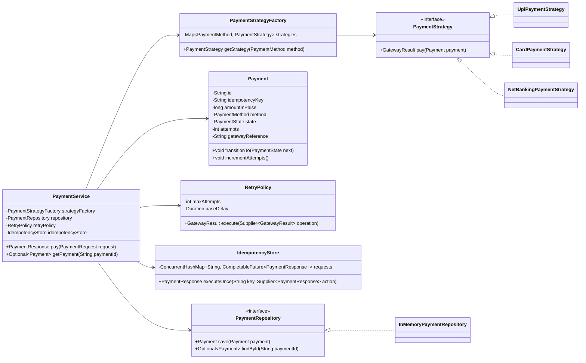
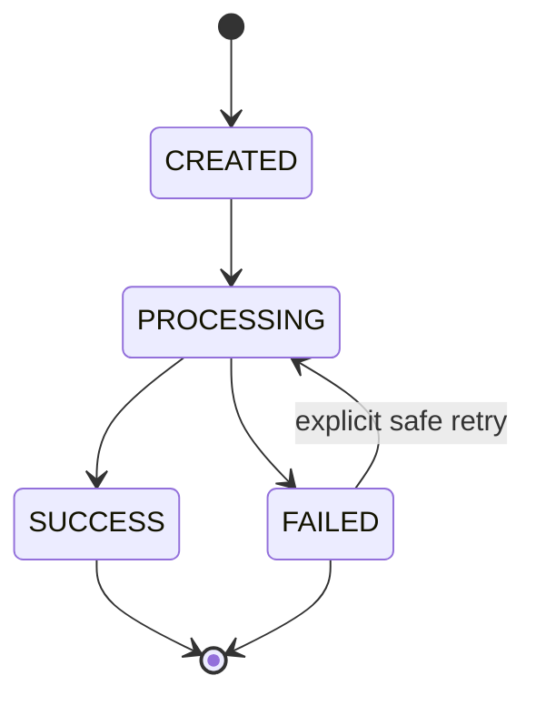
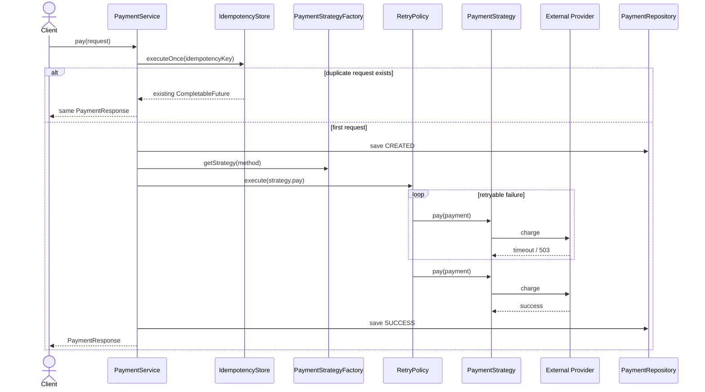
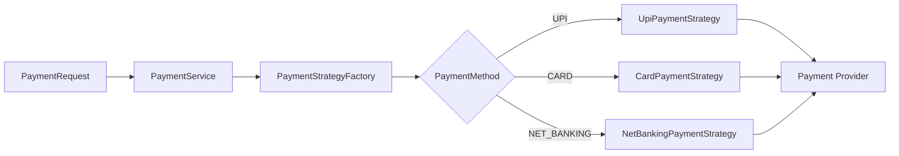
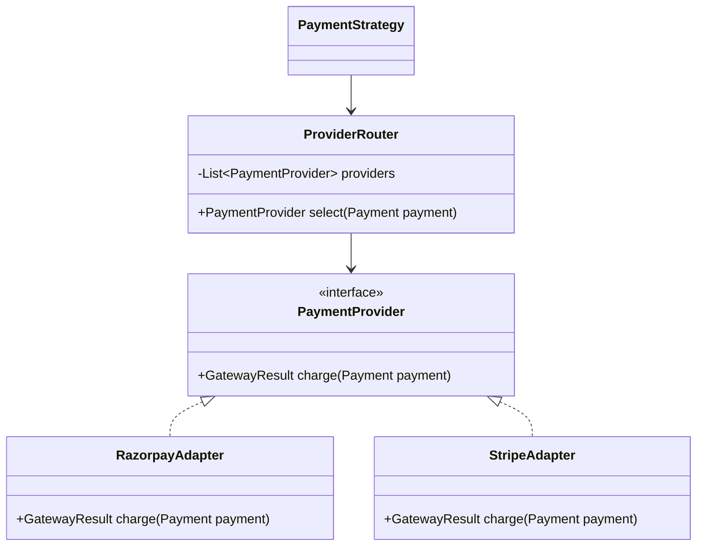
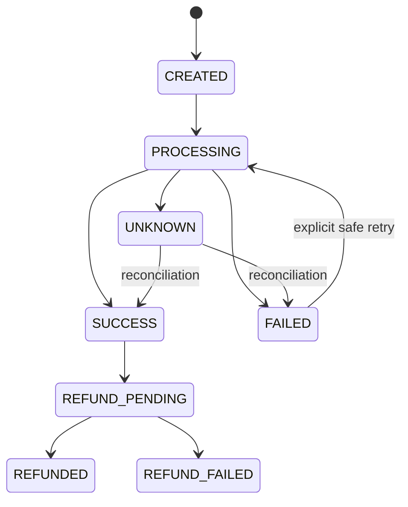
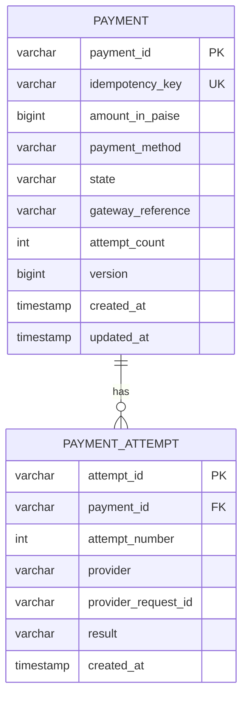

# Payment Gateway LLD — Java 21

> Covers `PaymentStrategy`, UPI/Card/NetBanking, Factory + Strategy, payment states, retry, idempotency, concurrency, Mermaid UML, and runnable Java 21 code.

---

## 1. Requirements

Build a payment gateway supporting:

```text
UPI
CARD
NET_BANKING
```

The gateway should:

- choose a payment implementation at runtime
- isolate payment-method logic
- track payment states
- retry transient failures
- prevent duplicate charges
- safely handle concurrent duplicate requests
- remain extensible for future methods/providers

---

## 2. Core Design



---

## 3. Strategy Pattern

```java
interface PaymentStrategy {
    GatewayResult pay(Payment payment);
}
```

Implementations:

```text
UpiPaymentStrategy
CardPaymentStrategy
NetBankingPaymentStrategy
```

Strategy answers:

> How should this payment method be executed?

---

## 4. Factory Pattern

The factory answers:

> Which payment strategy should be used?

```java
final class PaymentStrategyFactory {

    private final Map<PaymentMethod, PaymentStrategy> strategies;

    PaymentStrategyFactory(Map<PaymentMethod, PaymentStrategy> strategies) {
        this.strategies = Map.copyOf(strategies);
    }

    PaymentStrategy getStrategy(PaymentMethod method) {
        PaymentStrategy strategy = strategies.get(method);

        if (strategy == null) {
            throw new IllegalArgumentException(
                    "Unsupported payment method: " + method
            );
        }

        return strategy;
    }
}
```

---

## 5. Payment States

For the interview implementation:

```text
CREATED
PROCESSING
SUCCESS
FAILED
```



Important invariant:

```text
SUCCESS must not transition back to PROCESSING.
```

For production, also consider:

```text
UNKNOWN
CANCELLED
REFUND_PENDING
REFUNDED
REFUND_FAILED
```

`UNKNOWN` is especially important when the provider may have processed the charge but the response was lost.

---

## 6. Full Payment Flow



---

## 7. Idempotency

Assume a client sends:

```text
POST /payments
Idempotency-Key: order-1001-payment-1
```

The provider successfully charges the customer, but the network response is lost.

The client retries.

Without idempotency:

```text
Request 1 -> charge ₹1000
Request 2 -> charge ₹1000 again
```

With idempotency:

```text
Request 1 -> process payment
Request 2 -> return same logical result
```

---

## 8. Concurrency Race

This code is unsafe:

```java
if (!processed.containsKey(key)) {
    PaymentResponse response = processPayment();
    processed.put(key, response);
}
```

Possible interleaving:

```text
T1 -> containsKey = false
T2 -> containsKey = false

T1 -> charge
T2 -> charge
```

Duplicate charge.

A correct single-JVM design needs atomic ownership of the idempotency key.

---

## 9. Concurrent Duplicate Requests

Use:

```text
ConcurrentHashMap<String, CompletableFuture<PaymentResponse>>
```

Conceptually:

```text
idempotencyKey
      |
      v
CompletableFuture<PaymentResponse>
      |
      +--> first thread performs payment
      +--> other threads wait for same future
```

Only one thread should call the payment provider.

---

## 10. Retry Policy

Retry only transient failures.

### Retryable

```text
HTTP 429
HTTP 502
HTTP 503
connection reset
temporary provider outage
timeout, if provider-side idempotency exists
```

### Non-retryable

```text
invalid card
invalid UPI ID
insufficient funds
authentication rejected
blocked account
```

A practical rule:

```text
Retry only when the operation is idempotent
or the downstream provider supports an idempotency key.
```

---

## 11. Exponential Backoff

```text
Attempt 1
  |
fail
  |
100 ms
  |
Attempt 2
  |
fail
  |
200 ms
  |
Attempt 3
```

Typical production approach:

```text
exponential backoff + jitter
```

Example:

```text
delay = baseDelay * 2^attempt + randomJitter
```

---

## 12. Complete Runnable Java 21 Code

Save as:

```text
PaymentGatewayDemo.java
```

```java
import java.time.Duration;
import java.util.Map;
import java.util.Optional;
import java.util.UUID;
import java.util.concurrent.*;
import java.util.function.Supplier;

public class PaymentGatewayDemo {

    public static void main(String[] args) throws Exception {

        PaymentRepository repository =
                new InMemoryPaymentRepository();

        PaymentStrategyFactory factory =
                new PaymentStrategyFactory(
                        Map.of(
                                PaymentMethod.UPI,
                                new UpiPaymentStrategy(),

                                PaymentMethod.CARD,
                                new CardPaymentStrategy(),

                                PaymentMethod.NET_BANKING,
                                new NetBankingPaymentStrategy()
                        )
                );

        RetryPolicy retryPolicy =
                new RetryPolicy(
                        3,
                        Duration.ofMillis(100)
                );

        IdempotencyStore idempotencyStore =
                new IdempotencyStore();

        PaymentService service =
                new PaymentService(
                        factory,
                        repository,
                        retryPolicy,
                        idempotencyStore
                );

        PaymentRequest request =
                new PaymentRequest(
                        "order-1001-payment-1",
                        10_000,
                        PaymentMethod.UPI
                );

        System.out.println("=== Single payment ===");

        PaymentResponse first =
                service.pay(request);

        System.out.println(first);

        System.out.println(
                "\n=== Same idempotency key ==="
        );

        PaymentResponse duplicate =
                service.pay(request);

        System.out.println(duplicate);

        System.out.println(
                "\n=== Concurrent duplicate requests ==="
        );

        ExecutorService executor =
                Executors.newFixedThreadPool(5);

        PaymentRequest concurrentRequest =
                new PaymentRequest(
                        "order-2001-payment-1",
                        25_000,
                        PaymentMethod.CARD
                );

        var futures =
                java.util.stream.IntStream
                        .range(0, 5)
                        .mapToObj(i ->
                                executor.submit(
                                        () -> service.pay(
                                                concurrentRequest
                                        )
                                )
                        )
                        .toList();

        for (Future<PaymentResponse> future : futures) {
            System.out.println(future.get());
        }

        executor.shutdown();
    }
}

enum PaymentMethod {
    UPI,
    CARD,
    NET_BANKING
}

enum PaymentState {
    CREATED,
    PROCESSING,
    SUCCESS,
    FAILED
}

final class Payment {

    private final String id;
    private final String idempotencyKey;
    private final long amountInPaise;
    private final PaymentMethod method;

    private PaymentState state;
    private int attempts;
    private String gatewayReference;

    Payment(
            String id,
            String idempotencyKey,
            long amountInPaise,
            PaymentMethod method
    ) {
        this.id = id;
        this.idempotencyKey = idempotencyKey;
        this.amountInPaise = amountInPaise;
        this.method = method;
        this.state = PaymentState.CREATED;
    }

    synchronized void transitionTo(
            PaymentState next
    ) {

        if (!isValidTransition(state, next)) {
            throw new IllegalStateException(
                    "Invalid transition: "
                            + state
                            + " -> "
                            + next
            );
        }

        state = next;
    }

    private boolean isValidTransition(
            PaymentState current,
            PaymentState next
    ) {

        return switch (current) {

            case CREATED ->
                    next == PaymentState.PROCESSING;

            case PROCESSING ->
                    next == PaymentState.SUCCESS
                            || next == PaymentState.FAILED;

            case FAILED ->
                    next == PaymentState.PROCESSING;

            case SUCCESS ->
                    false;
        };
    }

    synchronized void incrementAttempts() {
        attempts++;
    }

    synchronized void setGatewayReference(
            String gatewayReference
    ) {
        this.gatewayReference =
                gatewayReference;
    }

    String id() {
        return id;
    }

    String idempotencyKey() {
        return idempotencyKey;
    }

    long amountInPaise() {
        return amountInPaise;
    }

    PaymentMethod method() {
        return method;
    }

    synchronized PaymentState state() {
        return state;
    }

    synchronized int attempts() {
        return attempts;
    }

    synchronized String gatewayReference() {
        return gatewayReference;
    }
}

record PaymentRequest(
        String idempotencyKey,
        long amountInPaise,
        PaymentMethod method
) {

    PaymentRequest {

        if (idempotencyKey == null
                || idempotencyKey.isBlank()) {

            throw new IllegalArgumentException(
                    "idempotencyKey is required"
            );
        }

        if (amountInPaise <= 0) {

            throw new IllegalArgumentException(
                    "amount must be positive"
            );
        }

        if (method == null) {

            throw new IllegalArgumentException(
                    "payment method is required"
            );
        }
    }
}

record PaymentResponse(
        String paymentId,
        PaymentState state,
        String gatewayReference
) {
}

interface PaymentStrategy {

    GatewayResult pay(Payment payment);
}

final class UpiPaymentStrategy
        implements PaymentStrategy {

    @Override
    public GatewayResult pay(
            Payment payment
    ) {

        System.out.println(
                "Processing UPI payment: "
                        + payment.id()
        );

        return GatewayResult.success(
                "UPI-" + UUID.randomUUID()
        );
    }
}

final class CardPaymentStrategy
        implements PaymentStrategy {

    @Override
    public GatewayResult pay(
            Payment payment
    ) {

        System.out.println(
                "Processing CARD payment: "
                        + payment.id()
        );

        return GatewayResult.success(
                "CARD-" + UUID.randomUUID()
        );
    }
}

final class NetBankingPaymentStrategy
        implements PaymentStrategy {

    @Override
    public GatewayResult pay(
            Payment payment
    ) {

        System.out.println(
                "Processing NET_BANKING payment: "
                        + payment.id()
        );

        return GatewayResult.success(
                "NB-" + UUID.randomUUID()
        );
    }
}

final class PaymentStrategyFactory {

    private final Map<
            PaymentMethod,
            PaymentStrategy
            > strategies;

    PaymentStrategyFactory(
            Map<
                    PaymentMethod,
                    PaymentStrategy
                    > strategies
    ) {
        this.strategies =
                Map.copyOf(strategies);
    }

    PaymentStrategy getStrategy(
            PaymentMethod method
    ) {

        PaymentStrategy strategy =
                strategies.get(method);

        if (strategy == null) {

            throw new IllegalArgumentException(
                    "Unsupported payment method: "
                            + method
            );
        }

        return strategy;
    }
}

record GatewayResult(
        boolean success,
        boolean retryable,
        String reference,
        String message
) {

    static GatewayResult success(
            String reference
    ) {

        return new GatewayResult(
                true,
                false,
                reference,
                "Payment successful"
        );
    }

    static GatewayResult retryableFailure(
            String message
    ) {

        return new GatewayResult(
                false,
                true,
                null,
                message
        );
    }

    static GatewayResult permanentFailure(
            String message
    ) {

        return new GatewayResult(
                false,
                false,
                null,
                message
        );
    }
}

final class RetryPolicy {

    private final int maxAttempts;
    private final Duration baseDelay;

    RetryPolicy(
            int maxAttempts,
            Duration baseDelay
    ) {

        if (maxAttempts <= 0) {
            throw new IllegalArgumentException(
                    "maxAttempts must be > 0"
            );
        }

        this.maxAttempts =
                maxAttempts;

        this.baseDelay =
                baseDelay;
    }

    GatewayResult execute(
            Supplier<GatewayResult> operation
    ) {

        GatewayResult last = null;

        for (
                int attempt = 1;
                attempt <= maxAttempts;
                attempt++
        ) {

            last = operation.get();

            if (last.success()) {
                return last;
            }

            if (!last.retryable()) {
                return last;
            }

            if (attempt < maxAttempts) {
                sleep(backoff(attempt));
            }
        }

        return last;
    }

    private Duration backoff(
            int attempt
    ) {

        long multiplier =
                1L << Math.max(
                        0,
                        attempt - 1
                );

        return baseDelay.multipliedBy(
                multiplier
        );
    }

    private void sleep(
            Duration duration
    ) {

        try {

            Thread.sleep(
                    duration.toMillis()
            );

        } catch (InterruptedException e) {

            Thread.currentThread()
                    .interrupt();

            throw new RuntimeException(
                    "Retry interrupted",
                    e
            );
        }
    }
}

interface PaymentRepository {

    Payment save(Payment payment);

    Optional<Payment> findById(
            String paymentId
    );
}

final class InMemoryPaymentRepository
        implements PaymentRepository {

    private final ConcurrentHashMap<
            String,
            Payment
            > payments =
            new ConcurrentHashMap<>();

    @Override
    public Payment save(
            Payment payment
    ) {

        payments.put(
                payment.id(),
                payment
        );

        return payment;
    }

    @Override
    public Optional<Payment> findById(
            String paymentId
    ) {

        return Optional.ofNullable(
                payments.get(paymentId)
        );
    }
}

final class IdempotencyStore {

    private final ConcurrentHashMap<
            String,
            CompletableFuture<PaymentResponse>
            > requests =
            new ConcurrentHashMap<>();

    PaymentResponse executeOnce(
            String idempotencyKey,
            Supplier<PaymentResponse> action
    ) {

        CompletableFuture<PaymentResponse>
                candidate =
                new CompletableFuture<>();

        CompletableFuture<PaymentResponse>
                existing =
                requests.putIfAbsent(
                        idempotencyKey,
                        candidate
                );

        if (existing != null) {
            return existing.join();
        }

        try {

            PaymentResponse response =
                    action.get();

            candidate.complete(response);

            return response;

        } catch (Throwable throwable) {

            candidate.completeExceptionally(
                    throwable
            );

            requests.remove(
                    idempotencyKey,
                    candidate
            );

            throw throwable;
        }
    }
}

final class PaymentService {

    private final PaymentStrategyFactory
            strategyFactory;

    private final PaymentRepository
            repository;

    private final RetryPolicy
            retryPolicy;

    private final IdempotencyStore
            idempotencyStore;

    PaymentService(
            PaymentStrategyFactory strategyFactory,
            PaymentRepository repository,
            RetryPolicy retryPolicy,
            IdempotencyStore idempotencyStore
    ) {

        this.strategyFactory =
                strategyFactory;

        this.repository =
                repository;

        this.retryPolicy =
                retryPolicy;

        this.idempotencyStore =
                idempotencyStore;
    }

    PaymentResponse pay(
            PaymentRequest request
    ) {

        return idempotencyStore.executeOnce(
                request.idempotencyKey(),
                () -> processPayment(request)
        );
    }

    Optional<Payment> getPayment(
            String paymentId
    ) {

        return repository.findById(
                paymentId
        );
    }

    private PaymentResponse processPayment(
            PaymentRequest request
    ) {

        Payment payment =
                new Payment(
                        UUID.randomUUID()
                                .toString(),

                        request.idempotencyKey(),
                        request.amountInPaise(),
                        request.method()
                );

        repository.save(payment);

        payment.transitionTo(
                PaymentState.PROCESSING
        );

        PaymentStrategy strategy =
                strategyFactory.getStrategy(
                        request.method()
                );

        GatewayResult result =
                retryPolicy.execute(
                        () -> {

                            payment.incrementAttempts();

                            return strategy.pay(
                                    payment
                            );
                        }
                );

        if (result.success()) {

            payment.setGatewayReference(
                    result.reference()
            );

            payment.transitionTo(
                    PaymentState.SUCCESS
            );

        } else {

            payment.transitionTo(
                    PaymentState.FAILED
            );
        }

        repository.save(payment);

        return new PaymentResponse(
                payment.id(),
                payment.state(),
                payment.gatewayReference()
        );
    }
}
```

---

## 13. Compile and Run

```bash
javac --release 21 PaymentGatewayDemo.java
java PaymentGatewayDemo
```

You should see that concurrent requests sharing the same idempotency key produce the same `paymentId` and gateway reference.

The line:

```text
Processing CARD payment: ...
```

should appear once for the concurrent duplicate group.

---

## 14. Factory + Strategy Interaction



---

## 15. Why Not a Giant `switch`?

Avoid:

```java
switch (method) {
    case UPI:
        // provider logic
    case CARD:
        // provider logic
    case NET_BANKING:
        // provider logic
}
```

Problems:

```text
PaymentService knows every implementation
large conditional logic
harder unit testing
poor extensibility
violates Open/Closed Principle
```

With Strategy:

```text
PaymentService
      |
      v
PaymentStrategy
      |
      +-- UPI
      +-- Card
      +-- NetBanking
```

---

## 16. Adding a New Payment Method

Suppose we add:

```text
WALLET
```

Implement:

```java
final class WalletPaymentStrategy
        implements PaymentStrategy {

    @Override
    public GatewayResult pay(
            Payment payment
    ) {
        return GatewayResult.success(
                "WALLET-" + UUID.randomUUID()
        );
    }
}
```

Register it in the factory.

No changes are required in:

```text
PaymentService
RetryPolicy
IdempotencyStore
PaymentRepository
```

---

## 17. Payment Method vs Provider

Do not confuse:

```text
payment method
```

with:

```text
payment provider
```

Example:

```text
CARD
 |
 +-- Razorpay
 +-- Stripe
 +-- Adyen
```

A stronger design introduces:

```text
PaymentStrategy
      |
      v
ProviderRouter
      |
      +-- RazorpayAdapter
      +-- StripeAdapter
```

This typically combines:

```text
Strategy
Factory
Adapter
```

---

## 18. Provider Adapter UML



---

## 19. The Hard Retry Problem

Consider:

```text
Payment Service -> Provider: charge ₹1000
```

The provider successfully charges the user.

Before the response returns:

```text
network timeout
```

Your service only sees:

```text
TIMEOUT
```

You do not know whether the charge happened.

Blindly retrying can create:

```text
double charge
```

Therefore provider calls also need an idempotency key.

Example:

```text
Provider-Idempotency-Key: payment-123
```

---

## 20. End-to-End Idempotency

```mermaid
sequenceDiagram

participant Client
participant PaymentService
participant DB
participant Provider

Client->>PaymentService: pay(key=ABC)

PaymentService->>DB: reserve ABC atomically
PaymentService->>Provider: charge(providerKey=ABC)

Provider->>Provider: deduplicate ABC
Provider-->>PaymentService: SUCCESS

PaymentService->>DB: mark SUCCESS
PaymentService-->>Client: SUCCESS

Note over Client,Provider:
Retrying ABC must not create another charge.
```

Idempotency should exist at both:

```text
Client -> Payment Service
Payment Service -> External Provider
```

---

## 21. Database-Level Idempotency

The runnable demo uses:

```text
ConcurrentHashMap
```

Production systems need durable shared state.

Example:

```sql
CREATE UNIQUE INDEX
    ux_payment_idempotency_key
ON payments(idempotency_key);
```

This guarantees that two application instances cannot create the same logical payment.

---

## 22. Why `ConcurrentHashMap` Is Not Enough in Production

Suppose there are three instances:

```text
PaymentService-1
PaymentService-2
PaymentService-3
```

Each JVM has its own memory.

A request may hit instance 1:

```text
key = ABC
```

and its retry may hit instance 2.

Instance 2's local `ConcurrentHashMap` does not know that instance 1 already processed `ABC`.

Therefore:

```text
local concurrency safety
!=
distributed idempotency
```

Production choices:

```text
DB UNIQUE constraint
Redis SET NX
distributed KV store
durable idempotency table
```

For financial correctness, durable persistence is preferable.

---

## 23. Optimistic Concurrency

Payment state should also be protected in the database.

Add:

```text
version
```

Example:

```text
payment_id = P1
state      = PROCESSING
version    = 4
```

Update:

```sql
UPDATE payment
SET
    state = 'SUCCESS',
    version = version + 1
WHERE
    payment_id = ?
    AND version = ?;
```

If updated rows:

```text
0
```

another transaction modified the payment first.

---

## 24. Why `UNKNOWN` Is Useful

Suppose:

```text
Provider may have charged
+
provider response was lost
```

Calling that:

```text
FAILED
```

can be incorrect.

A production state machine should often include:

```text
UNKNOWN
```

or:

```text
PENDING_CONFIRMATION
```

Then use:

```text
provider status query
webhook
reconciliation job
```

to establish the final state.

---

## 25. Production State Machine



---

## 26. Retry Explosion

Retries can exist in:

```text
client
API gateway
payment service
HTTP client
queue consumer
workflow engine
```

If each layer retries three times:

```text
3 x 3 x 3 = 27 possible attempts
```

Retry ownership must be explicit.

---

## 27. Persistence Model



Storing attempts separately helps with:

```text
audit
debugging
provider reconciliation
failure analysis
retry history
```

---

## 28. API Design

### Create payment

```http
POST /payments
Idempotency-Key: order-1001-payment-1
Content-Type: application/json
```

```json
{
  "amountInPaise": 10000,
  "method": "UPI"
}
```

Response:

```json
{
  "paymentId": "pay-123",
  "state": "SUCCESS",
  "gatewayReference": "provider-987"
}
```

### Get payment

```http
GET /payments/pay-123
```

---

## 29. Security

Never casually store:

```text
CVV
UPI PIN
NetBanking password
full card number
```

Prefer:

```text
cardToken
paymentMethodToken
providerToken
```

Real card processing also involves PCI-DSS requirements.

---

## 30. SOLID Mapping

### Single Responsibility

```text
PaymentService
    -> orchestration

PaymentStrategy
    -> method-specific behavior

PaymentStrategyFactory
    -> strategy selection

RetryPolicy
    -> retry behavior

IdempotencyStore
    -> duplicate suppression

PaymentRepository
    -> persistence
```

### Open/Closed

Adding:

```text
Wallet
BNPL
another UPI implementation
```

should not require rewriting the payment orchestration.

### Dependency Inversion

`PaymentService` depends on abstractions such as:

```text
PaymentRepository
PaymentStrategy
```

rather than embedding database/provider code directly.

---

## 31. Interview Follow-Ups

### Why both Factory and Strategy?

Strategy defines interchangeable payment algorithms.

Factory selects the right strategy at runtime.

### Why `CompletableFuture`?

Concurrent duplicate requests can join one in-flight payment instead of independently calling the provider.

### Why not just synchronize the whole method?

That serializes unrelated payments.

We only want duplicate requests sharing the same idempotency key to coordinate.

### How do you prevent duplicate charges across multiple application instances?

Use:

```text
durable idempotency record
DB unique constraint
provider-side idempotency key
```

### What happens after a provider timeout?

Do not immediately assume failure.

The payment may move to:

```text
UNKNOWN
```

and be reconciled.

### Should every failure retry?

No.

Only retry transient failures, and only when the operation is safe to retry.

---

## 32. Recommended Interview Implementation Order

Build incrementally.

```text
1. Payment / PaymentRequest / PaymentState
2. PaymentStrategy
3. UPI / Card / NetBanking
4. PaymentStrategyFactory
5. PaymentService
6. State transition validation
7. RetryPolicy
8. Idempotency
9. Concurrent duplicate protection
10. Distributed idempotency discussion
11. Provider idempotency
12. Reconciliation
```

Do not start by overengineering distributed locks and message queues.

Get the basic object model correct first.

---

## 33. 60-Second Interview Answer

> I would model UPI, Card, and NetBanking behind a `PaymentStrategy` interface. A `PaymentStrategyFactory` selects the appropriate implementation at runtime, while `PaymentService` only orchestrates the workflow.
>
> The payment entity owns a validated state machine such as `CREATED -> PROCESSING -> SUCCESS/FAILED`, with an `UNKNOWN` state in a production system for ambiguous provider outcomes.
>
> Retry should apply only to transient failures and use exponential backoff. More importantly, retries must be idempotent because a timeout does not prove that a provider did not process a charge.
>
> I would require a client idempotency key and enforce it atomically. In one JVM, `ConcurrentHashMap<String, CompletableFuture<PaymentResponse>>` can coalesce concurrent duplicate requests. In a distributed deployment, I would use a durable database record with a unique idempotency constraint, optimistic state versioning, and a provider-side idempotency key.

---

## 34. Final Mental Model

```text
PaymentService
      |
      +--> PaymentStrategyFactory
      |          |
      |          +--> UPI
      |          +--> Card
      |          +--> NetBanking
      |
      +--> Payment State Machine
      |
      +--> RetryPolicy
      |
      +--> IdempotencyStore
      |
      +--> PaymentRepository
```

Production correctness:

```text
Factory
+
Strategy
+
validated state transitions
+
retry classification
+
client idempotency
+
provider idempotency
+
DB unique constraint
+
optimistic concurrency
+
reconciliation
```
