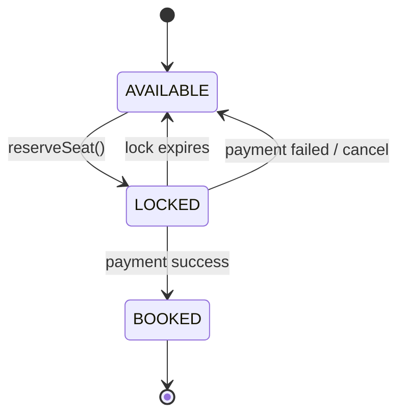
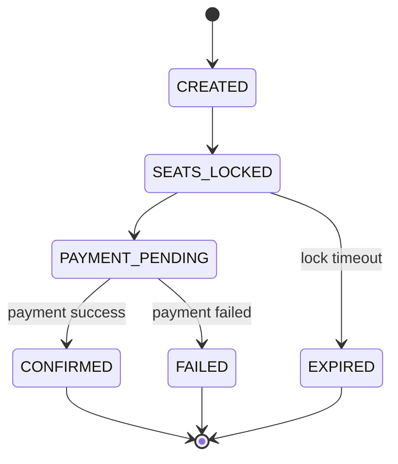
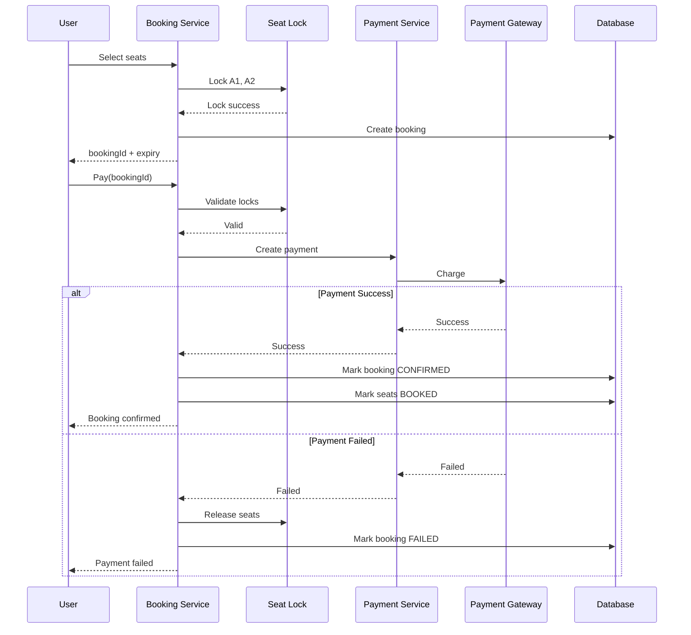
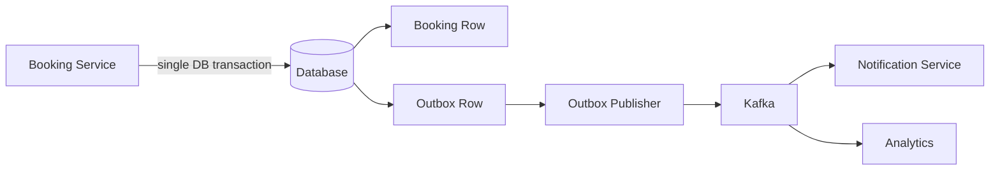
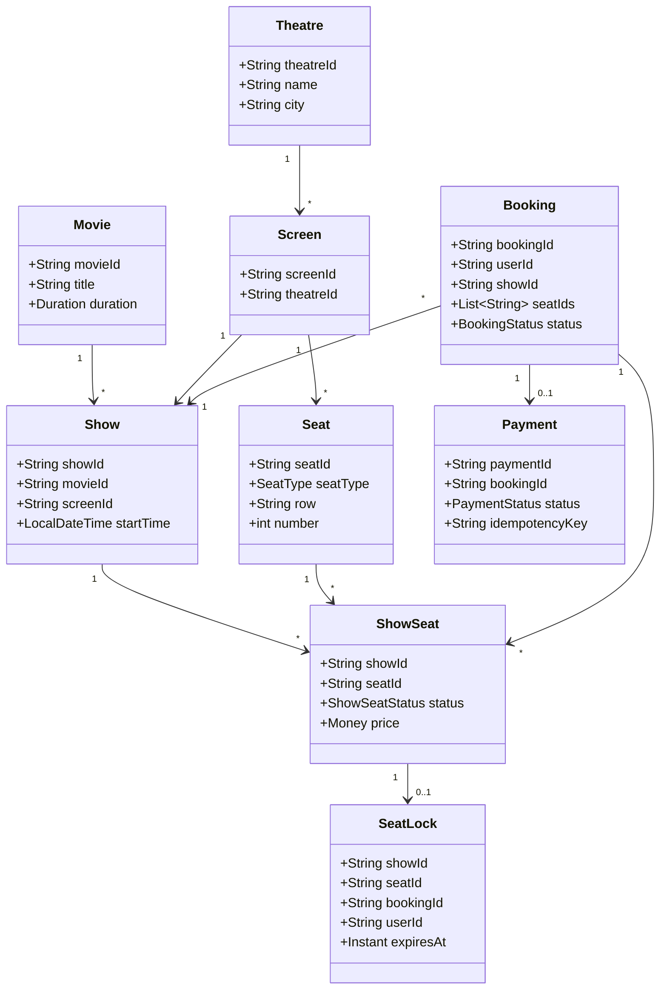
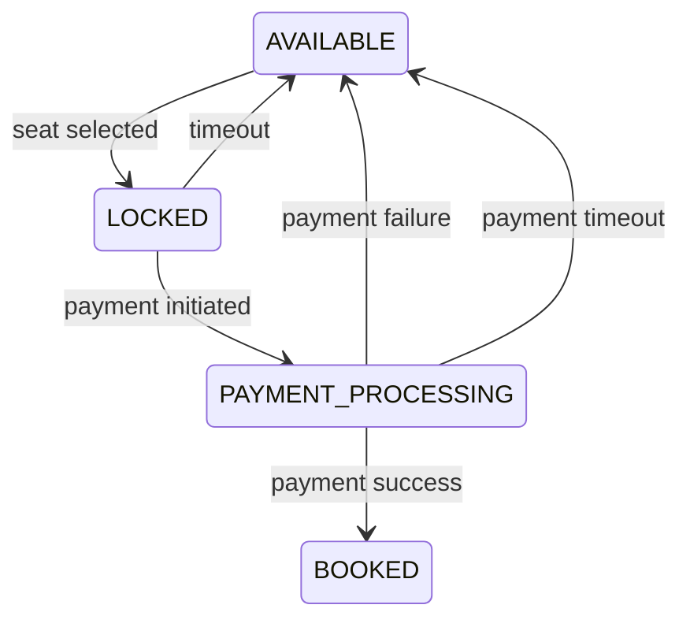
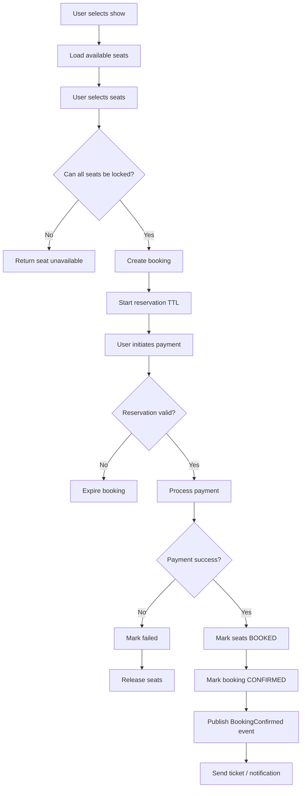
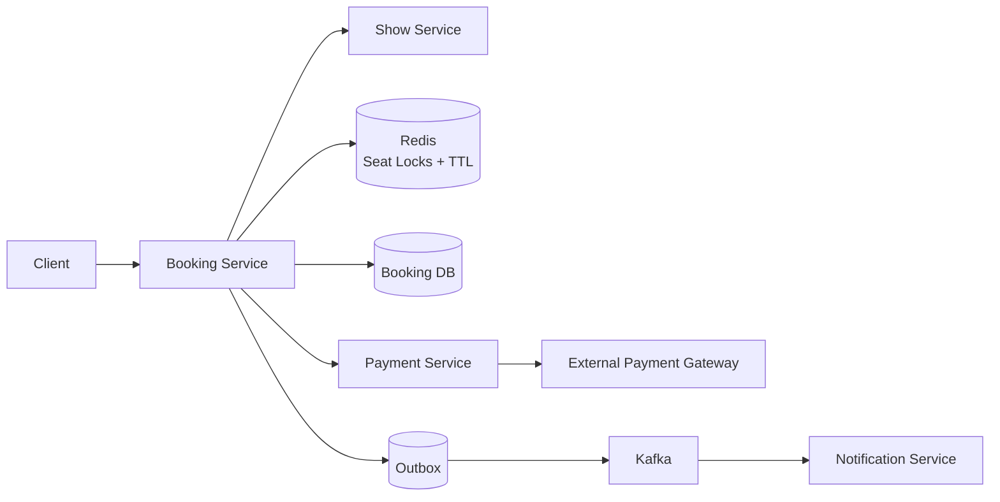

# BookMyShow / Ticket Booking — Low Level Design

## 1. Problem Statement

Design a ticket-booking system similar to **BookMyShow** where users can:

- Browse movies/events by city.
- View theatres, shows, and seat layouts.
- Select seats.
- Temporarily lock selected seats.
- Complete payment.
- Confirm a booking.
- Automatically release seats when the reservation expires or payment fails.

The most important parts of this LLD are:

1. **Seat locking**
2. **Concurrency**
3. **Reservation expiry**
4. **Payment**
5. **Idempotency**
6. **State transitions**

---

# 2. Core Requirements

## Functional Requirements

- Search movies/events.
- Find shows for a movie.
- View seat availability.
- Select one or more seats.
- Lock seats for a short duration.
- Make payment.
- Confirm booking.
- Cancel/release expired reservations.
- Prevent two users from booking the same seat.
- Support payment retries safely.

## Non-Functional Requirements

- Thread-safe seat reservation.
- No double booking.
- Low latency for seat selection.
- Idempotent booking/payment APIs.
- Locks must expire automatically.
- System should recover safely from payment/provider failures.
- Clear state transitions.

---

# 3. Core Domain Model

```text
Movie
  |
  +--> Show
         |
         +--> Screen
                |
                +--> Seat

ShowSeat
  |
  +--> availability/status

SeatLock
  |
  +--> user
  +--> expiry

Booking
  |
  +--> BookingSeats
  +--> Payment
```

---

# 4. Main Entities

## Movie

```java
public record Movie(
    String movieId,
    String title,
    String language,
    Duration duration
) {}
```

---

## Theatre

```java
public record Theatre(
    String theatreId,
    String name,
    String city
) {}
```

---

## Screen

```java
public record Screen(
    String screenId,
    String theatreId,
    String name
) {}
```

---

## Seat

A physical seat belongs to a screen.

```java
public record Seat(
    String seatId,
    String screenId,
    String row,
    int number,
    SeatType seatType
) {}
```

```java
public enum SeatType {
    NORMAL,
    PREMIUM,
    RECLINER
}
```

---

## Show

```java
public record Show(
    String showId,
    String movieId,
    String screenId,
    LocalDateTime startTime,
    LocalDateTime endTime
) {}
```

---

# 5. Why `ShowSeat` Is Required

A common mistake is storing availability directly inside `Seat`.

A seat is a **physical entity**.

Availability belongs to:

```text
(showId, seatId)
```

because the same physical seat can be:

- booked for the 3 PM show
- available for the 7 PM show

Therefore:

```java
public class ShowSeat {

    private final String showId;
    private final String seatId;

    private volatile ShowSeatStatus status;
    private Money price;

    public ShowSeat(
            String showId,
            String seatId,
            ShowSeatStatus status,
            Money price) {

        this.showId = showId;
        this.seatId = seatId;
        this.status = status;
        this.price = price;
    }

    public String getShowId() {
        return showId;
    }

    public String getSeatId() {
        return seatId;
    }

    public ShowSeatStatus getStatus() {
        return status;
    }

    public void setStatus(ShowSeatStatus status) {
        this.status = status;
    }
}
```

```java
public enum ShowSeatStatus {
    AVAILABLE,
    LOCKED,
    BOOKED
}
```

---

# 6. Main State Machine



The critical invariant is:

> A seat can transition from `AVAILABLE -> LOCKED` for only one active reservation.

---

# 7. Booking State

```java
public enum BookingStatus {
    CREATED,
    SEATS_LOCKED,
    PAYMENT_PENDING,
    CONFIRMED,
    FAILED,
    EXPIRED,
    CANCELLED
}
```

Typical transition:



---

# 8. Seat Lock

A seat lock represents a temporary claim on a seat.

```java
public record SeatLock(
    String showId,
    String seatId,
    String userId,
    String bookingId,
    Instant expiresAt
) {
    public boolean isExpired(Clock clock) {
        return clock.instant().isAfter(expiresAt);
    }
}
```

Typical lock duration:

```text
5 minutes
```

The exact duration is a business decision.

---

# 9. Seat Locking Interface

```java
public interface SeatLockProvider {

    void lockSeats(
        String showId,
        List<String> seatIds,
        String userId,
        String bookingId,
        Duration lockDuration
    );

    void unlockSeats(
        String showId,
        List<String> seatIds,
        String bookingId
    );

    boolean validateLock(
        String showId,
        String seatId,
        String bookingId
    );
}
```

---

# 10. In-Memory Seat Lock Implementation

Useful for an interview implementation.

```java
import java.time.Clock;
import java.time.Duration;
import java.time.Instant;
import java.util.List;
import java.util.Map;
import java.util.concurrent.ConcurrentHashMap;

public class InMemorySeatLockProvider implements SeatLockProvider {

    private final Map<String, SeatLock> locks = new ConcurrentHashMap<>();
    private final Clock clock;

    public InMemorySeatLockProvider(Clock clock) {
        this.clock = clock;
    }

    private String key(String showId, String seatId) {
        return showId + ":" + seatId;
    }

    @Override
    public void lockSeats(
            String showId,
            List<String> seatIds,
            String userId,
            String bookingId,
            Duration lockDuration) {

        Instant expiresAt = clock.instant().plus(lockDuration);

        synchronized (this) {

            // Validate everything first.
            for (String seatId : seatIds) {

                String key = key(showId, seatId);

                SeatLock existing = locks.get(key);

                if (existing != null && !existing.isExpired(clock)) {
                    throw new SeatAlreadyLockedException(seatId);
                }
            }

            // Lock everything atomically.
            for (String seatId : seatIds) {

                locks.put(
                    key(showId, seatId),
                    new SeatLock(
                        showId,
                        seatId,
                        userId,
                        bookingId,
                        expiresAt
                    )
                );
            }
        }
    }

    @Override
    public void unlockSeats(
            String showId,
            List<String> seatIds,
            String bookingId) {

        for (String seatId : seatIds) {

            String key = key(showId, seatId);

            locks.computeIfPresent(key, (k, currentLock) -> {

                if (currentLock.bookingId().equals(bookingId)) {
                    return null;
                }

                return currentLock;
            });
        }
    }

    @Override
    public boolean validateLock(
            String showId,
            String seatId,
            String bookingId) {

        SeatLock lock = locks.get(key(showId, seatId));

        if (lock == null) {
            return false;
        }

        if (lock.isExpired(clock)) {
            locks.remove(key(showId, seatId), lock);
            return false;
        }

        return lock.bookingId().equals(bookingId);
    }
}
```

Exception:

```java
public class SeatAlreadyLockedException extends RuntimeException {

    public SeatAlreadyLockedException(String seatId) {
        super("Seat already locked: " + seatId);
    }
}
```

---

# 11. Important Concurrency Problem

Assume:

```text
User A -> wants A1
User B -> wants A1
```

Naive implementation:

```java
if (seat.getStatus() == AVAILABLE) {
    seat.setStatus(LOCKED);
}
```

This is unsafe.

Possible execution:

```text
Thread A reads AVAILABLE
Thread B reads AVAILABLE

Thread A sets LOCKED
Thread B sets LOCKED
```

Both users may believe they own the seat.

---

# 12. Concurrency Solutions

There are several valid approaches.

---

## Option 1 — `synchronized`

Simplest for an in-memory interview solution.

```java
public synchronized void lockSeat(...) {
    ...
}
```

### Pros

- Easy.
- Correct inside one JVM.

### Cons

- Coarse lock.
- Does not solve multi-instance distributed concurrency.

---

## Option 2 — Per-Seat `ReentrantLock`

```java
ConcurrentHashMap<String, ReentrantLock> seatLocks;
```

Allows unrelated seats to be reserved concurrently.

Example:

```java
public class SeatMutexRegistry {

    private final ConcurrentHashMap<String, ReentrantLock> locks =
        new ConcurrentHashMap<>();

    public ReentrantLock get(String showId, String seatId) {
        return locks.computeIfAbsent(
            showId + ":" + seatId,
            ignored -> new ReentrantLock()
        );
    }
}
```

### Danger: Deadlock for Multiple Seats

Suppose:

```text
User A -> A1, A2
User B -> A2, A1
```

Then:

```text
A locks A1
B locks A2

A waits for A2
B waits for A1
```

Deadlock.

### Solution

Always acquire seat locks in deterministic order:

```java
List<String> sortedSeatIds =
    seatIds.stream()
           .sorted()
           .toList();
```

Then lock seats in that order.

---

# 13. Database-Level Concurrency

In production, application-level JVM locks alone are insufficient because:

```text
        Load Balancer
          /       \
         /         \
      App-1       App-2
```

Two requests may reach different application instances.

The database must enforce the final correctness constraint.

---

## Optimistic Locking

Example table:

```text
show_seats

show_id
seat_id
status
booking_id
version
```

SQL-style operation:

```sql
UPDATE show_seats
SET
    status = 'LOCKED',
    booking_id = :bookingId,
    version = version + 1
WHERE
    show_id = :showId
    AND seat_id = :seatId
    AND status = 'AVAILABLE';
```

Then:

```text
updated_rows == 1
    -> success

updated_rows == 0
    -> someone else acquired it
```

This is often the cleanest solution.

---

# 14. Database Unique Constraint

A database-level unique constraint can provide another safety boundary.

For example:

```text
UNIQUE(show_id, seat_id)
```

for confirmed booking-seat records.

Even if application concurrency contains a bug:

```text
DB rejects second confirmed booking
```

Defense in depth.

---

# 15. Reservation Expiry

A reservation must not lock a seat forever.

Example:

```text
T0       User locks A1
T0+5min  Lock expires
T0+5min  A1 becomes available
```

---

# 16. Ways to Implement Expiry

## Approach 1 — Lazy Expiration

Whenever a lock is checked:

```java
if (lock.expiresAt().isBefore(now)) {
    remove(lock);
}
```

### Advantage

Simple.

### Problem

Expired locks remain in storage until accessed.

---

## Approach 2 — Scheduled Cleanup

```java
ScheduledExecutorService scheduler =
    Executors.newSingleThreadScheduledExecutor();

scheduler.scheduleAtFixedRate(
    this::cleanupExpiredLocks,
    1,
    1,
    TimeUnit.SECONDS
);
```

Example:

```java
private void cleanupExpiredLocks() {

    Instant now = clock.instant();

    locks.entrySet().removeIf(
        entry -> entry.getValue().expiresAt().isBefore(now)
    );
}
```

Good for one-process interview implementation.

---

## Approach 3 — Redis TTL

Production-friendly approach:

```text
SET seat-lock:{showId}:{seatId}
    bookingId
    NX
    EX 300
```

Semantics:

```text
NX -> acquire only when key does not exist
EX -> automatically expire after TTL
```

This provides:

- atomic lock acquisition
- automatic expiration
- cross-instance coordination

For locking multiple seats atomically, use:

- Lua script
- transaction
- another atomic reservation mechanism

---

# 17. Booking Entity

```java
public class Booking {

    private final String bookingId;
    private final String userId;
    private final String showId;
    private final List<String> seatIds;

    private BookingStatus status;

    private final Instant createdAt;

    public Booking(
            String bookingId,
            String userId,
            String showId,
            List<String> seatIds,
            Instant createdAt) {

        this.bookingId = bookingId;
        this.userId = userId;
        this.showId = showId;
        this.seatIds = List.copyOf(seatIds);
        this.createdAt = createdAt;
        this.status = BookingStatus.CREATED;
    }

    public String getBookingId() {
        return bookingId;
    }

    public String getUserId() {
        return userId;
    }

    public String getShowId() {
        return showId;
    }

    public List<String> getSeatIds() {
        return seatIds;
    }

    public BookingStatus getStatus() {
        return status;
    }

    public void markSeatsLocked() {
        requireStatus(BookingStatus.CREATED);
        status = BookingStatus.SEATS_LOCKED;
    }

    public void markPaymentPending() {
        requireStatus(BookingStatus.SEATS_LOCKED);
        status = BookingStatus.PAYMENT_PENDING;
    }

    public void confirm() {
        if (status != BookingStatus.PAYMENT_PENDING) {
            throw new IllegalStateException();
        }

        status = BookingStatus.CONFIRMED;
    }

    public void fail() {
        status = BookingStatus.FAILED;
    }

    public void expire() {
        if (status == BookingStatus.CONFIRMED) {
            throw new IllegalStateException(
                "Confirmed booking cannot expire"
            );
        }

        status = BookingStatus.EXPIRED;
    }

    private void requireStatus(BookingStatus expected) {

        if (status != expected) {
            throw new IllegalStateException(
                "Expected " + expected + " but found " + status
            );
        }
    }
}
```

---

# 18. Payment Abstraction

```java
public interface PaymentGateway {

    PaymentResult charge(PaymentRequest request);
}
```

```java
public record PaymentRequest(
    String bookingId,
    String paymentIdempotencyKey,
    Money amount
) {}
```

```java
public record PaymentResult(
    String transactionId,
    PaymentStatus status
) {}
```

```java
public enum PaymentStatus {
    SUCCESS,
    FAILED,
    PENDING
}
```

---

# 19. Payment Service

```java
public class PaymentService {

    private final PaymentGateway paymentGateway;
    private final PaymentRepository paymentRepository;

    public PaymentService(
            PaymentGateway paymentGateway,
            PaymentRepository paymentRepository) {

        this.paymentGateway = paymentGateway;
        this.paymentRepository = paymentRepository;
    }

    public PaymentResult pay(
            String bookingId,
            String idempotencyKey,
            Money amount) {

        return paymentRepository
            .findByIdempotencyKey(idempotencyKey)
            .map(Payment::toResult)
            .orElseGet(() -> processPayment(
                bookingId,
                idempotencyKey,
                amount
            ));
    }

    private PaymentResult processPayment(
            String bookingId,
            String idempotencyKey,
            Money amount) {

        PaymentResult result =
            paymentGateway.charge(
                new PaymentRequest(
                    bookingId,
                    idempotencyKey,
                    amount
                )
            );

        paymentRepository.save(
            Payment.from(
                bookingId,
                idempotencyKey,
                result
            )
        );

        return result;
    }
}
```

---

# 20. Why Payment Idempotency Matters

Scenario:

```text
Client -> POST /payments

Payment provider charges ₹500

Network timeout happens before client receives response.

Client retries.
```

Without idempotency:

```text
₹500 charged twice
```

With:

```text
Idempotency-Key: 3bc95...
```

The retry returns the previous result instead of creating another charge.

---

# 21. Booking Service

The booking service coordinates the whole flow.

```java
public class BookingService {

    private static final Duration LOCK_DURATION =
        Duration.ofMinutes(5);

    private final SeatLockProvider seatLockProvider;
    private final BookingRepository bookingRepository;
    private final PaymentService paymentService;
    private final Clock clock;

    public BookingService(
            SeatLockProvider seatLockProvider,
            BookingRepository bookingRepository,
            PaymentService paymentService,
            Clock clock) {

        this.seatLockProvider = seatLockProvider;
        this.bookingRepository = bookingRepository;
        this.paymentService = paymentService;
        this.clock = clock;
    }

    public Booking createBooking(
            String userId,
            String showId,
            List<String> seatIds) {

        String bookingId = UUID.randomUUID().toString();

        Booking booking = new Booking(
            bookingId,
            userId,
            showId,
            seatIds,
            clock.instant()
        );

        seatLockProvider.lockSeats(
            showId,
            seatIds,
            userId,
            bookingId,
            LOCK_DURATION
        );

        booking.markSeatsLocked();

        bookingRepository.save(booking);

        return booking;
    }

    public Booking confirmBooking(
            String bookingId,
            String paymentIdempotencyKey,
            Money amount) {

        Booking booking =
            bookingRepository
                .findById(bookingId)
                .orElseThrow();

        // Validate all locks before charging.
        for (String seatId : booking.getSeatIds()) {

            boolean valid =
                seatLockProvider.validateLock(
                    booking.getShowId(),
                    seatId,
                    bookingId
                );

            if (!valid) {
                booking.expire();
                bookingRepository.save(booking);

                throw new ReservationExpiredException();
            }
        }

        booking.markPaymentPending();

        PaymentResult paymentResult =
            paymentService.pay(
                bookingId,
                paymentIdempotencyKey,
                amount
            );

        if (paymentResult.status() != PaymentStatus.SUCCESS) {

            booking.fail();

            seatLockProvider.unlockSeats(
                booking.getShowId(),
                booking.getSeatIds(),
                bookingId
            );

            bookingRepository.save(booking);

            return booking;
        }

        booking.confirm();

        bookingRepository.save(booking);

        return booking;
    }
}
```

---

# 22. Important Production Correction

The previous in-memory service is useful for explaining the design, but in production this sequence is unsafe if the process crashes:

```text
payment succeeds
        |
        v
application crashes
        |
        v
booking not confirmed
```

Therefore payment and booking need asynchronous reconciliation.

---

# 23. Robust Payment Flow



---

# 24. Payment Success but Booking Confirmation Fails

This is one of the best follow-up questions.

Example:

```text
1. Seat locked
2. Payment succeeds
3. DB confirmation fails
4. User has been charged
5. Seat may still not be booked
```

Possible solutions:

### Option A — Retry Confirmation

Persist:

```text
PAYMENT_SUCCESS
BOOKING_CONFIRMATION_PENDING
```

A worker retries booking confirmation.

### Option B — Refund

If the seat cannot be booked:

```text
initiate refund
```

### Option C — Saga

Model booking as a distributed transaction:

```text
lock seat
   |
   v
charge payment
   |
   v
confirm booking
```

Compensation:

```text
if final confirmation fails
    -> refund payment
    -> release seat
```

---

# 25. Outbox Pattern

Do not perform:

```text
DB commit + Kafka publish
```

as independent writes.

Instead:



Transaction:

```text
BEGIN

UPDATE booking
SET status = CONFIRMED

INSERT INTO outbox (...)

COMMIT
```

Then a background publisher sends:

```text
BookingConfirmed
```

---

# 26. Recommended Class Diagram



---

# 27. API Design

## Search Shows

```http
GET /movies/{movieId}/shows?city=Kolkata&date=2026-08-14
```

---

## Get Seats

```http
GET /shows/{showId}/seats
```

Response:

```json
{
  "showId": "SHOW-123",
  "seats": [
    {
      "seatId": "A1",
      "type": "PREMIUM",
      "status": "AVAILABLE",
      "price": 350
    }
  ]
}
```

---

## Create Booking / Lock Seats

```http
POST /bookings
Content-Type: application/json
```

```json
{
  "userId": "USER-1",
  "showId": "SHOW-123",
  "seatIds": ["A1", "A2"]
}
```

Response:

```json
{
  "bookingId": "BOOK-100",
  "status": "SEATS_LOCKED",
  "expiresAt": "2026-08-14T11:35:00Z"
}
```

---

## Payment

```http
POST /bookings/{bookingId}/payments
Idempotency-Key: 873d8d4f...
```

---

## Booking Status

```http
GET /bookings/{bookingId}
```

---

# 28. Database Schema

## `movies`

```text
movie_id PK
title
language
duration
```

## `theatres`

```text
theatre_id PK
name
city
```

## `screens`

```text
screen_id PK
theatre_id FK
name
```

## `seats`

```text
seat_id PK
screen_id FK
row
number
seat_type
```

## `shows`

```text
show_id PK
movie_id FK
screen_id FK
start_time
end_time
```

## `show_seats`

```text
show_id
seat_id
status
price
booking_id
version

PRIMARY KEY(show_id, seat_id)
```

## `bookings`

```text
booking_id PK
user_id
show_id
status
created_at
expires_at
```

## `booking_seats`

```text
booking_id
show_id
seat_id

UNIQUE(show_id, seat_id, booking_id)
```

## `payments`

```text
payment_id PK
booking_id
idempotency_key UNIQUE
provider_transaction_id
status
amount
created_at
```

---

# 29. Multi-Seat Atomicity

Suppose the user selects:

```text
A1, A2, A3
```

and:

```text
A1 -> available
A2 -> available
A3 -> already locked
```

Do not produce:

```text
A1 locked
A2 locked
A3 failed
```

while leaving A1 and A2 stuck.

Reservation should ideally be:

```text
all seats locked
OR
no seats locked
```

---

# 30. Transactional Seat Lock

Pseudo-SQL:

```sql
BEGIN;

UPDATE show_seats
SET
    status = 'LOCKED',
    booking_id = :bookingId,
    lock_expiry = :expiry
WHERE
    show_id = :showId
    AND seat_id IN (:seatIds)
    AND (
        status = 'AVAILABLE'
        OR (
            status = 'LOCKED'
            AND lock_expiry < NOW()
        )
    );
```

Check:

```text
updated rows == requested seats
```

Otherwise:

```sql
ROLLBACK;
```

This is the important atomicity guarantee.

---

# 31. Do Not Hold a DB Transaction During Payment

Wrong:

```text
BEGIN TRANSACTION

lock seats

call external payment gateway
wait 3 seconds

confirm booking

COMMIT
```

Why this is bad:

- long-running DB transaction
- row locks held during network call
- reduced throughput
- possible lock contention
- external system latency controls DB transaction time

Instead:

```text
1. Persist temporary reservation
2. Commit
3. Call payment gateway
4. Confirm asynchronously / transactionally afterward
```

---

# 32. Seat Lock vs Seat Booking

Do not confuse them.

## Seat Lock

Temporary.

```text
expires automatically
```

## Seat Booking

Permanent for that show.

```text
payment successful
booking confirmed
```

---

# 33. Race: Expiry vs Payment

Important edge case:

```text
12:00:00 seat locked
12:05:00 expiry

12:04:59 payment starts
12:05:01 payment succeeds
```

The seat might already have been released at 12:05.

Possible rule:

Before charging:

```text
validate lock
```

But payment may still finish after expiry.

Stronger design:

```text
LOCKED
   |
   v
PAYMENT_PROCESSING
```

and temporarily extend/protect the reservation while an authorized payment is actively being finalized.

For example:

```text
reservation expiry: 5 min

payment starts before expiry:
    extend reservation by 60 seconds
```

The exact policy is business-specific.

---

# 34. Suggested Seat State Model

```java
public enum ShowSeatStatus {

    AVAILABLE,

    LOCKED,

    PAYMENT_PROCESSING,

    BOOKED
}
```

Flow:



---

# 35. Repository Interfaces

```java
public interface BookingRepository {

    void save(Booking booking);

    Optional<Booking> findById(String bookingId);
}
```

```java
public interface ShowSeatRepository {

    List<ShowSeat> findSeats(
        String showId,
        Collection<String> seatIds
    );

    boolean tryLockSeats(
        String showId,
        Collection<String> seatIds,
        String bookingId,
        Instant expiresAt
    );

    void markBooked(
        String showId,
        Collection<String> seatIds,
        String bookingId
    );

    void releaseSeats(
        String showId,
        Collection<String> seatIds,
        String bookingId
    );
}
```

---

# 36. Service Separation

```text
MovieService
    -> movie metadata

TheatreService
    -> theatres/screens

ShowService
    -> shows

SeatAvailabilityService
    -> show-seat availability

SeatLockService
    -> temporary reservation

BookingService
    -> booking lifecycle

PaymentService
    -> payment and idempotency

NotificationService
    -> confirmation email/SMS/push
```

Do not create classes merely because a noun exists.

Create abstractions around real responsibilities.

---

# 37. Full Booking Flow



---

# 38. Failure Matrix

| Failure | Expected Behaviour |
|---|---|
| Seat already locked | Reject reservation |
| Only some seats available | Reject whole reservation |
| Reservation expired | Reject payment / reacquire seats |
| Payment failed | Release seats |
| Payment request retried | Idempotent result |
| Payment succeeds but service crashes | Reconcile payment and booking |
| Notification fails | Booking remains confirmed; retry notification |
| Redis fails | Fall back to DB correctness / reject safely |
| Booking service restarts | Locks survive in shared storage |
| Two service instances reserve same seat | DB/Redis atomic primitive allows one winner |

---

# 39. Single JVM vs Distributed System

## Interview Runnable Version

Use:

```text
ConcurrentHashMap
synchronized
ScheduledExecutorService
```

This demonstrates:

- OOP
- thread safety
- TTL
- domain design

## Production Version

Use:

```text
PostgreSQL / MySQL
Redis TTL
Kafka
Payment Gateway
Outbox
Idempotency store
```

Critical correctness must not depend only on:

```java
synchronized
```

because there may be multiple service instances.

---

# 40. Pessimistic vs Optimistic Locking

## Pessimistic

```sql
SELECT *
FROM show_seats
WHERE show_id = ?
  AND seat_id = ?
FOR UPDATE;
```

### Pros

Strong serialization.

### Cons

- DB row locks
- contention during high-demand releases
- risk of lock waits

---

## Optimistic

```sql
UPDATE show_seats
SET status='LOCKED'
WHERE show_id=?
AND seat_id=?
AND status='AVAILABLE';
```

### Pros

- simple
- no long-held lock
- works well with contention retries

### Cons

Caller must handle failure.

For ticket booking, atomic conditional updates are usually a strong choice.

---

# 41. Hot Show Problem

For a blockbuster release:

```text
100 seats

100,000 users trying simultaneously
```

Problems:

- extreme DB contention
- cache stampede
- frequent seat-map refreshes
- lock conflicts

Possible strategies:

- cache static seat layout
- keep availability state separately
- Redis for short-lived locks
- database as final source of truth
- rate limiting
- waiting room / queue for extremely hot events
- shard by `showId`
- websocket/SSE updates for seat availability

---

# 42. Caching

Good cache candidates:

```text
Movie metadata
Theatre metadata
Screen layouts
Show information
```

Be careful caching:

```text
seat availability
```

because it changes rapidly.

Possible model:

```text
static seat map -> long TTL cache
dynamic availability -> Redis / DB
```

---

# 43. Useful Design Patterns

## Strategy Pattern

Payment:

```java
interface PaymentStrategy {
    PaymentResult pay(PaymentRequest request);
}
```

Implementations:

```text
CardPaymentStrategy
UPIPaymentStrategy
NetBankingPaymentStrategy
```

---

## Factory Pattern

```java
PaymentStrategy strategy =
    paymentStrategyFactory.get(paymentMethod);
```

---

## State Pattern

Useful when booking-state transition behavior becomes complex.

For interview coding, an enum plus explicit transition validation is often simpler.

---

## Repository Pattern

Separates:

```text
business logic
```

from:

```text
storage logic
```

---

# 44. What Not to Over-Engineer

For a 45–60 minute LLD interview, do not begin with:

```text
Kafka
Redis Cluster
Kubernetes
Saga Orchestrator
CQRS
Event Sourcing
```

Start with:

```text
Entities
Responsibilities
State transitions
Seat locking
Concurrency
Payment
```

Then extend when asked.

---

# 45. Interview Implementation Order

A strong implementation order is:

## Step 1 — Clarify Scope

Say:

> I will focus on show-level seat availability, seat locking, booking lifecycle, reservation expiry, concurrency, and payment.

---

## Step 2 — Define Invariants

```text
1. One seat can belong to at most one active booking per show.

2. Locks expire.

3. Only the lock owner may confirm a seat.

4. A confirmed seat cannot be released by reservation expiry.

5. Payment retries must not create multiple charges.
```

---

## Step 3 — Model Core Entities

```text
Show
Seat
ShowSeat
SeatLock
Booking
Payment
```

---

## Step 4 — Define States

```text
ShowSeatStatus
BookingStatus
PaymentStatus
```

---

## Step 5 — Implement Seat Locking

Start with:

```java
SeatLockProvider
```

Then:

```java
InMemorySeatLockProvider
```

---

## Step 6 — Explain Concurrency

Mention:

```text
ConcurrentHashMap is not enough for compound operations.
```

You need atomicity around:

```text
check -> validate -> write
```

---

## Step 7 — Implement Booking Service

```text
create booking
validate locks
payment
confirmation
release
```

---

## Step 8 — Add Reservation Expiry

```text
ScheduledExecutorService
```

for runnable code.

Mention Redis TTL for distributed deployment.

---

## Step 9 — Discuss Payment Failure

Cover:

```text
idempotency
payment success + booking failure
refund/reconciliation
```

---

## Step 10 — Production Evolution

Only now mention:

```text
DB optimistic locking
Redis
Outbox
Kafka
Saga
```

---

# 46. Interview Questions You Should Expect

## Q1. Two users select the same seat. Who wins?

The first request that successfully performs the atomic transition:

```text
AVAILABLE -> LOCKED
```

wins.

The second request receives a conflict.

---

## Q2. Is `ConcurrentHashMap` enough?

No.

This is not atomic:

```java
if (!map.containsKey(key)) {
    map.put(key, lock);
}
```

Use:

```java
putIfAbsent
```

or a synchronized/locked compound operation.

---

## Q3. How do multiple app servers coordinate?

Use a shared concurrency boundary such as:

```text
DB conditional update
Redis NX
```

JVM locks only coordinate threads inside one process.

---

## Q4. What happens if the user never pays?

The reservation expires and seats return to:

```text
AVAILABLE
```

---

## Q5. What if payment succeeds after the lock expires?

Do not blindly confirm.

You need:

```text
reconciliation
refund
or reservation-extension/payment-processing state
```

depending on business rules.

---

## Q6. Why not hold DB locks during payment?

Because payment is a slow remote network operation.

Holding DB locks across that call:

```text
reduces throughput
increases contention
increases failure probability
```

---

## Q7. How do you prevent duplicate payments?

Use a unique:

```text
payment idempotency key
```

Persist it before/while processing payment.

---

## Q8. How do you prevent double booking even if Redis fails?

Database is the final correctness layer.

Use:

```text
conditional updates
constraints
transactions
```

---

## Q9. How do you reserve multiple seats atomically?

All seats should be reserved in one atomic operation.

If any seat cannot be acquired:

```text
rollback everything
```

---

## Q10. Where would you use Redis?

Good fit for:

```text
temporary seat locks
lock TTL
frequently accessed availability state
```

But the DB should still protect final confirmed bookings.

---

# 47. Common Interview Mistakes

## Mistake 1

Putting:

```java
boolean available;
```

inside `Seat`.

Availability belongs to:

```text
ShowSeat
```

---

## Mistake 2

Using only:

```java
ConcurrentHashMap
```

and assuming all operations are thread-safe.

Compound operations can still race.

---

## Mistake 3

No reservation timeout.

That causes permanent phantom reservations.

---

## Mistake 4

Calling payment before validating reservation ownership.

---

## Mistake 5

Ignoring payment idempotency.

---

## Mistake 6

Locking each selected seat independently without rollback.

---

## Mistake 7

Holding a database transaction open during payment.

---

## Mistake 8

Using JVM locks as the production distributed lock.

---

# 48. Compact Interview Architecture



---

# 49. Strong Interview Answer in 60 Seconds

If the interviewer asks:

> How would you design BookMyShow seat booking?

A concise answer:

> I would separate physical `Seat` from `ShowSeat`, because availability is show-specific. A user first creates a temporary reservation for one or more `ShowSeat`s. The system atomically transitions them from `AVAILABLE` to `LOCKED`, associates the lock with a booking ID, and stores an expiry. In a single-JVM implementation I can use synchronized or per-seat locks; in production I would use an atomic database conditional update or Redis `SET NX` with TTL, while keeping the database as the final correctness boundary.
>
> The booking then moves from `CREATED` to `SEATS_LOCKED` to `PAYMENT_PENDING` and finally `CONFIRMED`. Payment APIs are idempotent so retries cannot double-charge. If payment fails or the reservation expires, the seats are released. If payment succeeds but confirmation fails, I persist the payment state and reconcile asynchronously, potentially refunding if the seat can no longer be confirmed. Booking-confirmed events can be published using an outbox pattern.

---

# 50. Final Interview Checklist

Before finishing the design, verify that you covered:

- [ ] `Seat` vs `ShowSeat`
- [ ] `AVAILABLE -> LOCKED -> BOOKED`
- [ ] Atomic multi-seat locking
- [ ] Concurrent users selecting the same seat
- [ ] Reservation TTL
- [ ] Expired-lock cleanup
- [ ] Multi-instance concurrency
- [ ] Payment idempotency
- [ ] Payment failure
- [ ] Payment success + booking failure
- [ ] DB transaction boundaries
- [ ] Final database correctness
- [ ] Outbox for confirmation events
- [ ] Extension path to Redis/Kafka

---

# 51. Core Principle

The hardest part of BookMyShow LLD is not modeling `Movie` or `Theatre`.

It is guaranteeing:

```text
For a given show,
a seat must never be successfully sold to two users.
```

Everything around seat locking, expiry, payment, idempotency, and database concurrency exists to preserve that invariant.
