# Distributed Caching System Design

> **Interview assumption:** Senior-level, FAANG-style, ~45-minute system design interview.

---

## 1. Problem Statement

Design a **distributed caching system** similar in spirit to Redis Cluster or Memcached, where many application servers can store and retrieve frequently accessed data from a scalable, low-latency cache spread across multiple machines.

The system should:

* Serve reads with very low latency.
* Scale horizontally by adding cache nodes.
* Distribute keys evenly.
* Replicate data for availability.
* Survive cache-node failures.
* Handle hot keys and traffic spikes.
* Support TTL-based expiration and eviction.
* Avoid overwhelming the backing database when the cache fails.
* Support multi-region production deployment.
* Provide monitoring, security, and operational controls.

---

# 2. Requirements

## 2.1 Functional Requirements

Core operations:

```text
GET(key)
SET(key, value, ttl)
DELETE(key)
MGET(keys...)
```

Optional advanced operations:

```text
INCR(key)
DECR(key)
CAS(key, expectedVersion, value)
SETNX(key, value)
```

The cache should support:

* Key/value storage.
* Configurable TTL.
* Automatic expiration.
* Eviction when memory is full.
* Replication.
* Node discovery.
* Consistent routing.
* Cache invalidation.
* Bulk reads.
* Health checking.

---

## 2.2 Non-Functional Requirements

| Requirement        | Target                 |
| ------------------ | ---------------------- |
| Read latency       | p99 < 5 ms             |
| Write latency      | p99 < 10 ms            |
| Availability       | 99.99%+                |
| Scale              | Millions of QPS        |
| Data size          | Hundreds of GB to TB   |
| Durability         | Usually not guaranteed |
| Consistency        | Eventual by default    |
| Horizontal scaling | Required               |
| Failure recovery   | Automatic              |
| Hot-key protection | Required               |

The most important principle is:

> **The cache improves performance, but the backing datastore remains the system of record.**

---

# 3. Capacity Estimation

Assume:

* 100 million daily active users.
* Each user generates 100 cacheable reads/day.
* Peak traffic = 5× average.
* Average cached object = 1 KB.
* 20% of operations are writes.
* Desired cache dataset = 2 TB.
* Each cache server provides 64 GB usable memory.

## Read QPS

```text
100M users × 100 reads/day
= 10B reads/day

Average QPS
= 10B / 86,400
≈ 115,740 reads/sec

Peak QPS
≈ 115,740 × 5
≈ 579,000 reads/sec
```

Approximately:

```text
600K peak read QPS
```

## Write QPS

If writes are 20% of reads:

```text
600K × 0.20
≈ 120K writes/sec
```

## Network Bandwidth

With an average response of 1 KB:

```text
600K requests/sec × 1 KB
≈ 600 MB/sec
≈ 4.8 Gbps
```

Replication approximately doubles or triples internal network traffic depending on replication factor.

---

## Memory Requirements

If the desired working set is:

```text
2 TB
```

and every node safely contributes:

```text
64 GB
```

then:

```text
2 TB / 64 GB
≈ 32 nodes
```

After allowing for:

* replicas,
* allocator overhead,
* metadata,
* fragmentation,
* headroom,

a practical cluster may require:

```text
80–120 cache nodes
```

---

# 4. Core Concepts Primer

## 4.1 Cache

A cache stores frequently accessed information in a faster storage layer.

### Analogy

Instead of walking to a warehouse every time you need something, keep frequently used items on your desk.

### Here

```text
Application → Cache → Database
```

The cache is much faster than the database because it normally keeps data in memory.

---

## 4.2 Cache Hit

A requested key exists in the cache.

```text
GET user:42
→ value found
→ return immediately
```

---

## 4.3 Cache Miss

A requested key is absent.

```text
GET user:42
→ not found
→ read DB
→ populate cache
→ return value
```

The percentage of successful cache lookups is the:

```text
cache hit ratio
```

For example:

```text
950 cache hits
50 cache misses

Hit ratio = 950 / 1000 = 95%
```

---

# 5. Basic Cache Architecture

The simplest architecture places one shared cache between the application and database.

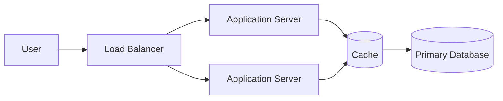

## Read Flow

1. Application checks cache.
2. If the value exists, return it.
3. Otherwise query the database.
4. Store result in cache.
5. Return result.

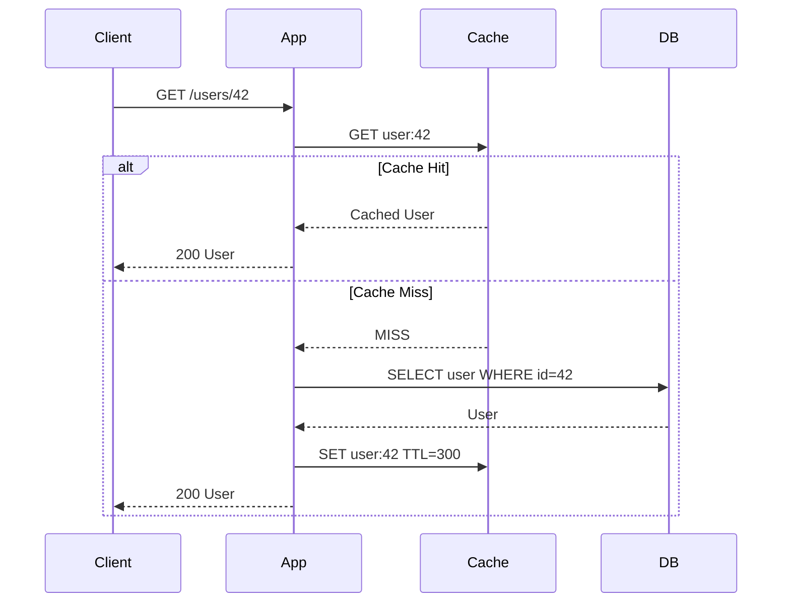

---

# 6. Why One Cache Server Fails

A single cache server creates several problems.

### Memory limit

A single machine might hold only 64–256 GB.

### Throughput limit

One machine can process only a finite number of operations.

### Single point of failure

If the cache crashes:

```text
100% cache misses
        ↓
Database receives huge traffic spike
        ↓
Database may fail
```

We therefore distribute cache entries across many machines.

---

# 7. Distributed Cache

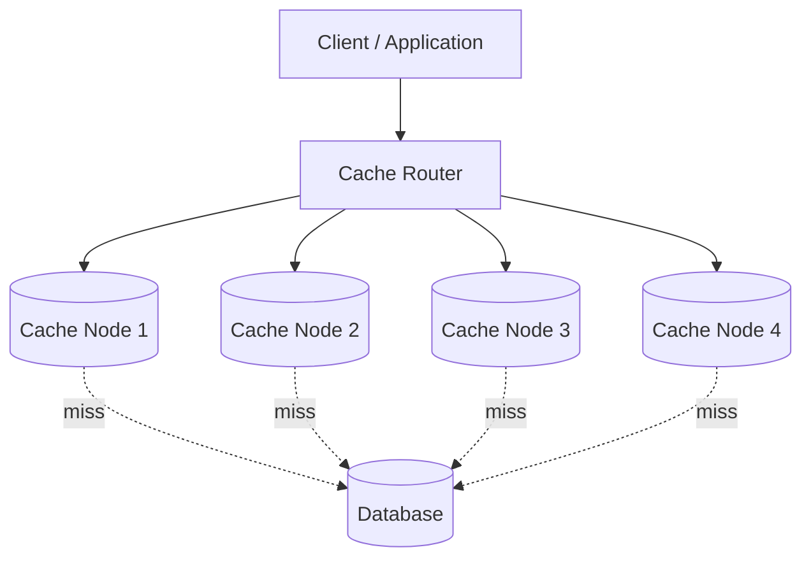

The main problem becomes:

> Given a key, which cache node should store it?

---

# 8. Naive Hashing

One possibility:

```text
node = hash(key) % numberOfNodes
```

Example:

```text
hash("user:42") = 912341

912341 % 4 = 1
```

Store it on:

```text
Cache Node 1
```

## Problem

Suppose we change:

```text
4 nodes → 5 nodes
```

Then almost every modulo result changes.

A huge fraction of keys must be moved or repopulated.

This causes:

```text
node addition
    ↓
massive key remapping
    ↓
cache miss explosion
    ↓
database overload
```

---

# 9. Consistent Hashing

Consistent hashing solves this problem.

Both:

* cache nodes,
* cache keys,

are mapped onto a logical hash ring.

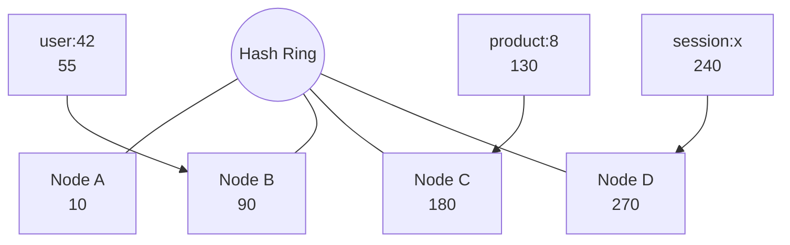

For a key:

1. Hash the key.
2. Locate its position on the ring.
3. Walk clockwise.
4. Store the key on the first cache node encountered.

---

## Node Addition

If a new node appears, only a fraction of the keyspace moves.

```text
Before:

A -------- B -------- C

After:

A ---- NEW ---- B ---- C
```

Only keys belonging to the new node's section are redistributed.

This greatly reduces churn.

---

# 10. Virtual Nodes

Physical machines are represented multiple times on the ring.

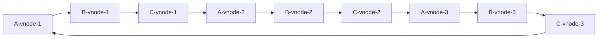

Benefits:

* Better load distribution.
* Easier rebalancing.
* Machines with more capacity can own more virtual nodes.

---

# 11. Cache Partitioning

Another common implementation uses explicit hash slots.

For example:

```text
0      ───── 5000   → Node A
5001   ───── 10000  → Node B
10001  ───── 16383  → Node C
```

Key routing becomes:

```text
slot = hash(key) % 16384
```

This is easier to administratively move than arbitrary individual keys.

---

# 12. Cache Replication

If a node dies and no replica exists, all keys stored there disappear.

Use replication:

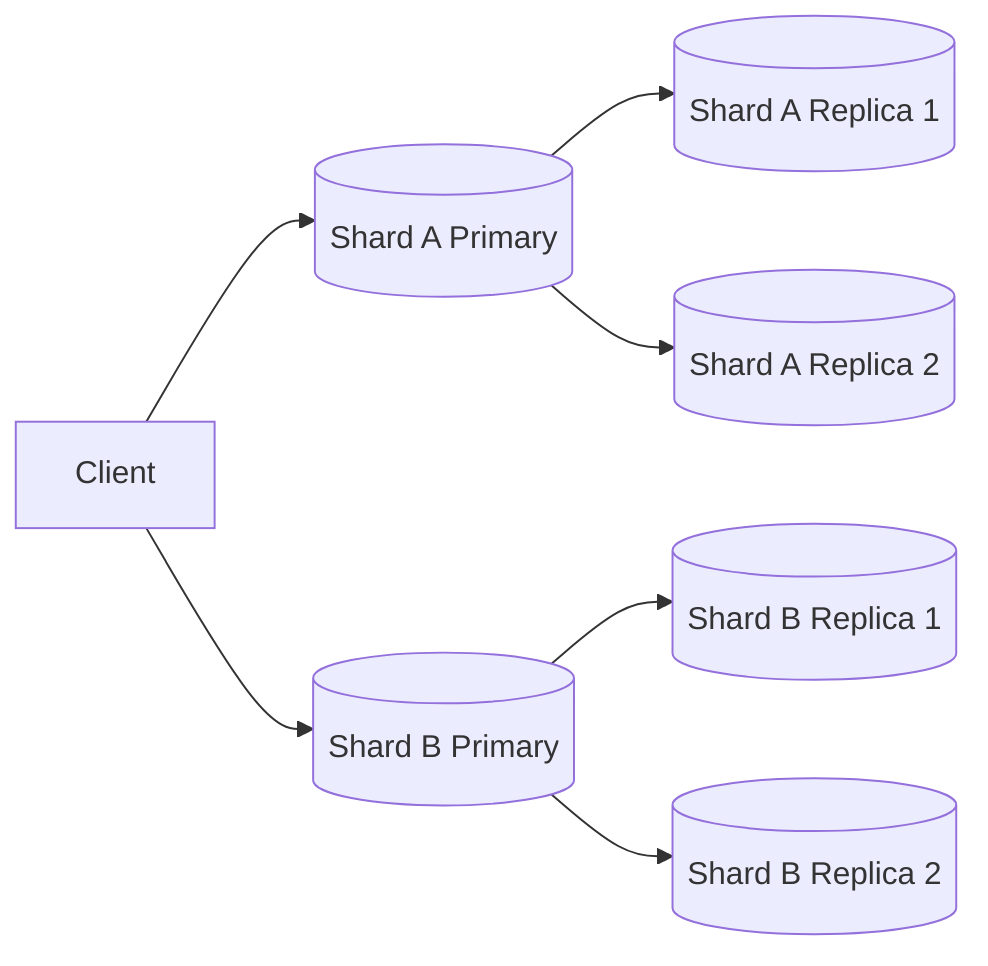

A common configuration is:

```text
Replication factor = 2 or 3
```

---

# 13. Synchronous vs Asynchronous Replication

## Synchronous

```text
Client
  ↓
Primary
  ↓
Replica
  ↓
ACK
  ↓
Client
```

### Advantages

* Stronger consistency.
* Less data loss after failover.

### Disadvantages

* Higher write latency.
* Availability suffers when replicas are unavailable.

---

## Asynchronous

```text
Client
  ↓
Primary
  ↓
ACK

Primary → Replica later
```

### Advantages

* Low write latency.
* Better availability.

### Disadvantages

A recently acknowledged write may disappear if the primary fails before replication completes.

Most high-performance caches prefer asynchronous replication.

---

# 14. Cache Strategies

## 14.1 Cache-Aside

The application manages the cache.

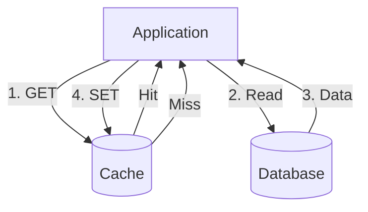

Pseudo-code:

```text
value = cache.get(key)

if value == null:
    value = database.get(key)
    cache.set(key, value, ttl)

return value
```

### Pros

* Simple.
* Only frequently requested data is cached.
* Cache failure does not destroy source data.

### Cons

* First request is slow.
* Application contains cache logic.
* Stale data is possible.

This is the most common interview choice.

---

# 15. Write-Through Cache

Writes first update the cache, which synchronously updates storage.

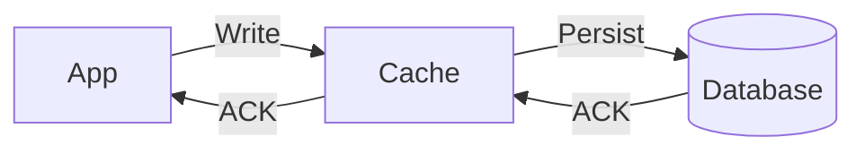

Pros:

* Cache stays warm.
* Cache and database are closely synchronized.

Cons:

* Higher write latency.
* Cache becomes part of the critical write path.

---

# 16. Write-Behind / Write-Back

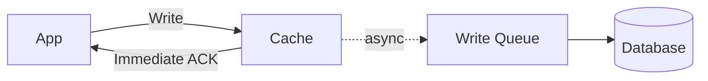

Pros:

* Very fast writes.
* Can batch database operations.

Cons:

* Data loss risk.
* Much greater implementation complexity.

Use carefully when cached state must eventually become durable.

---

# 17. Cache Invalidation

A classic problem:

> How do we ensure cached data does not remain stale after database updates?

A typical write flow:

```text
1. Update database.
2. Delete corresponding cache entry.
3. Next read repopulates cache.
```

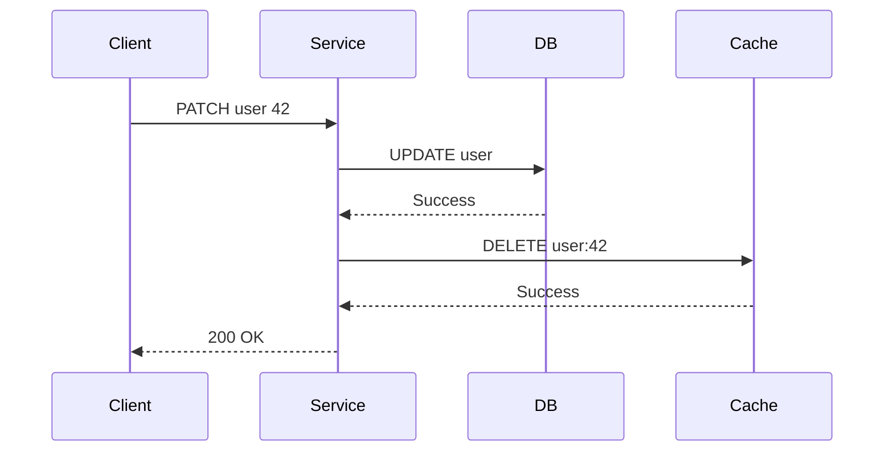

Why delete instead of update?

Because rebuilding an object correctly may require:

* joins,
* authorization information,
* derived data,
* multiple tables.

Deletion often keeps the write path simpler.

---

# 18. TTL

Every entry may have an expiration time.

Example:

```text
SET product:123 "{...}" TTL=300
```

Meaning:

```text
expires after 5 minutes
```

TTL limits the duration of stale data.

Typical TTLs may differ by data type:

```text
Session              → 30 minutes
Product information  → 5 minutes
Feature configuration→ 1 minute
Static metadata      → 1 hour
```

Random jitter is often added:

```text
TTL = 300 seconds ± random(30 seconds)
```

This prevents thousands of keys from expiring simultaneously.

---

# 19. Lazy and Active Expiration

## Lazy Expiration

When accessing a key:

```text
if now > expiration:
    delete key
    return MISS
```

Cheap, but expired values that are never accessed may continue occupying memory.

## Active Expiration

Background jobs periodically sample and delete expired keys.

Production caches usually combine both.

---

# 20. Eviction Policies

When memory becomes full, something must be removed.

## LRU — Least Recently Used

Remove items that have not been accessed recently.

Good when recent activity predicts future activity.

---

## LFU — Least Frequently Used

Remove entries with the lowest access frequency.

Useful when certain keys remain popular for long periods.

---

## FIFO

Remove the oldest inserted object.

Simple but often less effective.

---

## Random

Remove random entries.

Very cheap, but less intelligent.

---

# 21. Hot-Key Problem

Suppose:

```text
Taylor Swift concert ticket availability
```

becomes extremely popular.

Millions of requests may target one key.

Even with 100 cache nodes:

```text
hash(hot-key) → Node 17
```

Only Node 17 receives the traffic.

This defeats horizontal scaling.

---

# 22. Hot-Key Solutions

## Solution 1 — Replicate the Hot Key

Store copies on multiple nodes.

```text
concert:availability:0
concert:availability:1
concert:availability:2
concert:availability:3
```

Reads randomly choose a replica.

---

## Solution 2 — Local Application Cache

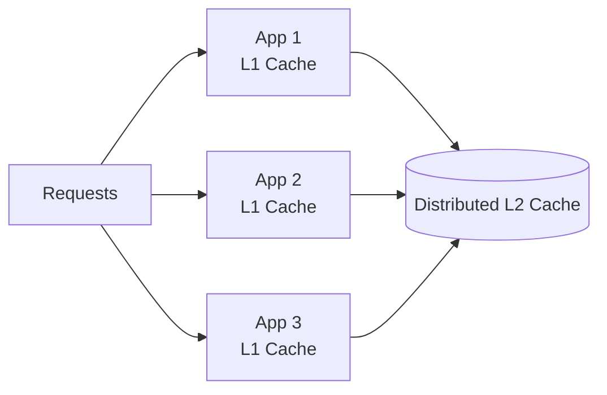

This creates:

```text
L1 = process-local cache
L2 = distributed cache
L3 = database
```

The hottest values may never reach the distributed cache.

---

# 23. Cache Stampede

Imagine one extremely popular key expires.

```text
10,000 requests arrive
        ↓
all observe cache MISS
        ↓
all query database
        ↓
database overload
```

This is called:

* cache stampede,
* thundering herd.

---

# 24. Stampede Protection

## Request Coalescing / Single Flight

Only one request may rebuild a given cache key.

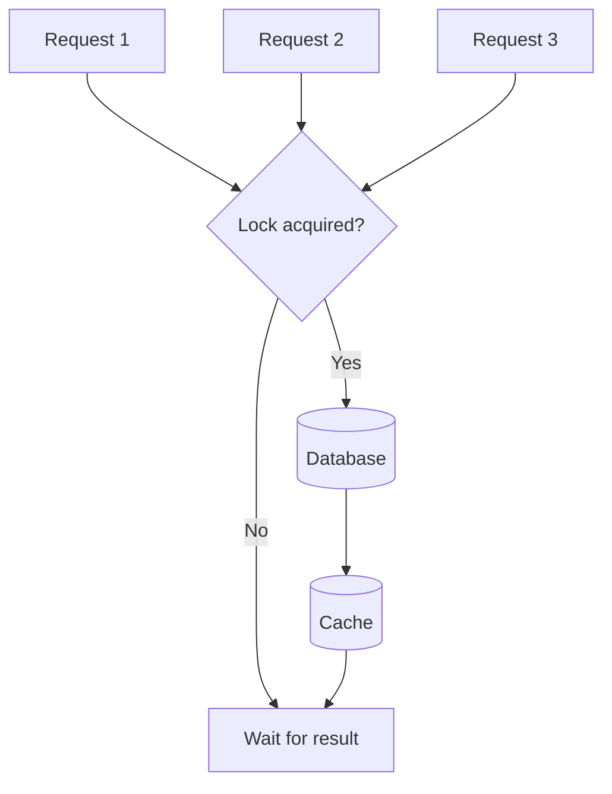

Pseudo-code:

```text
value = cache.get(key)

if value != null:
    return value

if acquireLock(key):
    value = db.get(key)
    cache.set(key, value)
    releaseLock(key)
    return value

waitForCachePopulation()
return cache.get(key)
```

---

# 25. Probabilistic Early Refresh

Instead of waiting for TTL to hit exactly zero:

```text
remaining TTL = 15 seconds
```

some requests proactively refresh the key.

The probability of refresh increases as expiration approaches.

This spreads regeneration over time.

---

# 26. Negative Caching

Suppose attackers repeatedly request:

```text
GET /users/999999999
```

The user does not exist.

Without negative caching:

```text
cache miss
→ DB lookup
→ not found

cache miss
→ DB lookup
→ not found
```

Instead cache:

```text
user:999999999 = NOT_FOUND
TTL = 30 seconds
```

This protects the database.

---

# 27. Cache Penetration

Attackers may intentionally send millions of nonexistent keys.

Mitigation:

```text
Bloom Filter
```

A Bloom filter can quickly tell us:

> This key definitely does not exist.

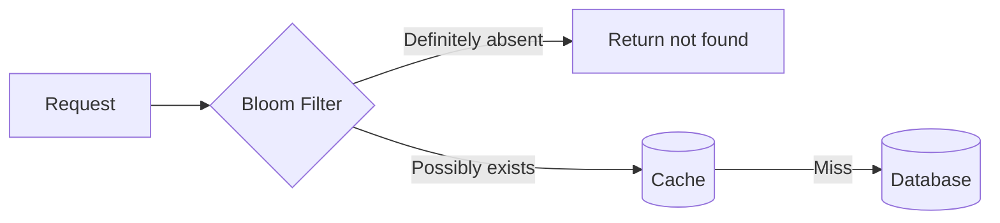

Bloom filters may produce false positives but not false negatives under their normal insertion-only semantics.

---

# 28. Cache Avalanche

A cache avalanche happens when:

* many entries expire simultaneously, or
* a large part of the cache cluster fails.

Then:

```text
cache miss volume
    ↓
database traffic spike
    ↓
database latency
    ↓
timeouts
    ↓
retries
    ↓
even more database traffic
```

Mitigations:

* TTL jitter.
* Replication.
* Circuit breakers.
* DB rate limiting.
* Request coalescing.
* Graceful stale reads.
* Bulkheads.
* Autoscaling.

---

# 29. Serving Stale Data

For some workloads:

```text
slightly stale result
```

is better than:

```text
complete outage
```

Maintain two logical expiration times:

```text
soft TTL = 5 minutes
hard TTL = 30 minutes
```

Between soft and hard TTL:

```text
serve stale value
+
refresh asynchronously
```

This is commonly known as:

```text
stale-while-revalidate
```

---

# 30. End-to-End Read Path

Now combine the concepts.

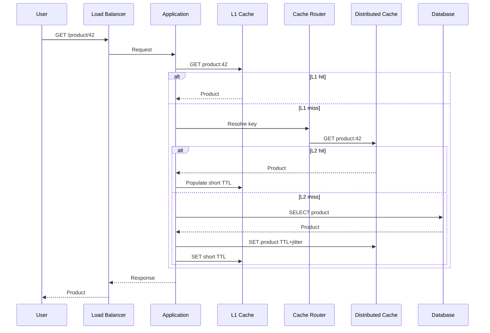

---

# 31. End-to-End Write Path

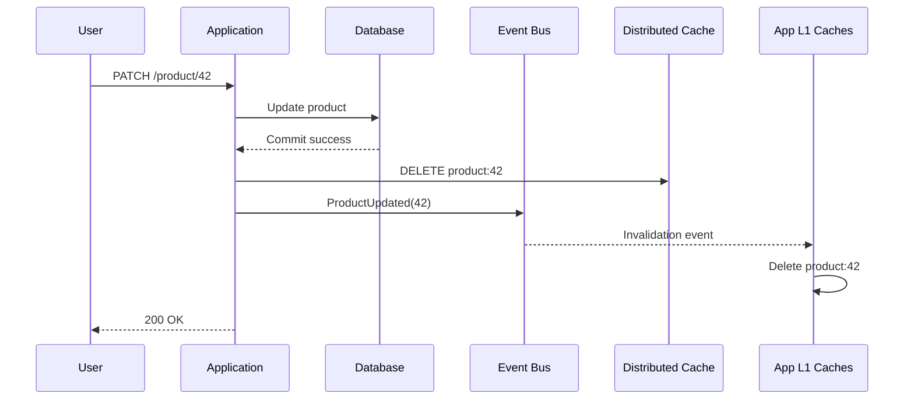

The database is updated first because it is the source of truth.

Distributed invalidation events remove stale local cache entries.

---

# 32. Client-Side vs Proxy-Based Routing

## Client-Side Routing

The application knows the cluster topology.

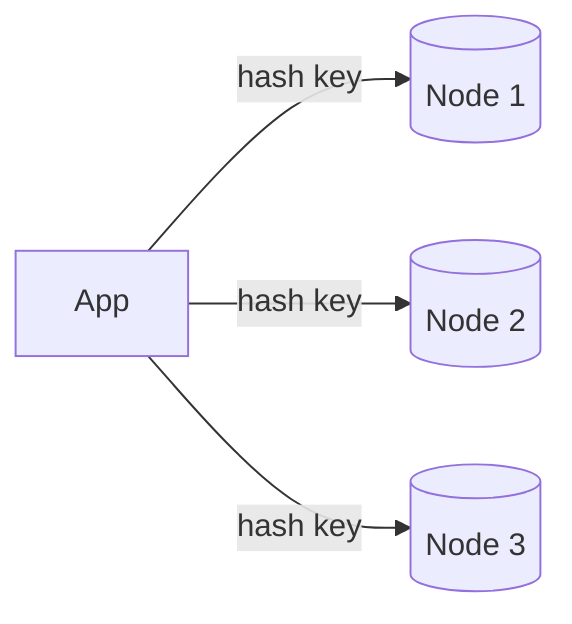

Advantages:

* One fewer network hop.
* High throughput.

Disadvantages:

* Clients must understand cluster topology.
* More complex SDKs.

---

## Proxy Routing

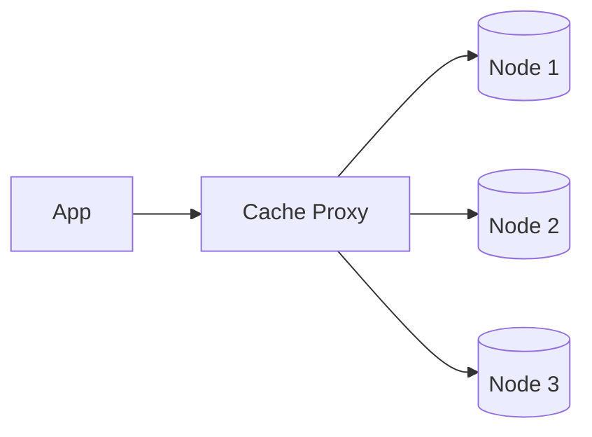

Advantages:

* Applications stay simple.
* Routing logic is centralized.

Disadvantages:

* Additional network hop.
* Proxy can become a bottleneck.

A proxy tier must itself be horizontally scalable.

---

# 33. Cluster Metadata

Clients need to know:

```text
which node owns which shard?
```

Metadata might look like:

```json
{
  "version": 81,
  "shards": [
    {
      "range": "0-5000",
      "primary": "10.0.1.20",
      "replicas": ["10.0.2.20"]
    },
    {
      "range": "5001-10000",
      "primary": "10.0.1.21",
      "replicas": ["10.0.2.21"]
    }
  ]
}
```

A control plane manages this information.

---

# 34. Control Plane vs Data Plane

## Data Plane

Handles user traffic:

```text
GET
SET
DELETE
```

It must be extremely fast.

## Control Plane

Handles:

* node registration,
* topology,
* shard assignment,
* failover,
* health,
* scaling,
* rebalancing.

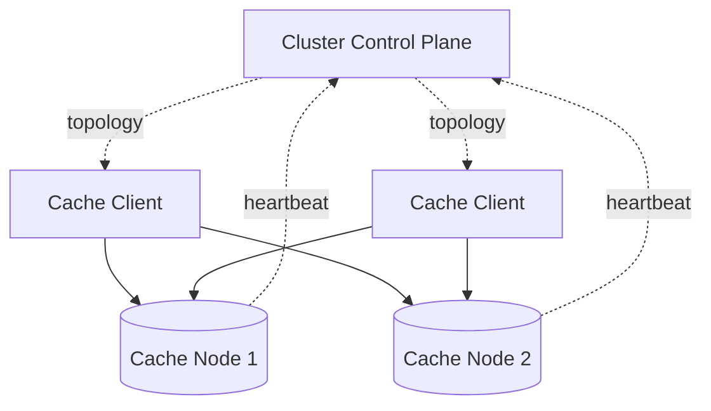

Separating the two prevents administrative operations from slowing the hot request path.

---

# 35. Failure Detection

Cache nodes periodically send:

```text
heartbeat
```

Example:

```text
Node A → healthy
Node B → healthy
Node C → no heartbeat
```

After a timeout:

```text
Node C suspected failed
```

The system promotes a replica.

---

# 36. Failover

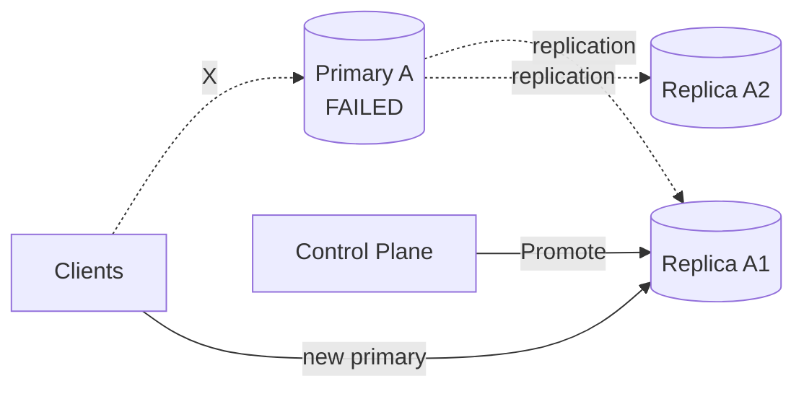

Steps:

1. Detect node failure.
2. Reach agreement that node is unavailable.
3. Select replica.
4. Promote replica.
5. Update topology.
6. Notify clients.
7. Re-replicate data to a new replica.

---

# 37. Split-Brain

Suppose network connectivity breaks:

```text
Primary A ──X── Replica B
```

Both may believe the other failed.

If both accept writes, divergent states appear.

Solutions include:

* quorum.
* leases.
* epochs/terms.
* fencing tokens.
* consensus-based control planes.

A cache may sometimes accept weaker guarantees because data can be reconstructed, but incorrect values can still cause serious application bugs.

---

# 38. Rebalancing

When adding a node:

```text
Old:

A    B    C

New:

A    B    C    D
```

some keys move to D.

Migration should be gradual.

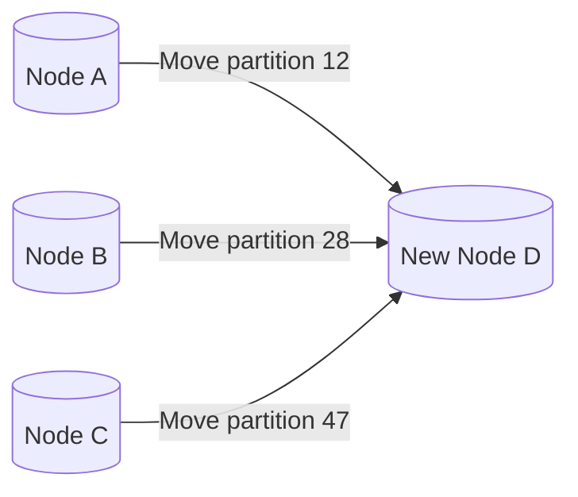

Throttle migrations so they do not consume all:

* CPU,
* network,
* cache capacity.

---

# 39. Cache Warming

A newly started node has no data.

Without warming:

```text
new node
→ massive miss ratio
→ database traffic
```

Options:

### Lazy warming

Populate keys only when requested.

### Snapshot loading

Load a previous cache snapshot.

### Replica promotion

Bring up the node as a replica before making it primary.

### Traffic ramp-up

Send:

```text
5%
→ 10%
→ 25%
→ 50%
→ 100%
```

of traffic gradually.

---

# 40. Multi-Tier Cache Architecture

A mature system may use:

```text
L1: Application memory
L2: Distributed in-memory cache
L3: Regional secondary cache
L4: Database
```

```mermaid
flowchart LR
    U[User] --> A[Application]

    A --> L1[(L1<br/>Process Cache)]
    L1 --> L2[(L2<br/>Distributed Cache)]
    L2 --> L3[(L3<br/>Regional Cache)]
    L3 --> DB[(Database)]
```

Trade-off:

More layers improve latency and resilience but make invalidation harder.

---

# 41. Production-Grade Architecture

```mermaid
flowchart TB
    U[Clients]
    DNS[Global Traffic Manager]

    U --> DNS

    subgraph Region_A[Region A]
        LB1[Load Balancer]

        A1[App Servers<br/>L1 Cache]
        P1[Cache Proxy / Smart Client Layer]

        C11[(Shard 1 Primary)]
        C12[(Shard 2 Primary)]
        C13[(Shard 3 Primary)]

        R11[(Shard 1 Replica)]
        R12[(Shard 2 Replica)]
        R13[(Shard 3 Replica)]

        CP1[Cache Control Plane]
        Q1[Event Bus]
        DB1[(Regional DB)]

        LB1 --> A1
        A1 --> P1

        P1 --> C11
        P1 --> C12
        P1 --> C13

        C11 --> R11
        C12 --> R12
        C13 --> R13

        CP1 -. topology .-> P1
        CP1 -. management .-> C11
        CP1 -. management .-> C12
        CP1 -. management .-> C13

        A1 --> Q1
        A1 --> DB1
        Q1 -. invalidation .-> A1
    end

    subgraph Region_B[Region B]
        LB2[Load Balancer]
        A2[App Servers<br/>L1 Cache]
        P2[Cache Layer]
        C21[(Cache Shards)]
        DB2[(Regional DB)]

        LB2 --> A2
        A2 --> P2
        P2 --> C21
        A2 --> DB2
    end

    DNS --> LB1
    DNS --> LB2

    DB1 <-. replication .-> DB2
```

---

# 42. Multi-Region Strategy

Prefer:

```text
region-local cache
```

instead of one globally shared cache.

Why?

A cross-continent cache request may take:

```text
50–200+ ms
```

while an in-region cache may take only a few milliseconds.

Architecture:

```text
US application → US cache
EU application → EU cache
Asia application → Asia cache
```

Each region independently populates cached values.

---

# 43. Cross-Region Invalidation

After an authoritative update:

```text
ProductUpdated(42)
```

publish an event.

```mermaid
flowchart LR
    DB[(Source Database)] --> E[Global Event Stream]

    E --> US[US Cache Invalidator]
    E --> EU[EU Cache Invalidator]
    E --> AP[Asia Cache Invalidator]

    US --> C1[(US Cache)]
    EU --> C2[(EU Cache)]
    AP --> C3[(Asia Cache)]
```

This leads to eventual rather than instantaneous global consistency.

---

# 44. Consistency Model

For most caches:

```text
eventual consistency
```

is acceptable.

Example:

```text
Database: price = $100
Cache:    price = $95
```

for a short period after a write.

Whether that is acceptable depends on the domain.

Usually safe:

* profile pictures,
* feeds,
* search results,
* recommendations.

Potentially unsafe:

* bank balance,
* inventory reservation,
* permission revocation,
* payment state.

For critical values, either:

* bypass the cache,
* use extremely short TTL,
* synchronously invalidate,
* version the cached objects.

---

# 45. Versioned Cache Entries

Store:

```json
{
  "version": 91,
  "value": {
    "price": 100
  }
}
```

An update carrying:

```text
version 90
```

must never overwrite:

```text
version 91
```

This prevents reordered asynchronous events from resurrecting stale data.

---

# 46. API Design

Internal cache protocol:

```text
GET /v1/cache/{key}

PUT /v1/cache/{key}
{
  "value": "...",
  "ttlSeconds": 300
}

DELETE /v1/cache/{key}
```

At very high scale, a binary persistent protocol is preferable to HTTP because it reduces:

* payload size,
* serialization overhead,
* connection establishment,
* CPU usage.

Client libraries should generally use:

```text
connection pooling
+
persistent connections
+
pipelining/batching
```

---

# 47. Data Model

A cache record might contain:

```text
Key
Value
ExpirationTime
Version
CreationTime
LastAccessTime
FrequencyCounter
Flags
```

Conceptually:

```text
CacheEntry {
    key: bytes
    value: bytes
    expiresAt: timestamp
    version: int64
    lastAccess: timestamp
    frequency: integer
}
```

A real high-performance implementation tries to minimize metadata because every additional byte consumes RAM.

---

# 48. Internal Data Structures

Typical in-memory indexes use:

```text
Hash Table
```

Average lookup complexity:

```text
O(1)
```

Example:

```text
hash(key)
   ↓
bucket
   ↓
cache entry
```

Expiration may additionally use:

* timer wheels,
* min-heaps,
* sampled expiration,
* ordered structures.

---

# 49. Memory Fragmentation

Even if the logical dataset occupies:

```text
50 GB
```

the process may consume:

```text
65 GB
```

because of:

* allocator metadata,
* object headers,
* partially filled slabs,
* fragmentation.

Therefore nodes should never be planned at 100% memory usage.

Maintain headroom such as:

```text
20–30%
```

depending on workload and allocator behavior.

---

# 50. Large Objects

Large cached values cause:

* expensive serialization,
* long network transfers,
* memory fragmentation,
* eviction of many small useful values.

Instead of caching:

```text
20 MB response
```

consider caching:

* smaller fragments,
* IDs,
* precomputed summaries.

Set maximum object-size limits.

---

# 51. Compression

For sufficiently large values:

```text
value → compress → cache
```

Advantages:

* lower memory consumption,
* lower network bandwidth.

Disadvantages:

* increased CPU.
* extra latency.

Use compression only when saved memory/network cost outweighs CPU cost.

---

# 52. Batching

Instead of:

```text
GET key1
GET key2
GET key3
GET key4
```

use:

```text
MGET key1 key2 key3 key4
```

This reduces:

* network round trips,
* system calls,
* protocol overhead.

---

# 53. Pipelining

Without pipelining:

```text
send GET
wait
send GET
wait
send GET
wait
```

With pipelining:

```text
send GET
send GET
send GET
↓
receive responses
```

This dramatically increases throughput for high-latency client connections.

---

# 54. Backpressure

Suppose the cache can safely process:

```text
1M QPS
```

but receives:

```text
3M QPS
```

Do not blindly queue everything.

Instead use:

* bounded queues,
* timeouts,
* concurrency limits,
* load shedding,
* admission control.

Otherwise latency grows until the entire system collapses.

---

# 55. Circuit Breaker

If the cache cluster becomes unhealthy:

```text
requests
→ timeout
→ retry
→ timeout
→ retry
```

can worsen the outage.

A circuit breaker detects repeated failures and temporarily stops calling the dependency.

```mermaid
stateDiagram-v2
    [*] --> Closed

    Closed --> Open: failure threshold reached
    Open --> HalfOpen: cooldown expires
    HalfOpen --> Closed: probe succeeds
    HalfOpen --> Open: probe fails
```

---

# 56. Retry Policy

Retries must use:

```text
exponential backoff + jitter
```

Example:

```text
50 ms
100 ms
200 ms
400 ms
```

with random variation.

Never allow unlimited retries.

Retries can transform a small outage into a traffic avalanche.

---

# 57. Database Protection

If the cache fails completely, the database may suddenly receive 10×–100× its normal read traffic.

Protect it using:

```mermaid
flowchart LR
    Requests --> RL[Rate Limiter]
    RL --> SF[Single Flight]
    SF --> DB[(Database)]

    DB --> Cache[(Cache)]
```

Useful mechanisms:

* rate limiting,
* request coalescing,
* stale responses,
* circuit breakers,
* queue limits,
* degraded-mode responses.

---

# 58. Admission Policy

Not every object deserves to enter the cache.

Consider an object requested once:

```text
GET obscure-report-83945
```

Caching it may evict something popular.

An admission policy estimates whether the incoming item is likely to be more valuable than the item it would evict.

This is particularly useful for workloads with large numbers of one-time scans.

---

# 59. Security

The cache should normally live on private infrastructure.

Controls:

* Private network.
* TLS in transit.
* Authentication.
* Authorization.
* Network ACLs.
* Key namespaces.
* Audit logs for administrative operations.
* Encryption for sensitive values.
* Secrets never stored casually in cache.
* Rate limits per tenant.

Avoid exposing cache servers directly to the public internet.

---

# 60. Multi-Tenant Isolation

One tenant should not be able to consume all cache capacity.

Use:

```text
tenant:user:123
tenant:product:456
```

and enforce:

* per-tenant memory quotas,
* request limits,
* key-size limits,
* value-size limits.

---

# 61. Observability

Key metrics include:

## Traffic

```text
requests/sec
GET/sec
SET/sec
DELETE/sec
```

## Cache effectiveness

```text
hit rate
miss rate
evictions/sec
expiration/sec
```

## Performance

```text
p50 latency
p95 latency
p99 latency
```

## Resources

```text
memory utilization
CPU utilization
network bandwidth
connection count
```

## Cluster health

```text
replication lag
failed nodes
rebalancing progress
failover count
```

## Downstream impact

```text
DB QPS caused by cache misses
DB latency
single-flight waiters
```

A drop from:

```text
95% cache hit rate
```

to:

```text
70%
```

may be more dangerous than a cache node reaching 80% CPU.

---

# 62. Important Alerts

Example alerts:

```text
Cache hit ratio < 85%
p99 GET latency > 10 ms
Memory utilization > 85%
Evictions suddenly increase
Replication lag > threshold
Node unavailable
Database miss traffic > safe limit
Hot shard > 2× cluster average
```

---

# 63. Disaster Recovery

Caches generally do not need classic durable disaster recovery because the data is reconstructible.

After an entire region fails:

```text
new cache cluster
↓
starts empty
↓
requests repopulate it
```

The real concern is:

```text
cold-cache database overload
```

Therefore disaster recovery should include:

* staged traffic ramp-up,
* cache prewarming,
* stale data snapshots where appropriate,
* database protection,
* request coalescing.

---

# 64. Cost Trade-Off

Suppose caching reduces database reads by 95%.

Without cache:

```text
600K database reads/sec
```

With 95% hit rate:

```text
30K database reads/sec
```

The organization pays for cache memory to avoid:

* database CPU,
* additional database replicas,
* expensive storage I/O,
* higher request latency.

Memory is expensive, so optimize what gets cached rather than caching everything.

---

# 65. Full End-to-End Request Architecture

```mermaid
flowchart TB
    Client[Client]

    Client --> GTM[Global Traffic Manager]
    GTM --> LB[Regional Load Balancer]

    LB --> App[Application Servers]

    App --> L1{L1 Local Cache}

    L1 -->|Hit| Resp[Return Response]

    L1 -->|Miss| Router[Cache Client / Router]

    Router --> Meta[Cached Cluster Metadata]

    Router --> S1[(Shard A)]
    Router --> S2[(Shard B)]
    Router --> S3[(Shard C)]

    S1 --> S1R[(Replica)]
    S2 --> S2R[(Replica)]
    S3 --> S3R[(Replica)]

    S1 -->|Miss| Protect[DB Protection Layer]
    S2 -->|Miss| Protect
    S3 -->|Miss| Protect

    Protect --> Lock[Single Flight]
    Lock --> DB[(Source-of-Truth Database)]

    DB --> Fill[Populate Cache]
    Fill --> Router

    Router --> L1
    L1 --> Resp

    CP[Cluster Control Plane] -. topology .-> Meta
    CP -. heartbeat / failover .-> S1
    CP -. heartbeat / failover .-> S2
    CP -. heartbeat / failover .-> S3

    Events[Invalidation Event Bus] -. invalidate .-> App
```

---

# 66. End-to-End Component Responsibilities

## Global Traffic Manager

Routes users toward a healthy nearby region.

---

## Load Balancer

Distributes requests across application servers.

---

## Application L1 Cache

Provides sub-millisecond access to extremely hot values.

---

## Cache Client / Router

Responsible for:

* consistent hashing,
* shard selection,
* retries,
* timeouts,
* connection pooling,
* topology refresh,
* replica selection.

---

## Distributed Cache Nodes

Responsible for:

* in-memory storage,
* TTL,
* expiration,
* eviction,
* replication,
* cache operations.

---

## Control Plane

Responsible for:

* node membership,
* health checking,
* shard ownership,
* replica promotion,
* rebalancing.

---

## Event Bus

Propagates:

* invalidation messages,
* domain update events,
* regional cache changes.

---

## Database Protection Layer

Contains:

* rate limiter,
* concurrency control,
* circuit breaker,
* request coalescing.

---

## Source-of-Truth Database

Contains authoritative durable data.

---

# 67. Complete Cache-Miss Lifecycle

For:

```text
GET /product/42
```

the system performs:

```text
1. Client reaches nearest region.
2. Load balancer chooses application server.
3. Application checks L1 cache.
4. L1 misses.
5. Client SDK hashes "product:42".
6. Hash maps key to shard 17.
7. Request goes to shard 17 primary.
8. Distributed cache misses.
9. Application attempts single-flight lock.
10. One caller queries database.
11. Database returns product.
12. Product is serialized.
13. TTL + random jitter is chosen.
14. Value is stored in distributed cache.
15. Value is stored in local L1 cache.
16. Waiting requests receive the populated value.
17. Response returns to user.
```

Subsequent requests execute approximately:

```text
application
→ L1 hit
→ response
```

or:

```text
application
→ L2 hit
→ response
```

instead of reaching the database.

---

# 68. Complete Update Lifecycle

Suppose an admin changes:

```text
product:42.price
```

Flow:

```text
1. Request reaches application.
2. Application validates request.
3. Database transaction updates price.
4. Database commits.
5. Distributed cache entry is deleted.
6. ProductUpdated event is published.
7. Other regions receive the event.
8. Regional L1 caches invalidate product:42.
9. Next read misses.
10. Fresh value is loaded from database.
11. Cache is repopulated.
```

---

# 69. Failure Scenarios

## Cache Node Fails

Response:

```text
detect failure
→ promote replica
→ update topology
→ recreate replication factor
```

---

## Entire Cache Cluster Fails

Response:

```text
circuit breaker
+ DB rate limiting
+ stale data
+ single flight
+ gradual recovery
```

---

## Database Fails

Cache hits may continue working.

For misses:

* serve stale data where safe,
* return degraded responses,
* avoid unlimited retry storms.

---

## Event Bus Fails

Invalidations may be delayed.

TTL provides eventual correction.

---

## Control Plane Fails

Existing data-plane traffic should continue using its last known topology.

This is a key design principle:

> Control-plane failure should not immediately stop cache GET/SET traffic.

---

## Network Partition

Use:

* epochs,
* leases,
* quorum-based ownership,
* fencing,

to avoid competing primaries.

---

# 70. Trade-Off Summary

| Decision                 | Pros                         | Cons                  | Alternative        |
| ------------------------ | ---------------------------- | --------------------- | ------------------ |
| Cache-aside              | Simple, flexible             | Miss penalty          | Read-through       |
| Consistent hashing       | Minimal remapping            | More complex routing  | Modulo hashing     |
| Replication              | High availability            | More memory           | No replication     |
| Async replication        | Low latency                  | Possible lost writes  | Sync replication   |
| LRU eviction             | Simple, effective            | Not frequency-aware   | LFU                |
| LFU eviction             | Preserves popular keys       | More metadata         | LRU                |
| L1 cache                 | Extremely fast               | Harder invalidation   | L2 only            |
| TTL                      | Prevents permanent staleness | Temporary stale reads | Push invalidation  |
| Event invalidation       | Fast propagation             | Event infrastructure  | TTL only           |
| Client routing           | No proxy hop                 | Smart SDK required    | Proxy              |
| Proxy routing            | Simple clients               | Extra network hop     | Client routing     |
| Eventual consistency     | Fast and available           | Stale reads possible  | Strong consistency |
| Multi-region local cache | Low regional latency         | Duplicate memory      | Global cache       |
| Request coalescing       | Stops stampedes              | Coordination needed   | Unlimited DB reads |
| Serve stale              | High availability            | Old data              | Fail closed        |

---

# 71. Design Evolution

A strong interview explanation should evolve the architecture.

## Version 1

```text
Application
→ Database
```

Problem:

```text
high DB latency and load
```

---

## Version 2

```text
Application
→ Single Cache
→ Database
```

Problem:

```text
single point of failure
+
limited memory
```

---

## Version 3

```text
Application
→ Distributed Cache
→ Database
```

Use:

```text
consistent hashing
```

Problem:

```text
node failures lose cached data
```

---

## Version 4

Add:

```text
replication
+
automatic failover
```

Problem:

```text
hot keys
+
stampedes
+
cold starts
```

---

## Version 5

Add:

```text
L1 caches
hot-key replication
single-flight
TTL jitter
negative caching
DB protection
```

---

## Version 6 — Production Grade

Add:

```text
multi-region architecture
control plane
event-driven invalidation
observability
security
rate limiting
gradual rebalancing
disaster recovery
```

---

# 72. Interview Questions and Model Answers

## Q1. Why use consistent hashing?

Adding or removing cache nodes under:

```text
hash(key) % N
```

remaps a large percentage of keys.

Consistent hashing remaps only the portion of the keyspace associated with the changed node, dramatically reducing cache churn and database misses.

---

## Q2. Why do we need replicas if cached data is not durable?

Not primarily for durability.

Replicas provide **availability**.

Without replicas, losing one cache node turns all keys on that node into misses and may overload the database.

---

## Q3. What happens when the cache is completely down?

The system should not blindly send every request to the database.

Use:

* rate limiting,
* request coalescing,
* circuit breaking,
* stale values,
* graceful degradation,
* gradual cache recovery.

---

## Q4. How do you handle hot keys?

Possible approaches:

* local L1 cache,
* replicate the key,
* shard the logical key,
* request coalescing,
* identify hot keys dynamically.

---

## Q5. How do you avoid cache stampedes?

Use:

```text
single-flight locking
+
TTL jitter
+
early refresh
+
stale-while-revalidate
```

---

## Q6. Why not cache every database row?

Memory is expensive.

Caching rarely accessed objects:

* wastes RAM,
* lowers hit efficiency,
* evicts valuable hot entries.

Cache the working set.

---

## Q7. What consistency guarantee does the cache provide?

Usually eventual consistency.

The database remains authoritative.

Critical data may bypass cache or use stronger invalidation/version semantics.

---

## Q8. What happens when a new cache node joins?

The control plane assigns it hash slots or virtual nodes.

Existing nodes gradually migrate ownership while migration traffic is throttled.

---

## Q9. How do clients learn the new topology?

Possible methods:

* control-plane discovery,
* SDK polling,
* push notifications,
* redirects from cache nodes,
* service discovery.

The client should cache topology locally.

---

## Q10. What if a cache invalidation event arrives out of order?

Use monotonically increasing versions.

An event containing version:

```text
42
```

cannot overwrite state already at:

```text
43
```

---

## Q11. Redis or Memcached?

For a simple interview answer:

Memcached-like systems are attractive for straightforward distributed key/value caching.

Redis-like systems add richer capabilities such as:

* data structures,
* replication,
* persistence options,
* scripting,
* streams,
* clustering.

The correct choice depends on whether the application needs a basic cache or more advanced server-side behavior.

---

## Q12. Should the cache be durable?

Usually no.

Making the cache strongly durable can reduce its simplicity and latency advantages.

If losing cached data would lose business data, then it is no longer merely a cache and the system requirements should be reconsidered.

---

# 73. Whiteboard Interview Order

For a 45-minute interview:

## Minutes 0–5

Clarify:

```text
scale
latency
consistency
data size
read/write ratio
durability
multi-region requirement
```

---

## Minutes 5–10

Estimate:

```text
QPS
memory
bandwidth
number of nodes
```

---

## Minutes 10–15

Draw:

```text
Client
→ App
→ Cache
→ DB
```

Explain cache-aside.

---

## Minutes 15–20

Scale the cache using:

```text
sharding
+
consistent hashing
```

---

## Minutes 20–25

Add:

```text
replication
+
failover
+
control plane
```

---

## Minutes 25–30

Discuss:

```text
TTL
eviction
invalidation
consistency
```

---

## Minutes 30–35

Solve:

```text
hot keys
cache stampede
cache avalanche
cache penetration
```

---

## Minutes 35–40

Add production concerns:

```text
multi-region
observability
security
backpressure
DB protection
```

---

## Minutes 40–45

Summarize trade-offs and discuss failure cases.

---

# 74. Final Architecture Summary

A production distributed cache consists of four major layers.

```text
                 ┌──────────────────────┐
                 │      Application     │
                 │       + L1 Cache     │
                 └──────────┬───────────┘
                            │
                 ┌──────────▼───────────┐
                 │ Cache Routing Layer  │
                 │ Consistent Hashing   │
                 └──────────┬───────────┘
                            │
          ┌─────────────────┼─────────────────┐
          │                 │                 │
     ┌────▼────┐       ┌────▼────┐       ┌────▼────┐
     │ Shard A │       │ Shard B │       │ Shard C │
     │ +Replica│       │ +Replica│       │ +Replica│
     └────┬────┘       └────┬────┘       └────┬────┘
          │                 │                 │
          └─────────────────┼─────────────────┘
                            │ misses
                   ┌────────▼────────┐
                   │ DB Protection   │
                   │ Single Flight   │
                   │ Rate Limiting   │
                   └────────┬────────┘
                            │
                   ┌────────▼────────┐
                   │ Source-of-Truth │
                   │    Database     │
                   └─────────────────┘
```

The central design principles are:

1. **Partition using consistent hashing or explicit hash slots.**
2. **Replicate each partition for availability.**
3. **Keep the database as the source of truth.**
4. **Use cache-aside for simple application integration.**
5. **Use TTL plus invalidation to control stale data.**
6. **Protect against hot keys, stampedes, and avalanches.**
7. **Protect the database when cache capacity disappears.**
8. **Separate the data plane from the control plane.**
9. **Use region-local caches for global systems.**
10. **Measure hit rate, latency, evictions, hot shards, and database miss traffic.**

---

# 75. One-Minute Interview Summary

> I would design the cache as a horizontally partitioned in-memory key/value system. Clients route keys to shards using consistent hashing or hash slots, while every shard has one primary and multiple replicas. The application uses cache-aside: read from cache first, fetch from the source database after a miss, then repopulate the cache with a TTL and jitter. Writes update the authoritative datastore and invalidate cached copies. A separate control plane manages node membership, failover, shard ownership, and rebalancing. For production scale, I would add L1 application caches, hot-key replication, single-flight request coalescing, negative caching, stale-while-revalidate, database rate limiting, regional cache clusters, event-driven invalidation, observability, and automated failover.

---

# 76. References and Further Reading

* Redis Documentation — https://redis.io/docs/
* Redis Cluster Specification — https://redis.io/docs/latest/operate/oss_and_stack/reference/cluster-spec/
* Memcached Documentation — https://docs.memcached.org/
* AWS ElastiCache Documentation — https://docs.aws.amazon.com/elasticache/
* Google Cloud Memorystore Documentation — https://cloud.google.com/memorystore/docs
* Microsoft Azure Cache for Redis Documentation — https://learn.microsoft.com/azure/azure-cache-for-redis/
* Amazon Dynamo paper, which popularized consistent-hashing techniques in large-scale distributed systems — https://www.allthingsdistributed.com/files/amazon-dynamo-sosp2007.pdf

---

# 77. Final Checklist

* [ ] Define cache API.
* [ ] Estimate QPS and memory.
* [ ] Explain cache-aside.
* [ ] Partition data.
* [ ] Explain consistent hashing.
* [ ] Add virtual nodes or hash slots.
* [ ] Replicate shards.
* [ ] Explain failover.
* [ ] Define TTL.
* [ ] Pick eviction strategy.
* [ ] Design invalidation.
* [ ] Handle cache stampede.
* [ ] Handle hot keys.
* [ ] Handle cache penetration.
* [ ] Handle cache avalanche.
* [ ] Protect database during cache failure.
* [ ] Add L1 cache.
* [ ] Add control plane.
* [ ] Add multi-region deployment.
* [ ] Add observability.
* [ ] Cover security.
* [ ] Discuss consistency.
* [ ] Discuss failure modes.
* [ ] Summarize trade-offs.
