# HLD Interview Mental Model

Use this as a **decision tree in your head** during almost any system-design interview.

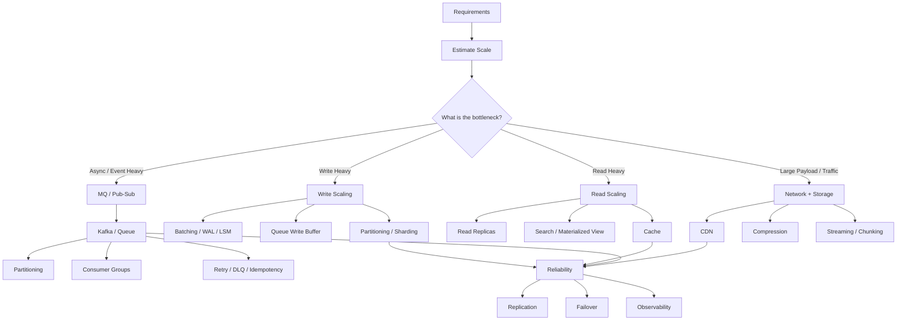

---

# 1. Start Every HLD With 5 Questions

Before choosing components:

```text
1. How much traffic?
2. Read-heavy or write-heavy?
3. Strong consistency required?
4. Synchronous or asynchronous?
5. What happens when something fails?
```

Then calculate:

```text
Users
   ↓
Requests/sec
   ↓
Read : Write ratio
   ↓
Payload size
   ↓
Bandwidth
   ↓
Storage/day
```

Example:

```text
10M DAU
100 requests/user/day

≈ 1B requests/day
≈ 11.5K average RPS

Peak ≈ 5–10x
≈ 100K RPS
```

---

# 2. Database Mental Model

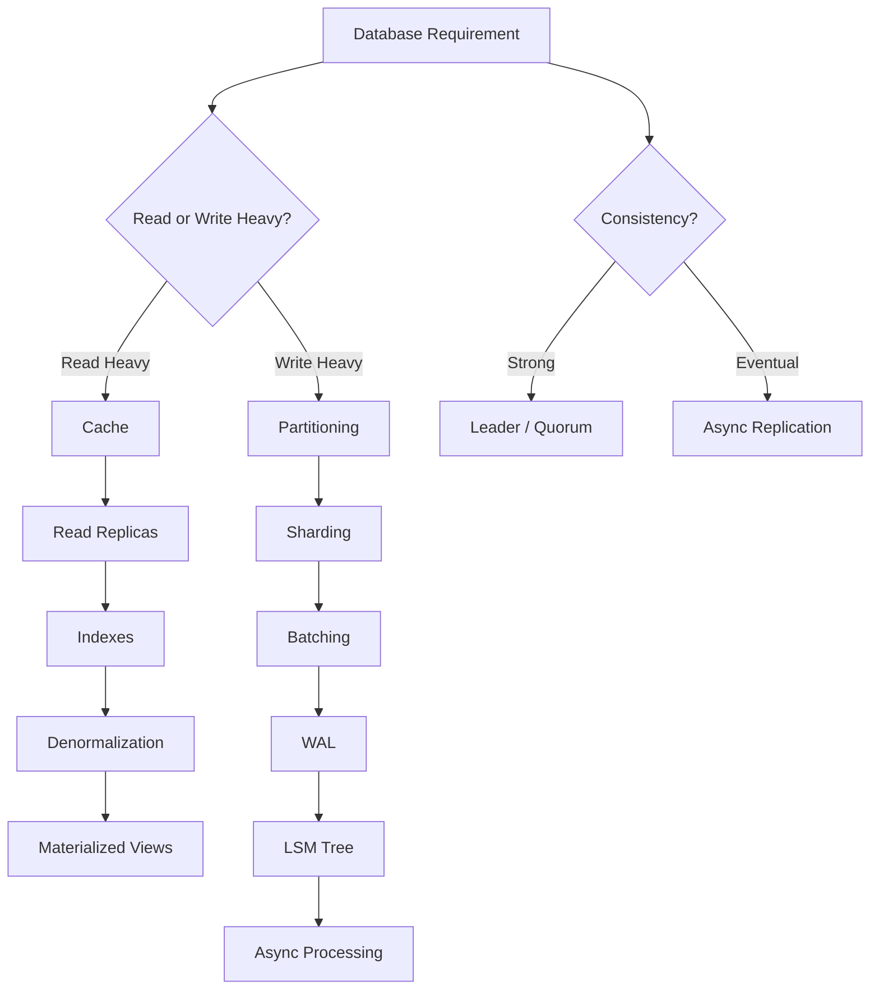

## Read Scaling

Think in this order:

```text
Application
    ↓
Local Cache
    ↓
Distributed Cache
    ↓
Read Replica
    ↓
Database
```

### Level 1 — Index

Without index:

```text
O(N)
```

With B+ Tree:

```text
O(log N)
```

Use indexes for:

```text
WHERE
JOIN
ORDER BY
GROUP BY
```

But:

> More indexes = faster reads + slower writes.

---

### Level 2 — Cache

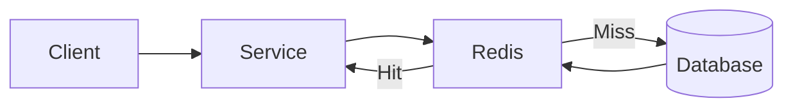

Use when:

```text
Same data repeatedly read
Read > Write
Slightly stale data acceptable
```

Think about:

```text
Cache Aside
Write Through
Write Back
TTL
Eviction
Hot Key
Stampede
Penetration
Avalanche
```

---

### Level 3 — Read Replicas

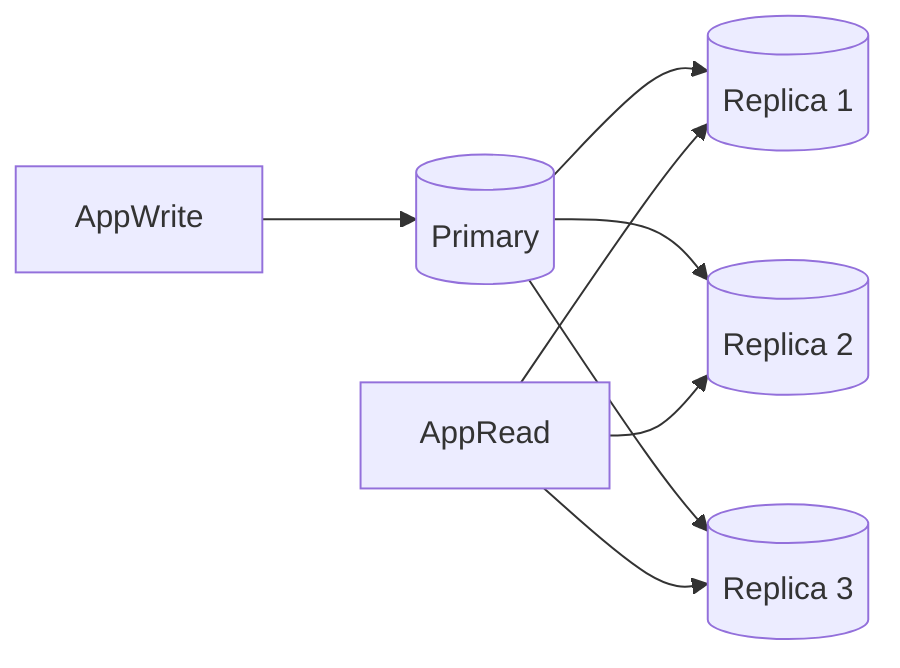

Good for:

```text
Read-heavy workload
```

Problem:

```text
Replication lag
```

Example:

```text
User updates profile
        ↓
Primary updated
        ↓
Immediately GET profile
        ↓
Replica hasn't replicated yet
        ↓
Old data returned
```

Possible solution:

```text
Read-your-own-write
→ temporarily read from leader.
```

---

# 3. Write Scaling Mental Model

If interviewer says:

> "We need 1M writes/sec."

Immediately think:

```text
Can one DB handle this?
        ↓
Probably not
        ↓
Partition writes
        ↓
Shard database
        ↓
Batch writes
        ↓
Queue if possible
        ↓
Sequential disk writes
```

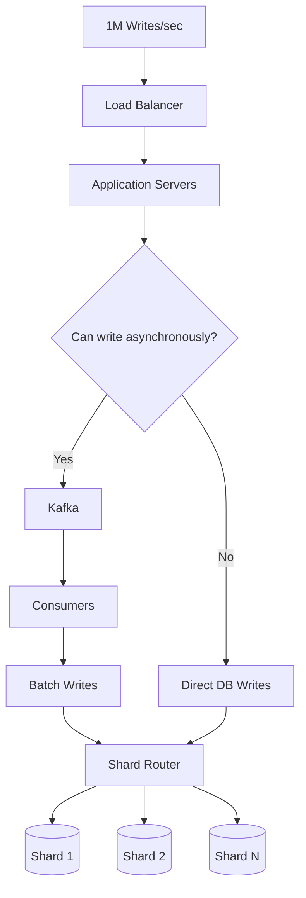

---

## Sharding

Instead of:

```text
1 DB
100M writes/sec
```

Use:

```text
100 shards
1M writes/sec each
```

Common shard keys:

```text
userId
tenantId
accountId
regionId
```

Example:

```java
shard = hash(userId) % N;
```

Problems:

```text
Hot shards
Rebalancing
Cross-shard JOIN
Cross-shard transaction
Shard discovery
```

---

# 4. Partitioning vs Replication

Mental shortcut:

```text
Partitioning → scale DATA / WRITES
Replication → scale READS / AVAILABILITY
```

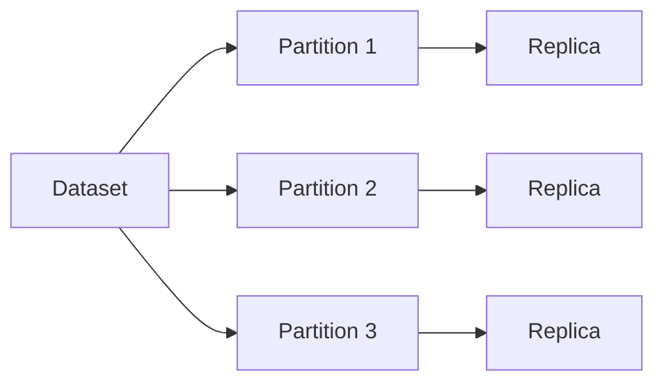

---

# 5. Database Choice Mental Model

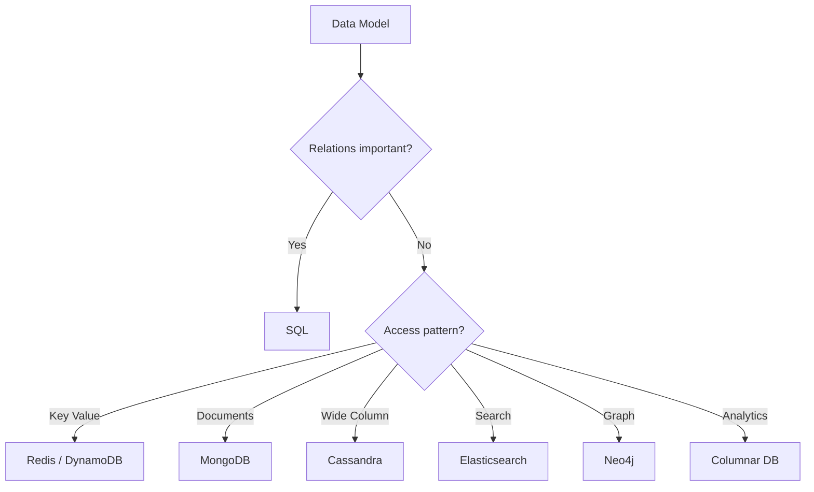

Think:

| Requirement       | Typical choice        |
| ----------------- | --------------------- |
| Transactions      | PostgreSQL / MySQL    |
| Key-value         | Redis / DynamoDB      |
| Massive writes    | Cassandra             |
| Flexible document | MongoDB               |
| Search            | Elasticsearch         |
| Analytics         | ClickHouse / BigQuery |
| Graph relations   | Neo4j                 |
| Blob/file         | S3 / Object Storage   |

Do not say:

> "NoSQL scales better."

Instead say:

> "The access pattern is mostly key-based with no cross-entity joins, so a partitioned key-value/document store fits."

---

# 6. Quorum Mental Model

Assume:

```text
N = replicas
W = replicas acknowledging write
R = replicas contacted during read
```

Strong quorum condition:

```text
R + W > N
```

Example:

```text
N = 3
W = 2
R = 2
```

Because:

```text
2 + 2 > 3
```

read/write sets must overlap.

Trade-off:

```text
Higher W
→ stronger write durability
→ slower writes

Higher R
→ stronger/fresher reads
→ slower reads
```

---

# 7. MQ / Pub-Sub Mental Model

Whenever you hear:

```text
async
events
notifications
analytics
decoupling
high write burst
background processing
```

think:

```text
Kafka / Queue
```

---

## Queue vs Pub/Sub

### Queue

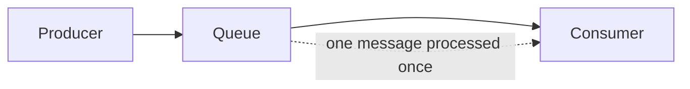

Use for:

```text
Job processing
Email sending
Image processing
Payment processing
```

Conceptually:

```text
1 message → 1 worker
```

---

### Pub/Sub

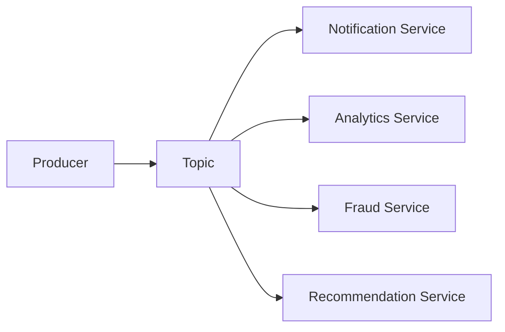

Conceptually:

```text
1 event
→ many interested systems
```

---

# 8. Kafka Mental Model

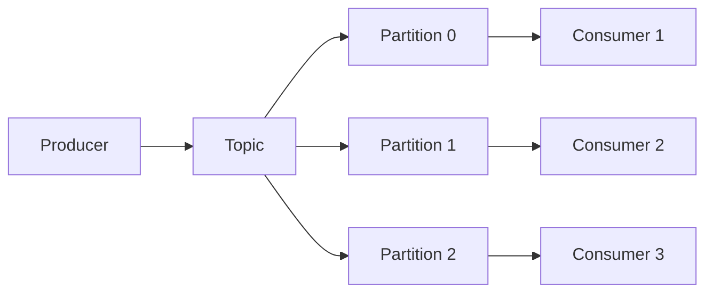

The mental hierarchy:

```text
Kafka
  ↓
Topic
  ↓
Partitions
  ↓
Ordered log
  ↓
Consumer Groups
  ↓
Consumers
```

---

## Partition Rule

Important:

```text
Ordering is guaranteed
within a partition
```

NOT:

```text
across the whole topic
```

So:

```java
key = userId
```

ensures:

```text
events for same user
→ same partition
→ ordered
```

---

# 9. Kafka Scaling Mental Model

Suppose:

```text
10M messages/sec
```

Think:

```text
Increase partitions
        ↓
Spread partitions across brokers
        ↓
Increase consumer parallelism
```

Rule:

```text
max active consumers
≈ number of partitions
```

Example:

```text
10 partitions
20 consumers

10 active
10 idle
```

---

# 10. MQ Failure Mental Model

Every queue design should address:

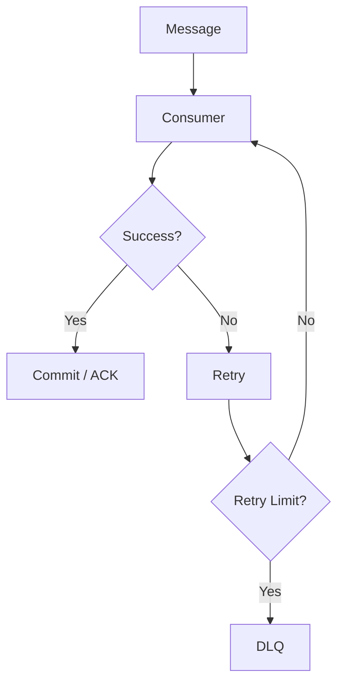

Discuss:

```text
Retry
Backoff
Dead Letter Queue
Idempotency
Duplicate messages
Ordering
Poison messages
Consumer crashes
```

---

# 11. Delivery Guarantees

```text
At-most-once
At-least-once
Exactly-once
```

### At-most-once

```text
Deliver 0 or 1 times
```

Possible message loss.

---

### At-least-once

```text
Deliver >=1 times
```

Possible duplicates.

Most common.

Therefore:

```text
At-least-once
+
Idempotent consumer
```

Example:

```text
paymentEventId = abc123
```

Before processing:

```sql
SELECT eventId FROM processed_events
WHERE eventId = 'abc123';
```

---

# 12. Sync vs Async Mental Model

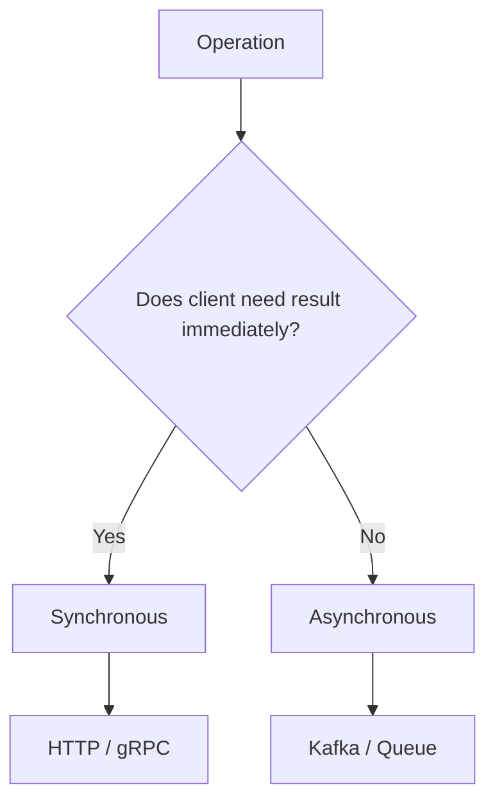

Sync:

```text
Login
Payment authorization
Search
GET profile
```

Async:

```text
Email
Analytics
Notifications
Video encoding
Search indexing
Audit events
```

---

# 13. Core HLD Components

Your mental toolbox:

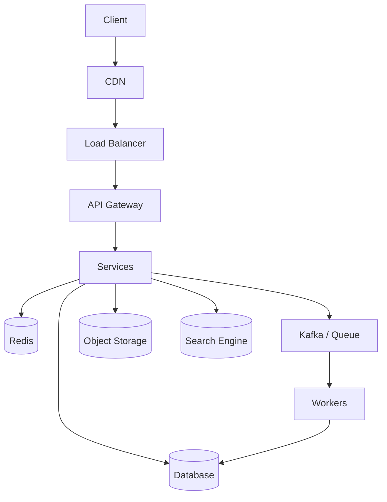

---

# 14. API Gateway

Think:

```text
Client
 ↓
API Gateway
 ↓
Services
```

Responsibilities:

```text
Authentication
Authorization
Rate limiting
Routing
SSL termination
Request validation
Logging
```

Do not overload gateway with business logic.

---

# 15. Load Balancer

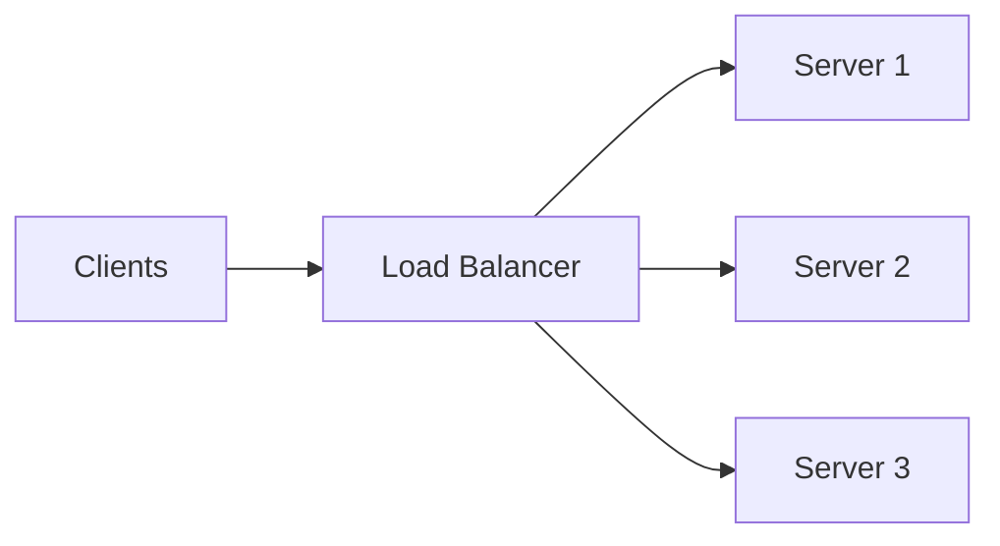

Algorithms:

```text
Round Robin
Least Connections
Weighted Round Robin
Consistent Hashing
```

For stateless services:

```text
Round Robin / Least Connections
```

For affinity:

```text
Consistent hashing
```

---

# 16. Stateless Services

Preferred:

```text
Client
 ↓
Any application server
```

Bad:

```text
User A session stored in Server 1 memory
```

Better:

```text
Session
 ↓
Redis / DB
```

Then:

```text
Server 1 dies
→ Server 2 continues request handling
```

---

# 17. CDN Mental Model

If interviewer mentions:

```text
Images
Videos
CSS
JavaScript
Static assets
Global users
```

Think:

```text
CDN
```

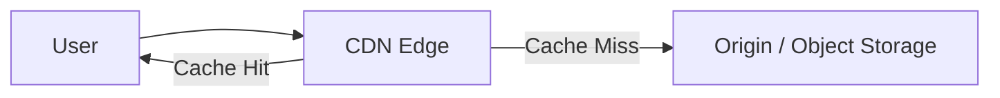

Benefits:

```text
Lower latency
Lower origin load
Lower bandwidth cost
```

---

# 18. Object Storage

Never store huge files directly in your relational database unless there is a specific reason.

Instead:

```text
Metadata → Database
Actual file → Object Storage
```

Example:

```text
videoId
userId
uploadTime
S3 URL
```

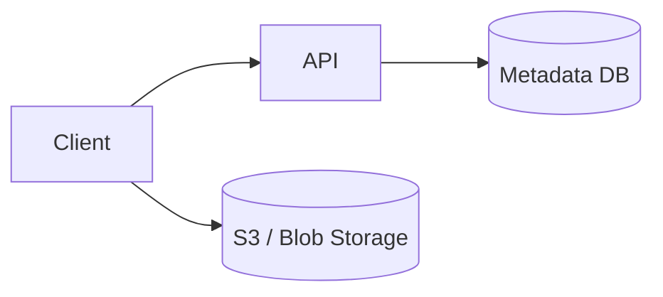

Often use:

```text
Pre-signed URL
```

so the application servers don't proxy huge files.

---

# 19. Search Mental Model

Database:

```sql
SELECT *
FROM products
WHERE description LIKE '%iphone%';
```

Bad at massive full-text search.

Instead:

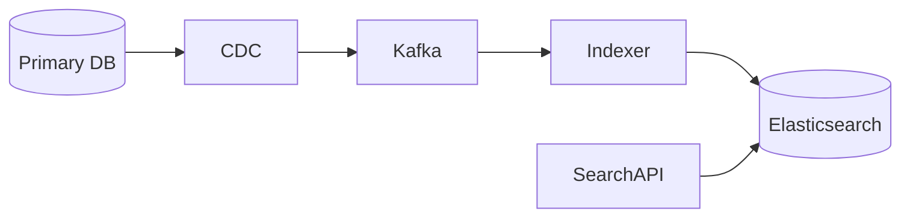

Mental rule:

```text
DB = source of truth
Search index = derived data
```

---

# 20. Network Communication Mental Model

Start here:

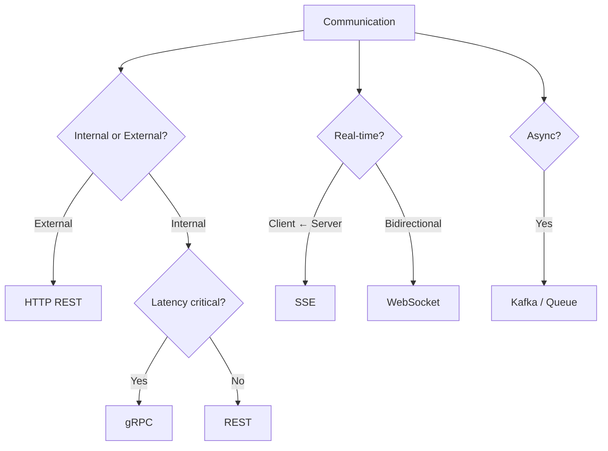

---

# 21. HTTP / REST

Best for:

```text
Public APIs
CRUD
Client-server communication
Simple interoperability
```

Characteristics:

```text
Text based
Usually JSON
Stateless
Easy debugging
Universal support
```

---

# 22. gRPC

Best for:

```text
Internal microservices
Low latency
High throughput
Strong contracts
```

Uses:

```text
HTTP/2
Protocol Buffers
```

Advantages:

```text
Binary serialization
Multiplexing
Streaming
Smaller payloads
Generated clients
```

---

# 23. REST vs gRPC

|                   | REST      | gRPC        |
| ----------------- | --------- | ----------- |
| Format            | JSON      | Protobuf    |
| Transport         | HTTP      | HTTP/2      |
| Human readable    | Yes       | No          |
| Performance       | Good      | Better      |
| Browser support   | Excellent | Limited     |
| Internal services | Good      | Excellent   |
| Public APIs       | Excellent | Less common |

Mental shortcut:

```text
External API → REST

Internal high-performance RPC → gRPC
```

---

# 24. WebSocket vs SSE

### WebSocket

```text
Client ↔ Server
```

Bidirectional.

Use:

```text
Chat
Multiplayer games
Collaboration
Trading
```

---

### SSE

```text
Server → Client
```

One-way stream.

Use:

```text
Notifications
Live feed
LLM token streaming
Progress updates
```

---

# 25. Long Polling

```text
Client → request
Server holds request

event arrives

Server → response

Client → reconnect
```

Older/simple alternative to WebSockets/SSE.

---

# 26. TCP vs UDP Mental Model

```text
TCP
→ reliable
→ ordered
→ connection-oriented
```

Use:

```text
HTTP
Database
Kafka
gRPC
```

UDP:

```text
fast
no delivery guarantee
no ordering
```

Use:

```text
VoIP
Gaming
Video streaming
DNS
```

---

# 27. Network Bandwidth Estimation

Suppose:

```text
100K requests/sec

payload = 10 KB
```

Then:

```text
100K × 10 KB
= 1 GB/sec
```

Approximately:

```text
8 Gbps
```

Immediately think:

```text
NIC capacity?
Compression?
CDN?
Payload reduction?
Horizontal scaling?
```

---

# 28. Service-to-Service Failure Mental Model

Every network call can fail.

Think:

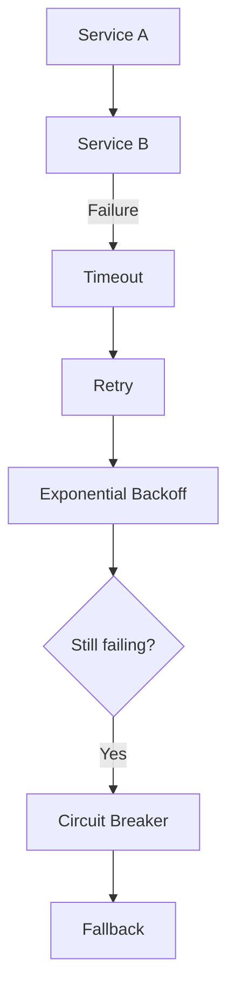

Always discuss:

```text
Timeout
Retry
Backoff
Jitter
Circuit breaker
Bulkhead
Fallback
Idempotency
```

---

# 29. Retry Mental Model

Never:

```text
retry immediately
retry immediately
retry immediately
```

Instead:

```text
1 sec
2 sec
4 sec
8 sec
```

with jitter:

```text
4 sec ± random
```

Prevents:

```text
Thundering herd
```

---

# 30. Circuit Breaker

```text
CLOSED
   ↓ failures
OPEN
   ↓ cooldown
HALF OPEN
   ↓ success
CLOSED
```

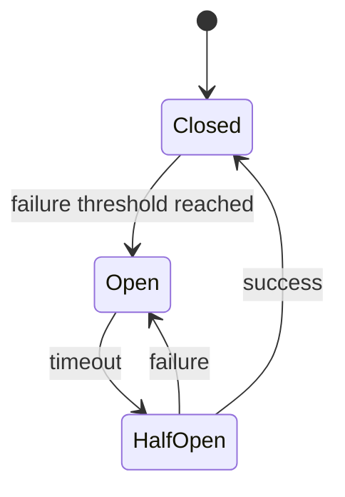

---

# 31. Rate Limiting

Think:

```text
Token Bucket
Leaky Bucket
Fixed Window
Sliding Window
```

Typical placement:

```text
Client
 ↓
API Gateway
 ↓
Rate Limiter
 ↓
Service
```

Example:

```text
100 requests/minute/user
```

Redis often stores:

```text
userId → tokens/counter
```

---

# 32. Consistent Hashing

Useful for:

```text
Cache cluster
Database sharding
Routing
Distributed storage
```

Problem with:

```text
hash(key) % N
```

If:

```text
N = 10 → 11
```

many keys move.

Consistent hashing:

```text
only fraction of keys move
```

```mermaid
flowchart LR
    A[Hash Ring] --> N1[Node A]
    A --> N2[Node B]
    A --> N3[Node C]

    K1[Key 1] --> N1
    K2[Key 2] --> N2
```

Use virtual nodes to improve distribution.

---

# 33. Reliability Mental Model

Every component:

```text
What if it dies?
```

Ask this for:

```text
App Server
Database
Cache
Kafka
Load Balancer
Region
Network
```

Solutions:

```text
Replication
Redundancy
Failover
Retry
Health Checks
Multi-AZ
Backups
```

---

# 34. Multi-AZ vs Multi-Region

```text
Multi-AZ
→ availability inside one region
```

```text
Multi-Region
→ disaster recovery
→ global latency reduction
```

```mermaid
flowchart LR
    Users --> DNS

    DNS --> R1[Region India]
    DNS --> R2[Region Europe]
    DNS --> R3[Region US]

    R1 --> DB1[(DB)]
    R2 --> DB2[(DB)]
    R3 --> DB3[(DB)]
```

Then discuss:

```text
Replication
Conflict resolution
Data residency
Consistency
Failover
```

---

# 35. Observability

Every production design should have:

```text
Logs
Metrics
Traces
Alerts
```

Golden signals:

```text
Latency
Traffic
Errors
Saturation
```

Think:

```mermaid
flowchart LR
    Services --> Logs
    Services --> Metrics
    Services --> Traces

    Logs --> Monitoring
    Metrics --> Monitoring
    Traces --> Monitoring

    Monitoring --> Alerts
```

---

# 36. Hot Key Mental Model

Suppose:

```text
TaylorSwiftProfile
```

gets:

```text
1M requests/sec
```

All requests hash to one cache node.

Problem:

```text
Hot key
```

Solutions:

```text
Local cache
Replicate hot key
Request coalescing
CDN
Key splitting
Dedicated cache
```

---

# 37. Cache Stampede

```text
Popular key expires
       ↓
100K requests arrive
       ↓
All miss cache
       ↓
100K DB queries
       ↓
DB dies
```

Solution:

```text
Single-flight / distributed lock
```

```mermaid
flowchart TD
    Requests --> Cache

    Cache -->|Miss| Lock

    Lock --> One[Only one request]
    One --> DB

    DB --> Cache
```

---

# 38. Backpressure

Whenever:

```text
Producer speed > Consumer speed
```

you need backpressure.

Example:

```text
Producer = 1M events/sec
Consumer = 700K events/sec
```

Queue grows:

```text
+300K events/sec
```

Think:

```text
Scale consumers
Rate limit producer
Batch processing
Drop low-priority events
Increase partitions
Autoscaling
```

---

# 39. CDC Mental Model

CDC = Change Data Capture.

```mermaid
flowchart LR
    App --> DB[(Database)]

    DB --> WAL[Transaction Log]

    WAL --> CDC[CDC Connector]

    CDC --> Kafka

    Kafka --> Search
    Kafka --> Analytics
    Kafka --> Cache
```

Useful when:

```text
DB should remain source of truth
but multiple downstream systems need updates
```

---

# 40. Saga Mental Model

For distributed transactions:

```text
Order
 ↓
Payment
 ↓
Inventory
 ↓
Shipping
```

Don't use distributed locking everywhere.

Use:

```text
Saga
```

```mermaid
flowchart LR
    Order --> Payment
    Payment --> Inventory
    Inventory --> Shipping

    Shipping -->|Failure| UndoInventory[Release Inventory]

    UndoInventory --> Refund[Refund Payment]
```

---

# 41. Outbox Pattern

Problem:

```java
saveOrder();
publishKafkaEvent();
```

What if:

```text
DB succeeds
Kafka fails
```

Inconsistency.

Use:

```mermaid
flowchart LR
    App --> TX[DB Transaction]

    TX --> Order[(Order Table)]
    TX --> Outbox[(Outbox Table)]

    Outbox --> Publisher

    Publisher --> Kafka
```

Now DB mutation and event creation happen atomically.

---

# 42. CAP Mental Model

During network partition:

```text
Choose:

Consistency
OR
Availability
```

```text
CP:
reject some operations
to preserve consistency

AP:
continue accepting operations
but allow temporary inconsistency
```

Examples conceptually:

```text
Payment balance
→ prefer consistency

Social media likes
→ eventual consistency acceptable
```

---

# 43. HLD Interview Master Decision Tree

Use this during the interview:

```mermaid
flowchart TD
    A[Requirements] --> B[Estimate Scale]

    B --> C{Read Heavy?}
    C -->|Yes| D[Cache]
    D --> E[Read Replica]
    E --> F[Index / Search]

    C -->|No| G{Write Heavy?}

    G -->|Yes| H[Partition]
    H --> I[Shard]
    I --> J[Queue / Batch]

    B --> K{Async possible?}
    K -->|Yes| L[Kafka / Queue]

    B --> M{Large Static Content?}
    M -->|Yes| N[Object Storage + CDN]

    B --> O{Search required?}
    O -->|Yes| P[Elasticsearch]

    B --> Q{Real-time connection?}
    Q -->|Bidirectional| R[WebSocket]
    Q -->|Server → Client| S[SSE]

    B --> T{Internal Service Communication?}
    T -->|High Performance| U[gRPC]
    T -->|Simple| V[REST]

    A --> W[Reliability]
    W --> X[Replication]
    W --> Y[Retry]
    W --> Z[Circuit Breaker]

    A --> AA[Observability]
```

---

# 44. The Interviewer's Requirement → Your Immediate Thought

| Interviewer says                   | Your brain should think               |
| ---------------------------------- | ------------------------------------- |
| 10M reads/sec                      | Cache + replicas + CDN                |
| 1M writes/sec                      | Sharding + batching                   |
| burst traffic                      | Queue                                 |
| asynchronous                       | Kafka                                 |
| multiple consumers need same event | Pub/Sub                               |
| ordered events                     | Partition key                         |
| exactly once                       | Idempotency + transactional semantics |
| global static content              | CDN                                   |
| images/videos                      | Object storage                        |
| search                             | Elasticsearch                         |
| real-time chat                     | WebSocket                             |
| server push                        | SSE                                   |
| microservice communication         | REST/gRPC                             |
| service failures                   | Retry + circuit breaker               |
| database failure                   | Replication + failover                |
| distributed transaction            | Saga                                  |
| DB update + event                  | Outbox                                |
| huge read hotspot                  | Cache replication                     |
| hot cache key                      | Local cache / replication             |
| repeated cache misses              | Stampede protection                   |
| DB cannot handle writes            | Partition/shard/queue                 |
| strong consistency                 | Leader/quorum                         |
| high availability                  | Replication + multi-AZ                |
| disaster recovery                  | Multi-region                          |
| global database                    | Replication + conflict handling       |
| producer faster than consumer      | Backpressure                          |
| downstream systems need DB changes | CDC                                   |

---

# 45. Final Mental Model

Don't think:

```text
"Which technology should I use?"
```

Think:

```mermaid
flowchart TD
    A[Requirement] --> B[Constraint]
    B --> C[Bottleneck]
    C --> D[Architecture Pattern]
    D --> E[Technology]

    E --> F[Failure Mode]
    F --> G[Mitigation]
    G --> H[Trade-off]
```

For example:

```text
Requirement
↓
1M notification events/sec

Constraint
↓
User doesn't need synchronous delivery

Bottleneck
↓
Notification workers can't absorb spikes

Pattern
↓
Async buffering + partitioned consumers

Technology
↓
Kafka

Failure
↓
Consumer crashes / duplicates

Mitigation
↓
Retry + DLQ + idempotency

Trade-off
↓
Eventual delivery instead of immediate consistency
```

That reasoning chain is the core of a strong HLD interview:

```text
Requirement
→ Scale
→ Bottleneck
→ Pattern
→ Component
→ Failure
→ Mitigation
→ Trade-off
```

Keep repeating that loop for every major component.
